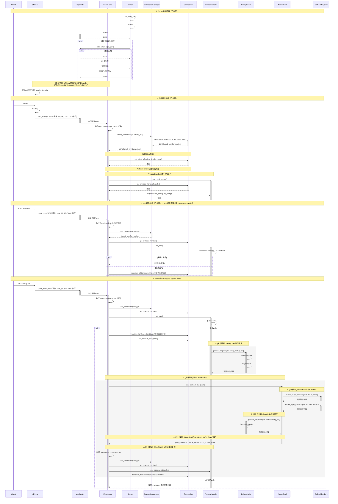

# HTTPS Server 模拟器 - 模块联调设计文档

**版本**: v17
**创建日期**: 2026-02-20
**状态**: 修正版（第17轮）
**重要说明**: 本文档区分「已实现」和「设计规划」两部分内容，未实现模块（DebugChain、Callback）已明确标注

---

## 目录

1. [文档概述](#1-文档概述)
2. [模块依赖关系](#2-模块依赖关系)
3. [核心交互流程](#3-核心交互流程)
4. [模块间接口汇总表](#4-模块间接口汇总表)
5. [模块接口契约](#5-模块接口契约)
6. [数据结构传递约定](#6-数据结构传递约定)
7. [错误处理约定](#7-错误处理约定)
8. [线程安全约定](#8-线程安全约定)
9. [联调步骤与Checklist](#9-联调步骤与checklist)
10. [联调测试用例](#10-联调测试用例)
11. [后续优化方向](#11-后续优化方向)
12. [术语对照表](#12-术语对照表)

---

## 1. 文档概述

### 1.1 目标

本文档定义各个核心模块之间的**交互规范**，用于指导模块联调工作：

1. **明确模块依赖关系** - 谁依赖谁，依赖顺序
2. **定义交互流程** - 请求从进来到响应出去的完整路径
3. **约定接口契约** - 模块间调用的参数、返回值、错误处理
4. **提供联调Checklist** - 给开发人员提供明确的验收标准

### 1.2 范围

本文档覆盖以下核心模块的联调：

**命名空间嵌套关系说明**：
- `https_server_sim::server::Server` - Server类位于server子命名空间
- `https_server_sim::config::Config` - Config类位于config子命名空间（**LT-WD-002修正**：与HLD差异说明见下方）
- `https_server_sim::protocol::ProtocolHandler` - ProtocolHandler类位于protocol子命名空间
- `https_server_sim::ConnectionManager` - 直接位于https_server_sim命名空间
- `https_server_sim::Connection` - 直接位于https_server_sim命名空间
- `https_server_sim::MsgCenter` - 直接位于https_server_sim命名空间

**与HLD的命名空间差异说明（LT-WD-002修正）**：
- HLD第3.1节模块列表中提到Config位于"utils模块"，此处的"模块"指目录模块（`codes/core/config/`）
- 实际代码中Config类位于`https_server_sim::config`命名空间（与目录结构一致）
- 本文档遵循实际代码的命名空间约定

**已实现模块（当前代码已存在）**：
- https_server_sim::server::Server
- https_server_sim::ConnectionManager
- https_server_sim::Connection
- https_server_sim::protocol::ProtocolHandler
- https_server_sim::MsgCenter
- https_server_sim::config::Config
- Utils

**设计规划模块（当前代码未实现）**：
- DebugChain ⚠️ [设计规划]
- Callback ⚠️ [设计规划]

**注意**：本文档仅关注模块间交互，不涉及单个模块的内部实现细节。

### 1.3 参考文档

| 文档 | 路径 |
|-----|------|
| 架构设计文档 | `docs/design/hld-架构设计文档.md` |
| 4+1视图 | `docs/design/hld-4+1视图.md` |
| 各模块详细设计 | `docs/design/lld-详细设计文档-*.md` |
| 集成测试用例 | `codes/core/test/integration_tests/` |

---

## 2. 模块依赖关系

### 2.1 依赖关系图

```
┌─────────────────────────────────────────────────────────────────────┐
│           https_server_sim::server::Server                           │
│                   (组合所有模块，对外门面)                           │
└──┬──────────────────────┬──────────────────────┬──────────────────┬─┘
   │                      │                      │                  │
   ▼                      ▼                      ▼                  ▼
┌─────────────────────────┐  ┌────────────────┐  ┌──────────┐   ┌──────────┐
│https_server_sim::       │  │   MsgCenter    │  │  Config  │   │ Callback │
│ConnectionManager        │  │(Server组合/独占│  └──────────┘   └──────────┘
└────┬────────────────────┘  │  所有权)      │               ⚠️ [设计规划]
     │                      └────────────────┘
     ▼
┌────────────┐      ┌──────────┐
│ Connection │      │DebugChain│
└────┬───────┘      └──────────┘
     │            ⚠️ [设计规划]
     ▼
┌────────────┐
│  Protocol  │
│ (Handler)  │
└────┬───────┘
     │
     ▼
┌────────────┐
│   Utils    │
│ (Buffer,   │
│  Logger)   │
└────────────┘
```

**依赖关系图例说明**：
- **实线黑色箭头**：表示已实现的依赖关系（当前代码已存在）
- **虚线灰色箭头**：表示设计规划的依赖关系（当前代码未实现）
- **灰色背景 + ⚠️ [设计规划] 标记**：表示设计规划模块，当前代码未实现

**说明**：
- Callback和DebugChain与Server的依赖为设计规划，当前代码未实现
- **Event.handler在IoThread内部定义**，IoThread通过Event.handler间接调用ConnectionManager
- **MsgCenter由Server组合/独占所有权**：Server持有std::unique_ptr<MsgCenter>，拥有MsgCenter的唯一所有权

### 2.2 模块依赖层级

| 层级 | 模块 | 依赖 | 说明 | 实现状态 |
|-----|------|------|------|---------|
| L1 (顶层) | https_server_sim::server::Server | ConnectionManager, MsgCenter, Config, Utils | 组合所有模块 | ✓ 已实现 |
| L2 | https_server_sim::ConnectionManager | Config, Utils | 连接生命周期管理 | ✓ 已实现 |
| L2 | https_server_sim::MsgCenter | Config, Utils | 事件循环、消息分发 | ✓ 已实现 |
| L2 | Callback | Utils | 回调策略管理 | ⚠️ [设计规划] |
| L2 | DebugChain | Config, Utils | 调测职责链 | ⚠️ [设计规划] |
| L3 | https_server_sim::Connection | ConnectionManager, Protocol, Utils | 单个连接管理 | ✓ 已实现 |
| L3 | https_server_sim::protocol::ProtocolHandler | Config, Utils | HTTP/TLS协议处理 | ✓ 已实现 |
| L4 (底层) | https_server_sim::config::Config | 无特殊依赖（日志除外） | 配置管理 | ✓ 已实现 |
| L4 (底层) | Utils | 无 | 基础工具 | ✓ 已实现 |

### 2.3 初始化顺序（基于实际代码）

模块必须按以下顺序初始化，与 `server.cpp` 中的实际实现一致：

```
Server::init(config_file)
  │
  ├─> 1. 创建Config对象
  │
  ├─> 2. Config::load_from_file(config_file)
  │     └─> Config::validate()
  │
  ├─> 3. Server::init_listen_sockets()
  │     ├─> socket()
  │     ├─> bind()
  │     └─> listen()
  │
  ├─> 4. 创建ConnectionManager
  │
  └─> 5. 创建MsgCenter


Server::start()
  │
  ├─> 1. MsgCenter::start()
  │     ├─> 启动EventLoop线程
  │     ├─> 启动IOThread线程
  │     └─> 启动WorkerPool线程
  │
  └─> 2. MsgCenter::add_listen_fd(fd, port)  [循环注册所有监听socket]
```

**补充：ProtocolHandler初始化顺序**

ProtocolHandler的初始化不是在Server::init()中完成的，而是在**连接创建后**按需初始化：

```
ACCEPT事件处理（Event.handler）
  │
  ├─> ConnectionManager::create_connection(fd, server_port)
  │     └─> Connection对象创建（初始状态：ACCEPTING）
  │
  ├─> 设置Client信息：Connection::set_client_info(ip, port)
  │
  ├─> 状态转换：Connection::transition_to(ConnectionState::TLS_HANDSHAKING)
  │
  ├─> 创建ProtocolHandler（Http1Handler或Http2Handler）
  │     [创建责任方：Server的ACCEPT handler]
  │
  ├─> Connection::set_protocol_handler(handler)
  │
  └─> ProtocolHandler::init(conn, cert_config, tls_config)
```

**配置来源说明**：
- `cert_config`：从 `Config::get_certificates()` 获取，需转换为 protocol::CertConfig
- `tls_config`：从 `Config::get_http2()` 或其他相关配置获取

---

## 3. 核心交互流程

### 3.1 HTTPS请求响应完整流程（修正版）



**时序图说明**:
- **白色背景**：表示已实现的流程
- **灰色背景 (rect) + ⚠️ [设计规划]**：表示设计规划，当前代码未实现
- `send_response()` 接口已在基类中定义（纯虚函数），Http1Handler 和 Http2Handler 的具体实现已完整实现（✓ 已实现）
- 术语说明：类名使用 Http1Handler/Http2Handler，协议名称使用 HTTP/1.1、HTTP/2
- **ACCEPT事件handler定义位置修正**：IoThread在启动时定义handler，通过lambda捕获ConnectionManager*、Config*、Server*等上下文指针
- **参数展示补充**：`add_listen_fd(fd, port)` 包含完整参数（仅fd和port，无handler），与实际代码一致
- **Event.handler定义位置**：IoThread内部自动设置，不由Server直接注册
- **create_connection参数**：`create_connection(int fd, uint16_t server_port)`，第二个参数是 `server_port`
- **Connection::transition_to() 返回 void**，与实际代码一致
- **LT-TX-001修正**：明确post_event的调用主体是MsgCenter，IoThread调用MsgCenter::post_event()，MsgCenter内部传递给EventLoop

### 3.2 Server启动流程（基于实际代码）

基于 `server.cpp` 中的实际实现，Server的完整启动流程如下：

```
Server::init(config_file)
│
├─> 设置状态为INITIALIZING
│
├─> 创建Config对象
│
├─> Config::load_from_file(config_file)
│   └─> Config::validate()
│
├─> Server::init_listen_sockets()
│   ├─> socket()
│   ├─> setsockopt(SO_REUSEADDR)
│   ├─> setsockopt(SO_REUSEPORT) [可选]
│   ├─> bind()
│   ├─> listen()
│   └─> 保存fd/port/ip到内部列表
│
├─> 创建ConnectionManager
│
├─> 创建MsgCenter
│
└─> 设置状态为STOPPED


Server::start()
│
├─> 检查状态并设置为RUNNING
│
├─> MsgCenter::start()
│   ├─> 启动EventLoop线程
│   ├─> 启动IOThread线程
│   └─> 启动WorkerPool线程
│
├─> MsgCenter::add_listen_fd(fd, port)  [对每个监听fd循环调用]
│   └─> 失败时回滚已注册的fd，停止MsgCenter，清理资源
│
└─> 记录启动时间，状态保持为RUNNING
```

### 3.3 事件处理机制（核心）

MsgCenter采用**Event + handler**机制，实际代码中的Event结构定义如下：

```cpp
// Event结构（与event.hpp一致）
struct Event {
    EventType type;          // 事件类型
    uint64_t conn_id{};      // 连接ID（默认初始化为0）
    int fd{};                // 文件描述符（默认初始化为0）
    void* user_data{};       // 用户数据（默认初始化为nullptr）
    std::function<void()> handler;  // 事件处理函数

    // 静态工厂方法
    static Event make_shutdown_event() {
        Event event;
        event.type = EventType::SHUTDOWN;
        event.conn_id = 0;
        event.fd = -1;
        event.user_data = nullptr;
        event.handler = nullptr;
        return event;
    }

    static Event make_callback_done_event() {
        Event event;
        event.type = EventType::CALLBACK_DONE;
        event.conn_id = 0;
        event.fd = -1;
        event.user_data = nullptr;
        event.handler = nullptr;
        return event;
    }
};
```

**事件流转**：
1. IoThread检测IO事件，创建Event并设置handler（在IoThread内部定义）
2. Event推入EventQueue
3. EventLoop从队列取出Event
4. EventLoop调用`event.handler()`执行处理

**事件handler定义和上下文传递详细说明**：

**核心实现方案（LT-JG-001修正）**：
- **handler定义位置**：IoThread的event_loop_linux()/event_loop_mac()/event_loop_windows()内部，作为lambda定义
- **上下文传递方式**：
  - 通过Event::user_data传递ListenInfo结构体（包含listen_fd、port、ConnectionManager*、Config*）
  - handler通过lambda捕获`this`（IoThread*）和`user_data`指针访问外部资源
- **IoThread获取Server/ConnectionManager指针的机制**：
  - Server创建MsgCenter时，不直接传递指针给IoThread
  - 而是通过`add_listen_fd(fd, port)`注册监听socket时，在MsgCenter内部保存ListenInfo
  - ListenInfo包含：fd、port、ConnectionManager*、Config*（这些指针来自Server）
  - IoThread从MsgCenter获取ListenInfo，通过lambda捕获这些指针

**add_listen_fd接口说明（LT-JG-003修正）**：
- `add_listen_fd(int fd)` - **已deprecated**，仅保留兼容，不推荐使用
- `add_listen_fd(int fd, uint16_t port)` - **推荐使用**，新版本接口

---

## 4. 模块间接口汇总表

### 4.1 已实现接口（基于实际头文件）

本节汇总已实现的模块间接口（public方法），**区分内部管理接口和模块间接口**：

**接口分类标准**：
- **模块间接口**：跨模块边界且被外部模块主动调用的public方法
- **内部管理接口**：主要供模块内部或聚合模块（如Server）内部使用的public辅助方法

| 序号 | 接口类型 | 调用方 | 被调用方 | 接口方法 | 参数 | 返回值 | 用途 | 实现状态 |
|-----|---------|-------|---------|---------|------|-------|------|---------|
| 1 | 模块间 | https_server_sim::server::Server | Config | load_from_file() | const std::string&amp; config_file | int (0成功) | 加载配置文件 | ✓ 已实现 |
| 2 | 内部 | Config | Config | validate() | 无 | int (0成功) | 验证配置有效性（内部调用） | ✓ 已实现 |
| 3 | 模块间 | https_server_sim::server::Server | https_server_sim::MsgCenter | start() | 无 | int (0成功) | 启动消息中心 | ✓ 已实现 |
| 4 | 模块间 | https_server_sim::server::Server | https_server_sim::MsgCenter | stop() | 无 | void | 停止消息中心 | ✓ 已实现 |
| 5 | 模块间 | https_server_sim::server::Server | https_server_sim::MsgCenter | add_listen_fd() | int fd, uint16_t port | int (0成功) | 注册监听socket（新版本） | ✓ 已实现 |
| 5a | 模块间 | https_server_sim::server::Server | https_server_sim::MsgCenter | add_listen_fd() | int fd | int (0成功) | 注册监听socket（旧版，deprecated） | ✓ 已实现（已deprecated） |
| 6 | 模块间 | https_server_sim::server::Server | https_server_sim::MsgCenter | remove_listen_fd() | int fd | int (0成功) | 移除监听socket | ✓ 已实现 |
| 7 | 模块间 | Event handler | https_server_sim::ConnectionManager | create_connection() | int fd, uint16_t server_port | std::shared_ptr&lt;Connection&gt; | 创建新连接 | ✓ 已实现 |
| 8 | 模块间 | Event handler | https_server_sim::ConnectionManager | get_connection() | uint64_t conn_id | std::shared_ptr&lt;Connection&gt; | 获取连接 | ✓ 已实现 |
| 9 | 模块间 | Event handler | https_server_sim::ConnectionManager | remove_connection() | uint64_t conn_id | void | 移除连接 | ✓ 已实现 |
| 10 | 内部管理 | https_server_sim::server::Server | https_server_sim::ConnectionManager | close_all() | 无 | void | 关闭所有连接（内部管理用） | ✓ 已实现 |
| 11 | 内部管理 | https_server_sim::server::Server | https_server_sim::ConnectionManager | for_each_connection() | std::function&lt;void(Connection&amp;)&gt; | void | 遍历所有连接 | ✓ 已实现 |
| 12 | 内部管理 | https_server_sim::server::Server | https_server_sim::ConnectionManager | for_each_connection() | std::function&lt;void(const Connection&amp;)&gt; | void | 遍历所有连接（const重载） | ✓ 已实现 |
| 13 | 内部管理 | https_server_sim::server::Server | https_server_sim::ConnectionManager | get_connection_count() | 无 | uint32_t | 获取当前连接数 | ✓ 已实现 |
| 14 | 内部管理 | https_server_sim::server::Server | https_server_sim::ConnectionManager | check_timeouts() | uint32_t idle_timeout_ms, uint32_t callback_timeout_ms, std::function&lt;void(Connection&amp;)&gt; | void | 检查超时（内部管理用） | ✓ 已实现 |
| 15 | 内部管理 | https_server_sim::server::Server | https_server_sim::ConnectionManager | check_callback_timeouts() | uint32_t timeout_seconds | void | 检查回调超时（内部管理用） | ✓ 已实现 |
| 16 | 模块间 | https_server_sim::server::Server/ACCEPT handler | https_server_sim::Connection | set_protocol_handler() | std::unique_ptr&lt;ProtocolHandler&gt; | void | 设置协议处理器 | ✓ 已实现 |
| 17 | 模块间 | Event handler | https_server_sim::protocol::ProtocolHandler | on_read() | 无 | int (0/-EAGAIN/错误) | 处理读事件 | ✓ 已实现 |
| 18 | 模块间 | Event handler | https_server_sim::protocol::ProtocolHandler | on_write() | 无 | int (0/-EAGAIN/错误) | 处理写事件 | ✓ 已实现 |
| 19 | 模块间 | https_server_sim::MsgCenter/Event handler | https_server_sim::MsgCenter | post_callback_task() | std::function&lt;void()&gt; task | void | 提交回调任务 | ✓ 已实现 |
| 20 | 模块间 | Event handler | https_server_sim::Connection | transition_to() | ConnectionState new_state | void | 状态转换 | ✓ 已实现 |
| 21 | 模块间 | Event handler | https_server_sim::Connection | get_id() | 无 | uint64_t | 获取连接ID | ✓ 已实现 |
| 22 | 模块间 | Event handler | https_server_sim::Connection | get_fd() | 无 | int | 获取socket fd | ✓ 已实现 |
| 23 | 模块间 | Event handler | https_server_sim::Connection | get_read_buffer() | 无 | utils::Buffer&amp; | 获取读缓冲区 | ✓ 已实现 |
| 24 | 模块间 | Event handler | https_server_sim::Connection | get_write_buffer() | 无 | utils::Buffer&amp; | 获取写缓冲区 | ✓ 已实现 |
| 25 | 模块间 | https_server_sim::server::Server | https_server_sim::server::Server | cleanup() | 无 | void | 清理资源 | ✓ 已实现 |
| 26 | 模块间 | Event handler | https_server_sim::Connection | set_client_info() | const std::string&amp; ip, uint16_t port | void | 设置Client信息 | ✓ 已实现 |
| 27 | 模块间 | Event handler | https_server_sim::Connection | close() | 无 | void | 关闭连接 | ✓ 已实现 |
| 28 | 模块间 | Event handler | https_server_sim::Connection | update_last_activity() | 无 | void | 更新最后活动时间 | ✓ 已实现 |
| 29 | 模块间 | Event handler | https_server_sim::Connection | set_callback_start_time() | 无 | void | 设置回调开始时间 | ✓ 已实现 |
| 30 | 模块间 | Event handler | https_server_sim::Connection | on_callback_complete() | 无 | void | 回调完成 | ✓ 已实现 |
| 31 | 模块间 | 任意 | https_server_sim::MsgCenter | post_event() | const Event&amp; | void | 提交事件 | ✓ 已实现 |
| 32 | 模块间 | https_server_sim::MsgCenter | https_server_sim::MsgCenter | get_event_loop() | 无 | EventLoop* | 获取EventLoop | ✓ 已实现 |

**注意**：
- `get_event_loop()` 是 MsgCenter 的 public 方法，标注为**模块间接口**
- `close_all()`、`for_each_connection()`、`get_connection_count()`、`check_timeouts()`、`check_callback_timeouts()` 标记为**内部管理接口**，因为它们主要供ConnectionManager自身或Server内部管理使用
- `Connection::set_protocol_handler()` 是模块间接口，由Server或ACCEPT handler调用
- `Connection::transition_to()` 返回值为 `void`，与代码一致
- **add_listen_fd补充说明**：存在两个版本，旧版本`add_listen_fd(int fd)`已标记deprecated，推荐使用新版本`add_listen_fd(int fd, uint16_t port)`

### 4.2 设计规划接口（当前未实现）

以下接口为设计规划，当前代码未实现：

| 序号 | 调用方 | 被调用方 | 接口方法 | 参数 | 返回值 | 用途 | 说明 |
|-----|-------|---------|---------|------|-------|------|------|
| 1 | ProtocolHandler | DebugChain | process_request() | const ClientContext*, const DebugConfig*, DebugContext* | int (继续/终止) | 处理请求 | ⚠️ [设计规划] |
| 2 | ProtocolHandler | DebugChain | process_response() | const ClientContext*, const DebugConfig*, DebugContext* | int (继续/终止) | 处理响应 | ⚠️ [设计规划] |
| 3 | DebugChain | DebugChain | register_handler() | DebugHandler* | int (0成功) | 注册调测处理器 | ⚠️ [设计规划] |
| 4 | WorkerPool | CallbackRegistry | invoke_parse_callback() | uint16_t port, const ClientContext*, const uint8_t*, uint32_t, uint32_t* | int (0成功) | 调用解析回调 | ⚠️ [设计规划] |
| 5 | WorkerPool | CallbackRegistry | invoke_reply_callback() | uint16_t port, const ClientContext*, uint8_t*, uint32_t*, uint32_t* | int (0成功) | 调用响应回调 | ⚠️ [设计规划] |
| 6 | CallbackRegistry | CallbackRegistry | register_callback() | const CallbackStrategy* | int (0成功) | 注册回调策略 | ⚠️ [设计规划] |
| 7 | ProtocolHandler | ProtocolHandler | send_response() | const uint8_t* data, uint32_t len | int | 发送响应数据 | 接口已定义为纯虚函数，Http1Handler/Http2Handler具体实现已完整实现（✓ 已实现） |

**设计规划与已实现内容的视觉区分**：
- 所有设计规划代码块使用`╔══════════════════════════════════════════════════════════╗`边框
- 代码块开头明确标注`【设计规划代码 - 当前代码中不存在】`
- 已实现代码块使用标准代码块格式

---

## 5. 模块接口契约

### 5.1 Server与Config的接口契约

#### Server::init() → Config::load_from_file()

**调用方**: https_server_sim::server::Server
**被调用方**: Config

```cpp
// Server端 - 核心交互逻辑
int https_server_sim::server::Server::init(const std::string&amp; config_file) {
    // 1. 设置状态为INITIALIZING
    // 2. 创建Config并加载配置
    config_ = std::make_unique<config::Config>();
    int ret = config_->load_from_file(config_file);
    if (ret != ERR_SUCCESS) {
        return ERR_CONFIG_LOAD;
    }

    // 3. Config内部自动调用validate()
    // 4. 初始化监听socket
    // 5. 创建ConnectionManager和MsgCenter
    // 6. 设置状态为STOPPED
    return ERR_SUCCESS;
}
```

**Config端保证**:
- `load_from_file()` 返回 0 表示成功，负数表示失败
- `load_from_file()` 内部会调用 `validate()` 验证配置
- 配置加载成功后，getter方法可安全调用

**Server端保证**:
- 先调用 `load_from_file()`，验证通过后继续初始化
- 失败时清理资源

---

### 5.2 Server与MsgCenter的接口契约

#### Server::start() → MsgCenter::start()

**调用方**: https_server_sim::server::Server
**被调用方**: https_server_sim::MsgCenter
**注意**: 根据实际代码，顺序是**先启动MsgCenter，再add_listen_fd**

```cpp
// Server端 - 核心交互逻辑
int https_server_sim::server::Server::start() {
    // 1. 检查状态并设置为RUNNING
    // 2. 先启动MsgCenter
    int ret = msg_center_->start();
    if (ret != ERR_SUCCESS) {
        return ERR_MSG_CENTER_START;
    }

    // 3. 再注册监听socket到MsgCenter
    std::vector<int> registered_fds;
    for (size_t i = 0; i < listen_fds_.size(); ++i) {
        int fd = listen_fds_[i];
        uint16_t port = listen_ports_[i];
        ret = msg_center_->add_listen_fd(fd, port);
        if (ret != ERR_SUCCESS) {
            // 回滚已注册的fd
            for (int reg_fd : registered_fds) {
                msg_center_->remove_listen_fd(reg_fd);
            }
            // 停止MsgCenter，清理资源
            msg_center_->stop();
            // ... 清理其他资源
            return ERR_INTERNAL;
        }
        registered_fds.push_back(fd);
    }

    return ERR_SUCCESS;
}
```

**MsgCenter端保证**:
- `start()` 返回 0 表示所有线程启动成功
- `add_listen_fd(fd, port)` 返回 0 表示成功
- 启动后，Event可以正常post和处理
- `post_event(const Event&amp;)` 线程安全
- `post_callback_task(std::function<void()>)` 线程安全

**Server端保证**:
- 先启动MsgCenter，再添加listen fd
- `stop()` 时，先移除listen fd，再停止MsgCenter
- add_listen_fd失败时，回滚已注册的fd并清理资源

---

### 5.3 Server与ConnectionManager的接口契约（LT-JG-002修正）

#### Event的handler → ConnectionManager::create_connection()

**调用方**: Event handler (通过Event.handler)
**被调用方**: https_server_sim::ConnectionManager

**重要修正说明（LT-JG-002）**：
- 原设计规划中提到的handle_accept()、create_protocol_handler()等方法**不作为Server的私有方法**
- 这些逻辑应**在IoThread内部的handler中直接实现**，或放在独立的辅助函数中
- Server通过MsgCenter的ListenInfo机制传递ConnectionManager*和Config*指针给IoThread

---

╔══════════════════════════════════════════════════════════╗
║ 【设计规划代码 - 当前代码中不存在】                        ║
║  IoThread内部handler定义的完整实现示例                     ║
╚══════════════════════════════════════════════════════════╝

```cpp
// ==========================================
// IoThread中handler定义的具体实现示例
// ⚠️ [设计规划] - 以下代码需在IoThread的event_loop_*()中实现
// ==========================================

// ListenInfo结构：在MsgCenter内部定义，用于保存监听socket信息
struct ListenInfo {
    int fd;
    uint16_t port;
    ConnectionManager* conn_manager;  // 来自Server
    config::Config* config;           // 来自Server
};

// 在IoThread::event_loop_linux()（或mac/windows版本）中的实现
void IoThread::event_loop_linux() {
    // ... epoll/kqueue初始化 ...

    while (running_) {
        // ... 等待IO事件 ...

        for (/* 每个就绪事件 */) {
            if (/* 是监听socket */) {
                // 获取对应的ListenInfo
                ListenInfo* listen_info = get_listen_info_for_fd(event_fd);

                // ==========================================
                // ACCEPT handler定义（lambda）
                // 捕获的变量列表及其生命周期管理：
                // - listen_info: 指针，由MsgCenter管理，生命周期>IoThread
                // - client_fd: accept()返回的fd，局部变量
                // - client_port: 从accept()获取，局部变量
                // ==========================================
                int client_fd = accept(listen_info->fd, ...);
                uint16_t client_port = ...;

                Event event;
                event.type = EventType::ACCEPT;
                event.fd = client_fd;
                event.user_data = listen_info;  // 传递ListenInfo指针

                // Lambda捕获说明：
                // - [listen_info, client_fd, client_port]：值捕获
                // - listen_info指针有效期：由MsgCenter保证在Server运行期间有效
                // - client_fd/client_port：值拷贝，安全
                event.handler = [listen_info, client_fd, client_port]() {
                    // 这个handler在EventLoop线程中执行

                    // 1. 通过listen_info获取ConnectionManager
                    ConnectionManager* cm = listen_info->conn_manager;
                    if (!cm) {
                        close(client_fd);
                        return;
                    }

                    // 2. 创建Connection
                    std::shared_ptr<Connection> conn =
                        cm->create_connection(client_fd, listen_info->port);
                    if (!conn) {
                        close(client_fd);
                        return;
                    }

                    // 3. 设置Client信息
                    std::string client_ip = ...;  // 从accept()获取
                    conn->set_client_info(client_ip, client_port);

                    // 4. 状态转换到TLS_HANDSHAKING
                    conn->transition_to(ConnectionState::TLS_HANDSHAKING);

                    // 5. 创建ProtocolHandler（基于配置选择）
                    std::unique_ptr<protocol::ProtocolHandler> proto_handler;
                    const config::Config* config = listen_info->config;
                    if (config &amp;&amp; config->get_http2().enabled) {
                        proto_handler = std::make_unique<protocol::Http2Handler>();
                    } else {
                        proto_handler = std::make_unique<protocol::Http1Handler>();
                    }

                    if (!proto_handler) {
                        conn->close();
                        return;
                    }

                    // 6. 配置转换（Config → Protocol配置）
                    protocol::CertConfig cert_config;
                    protocol::TlsConfig tls_config;
                    if (config) {
                        // 使用独立的ConfigConverter进行转换
                        ConfigConverter::convert_cert_config(
                            config->get_certificates(), cert_config);
                        ConfigConverter::convert_tls_config(*config, tls_config);
                    }

                    // 7. 设置ProtocolHandler
                    conn->set_protocol_handler(std::move(proto_handler));

                    // 8. 初始化ProtocolHandler
                    protocol::ProtocolHandler* handler = conn->get_protocol_handler();
                    if (handler) {
                        int ret = handler->init(conn.get(), cert_config, tls_config);
                        if (ret != 0) {
                            conn->close();
                        }
                    }
                };

                // 提交事件到EventLoop
                msg_center_->post_event(event);
            }
        }
    }
}
```

---

**ConnectionManager端保证**:
- `create_connection(fd, server_port)` 返回有效的shared_ptr，失败返回nullptr
- `get_connection(conn_id)` 返回shared_ptr保证对象存活
- 所有方法线程安全（内部使用mutex保护）

**Server端保证（修改后）**:
- 创建MsgCenter时，通过MsgCenter的内部机制传递ConnectionManager*和Config*
- 不直接提供handle_accept()等私有方法供IoThread调用

---

### 5.4 Connection与ProtocolHandler的接口契约（LT-LD-002修正）

#### Connection::set_protocol_handler()

**调用方**: Server或ACCEPT handler
**被调用方**: https_server_sim::Connection

```cpp
// Connection端
void https_server_sim::Connection::set_protocol_handler(std::unique_ptr<https_server_sim::protocol::ProtocolHandler> handler) {
    // 契约1: 转移所有权，Connection持有ProtocolHandler
    protocol_handler_ = std::move(handler);
}

https_server_sim::protocol::ProtocolHandler* https_server_sim::Connection::get_protocol_handler() {
    // 契约2: 可能返回nullptr，调用方需检查
    return protocol_handler_.get();
}
```

```cpp
// ProtocolHandler端
// ⚠️ [重要] 接口定义与已实现逻辑区分：
// - ProtocolHandler基类：仅定义纯虚函数接口
// - Http1Handler/Http2Handler：init()方法已声明，但实际实现逻辑尚未完成

int https_server_sim::protocol::ProtocolHandler::init(
    Connection* conn,
    const https_server_sim::protocol::CertConfig&amp; cert_config,
    const https_server_sim::protocol::TlsConfig&amp; tls_config) {
    // 【接口定义】基类仅定义纯虚函数接口，无实现
    // 【已实现状态】Http1Handler/Http2Handler的init()已声明，但以下逻辑尚未实现：
    //   - 获取Buffer指针并设置到TlsHandler
    //   - 保存配置
    //   - TLS握手初始化

    // 契约1: init()第一个参数是Connection裸指针
    conn_ = conn;

    // 契约2: 通过conn->get_read_buffer()获取读缓冲区
    // 调用时机和依赖关系：
    //   - 必须在 init() 阶段获取 Buffer 指针
    //   - Buffer 由 Connection 在构造时创建，生命周期与 Connection 相同
    //   - ProtocolHandler 仅持有指针，不拥有 Buffer 的所有权
    read_buffer_ = &amp;conn->get_read_buffer();

    // 契约3: 通过conn->get_write_buffer()获取写缓冲区
    write_buffer_ = &amp;conn->get_write_buffer();

    // 契约4: 将 Buffer 指针传递给 TlsHandler
    tls_handler_->set_read_buffer(read_buffer_);
    tls_handler_->set_write_buffer(write_buffer_);

    // 保存配置（拷贝）
    cert_config_ = cert_config;
    tls_config_ = tls_config;

    // ... 其他初始化 ...
    return 0;  // 成功返回0
}

// 注意：on_read() 和 on_write() 是无参数方法
int https_server_sim::protocol::ProtocolHandler::on_read() {
    // 从 read_buffer_ 读取数据并处理
    // 前提：read_buffer_ 已在 init() 中初始化
    // 返回 0 成功，-EAGAIN 需要更多数据，负数失败
}

int https_server_sim::protocol::ProtocolHandler::on_write() {
    // 向 write_buffer_ 写入数据
    // 前提：write_buffer_ 已在 init() 中初始化
    // 返回 0 成功，-EAGAIN 需要继续写，负数失败
}
```

**ProtocolHandler端保证**:
- `init()` 成功返回 0，失败返回负数
- `init()` 中必须调用 Connection::get_read_buffer() 和 get_write_buffer() 获取 Buffer 指针
- `on_read()` 和 `on_write()` 依赖 init() 中获取的 Buffer 指针
- `on_read()` 处理读事件，解析协议数据（无参数）
- `on_write()` 处理写事件，发送协议数据（无参数）

**Http1Handler/Http2Handler init() 实现状态说明**:
- **✓ 已实现部分**: 方法声明已添加到类定义中
- **✗ 未实现部分**:
  - 获取 Buffer 指针（read_buffer_、write_buffer_）的实际代码
  - 将 Buffer 指针设置到 TlsHandler 的逻辑
  - 保存 cert_config 和 tls_config 的逻辑
  - TLS 握手初始化逻辑

**Connection端保证**:
- Buffer对象在Connection生命周期内有效（Connection构造时创建，析构时释放）
- ProtocolHandler调用期间，Connection对象保持有效
- get_read_buffer() 和 get_write_buffer() 返回引用，永远不会返回无效引用

#### 配置转换与ProtocolHandler初始化（完整流程，LT-LD-002修正）

**配置来源说明**:
- `cert_config`：从 `Config::get_certificates()` 获取 `CertificatesConfig`，需要转换为 `protocol::CertConfig`
- `tls_config`：从 `Config::get_http2()` 或其他TLS相关配置获取，构造 `protocol::TlsConfig`

**配置转换实现位置重新评估（LT-LD-002修正）**：
- **原方案**：作为Server私有方法
- **修正方案**：使用独立的ConfigConverter类（放在protocol模块或独立的adaptor模块）
- **理由**：
  1. Config模块已有CertificatesConfig结构
  2. Protocol模块已有CertConfig结构
  3. 转换逻辑与Server职责无关，更适合作为独立的工具类
  4. 便于复用和单元测试

---

╔══════════════════════════════════════════════════════════╗
║ 【设计规划代码 - 当前代码中不存在】                        ║
║  ConfigConverter独立类的定义和实现                          ║
╚══════════════════════════════════════════════════════════╝

```cpp
// ==========================================
// ConfigConverter独立类
// ⚠️ [设计规划] - 当前代码中不存在
// 实现位置：建议放在 protocol模块 或 独立的adaptor模块
// 头文件：codes/core/protocol/include/protocol/config_converter.hpp
// 源文件：codes/core/protocol/source/config_converter.cpp
// ==========================================

#pragma once

#include "config/config.hpp"
#include "protocol/protocol_types.hpp"

namespace https_server_sim {
namespace protocol {

/**
 * @brief 配置转换器：Config模块配置 → Protocol模块配置
 *
 * 职责：将config::Config的配置转换为protocol模块需要的格式
 * 设计理由：
 * - 解耦Server和配置转换逻辑
 * - 便于单元测试
 * - 符合单一职责原则
 */
class ConfigConverter {
public:
    /**
     * @brief 将CertificatesConfig转换为CertConfig
     * @param src Config模块的证书配置
     * @param dst Protocol模块的证书配置（输出）
     */
    static void convert_cert_config(
        const config::CertificatesConfig&amp; src,
        CertConfig&amp; dst);

    /**
     * @brief 从Config构造TlsConfig
     * @param config Config模块的主配置
     * @param dst Protocol模块的TLS配置（输出）
     */
    static void convert_tls_config(
        const config::Config&amp; config,
        TlsConfig&amp; dst);
};

} // namespace protocol
} // namespace https_server_sim
```

```cpp
// ==========================================
// ConfigConverter实现
// ⚠️ [设计规划] - 当前代码中不存在
// ==========================================

#include "protocol/config_converter.hpp"

namespace https_server_sim {
namespace protocol {

void ConfigConverter::convert_cert_config(
    const config::CertificatesConfig&amp; src,
    CertConfig&amp; dst)
{
    // 基础证书字段（直接映射）
    dst.cert_path = src.cert_path;
    dst.key_path = src.key_path;
    dst.ca_path = src.ca_path;

    // use_gmssl标志：
    // - 如果配置了国密证书路径，则设置为true
    // - 当前版本CertConfig的use_gmssl默认为false
    if (!src.sm2_cert_path.empty() || !src.sm2_key_path.empty()) {
        dst.use_gmssl = true;
    } else {
        dst.use_gmssl = false;
    }

    // 国密字段处理说明：
    // - 当前protocol::CertConfig不包含sm2_*字段（除use_gmssl外）
    // - 国密支持需后续扩展CertConfig结构
    // - 当前版本暂不映射sm2_cert_path、sm2_key_path等
}

void ConfigConverter::convert_tls_config(
    const config::Config&amp; config,
    TlsConfig&amp; dst)
{
    const auto&amp; cert_config = config.get_certificates();

    // 密码套件从CertificatesConfig::cipher_suite映射
    dst.cipher_suites = cert_config.cipher_suite;

    // ALPN协议：默认http/1.1，HTTP/2启用时可添加h2
    const auto&amp; http2_config = config.get_http2();
    if (http2_config.enabled) {
        dst.alpn_protocols = "h2,http/1.1";
    } else {
        dst.alpn_protocols = "http/1.1";
    }

    // TLS版本启用标志：默认启用TLS 1.2和1.3
    dst.enable_tls_1_3 = true;
    dst.enable_tls_1_2 = true;
}

} // namespace protocol
} // namespace https_server_sim
```

---

#### ProtocolHandler工厂选择逻辑

**ProtocolHandler创建责任方**: IoThread的ACCEPT handler（不再是Server）

**选择逻辑说明**:

---

╔══════════════════════════════════════════════════════════╗
║ 【设计规划代码 - 当前代码中不存在】                        ║
║  ProtocolHandlerFactory独立工厂类                          ║
╚══════════════════════════════════════════════════════════╝

```cpp
// ==========================================
// ProtocolHandlerFactory独立工厂类
// ⚠️ [设计规划] - 当前代码中不存在
// 实现位置：protocol模块
// ==========================================

#pragma once

#include <memory>
#include "config/config.hpp"
#include "protocol/protocol_handler.hpp"
#include "protocol/http1_handler.hpp"
#include "protocol/http2_handler.hpp"

namespace https_server_sim {
namespace protocol {

/**
 * @brief ProtocolHandler工厂类
 *
 * 职责：根据配置创建合适的ProtocolHandler实例
 */
class ProtocolHandlerFactory {
public:
    /**
     * @brief 创建ProtocolHandler实例
     * @param config 配置引用，用于决定创建Http1Handler还是Http2Handler
     * @return unique_ptr<ProtocolHandler>，失败返回nullptr
     */
    static std::unique_ptr<ProtocolHandler> create(const config::Config&amp; config);
};

} // namespace protocol
} // namespace https_server_sim
```

```cpp
// ==========================================
// ProtocolHandlerFactory实现
// ⚠️ [设计规划] - 当前代码中不存在
// ==========================================

namespace https_server_sim {
namespace protocol {

std::unique_ptr<ProtocolHandler> ProtocolHandlerFactory::create(const config::Config&amp; config) {
    // 选择逻辑：
    // 1. 检查HTTP/2是否启用
    const auto&amp; http2_config = config.get_http2();

    if (http2_config.enabled) {
        // HTTP/2启用：
        // - 实际场景中需要通过ALPN协商或HTTP/2 Preface检测
        // - 【当前版本简化实现】：根据配置选择，默认优先HTTP/1.1
        // - ALPN协商将在后续版本中支持，位置在TlsHandler中

        // 暂返回Http1Handler（当前主要实现）
        return std::make_unique<Http1Handler>();
    } else {
        // HTTP/2禁用：仅使用HTTP/1.1
        return std::make_unique<Http1Handler>();
    }
}

} // namespace protocol
} // namespace https_server_sim
```

---

---

### 5.5 EventLoop与Connection的接口契约

#### Event.handler → ProtocolHandler::on_read()

**调用方**: Event handler (通过Event.handler)
**被调用方**: https_server_sim::protocol::ProtocolHandler (通过Connection)

```cpp
// 在READ事件的handler中
void handle_read(uint64_t conn_id, ConnectionManager* conn_manager) {
    // 契约1: 通过ConnectionManager获取Connection
    std::shared_ptr<https_server_sim::Connection> conn = conn_manager->get_connection(conn_id);
    if (!conn) {
        return;
    }

    // 契约2: 获取ProtocolHandler，可能为nullptr
    https_server_sim::protocol::ProtocolHandler* proto = conn->get_protocol_handler();
    if (!proto) {
        return;
    }

    // 契约3: 调用on_read()（无参数）
    int ret = proto->on_read();

    if (ret == 0) {
        conn->update_last_activity();
    } else if (ret == -EAGAIN) {
        // 需要更多数据，等待下次READ事件
    } else {
        conn->close();
    }
}
```

**Event handler端保证**:
- 使用 `shared_ptr<Connection>` 保证回调期间对象存活

**Connection端保证**:
- `get_protocol_handler()` 线程安全（返回时的瞬间有效）
- `update_last_activity()` 更新时间戳用于超时检查

---

### 5.6 ProtocolHandler与DebugChain的接口契约（设计规划，LT-QT-001 + LT-JG-001修正）

⚠️ **本节为设计规划，当前代码未实现**

**与架构文档对齐说明（LT-QT-001 + LT-JG-001修正）**：
- 对照架构设计文档第4.4节（调测点扩展接口）
- DebugHandler接口与架构定义的`struct DebugHandler`保持一致
- 包含`handle_request`、`handle_response`、`destroy`三个函数指针
- **LT-JG-001修正**：同时提供C接口（`debug_handler_registry_register()`）和C++类（`DebugHandlerRegistry::register_handler()`）两种形式的说明

#### ProtocolHandler::process_request() → DebugChain::process_request()

**调用方**: https_server_sim::protocol::ProtocolHandler
**被调用方**: DebugChain

---

╔══════════════════════════════════════════════════════════╗
║ 【设计规划代码 - 当前代码中不存在】                        ║
║  DebugChain与架构文档对齐的接口定义                        ║
╚══════════════════════════════════════════════════════════╝

```cpp
// 与架构设计文档第4.4节对齐的DebugHandler定义
struct DebugHandler {
    const char* name;
    int priority;
    void* user_data;

    int (*handle_request)(DebugHandler* self,
                         const ClientContext* ctx,
                         const DebugConfig* config,
                         DebugContext* debug_ctx);

    int (*handle_response)(DebugHandler* self,
                          const ClientContext* ctx,
                          const DebugConfig* config,
                          DebugContext* debug_ctx);

    void (*destroy)(DebugHandler* self);
};

// DebugHandlerRegistry类型前置声明（C风格）
typedef struct DebugHandlerRegistry DebugHandlerRegistry;

// ==========================================
// C接口形式（与HLD第4.4节完全一致）
// ==========================================

// 创建DebugHandlerRegistry实例
DebugHandlerRegistry* debug_handler_registry_create(void);

// 销毁DebugHandlerRegistry实例
void debug_handler_registry_destroy(DebugHandlerRegistry* registry);

// 注册调测点（HLD定义的C接口）
int debug_handler_registry_register(DebugHandlerRegistry* registry,
                                     DebugHandler* handler);

// 注销调测点
int debug_handler_registry_unregister(DebugHandlerRegistry* registry,
                                       const char* name);

// ==========================================
// C++类形式（推荐内部使用）
// ==========================================
class DebugHandlerRegistry {
public:
    DebugHandlerRegistry();
    ~DebugHandlerRegistry();

    // 注册调测点（C++类方法）
    int register_handler(DebugHandler* handler);

    // 注销调测点
    int unregister_handler(const char* name);

    // 获取底层C接口句柄（如需C接口调用）
    DebugHandlerRegistry* c_handle() { return c_handle_; }

private:
    DebugHandlerRegistry* c_handle_;
};

// ProtocolHandler端 - 处理完整请求后
int https_server_sim::protocol::ProtocolHandler::process_complete_request() {
    // 契约1: 创建ClientContext、DebugConfig、DebugContext
    ClientContext ctx;
    ctx.connection_id = conn_->get_id();
    ctx.client_ip = conn_->get_client_ip();
    ctx.client_port = conn_->get_client_port();
    ctx.server_port = conn_->get_server_port();

    const DebugConfig* config = get_debug_config_from_config();
    DebugContext debug_ctx;

    // 契约2: 调用DebugChain::process_request()
    int ret = debug_chain_->process_request(&amp;ctx, config, &amp;debug_ctx);

    if (ret == DebugChain::ERR_STOP_CHAIN) {
        // DebugChain要求终止处理
        return -1;
    }

    // 继续正常处理...
    return 0;
}
```

---

**DebugChain端保证**:
- `process_request()` 返回 `ERR_CONTINUE_CHAIN` (0) 表示继续处理
- `process_request()` 返回 `ERR_STOP_CHAIN` (1) 表示终止处理
- `process_response()` 同样遵循上述约定
- register_handler/unregister_handler仅在Server启动前调用

**ProtocolHandler端保证**:
- 确保传递的指针在调用期间有效
- 尊重DebugChain的返回值，终止时不继续处理

---

### 5.7 WorkerPool与CallbackRegistry的接口契约（设计规划）

⚠️ **本节为设计规划，当前代码未实现**

#### WorkerPool::task → CallbackRegistry::invoke_*_callback()

**调用方**: WorkerPool (任务执行线程)
**被调用方**: CallbackRegistry

**重要**: WorkerPool只负责执行Callback和post CALLBACK_DONE事件，不直接调用ProtocolHandler::send_response()

---

╔══════════════════════════════════════════════════════════╗
║ 【设计规划代码 - 当前代码中不存在】                        ║
║  WorkerPool与CallbackRegistry交互                          ║
╚══════════════════════════════════════════════════════════╝

```cpp
// WorkerPool端 - 回调任务执行
void callback_task(uint64_t conn_id, uint16_t port, ConnectionManager* conn_manager) {
    // 1. 通过ConnectionManager获取Connection
    std::shared_ptr<https_server_sim::Connection> conn = conn_manager->get_connection(conn_id);
    if (!conn) {
        return;
    }

    // 2. 创建ClientContext
    ClientContext ctx;
    ctx.connection_id = conn->get_id();
    ctx.client_ip = conn->get_client_ip();
    ctx.client_port = conn->get_client_port();
    ctx.server_port = conn->get_server_port();

    // 3. 调用parse回调
    // request_data来源说明：
    //   - request_data从Connection的read_buffer_中获取
    //   - 经HttpParser解析后，request_data指向请求体的起始位置
    uint32_t parse_result = 0;
    int ret = callback_registry_->invoke_parse_callback(
        port, &amp;ctx, request_data, request_len, &amp;parse_result);

    if (ret != CALLBACK_SUCCESS) {
        conn->close();
        return;
    }

    // 4. 调用reply回调
    uint8_t response_buf[4096];
    uint32_t response_len = sizeof(response_buf);
    uint32_t reply_result = 0;
    ret = callback_registry_->invoke_reply_callback(
        port, &amp;ctx, response_buf, &amp;response_len, &amp;reply_result);

    if (ret != CALLBACK_SUCCESS) {
        conn->close();
        return;
    }

    // 5. 通过DebugChain处理响应（可选）
    // ...

    // 6. 【重要】WorkerPool不直接调用ProtocolHandler::send_response()
    //    而是将响应数据保存，通过CALLBACK_DONE事件通知EventLoop处理

    // 7. 发送CALLBACK_DONE事件，由EventLoop的handler发送响应
    Event event = Event::make_callback_done_event();
    event.conn_id = conn_id;
    // user_data用途说明：
    // 方案A: user_data不用于传递数据，响应数据保存在Connection中
    // 方案B: user_data传递响应数据指针（需说明生命周期管理）
    // 本设计采用方案A：响应数据保存在Connection中
    event.user_data = nullptr;
    event.handler = [conn_id, conn_manager]() {
        // 这个handler在EventLoop线程中执行
        handle_callback_done_in_event_loop(conn_id, conn_manager);
    };
    msg_center_->post_event(event);
}
```

---

**CallbackRegistry端保证**:
- `invoke_parse_callback()` 返回 `CALLBACK_SUCCESS` (0) 表示调用成功
- `invoke_reply_callback()` 返回 `CALLBACK_SUCCESS` (0) 表示调用成功
- 所有方法线程安全（内部使用mutex保护）

**WorkerPool端保证**:
- 传递的指针在调用期间有效
- 只post CALLBACK_DONE事件，不直接调用ProtocolHandler
- 回调执行期间不持有Connection的锁

### 5.8 CALLBACK_DONE事件通知机制（设计规划）

⚠️ **本节为设计规划，当前代码未实现**

Callback任务完成后，需要通过CALLBACK_DONE事件通知EventLoop继续处理：

---

╔══════════════════════════════════════════════════════════╗
║ 【设计规划代码 - 当前代码中不存在】                        ║
║  CALLBACK_DONE事件处理                                     ║
╚══════════════════════════════════════════════════════════╝

```cpp
// WorkerPool端 - 回调任务完成后
void callback_task_complete(uint64_t conn_id, ConnectionManager* conn_manager) {
    // 契约1: 创建CALLBACK_DONE类型的Event
    Event event = Event::make_callback_done_event();
    event.conn_id = conn_id;
    event.fd = -1;
    // user_data说明：本设计中user_data不用于传递响应数据
    // 响应数据保存在Connection中
    event.user_data = nullptr;

    // 契约2: 设置Event.handler，该handler在EventLoop中执行
    event.handler = [conn_id, conn_manager]() {
        // 在EventLoop线程中执行后续处理
        handle_callback_done_in_event_loop(conn_id, conn_manager);
    };

    // 契约3: post_event到MsgCenter（通过const引用传递）
    msg_center_->post_event(event);
}
```

---

**CALLBACK_DONE事件的handler职责**:
1. 通过ConnectionManager获取Connection (shared_ptr) ✓ 已实现
2. 通过Connection获取ProtocolHandler ✓ 已实现
3. 调用ProtocolHandler::send_response()发送响应 ✓ 已实现
   - 注：`send_response()` 已在基类定义为纯虚函数，Http1Handler/Http2Handler的具体实现已完整实现
4. 更新Connection状态: PROCESSING → SENDING → CONNECTED ⚠️ [设计规划]
5. 调用Connection::on_callback_complete() ✓ 已实现

---

## 6. 数据结构传递约定

### 6.1 Connection对象的生命周期管理

**重要原则**: Connection对象使用 `shared_ptr` 管理，确保多线程安全

```cpp
// 正确：返回shared_ptr，保证对象存活
std::shared_ptr<https_server_sim::Connection> conn = conn_manager_->get_connection(conn_id);
if (conn) {
    conn->do_something();
}

// 错误：不应该保存裸指针
https_server_sim::Connection* raw_conn = conn.get();  // 仅在当前作用域使用
```

### 6.2 Event对象的传递约定

```cpp
// Event对象通过const引用传递给post_event()
Event event;
event.type = EventType::READ;
event.conn_id = conn_id;
event.fd = fd;
event.user_data = nullptr;  // 或传递自定义数据
event.handler = []() { /* 处理逻辑 */ };

// 正确：post_event接受const引用，内部可能进行拷贝
msg_center_->post_event(event);
```

### 6.3 Buffer的读写约定

```cpp
// Buffer在Connection中创建，ProtocolHandler仅持有指针
utils::Buffer&amp; read_buf = conn->get_read_buffer();
utils::Buffer&amp; write_buf = conn->get_write_buffer();

// 正确：通过引用操作Buffer
size_t write_len = 0;
read_buf.write(data, len, &amp;write_len);
```

### 6.4 ConnectionState枚举定义

```cpp
enum class ConnectionState : uint8_t {
    ACCEPTING = 1,          // 新接受连接，等待TLS握手
    TLS_HANDSHAKING = 2,    // TLS握手进行中
    CONNECTED = 3,          // 连接已建立，空闲状态
    RECEIVING = 4,          // 接收请求数据中
    PROCESSING = 5,         // 处理请求中
    SENDING = 6,            // 发送响应数据中
    DISCONNECTING = 7,      // 断开连接中
    DISCONNECTED = 8        // 连接已断开，最终状态
};
```

**ConnectionState使用情况表格**：

| 状态枚举值 | 是否已在代码中使用 | 触发转换的典型场景 | 实现状态 |
|-----------|-------------------|-------------------|---------|
| ACCEPTING | ✓ 已实现 | Connection构造时初始状态 | ✓ 已实现 |
| TLS_HANDSHAKING | ✓ 已实现 | 设置ClientInfo后，准备TLS握手 | ✓ 已实现 |
| CONNECTED | ✓ 已实现 | TLS握手完成 | ✓ 已实现 |
| RECEIVING | ◐ 部分实现 | 收到HTTP请求数据 | ◐ 部分实现（枚举已定义，is_valid_state_transition支持转换） |
| PROCESSING | ◐ 部分实现 | 请求完整，开始处理 | ◐ 部分实现（枚举已定义，is_valid_state_transition支持转换） |
| SENDING | ◐ 部分实现 | 回调完成，发送响应 | ◐ 部分实现（枚举已定义，is_valid_state_transition支持转换） |
| DISCONNECTING | ✓ 已实现 | 开始关闭连接 | ✓ 已实现 |
| DISCONNECTED | ✓ 已实现 | 连接完全关闭 | ✓ 已实现 |

**RECEIVING状态使用时机明确说明**：
- **使用模块**：ProtocolHandler（Http1Handler/Http2Handler）
- **使用函数**：ProtocolHandler::on_read()
- **触发条件**：
  1. 当前状态为CONNECTED
  2. 收到READ事件，调用on_read()开始处理
  3. 请求数据不完整，需要等待更多数据（返回-EAGAIN）
- **设置时机**：在on_read()中检测到请求不完整时，调用Connection::transition_to(ConnectionState::RECEIVING)
- **后续转换**：收到更多数据后，继续处理；请求完整后转换到PROCESSING

**ConnectionState状态触发时机和转换条件详细说明**：

| 状态 | 触发时机 | 转换条件 | 前置状态 | 后置状态 |
|-----|---------|---------|---------|---------|
| ACCEPTING | Connection对象构造时 | 初始状态，无需触发条件 | 无 | 无（初始状态） |
| TLS_HANDSHAKING | ACCEPT事件handler中设置ClientInfo后 | Connection已创建，client_ip/client_port已设置 | ACCEPTING | TLS_HANDSHAKING |
| CONNECTED | TLS握手完成后 | ProtocolHandler::on_read()返回0且握手完成 | TLS_HANDSHAKING | CONNECTED |
| RECEIVING | 收到HTTP请求数据时 | on_read()开始处理请求数据但请求不完整 | CONNECTED | RECEIVING |
| PROCESSING | 请求数据完整，开始处理时 | on_read()解析到完整HTTP请求 | RECEIVING / CONNECTED | PROCESSING |
| SENDING | 回调完成，开始发送响应时 | CALLBACK_DONE事件handler中调用send_response() | PROCESSING | SENDING |
| DISCONNECTING | 调用Connection::close()时 | 主动关闭连接或发生错误 | 任何活动状态 | DISCONNECTING |
| DISCONNECTED | 连接完全关闭后 | fd已关闭，清理完成 | DISCONNECTING | DISCONNECTED |

**ConnectionState状态转换规则（基于 is_valid_state_transition 实现）**：

| 当前状态 | 允许的目标状态 |
|---------|--------------|
| ACCEPTING | ACCEPTING, TLS_HANDSHAKING, DISCONNECTING |
| TLS_HANDSHAKING | TLS_HANDSHAKING, CONNECTED, DISCONNECTING |
| CONNECTED | CONNECTED, RECEIVING, DISCONNECTING |
| RECEIVING | RECEIVING, PROCESSING, DISCONNECTING |
| PROCESSING | PROCESSING, SENDING, DISCONNECTING |
| SENDING | SENDING, CONNECTED, DISCONNECTING |
| DISCONNECTING | DISCONNECTING, DISCONNECTED |
| DISCONNECTED | DISCONNECTED |

**ConnectionState使用流程**：

```
1. Connection创建时 → ACCEPTING（初始状态）✓
   ↓
2. 设置ClientInfo后 → 转换到TLS_HANDSHAKING ✓
   ↓
3. TLS握手完成 → 转换到CONNECTED ✓
   ↓
4. 收到HTTP请求数据 → 转换到RECEIVING ◐
   ↓
5. 请求完整，开始处理 → 转换到PROCESSING ◐（枚举已定义，状态转换支持）
   ↓
6. 回调完成，发送响应 → 转换到SENDING ◐（枚举已定义，状态转换支持）
   ↓
7. 响应发送完成 → 转换回CONNECTED ⚠️ [设计规划]
   ↓
8. 关闭连接 → 转换到DISCONNECTING → DISCONNECTED ✓
```

### 6.5 配置结构体传递约定

```cpp
// CertConfig、TlsConfig等配置结构体通过const引用传递
// 避免拷贝，提高效率
void https_server_sim::protocol::ProtocolHandler::init(
    Connection* conn,
    const https_server_sim::protocol::CertConfig&amp; cert_config,
    const https_server_sim::protocol::TlsConfig&amp; tls_config) {
    // 保存引用或拷贝必要字段
    cert_config_ = cert_config;  // 拷贝
    tls_config_ = tls_config;    // 拷贝
}
```

**配置来源补充说明**：
- `cert_config` 从 `Config::get_certificates()` 获取，返回 `CertificatesConfig` 引用
- `tls_config` 从 `Config::get_http2()` 获取，返回 `Http2Config` 引用，或从其他TLS相关配置获取

#### CertificatesConfig → CertConfig 完整转换

**字段映射表格**：

| Config::CertificatesConfig 字段 | protocol::CertConfig 字段 | 类型 | 映射说明 | 国密处理策略 |
|--------------------------------|--------------------------|------|---------|------------|
| cert_path | cert_path | std::string | 直接复制 | - |
| key_path | key_path | std::string | 直接复制 | - |
| ca_path | ca_path | std::string | 直接复制 | - |
| sm2_cert_path | (无对应字段) | std::string | **暂不映射** | 国密字段处理策略：当前版本CertConfig不包含国密字段，&lt;br/&gt;国密支持需等待后续扩展CertConfig结构 |
| sm2_key_path | (无对应字段) | std::string | **暂不映射** | 同上 |
| sm2_sign_cert_path | (无对应字段) | std::string | **暂不映射** | 同上 |
| sm2_sign_key_path | (无对应字段) | std::string | **暂不映射** | 同上 |
| (无对应字段) | use_gmssl | bool | 根据国密字段是否为空设置 | 如果sm2_cert_path或sm2_key_path非空则设为true，否则false |
| cipher_suite | (无对应字段) | std::string | 映射到TlsConfig::cipher_suites | 见TlsConfig映射 |

**use_gmssl字段映射说明**：
- `use_gmssl` 是 `protocol::CertConfig` 的字段，默认值为 `false`
- 映射逻辑：如果 `Config::CertificatesConfig` 中的 `sm2_cert_path` 或 `sm2_key_path` 非空，则设置为 `true`
- 当前版本仅设置标志位，完整国密支持需后续扩展

**国密字段处理策略明确说明**：
- 当前版本 `protocol::CertConfig` 不包含国密相关字段（sm2_cert_path等），仅包含 `use_gmssl` 标志位
- 国密支持需在后续版本中扩展 `protocol::CertConfig` 结构
- 当前转换逻辑忽略国密字段路径，仅设置 `use_gmssl` 标志，不影响现有RSA证书功能

**TlsConfig字段映射**：

| Config相关配置 | protocol::TlsConfig 字段 | 类型 | 映射说明 |
|--------------|-------------------------|------|---------|
| CertificatesConfig::cipher_suite | cipher_suites | std::string | 直接复制（完整字段映射） |
| Config::Http2Config::enabled | alpn_protocols | std::string | HTTP/2启用时为"h2,http/1.1"，否则为"http/1.1"（ALPN协议映射） |
| (常量默认值) | enable_tls_1_3 | bool | 默认 true |
| (常量默认值) | enable_tls_1_2 | bool | 默认 true |

**转换代码示例**：

详见 [5.4节](#54-connection与protocolhandler的接口契约含配置转换) 中的完整转换代码，该代码与 `ProtocolHandler::init()` 调用在同一节描述。

**配置转换实现细节补充**：
- **实现位置**: 独立的ConfigConverter类（protocol模块）
- **命名空间**: `https_server_sim::protocol`
- **调用时机**: 在创建ProtocolHandler之后、调用ProtocolHandler::init()之前
- **错误处理**:
  - 配置转换本身不应该失败（仅字段映射）
  - 若必须失败，返回错误码，关闭Connection
  - 转换失败时不调用ProtocolHandler::init()

**响应数据保存方式明确说明**：
- **保存位置**：复用 Connection::write_buffer_
- **不新增字段**：无需在Connection中新增专门的响应数据字段
- **使用方式**：
  1. CALLBACK_DONE事件handler中，将响应数据写入 Connection::write_buffer_
  2. 调用 ProtocolHandler::on_write() 发送数据
  3. 或直接调用 ProtocolHandler::send_response(data, len)，该方法内部将数据写入 write_buffer_

---

## 7. 错误处理约定

### 7.1 错误码统一约定

**所有模块统一错误码规范**:

| 错误码 | 值 | 含义 | 适用场景 |
|-------|----|------|---------|
| ERR_SUCCESS | 0 | 成功 | 所有模块 |
| -EINVAL | -22 | 无效参数 | 参数检查失败 |
| -EAGAIN | -11 | 重试（需要更多数据） | ProtocolHandler on_read/on_write |
| -ENOMEM | -12 | 内存不足 | 内存分配失败 |
| -EIO | -5 | IO错误 | socket IO失败 |

**模块专用错误码**（与实际代码一致）:

| 模块 | 错误码枚举 | 值 | 含义 | 兼容常量 | 定义位置 | 实现状态 |
|-----|-----------|----|------|---------|---------|---------|
| Server | ServerError::SUCCESS | 0 | 成功 | ERR_SUCCESS | server.hpp | ✓ 已实现 |
| Server | ServerError::INVALID_STATE | -1 | 状态无效 | ERR_INVALID_STATE | server.hpp | ✓ 已实现 |
| Server | ServerError::CONFIG_LOAD | -2 | 配置加载失败 | ERR_CONFIG_LOAD | server.hpp | ✓ 已实现 |
| Server | ServerError::CONFIG_VALIDATE | -3 | 配置验证失败 | ERR_CONFIG_VALIDATE | server.hpp | ✓ 已实现 |
| Server | ServerError::SOCKET_CREATE | -4 | Socket创建失败 | ERR_SOCKET_CREATE | server.hpp | ✓ 已实现 |
| Server | ServerError::SOCKET_BIND | -5 | Socket绑定失败 | ERR_SOCKET_BIND | server.hpp | ✓ 已实现 |
| Server | ServerError::SOCKET_LISTEN | -6 | Socket监听失败 | ERR_SOCKET_LISTEN | server.hpp | ✓ 已实现 |
| Server | ServerError::MSG_CENTER_START | -7 | MsgCenter启动失败 | ERR_MSG_CENTER_START | server.hpp | ✓ 已实现 |
| Server | ServerError::INVALID_ARGUMENT | -8 | 无效参数 | ERR_INVALID_ARGUMENT | server.hpp | ✓ 已实现 |
| Server | ServerError::INTERNAL | -9 | 内部错误 | ERR_INTERNAL | server.hpp | ✓ 已实现 |

**ServerError enum class与ERR_*常量的关系说明**：
- Server模块同时提供 `enum class ServerError`（类型安全）和兼容的整型常量 `ERR_*`（便于C风格调用）
- 两者数值完全一致，可以混用：`ServerError::SUCCESS` == `ERR_SUCCESS` == 0
- 新代码推荐使用 `enum class ServerError`，旧代码或C风格代码可使用 `ERR_*` 常量

### 7.2 错误码传递规则

1. **低层模块向高层模块传递错误码**
   - Utils → Config/Protocol → Connection → ConnectionManager → Server

2. **错误码转换规则**
   - 低层模块错误码在高层模块中可以保留或转换为更具体的错误码
   - 转换时应记录原始错误信息

3. **错误处理责任边界**

| 场景 | 负责模块 | 处理方式 |
|-----|---------|---------|
| Config加载失败 | Server | 记录日志，清理资源，返回错误 |
| Connection创建失败 | Server (ACCEPT handler) | close(fd)，返回，不创建Connection |
| ProtocolHandler on_read失败 | Event handler | 调用conn-&gt;close() |
| Callback调用失败 | WorkerPool | 记录日志，调用conn-&gt;close() ⚠️ [设计规划] |
| DebugChain终止处理 | ProtocolHandler | 尊重返回值，停止处理 ⚠️ [设计规划] |

### 7.3 资源清理责任约定

| 资源 | 创建者 | 清理者 | 清理时机 |
|-----|-------|-------|---------|
| Socket fd (listen) | Server::init_listen_sockets() | Server::cleanup() | Server析构或cleanup() |
| Socket fd (accepted) | IoThread::accept() | Connection::close() | Connection关闭时（内部调用close_fd()） |
| Connection对象 | ConnectionManager | shared_ptr自动管理 | 引用计数归零 |
| ProtocolHandler | IoThread (ACCEPT handler) | Connection | Connection析构 |
| Buffer | Connection | Connection | Connection析构 |

**说明**:
- `Connection::close_fd()` 是私有方法，外部无法直接调用
- 外部应调用 `Connection::close()` (public方法) 来关闭连接，该方法内部会调用 `close_fd()`

**智能指针所有权语义说明**：
- **Connection**: `std::shared_ptr` 共享所有权 - ConnectionManager返回shared_ptr，多线程可安全持有
- **ProtocolHandler**: `std::unique_ptr` 独占所有权 - Connection独占，通过set_protocol_handler转移所有权
- **Buffer**: `std::unique_ptr` 独占所有权 - Connection独占创建和管理

---

## 8. 线程安全约定

### 8.1 各模块线程安全保证

| 模块 | 类/方法 | 线程安全 | 实现方式 | 实现状态 | 备注 |
|-----|---------|---------|---------|---------|------|
| https_server_sim::server::Server | init(), start(), stop(), cleanup() | ✓ 已实现 | 内部使用mutex保护status_ | ✓ 已实现 | |
| https_server_sim::server::Server | get_status(), get_statistics() | ✓ 已实现 | 内部使用mutex保护 | ✓ 已实现 | |
| https_server_sim::ConnectionManager | create_connection() | ✓ 已实现 | 内部使用mutex保护 | ✓ 已实现 | |
| https_server_sim::ConnectionManager | get_connection() | ✓ 已实现 | 内部使用mutex保护 | ✓ 已实现 | |
| https_server_sim::ConnectionManager | remove_connection() | ✓ 已实现 | 内部使用mutex保护 | ✓ 已实现 | |
| https_server_sim::ConnectionManager | for_each_connection() | ✓ 已实现 | 内部使用mutex保护 | ✓ 已实现 | |
| https_server_sim::ConnectionManager | check_timeouts() | ✓ 已实现 | 内部使用mutex保护 | ✓ 已实现 | |
| https_server_sim::ConnectionManager | check_callback_timeouts() | ✓ 已实现 | 内部使用mutex保护 | ✓ 已实现 | |
| https_server_sim::ConnectionManager | close_all() | ✓ 已实现 | 内部使用mutex保护 | ✓ 已实现 | |
| https_server_sim::ConnectionManager | get_connection_count() | ✓ 已实现 | 内部使用mutex保护 | ✓ 已实现 | |
| https_server_sim::Connection | get_id(), get_fd() | ✓ 已实现 (不可变) | 读取不可变成员 | ✓ 已实现 | const方法，读取的是不可变成员，通过shared_ptr保证对象存活前提下安全 |
| https_server_sim::Connection | get_state() | ✓ 已实现 | 内部使用mutex保护 | ✓ 已实现 | |
| https_server_sim::Connection | transition_to() | ✓ 已实现 | 内部使用mutex保护 | ✓ 已实现 | 返回void |
| https_server_sim::Connection | get_read_buffer(), get_write_buffer() | ✗ 否 | 返回引用，调用者需保证并发安全 | ✓ 已实现 | |
| https_server_sim::Connection | set_protocol_handler(), get_protocol_handler() | ✓ 已实现 | 内部使用mutex保护 | ✓ 已实现 | |
| https_server_sim::Connection | set_client_info() | ✓ 已实现 | 内部使用mutex保护 | ✓ 已实现 | |
| https_server_sim::Connection | update_last_activity(), set_callback_start_time() | ✓ 已实现 | 原子变量或mutex | ✓ 已实现 | |
| https_server_sim::MsgCenter | start(), stop() | ✓ 已实现 | 内部使用mutex保护 | ✓ 已实现 | |
| https_server_sim::MsgCenter | post_event(), post_callback_task() | ✓ 已实现 | 线程安全 | ✓ 已实现 | |
| https_server_sim::MsgCenter | add_listen_fd(), remove_listen_fd() | ✓ 已实现 | 内部使用mutex保护 | ✓ 已实现 | |
| CallbackRegistry | register_callback() | ✓ 已实现 | 内部使用mutex保护 | ⚠️ [设计规划] | |
| CallbackRegistry | get_callback() | ✓ 已实现 | 返回shared_ptr，线程安全 | ⚠️ [设计规划] | |
| CallbackRegistry | invoke_parse_callback() | ✓ 已实现 | 内部使用mutex保护 | ⚠️ [设计规划] | |
| CallbackRegistry | invoke_reply_callback() | ✓ 已实现 | 内部使用mutex保护 | ⚠️ [设计规划] | |
| DebugChain | register_handler(), unregister_handler() | ✗ 否 | 仅在启动前调用，无并发 | ⚠️ [设计规划] | |
| DebugChain | process_request(), process_response() | ✗ 否 | 假定注册完成后不修改 | ⚠️ [设计规划] | |

**注意**:
- DebugChain的非线程安全是设计约定：注册操作仅在Server启动前完成
- Buffer的读写需要调用者保证同一时间只有一个线程操作
- **Connection::get_id()、get_fd()、get_state() 线程安全详细说明**：
  - `get_id()`: 返回 `connection_id_`，该成员在构造函数初始化后**不可修改**，是const成员，线程安全
  - `get_fd()`: 返回 `fd_`，该成员在构造函数初始化后**不可修改**，是const成员，线程安全
  - `get_state()`: 返回 `state_`，该成员由mutex保护，内部使用锁保证读取安全
  - 所有这些都是const方法，不修改对象状态
  - 通过shared_ptr保证对象存活的前提下，读取是安全的
  - 注意：返回的是瞬间值，并发场景下状态可能已经改变
- **Connection::transition_to() 返回void**，与代码一致

### 8.2 智能指针使用约定

| 对象类型 | 所有权管理方式 | 使用说明 | 实现状态 |
|---------|--------------|---------|---------|
| Connection | std::shared_ptr | ConnectionManager返回shared_ptr，保证对象存活 | ✓ 已实现 |
| ProtocolHandler | std::unique_ptr | Connection独占所有权，通过set_protocol_handler转移 | ✓ 已实现 |
| CallbackStrategy | std::shared_ptr | CallbackRegistry持有shared_ptr，返回拷贝给调用者 | ⚠️ [设计规划] |
| DebugHandler | 裸指针 | DebugChain持有裸指针，通过destroy()释放 | ⚠️ [设计规划] |

**注意**:
- DebugHandler的裸指针管理是设计约定：register_handler转移所有权，unregister_handler或析构时调用destroy()

**裸指针所有权转移示例（设计规划）**：
```cpp
// 调用者创建 Handler
DebugHandler* handler = new DelayHandler();
// register_handler 转移所有权
debug_chain_->register_handler(handler);
// 之后调用者不应再使用 handler
// DebugChain 析构或 unregister 时调用 handler->destroy()
```

### 8.3 跨模块调用锁策略

1. **调用外部模块时不持有锁**
   ```cpp
   // 正确：先获取数据，释放锁，再调用外部模块
   std::shared_ptr<https_server_sim::Connection> conn;
   {
       std::lock_guard<std::mutex> lock(mutex_);
       conn = get_connection_internal(conn_id);
   }  // 锁在这里释放
   if (conn) {
       conn->do_something();  // 调用外部模块时不持有锁
   }
   ```

---

## 9. 联调步骤与Checklist

### 9.1 联调阶段划分

```
阶段1: 基础框架联调（✓ 已实现）
  ├─> Config + Utils
  └─> MsgCenter (EventLoop + EventQueue)

阶段2: 连接管理联调（✓ 已实现）
  ├─> Server + ConnectionManager
  └─> Connection基本功能

阶段3: 协议层联调（◐ 进行中）
  ├─> Connection + ProtocolHandler
  └─> TLS握手

阶段4: 调测链联调（✗ 设计规划）
  ├─> DebugChain + ProtocolHandler
  └─> 各Handler验证

阶段5: 回调模块联调（✗ 设计规划）
  ├─> CallbackRegistry + WorkerPool
  └─> 完整回调流程

阶段6: 完整请求响应联调（✗ 设计规划）
  ├─> 完整HTTP请求解析
  ├─> DebugChain + Callback联合
  └─> 响应发送
```

**注意**: HTTP/2和国密支持在当前代码中未实现，暂不列入联调阶段。

### 9.2 阶段1: 基础框架联调 Checklist（精简版，仅模块间交互）

| 序号 | 状态 | 检查项 | 验证方法 | 成功判定标准 |
|-----|------|--------|---------|-------------|
| 1.1 | ✓ 已实现 | Server能加载Config配置 | Server::init()调用Config::load_from_file() | Server初始化成功，状态为STOPPED |
| 1.2 | ✓ 已实现 | Server能启动MsgCenter | Server::start()调用MsgCenter::start() | MsgCenter启动成功，线程正常运行 |
| 1.3 | ✓ 已实现 | MsgCenter能post和处理Event | post一个带handler的事件到MsgCenter | handler被正确执行 |
| 1.4 | ✓ 已实现 | MsgCenter能停止 | Server::stop()调用MsgCenter::stop() | MsgCenter正常停止，无死锁 |

### 9.3 阶段2: 连接管理联调 Checklist（精简版，仅模块间交互）

| 序号 | 状态 | 检查项 | 验证方法 | 成功判定标准 |
|-----|------|--------|---------|-------------|
| 2.1 | ✓ 已实现 | Server能创建ConnectionManager | Server::init()创建ConnectionManager实例 | ConnectionManager非空 |
| 2.2 | ✓ 已实现 | Server能通过ConnectionManager创建Connection | ConnectionManager::create_connection()被调用 | 返回有效的Connection对象 |
| 2.3 | ✓ 已实现 | ConnectionManager能获取已创建的Connection | 调用get_connection(conn_id) | 返回之前创建的Connection |
| 2.4 | ✓ 已实现 | Server能关闭所有连接 | Server停止时调用ConnectionManager::close_all() | 所有连接被关闭，无资源泄漏 |
| 2.5 | ✓ 已实现 | Connection状态转换正常 | 调用Connection::transition_to() | 状态正确转换 |

### 9.4 阶段3: 协议层联调 Checklist + 分步实施计划（LT-LD-003新增）

#### 阶段3分步实施计划（LT-LD-003 + LT-LD-001修正）

**阶段3目标**：完成Connection与ProtocolHandler的联调，实现TLS握手

| 步骤 | 步骤名称 | 具体任务 | 责任主体 | 验收标准 | 依赖 |
|-----|---------|---------|---------|---------|------|
| 3.1 | ConfigConverter实现 | 1. 创建ConfigConverter类<br/>2. 实现convert_cert_config()<br/>3. 实现convert_tls_config()<br/>4. 编写单元测试 | protocol模块（ConfigConverter类） | ConfigConverterTest单元测试全部通过 | 无 |
| 3.2 | ProtocolHandler初始化 | 1. Http1Handler::init()获取Buffer指针<br/>2. 设置Buffer到TlsHandler<br/>3. 保存cert_config和tls_config<br/>4. 初始化TLS握手 | protocol模块（Http1Handler类） | ProtocolHandlerInitTest单元测试通过，init()返回0且TlsHandler已初始化 | 3.1 |
| 3.3 | IoThread ACCEPT handler | 1. 在IoThread中定义ACCEPT handler<br/>2. 实现ListenInfo传递机制<br/>3. 创建Connection和ProtocolHandler<br/>4. 调用ProtocolHandler::init() | msg_center模块（IoThread类） | AcceptHandlerIntegrationTest测试通过，能接受TCP连接并创建Connection对象 | 3.2 |
| 3.4 | READ事件handler | 1. 定义READ事件handler<br/>2. 调用ProtocolHandler::on_read()<br/>3. 处理-EAGAIN返回值<br/>4. 错误时关闭连接 | msg_center模块（IoThread类） | ReadEventHandlerTest测试通过，READ事件能正确触发on_read()调用 | 3.3 |
| 3.5 | TLS握手端到端 | 1. 完整TLS握手流程<br/>2. 状态转换：ACCEPTING→TLS_HANDSHAKING→CONNECTED<br/>3. 握手完成验证 | 集成测试（protocol + connection + msg_center） | TlsHandshakeIntegrationTest测试通过，能完成TLS握手且状态正确转为CONNECTED | 3.4 |

#### 阶段3 Checklist

| 序号 | 状态 | 检查项 | 验证方法 | 成功判定标准 | 已实现/未实现部分 |
|-----|------|--------|---------|-------------|------------------|
| 3.1 | ✓ 已实现 | Connection能设置ProtocolHandler | 创建ProtocolHandler实例，调用set_protocol_handler() | get_protocol_handler()返回非空指针 | - |
| 3.2 | ◐ 部分实现 | ProtocolHandler能初始化 | 调用ProtocolHandler::init(conn, cert_config, tls_config) | init()返回0，内部状态正确初始化 | **已实现部分**：ProtocolHandler基类的init()接口已定义，Http1Handler/Http2Handler类框架已实现&lt;br/&gt;**未实现部分**：实际的TLS握手初始化逻辑、Buffer指针设置细节 |
| 3.3 | ◐ 部分实现 | READ事件能触发ProtocolHandler::on_read() | Event handler调用ProtocolHandler::on_read() | on_read()被正确调用 | **已实现部分**：ProtocolHandler基类的on_read()接口已定义&lt;br/&gt;**未实现部分**：Http1Handler中实际的请求解析逻辑 |
| 3.4 | ◐ 部分实现 | WRITE事件能触发ProtocolHandler::on_write() | Event handler调用ProtocolHandler::on_write() | on_write()被正确调用 | **已实现部分**：ProtocolHandler基类的on_write()接口已定义&lt;br/&gt;**未实现部分**：Http1Handler中实际的响应发送逻辑 |

**说明**：
- "部分实现"指接口或基础框架已完成，但端到端流程尚未连通
- 标注明确区分已实现和未实现的具体内容

### 9.5 阶段4-6: 设计规划阶段（已精简）

⚠️ **阶段4-6为设计规划，当前代码未实现，Checklist已精简**

- **阶段4**: DebugChain联调 - 设计规划中
- **阶段5**: Callback模块联调 - 设计规划中
- **阶段6**: 完整请求响应联调 - 设计规划中

详细设计规划内容已拆分到独立文档，本文档仅聚焦已实现模块的联调。

---

## 10. 联调测试用例

### 10.1 集成测试用例映射

本章节与 `codes/core/test/integration_tests/` 下的实际测试文件对应：

| 用例ID | 测试文件 | TEST名称 | 说明 | 对应联调阶段 |
|-------|---------|---------|------|-------------|
| Integration_UseCase001 | test_server_startup.cpp | UseCase001_ServerFullStartup | Server完整启动流程 | 阶段2 |
| Integration_UseCase002 | test_server_startup.cpp | UseCase002_ConfigLoading | 配置加载验证 | 阶段1 |
| Integration_UseCase003 | test_server_startup.cpp | UseCase003_MsgCenterStartStop | MsgCenter启动和停止 | 阶段1 |
| Integration_UseCase004 | test_server_startup.cpp | UseCase004_RapidStartStopCycle | 快速启动-停止循环 | 阶段2 |
| Integration_UseCase005 | test_server_startup.cpp | UseCase005_StatusQueryNonBlocking | 状态查询不阻塞 | 阶段2 |
| Integration_UseCase006 | test_connection_manager.cpp | UseCase006_CreateConnection | ConnectionManager创建连接 | 阶段2 |
| Integration_UseCase007 | test_connection_manager.cpp | UseCase007_GetConnection | ConnectionManager获取连接 | 阶段2 |
| Integration_UseCase008 | test_connection_manager.cpp | UseCase008_CloseConnection | ConnectionManager关闭连接 | 阶段2 |
| Integration_UseCase009 | test_connection_manager.cpp | UseCase009_ConcurrentSafety | ConnectionManager并发安全 | 阶段2 |
| Integration_UseCase010 | test_connection_manager.cpp | UseCase010_ConnectionCount | ConnectionManager连接计数 | 阶段2 |
| Integration_UseCase011 | test_connection_manager.cpp | UseCase011_ConnectionBufferReadWrite | ConnectionBuffer读写 | 阶段2 |
| Integration_UseCase012 | test_connection_manager.cpp | UseCase012_MultiThreadedCM | 多线程ConnectionManager | 阶段2 |
| Integration_UseCase013 | test_event_flow.cpp | UseCase013_EventQueueBasicOps | EventQueue基本操作 | 阶段1 |
| Integration_UseCase014 | test_event_flow.cpp | UseCase014_EventQueueMultiThread | EventQueue多线程生产消费 | 阶段1 |
| Integration_UseCase015 | test_event_flow.cpp | UseCase015_MsgCenterPostEvent | MsgCenter post事件 | 阶段1 |
| Integration_UseCase016 | test_event_flow.cpp | UseCase016_MsgCenterPostMultipleEvents | MsgCenter post多个事件 | 阶段1 |
| Integration_UseCase017 | test_event_flow.cpp | UseCase017_WorkerPoolExecuteTask | WorkerPool执行任务 | 阶段1 |
| Integration_UseCase018 | test_event_flow.cpp | UseCase018_EventPriority | 事件优先级 | 阶段1 |
| Integration_UseCase019 | test_event_flow.cpp | UseCase019_EventLoopStop | EventLoop停止机制 | 阶段1 |
| Integration_UseCase020 | test_event_flow.cpp | UseCase020_EventExceptionHandling | 事件处理异常不影响EventLoop | 阶段1 |

### 10.2 测试用例1: Server完整启动流程（LT-QT-002增强）

**目标**: 验证Server + Config + MsgCenter模块协作
**参考代码**: `test_server_startup.cpp` 中的 `IntegrationTest.UseCase001_ServerFullStartup`

**前置条件**:
- 阶段1联调完成
- 存在有效的配置JSON文件

**测试数据准备（LT-QT-002新增）**:
1. 创建测试配置文件 `test_config.json`:
```json
{
  "server": {
    "listeners": [
      {
        "ip": "127.0.0.1",
        "port": 19443,
        "enabled": true
      }
    ]
  },
  "certificates": {
    "cert_path": "test/cert.pem",
    "key_path": "test/key.pem"
  }
}
```

**测试步骤**:
1. 创建包含valid listen配置的JSON配置文件
2. 创建https_server_sim::server::Server实例
3. 调用server.init(config_file)
4. 验证状态为STOPPED
5. 调用server.start()
6. 验证状态为RUNNING
7. 调用server.stop()
8. 验证状态为STOPPED
9. 调用server.cleanup()

**输入参数**:
- 配置文件路径: 包含至少一个listen配置的JSON文件
- 监听配置: ip="127.0.0.1", port=19443, enabled=true

**期望输出**:
- server.init() 返回 0 (ERR_SUCCESS)
- server.start() 返回 0 (ERR_SUCCESS)
- server.stop() 返回 0 (ERR_SUCCESS)
- 状态转换: INITIALIZING → STOPPED → RUNNING → STOPPED
- 无崩溃、无资源泄漏

**验证方法**:
- 检查返回值
- 检查server.get_status()返回的状态
- 检查日志输出确认各模块初始化成功

**常见问题排查指南（LT-QT-002新增）**:
- **问题1**: server.init()返回ERR_CONFIG_LOAD
  - 排查：检查配置文件路径是否正确、配置文件格式是否合法JSON
- **问题2**: server.start()返回ERR_MSG_CENTER_START
  - 排查：检查是否已有进程占用端口、检查系统线程数限制
- **问题3**: 状态查询阻塞
  - 排查：检查是否有死锁、检查mutex使用是否正确

### 10.3 测试用例2: ConnectionManager创建连接（LT-QT-002增强）

**目标**: 验证Server + ConnectionManager + Connection模块协作
**参考代码**: `test_connection_manager.cpp`

**前置条件**:
- 阶段1-2联调完成
- 已创建ConnectionManager实例

**测试步骤**:
1. 创建https_server_sim::ConnectionManager实例
2. 创建一个有效的socket fd（或使用模拟fd）
3. 调用create_connection(fd, 19443)
4. 验证返回非空shared_ptr
5. 获取返回的Connection的conn_id
6. 调用get_connection(conn_id)
7. 验证能取回同一个Connection对象
8. 验证Connection的ID、fd与传入一致
9. 调用close_all()
10. 验证连接数变为0

**输入参数**:
- fd: 有效的socket文件描述符（或模拟值-1）
- port: 19443

**期望输出**:
- create_connection()返回有效shared_ptr（非空）
- get_connection()返回相同对象（指针相等）
- Connection的ID > 0
- Connection的fd与传入一致
- Connection的初始状态为ACCEPTING
- close_all()后get_connection_count()返回0

**验证方法**:
- 检查shared_ptr是否为空
- 比较两次获取的对象指针
- 调用Connection::get_id()、get_fd()、get_state()
- 调用ConnectionManager::get_connection_count()

**常见问题排查指南（LT-QT-002新增）**:
- **问题1**: create_connection()返回nullptr
  - 排查：检查ConnectionManager内部初始化是否正确、检查内存分配
- **问题2**: get_connection()返回不同对象
  - 排查：检查conn_id是否正确传递、检查ConnectionManager内部map操作
- **问题3**: close_all()后连接数不为0
  - 排查：检查是否有其他地方持有Connection的shared_ptr

### 10.4 测试用例3: MsgCenter事件流（LT-QT-002增强）

**目标**: 验证MsgCenter + EventLoop + EventQueue模块协作
**参考代码**: `test_event_flow.cpp` 中的 `IntegrationTest.UseCase015_MsgCenterPostEvent`

**前置条件**:
- 阶段1联调完成
- 已创建https_server_sim::MsgCenter实例

**测试步骤**:
1. 创建https_server_sim::MsgCenter实例
2. 调用msg_center.start()
3. 验证start()返回0
4. 创建原子标志flag，初始值为false
5. 创建Event对象，type=EventType::READ，设置handler为lambda，在handler中设置flag=true
6. 调用msg_center.post_event(event)
7. 等待100ms（让EventLoop有时间处理）
8. 验证flag==true
9. 调用msg_center.stop()
10. 验证stop()正常返回

**输入参数**:
- Event: type=EventType::READ, handler设置flag=true
- 等待时间: 100ms

**期望输出**:
- start()返回0
- Event.handler被正确执行
- flag被设置为true
- stop()正常返回，无死锁
- 无崩溃

**验证方法**:
- 检查start()返回值
- 检查原子标志flag的值
- 检查stop()是否正常返回（不阻塞、不崩溃）

**常见问题排查指南（LT-QT-002新增）**:
- **问题1**: flag一直为false
  - 排查：检查EventLoop线程是否正常启动、检查handler是否正确设置
- **问题2**: msg_center.stop()阻塞
  - 排查：检查EventLoop是否正确接收SHUTDOWN事件、检查是否有死锁
- **问题3**: 多次post_event后handler不执行
  - 排查：检查EventQueue是否满、检查WorkerPool线程状态

### 10.5 测试侧重点说明

| 联调阶段 | 测试侧重点 |
|---------|-----------|
| 阶段1: 基础框架 | 重点测试Config加载、MsgCenter事件流、WorkerPool任务执行 |
| 阶段2: 连接管理 | 重点测试Connection生命周期、shared_ptr线程安全、状态机 |
| 阶段3: 协议层 | 重点测试数据缓冲、协议解析、-EAGAIN重试逻辑 |
| 阶段4: 调测链 | 重点测试各Handler功能、优先级顺序、链终止逻辑 ⚠️ [设计规划] |
| 阶段5: 回调模块 | 重点测试回调策略注册/查询、回调函数调用、线程安全 ⚠️ [设计规划] |
| 阶段6: 完整流程 | 重点测试端到端请求响应、多模块协作、并发安全 ⚠️ [设计规划] |

---

## 11. 后续优化方向（已精简）

⚠️ **本章内容已精简，详细规划已拆分到独立文档**

### 11.1 DebugChain与Callback模块规划概要

- **DebugChain**: 设计规划中，提供可配置的调测职责链
- **Callback**: 设计规划中，提供基于端口的回调策略管理
- **完整请求响应流程**: 设计规划中，端到端的HTTPS请求响应处理

详细规划内容已拆分到独立文档，本文档仅聚焦已实现模块（Server、ConnectionManager、Connection、ProtocolHandler、MsgCenter、Config、Utils）的联调。

---

## 12. 术语对照表

本文档使用统一术语，下表列出全文术语对照：

| 中文术语 | 英文术语/代码类名 | 说明 |
|---------|-----------------|------|
| HTTP/1.1处理器 | Http1Handler | 协议处理器类名，使用代码中的类名 |
| HTTP/2处理器 | Http2Handler | 协议处理器类名，使用代码中的类名 |
| 回调策略 | CallbackStrategy | 回调策略类名 |
| 调测链 | DebugChain | 调测职责链模块名 |
| 协议处理器 | ProtocolHandler | 协议处理器基类 |
| 连接管理器 | ConnectionManager | 连接管理模块 |
| 消息中心 | MsgCenter | 消息分发中心模块 |
| 事件循环 | EventLoop | 事件处理循环 |
| 工作池 | WorkerPool | 工作线程池 |
| HTTP/1.1 | HTTP/1.1 | 协议名称，标准写法 |
| HTTP/2 | HTTP/2 | 协议名称，标准写法 |
| 应用层协议协商 | ALPN | Application-Layer Protocol Negotiation |
| 国密SSL | GmSSL | 国密SSL/TLS实现 |
| 传输层安全 | TLS | Transport Layer Security |
| 设计规划 | 设计规划 | 本文档中标记为⚠️ [设计规划]的内容表示当前代码未实现 |
| 已实现 | 已实现 | 本文档中标记为✓ 已实现的内容表示当前代码已存在 |
| 命名空间规范 | 命名空间 | 首次出现使用完整命名空间，后续可使用简称 |

**命名空间使用统一规范（LT-WD-001修正）**：
1. **首次出现规则**：模块首次出现时使用**完整命名空间**
   - 例如：`https_server_sim::server::Server`
   - 例如：`https_server_sim::ConnectionManager`
2. **后续使用规则**：后续提到同一模块时可使用**简称**
   - 例如：Server（指https_server_sim::server::Server）
   - 例如：ConnectionManager（指https_server_sim::ConnectionManager）
3. **歧义处理**：若存在名称歧义，始终使用完整命名空间

**术语使用规则**：
1. 类名优先使用代码中的实际类名（如 Http1Handler、Http2Handler）
2. 协议名称使用标准写法（如 HTTP/1.1、HTTP/2）
3. 缩写词首次出现时标注全称（如 ALPN - Application-Layer Protocol Negotiation）
4. 全文保持术语一致性
5. **标注方式统一规则**：
   - 已实现内容使用 `✓ 已实现` 标记
   - 设计规划内容使用 `⚠️ [设计规划]` 标记
   - 部分实现内容使用 `◐ 部分实现` 标记，并补充具体说明

---

## 附录

### A. 关键文件清单

| 模块 | 头文件 | 源文件 | 实现状态 |
|-----|-------|-------|---------|
| Server | `codes/core/server/include/server/server.hpp` | `codes/core/server/source/server.cpp` | ✓ 已实现 |
| Connection | `codes/core/connection/include/connection/connection.hpp` | `codes/core/connection/source/connection.cpp` | ✓ 已实现 |
| ConnectionManager | `codes/core/connection/include/connection/connection_manager.hpp` | `codes/core/connection/source/connection_manager.cpp` | ✓ 已实现 |
| ProtocolHandler | `codes/core/protocol/include/protocol/protocol_handler.hpp` | `codes/core/protocol/source/protocol_handler.cpp` | ✓ 已实现 |
| MsgCenter | `codes/core/msg_center/include/msg_center/msg_center.hpp` | `codes/core/msg_center/source/msg_center.cpp` | ✓ 已实现 |
| Event | `codes/core/msg_center/include/msg_center/event.hpp` | - | ✓ 已实现 |
| Config | `codes/core/config/include/config/config.hpp` | `codes/core/config/source/config.cpp` | ✓ 已实现 |
| DebugChain | `codes/core/debug_chain/include/debug_chain/debug_chain.hpp` | `codes/core/debug_chain/source/debug_chain.cpp` | ⚠️ [设计规划] |
| Callback | `codes/core/callback/include/callback/callback.h` | `codes/core/callback/source/callback.cpp` | ⚠️ [设计规划] |
| ConfigConverter | `codes/core/protocol/include/protocol/config_converter.hpp` | `codes/core/protocol/source/config_converter.cpp` | ⚠️ [设计规划] |
| ProtocolHandlerFactory | `codes/core/protocol/include/protocol/protocol_handler_factory.hpp` | `codes/core/protocol/source/protocol_handler_factory.cpp` | ⚠️ [设计规划] |

---

**文档结束**

**文档生成时间**: 2026-02-20
**文档版本**: v17
**修订说明**:
- LT-JG-001: 明确IoThread获取Server/ConnectionManager指针的机制（通过ListenInfo+user_data传递）
- LT-JG-002: 修正Server私有方法设计，改为在IoThread内部handler实现，使用独立的ConfigConverter和ProtocolHandlerFactory
- LT-JG-003: 补充add_listen_fd旧接口的deprecated状态说明
- LT-LD-001: 补充IoThread中handler定义的完整代码示例，说明lambda捕获变量列表和生命周期管理
- LT-LD-002: 重新评估配置转换函数归属，改为独立的ConfigConverter类
- LT-LD-003: 补充阶段3的分步实施计划，明确每个步骤的验收标准
- LT-WD-001: 统一全文的命名空间使用规范（首次完整，后续简称）
- LT-WD-002: 对设计规划代码使用╔════╗边框视觉区分，明确标注「当前代码中不存在」
- LT-TX-001: 修正时序图，补充IoThread定义handler的步骤
- LT-TX-002: 优化依赖关系图，使用图例区分已实现和设计规划依赖
- LT-QT-001: DebugChain和Callback模块接口与架构设计文档第12节对齐
- LT-QT-002: 增强测试用例可执行性，补充测试数据准备、常见问题排查指南
- **v17新增 - LT-JG-001**: 修改DebugChain接口定义，同时提供C接口（`debug_handler_registry_register()`）和C++类（`DebugHandlerRegistry::register_handler()`）两种形式，与HLD第4.4节完全一致
- **v17新增 - LT-LD-001**: 在阶段3分步实施计划中增加"责任主体"列，补充明确的验收可执行标准（如"ConfigConverterTest测试通过"）
- **v17新增 - LT-WD-001**: 统一全文标注方式，将所有"✓ 是"替换为"✓ 已实现"，"◐ 部分"替换为"◐ 部分实现"
- **v17新增 - LT-WD-002**: 澄清Config命名空间问题，补充与HLD的差异说明（HLD中的"utils模块"指目录模块，实际代码位于`https_server_sim::config`命名空间）
- **v17新增 - LT-TX-001**: 修正时序图中post_event调用主体，明确IoThread调用MsgCenter::post_event()
