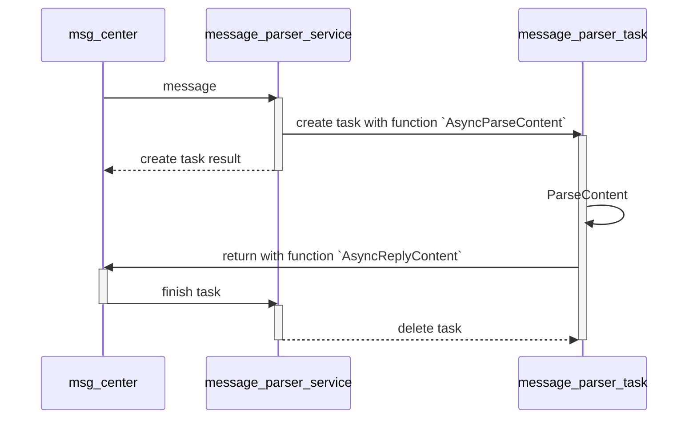

# HTTPS Server 模拟器 - 第二轮需求确认

## 确认日期：2026-02-15

---

## 1. Debug字段位置
- **确认**：在HTTP header里，在HTTP header的末尾

---

## 2. 回调上下文

### 是否需要client信息
- **确认**：接口需要带上client信息
  - client的IP、端口、连接ID等
  - 还需要token的记录

### client状态
- **确认**：server不感知client状态，正常处理完回消息即可

### 报文处理方式
- **当前**：所有报文处理方式一致
- **未来**：可能需要按照client做报文类型识别做区分

---

## 3. HTTP协议版本
- **确认**：所有版本都需要识别

---

## 4. C接口回调的异步机制

### 调用时序

### 额外建议
- msg_center里面采用时间转轮的形式，定时处理要做的事务

### 返回值含义
- **确认**：uint32_t表示错误码，0表示成功

---

## 5. 断链后的"结束的消息"
- **确认**：直接关闭TCP连接

---

## 6. 多个回调的策略模式
- **确认**：带上端口信息，通过端口信息来区分策略

---

## 7. 配置文件内容

### 需要的配置项
- 监听的IP地址（需要）
- TLS版本选择（需要）
- 端口
- 证书路径
- 线程数
- 超时时间

### 不需要的配置项
- 证书与TLS版本的对应关系（不需要）
- 最大连接数（不需要，固定1000）

