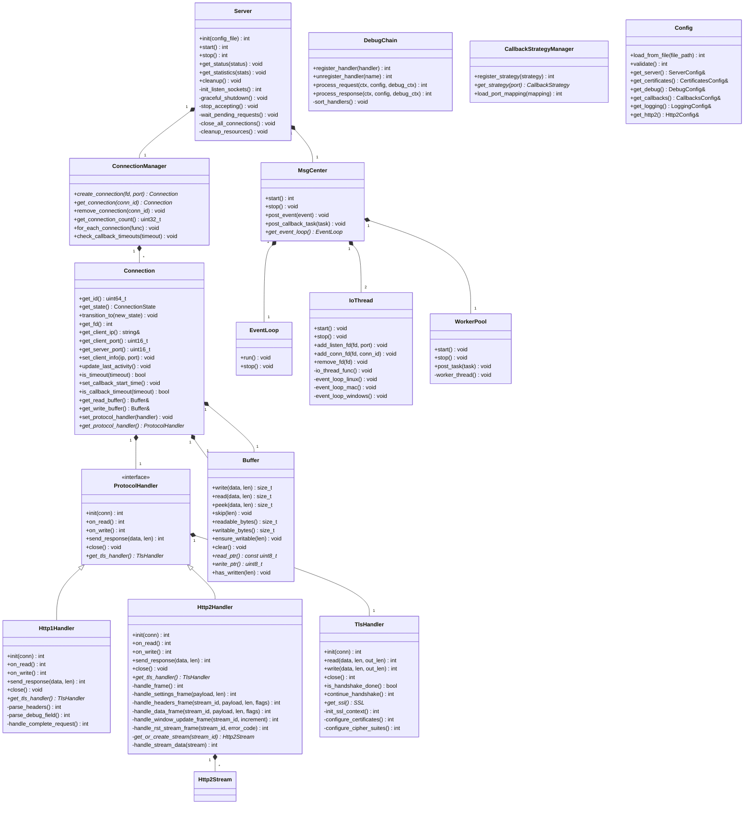
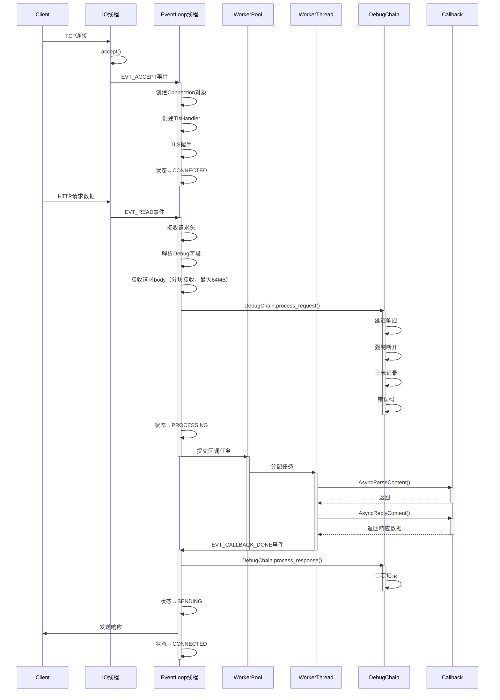
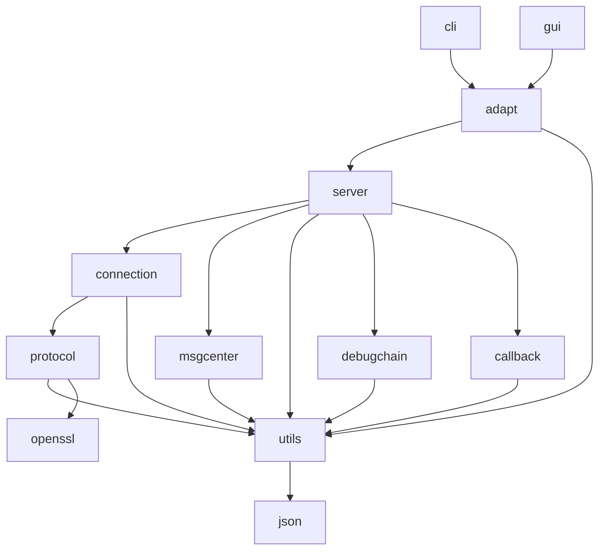
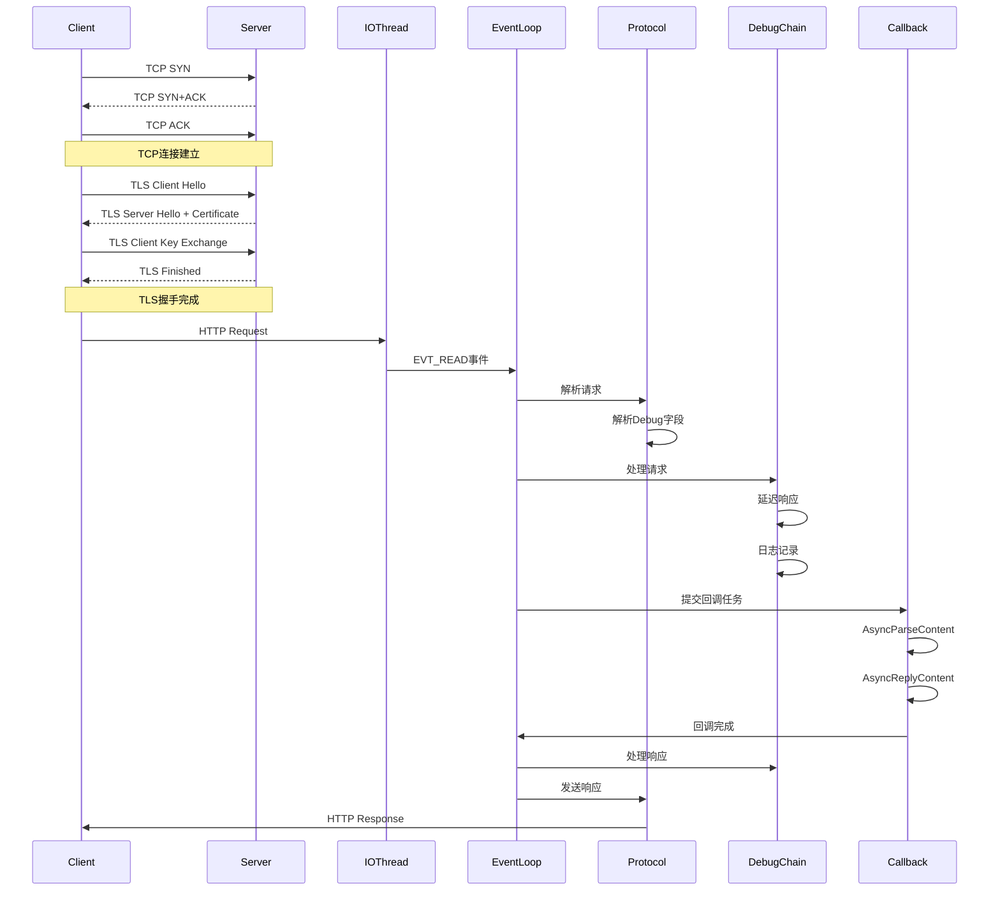
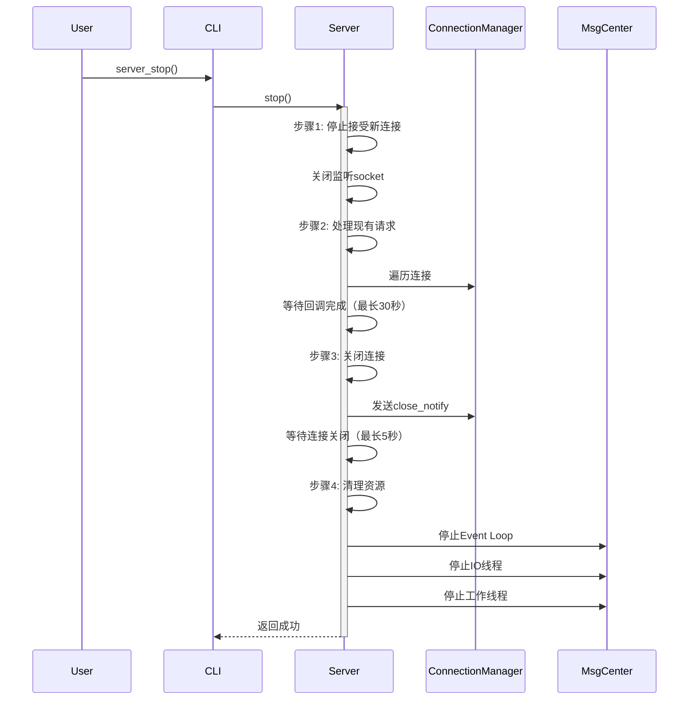

# HTTPS Server 模拟器 - 4+1 视图设计

**版本**: v1
**创建日期**: 2026-02-16
**状态**: 草稿

---

## 目录

1. [逻辑视图 (Logical View)](#1-逻辑视图-logical-view)
2. [物理视图 (Physical View)](#2-物理视图-physical-view)
3. [过程视图 (Process View)](#3-过程视图-process-view)
4. [开发视图 (Development View)](#4-开发视图-development-view)
5. [场景视图 (Scenario View)](#5-场景视图-scenario-view)

---

## 1. 逻辑视图 (Logical View)

### 1.1 系统分层架构

```
┌─────────────────────────────────────────────────────────────┐
│                     Python 3.8 适配层                        │
│  ┌──────────────────┐         ┌──────────────────┐        │
│  │   CLI (cli)      │         │   GUI (app)      │        │
│  └──────────────────┘         └──────────────────┘        │
└─────────────────────────────────────────────────────────────┘
                              │
                              ▼
┌─────────────────────────────────────────────────────────────┐
│                   C++17 核心层 (core)                        │
│  ┌───────────────────────────────────────────────────────┐ │
│  │              适配层封装 (adapt)                        │ │
│  └───────────────────────────────────────────────────────┘ │
│  ┌───────────────────────────────────────────────────────┐ │
│  │  ┌──────────────┐  ┌──────────────┐  ┌────────────┐ │ │
│  │  │  HTTP/TLS    │  │ Msg Center   │  │ Client     │ │ │
│  │  │  协议层      │  │ (Event Loop) │  │ 生命周期   │ │ │
│  │  └──────────────┘  └──────────────┘  └────────────┘ │ │
│  ├───────────────────────────────────────────────────────┤ │
│  │  ┌─────────────────────────────────────────────────┐  │ │
│  │  │          调测职责链 (Debug Chain)                │  │ │
│  │  │  延迟响应 | 强制断开 | 日志记录 | 错误码        │  │ │
│  │  └─────────────────────────────────────────────────┘  │ │
│  ├───────────────────────────────────────────────────────┤ │
│  │  ┌─────────────────────────────────────────────────┐  │ │
│  │  │       回调策略模式 (Callback Strategy)           │  │ │
│  │  │  根据server端口选择对应的回调object              │  │ │
│  │  └─────────────────────────────────────────────────┘  │ │
│  └───────────────────────────────────────────────────────┘ │
└─────────────────────────────────────────────────────────────┘
                              │
                              ▼
┌─────────────────────────────────────────────────────────────┐
│                   静态链接回调 Objects                        │
│  ┌──────────────┐  ┌──────────────┐  ┌──────────────┐     │
│  │  Callback 1  │  │  Callback 2  │  │  Callback N  │     │
│  └──────────────┘  └──────────────┘  └──────────────┘     │
└─────────────────────────────────────────────────────────────┘
```

### 1.2 核心类图



---

## 2. 物理视图 (Physical View)

### 2.1 部署架构图

```
┌─────────────────────────────────────────────────────────────────┐
│                        目标机器 (Windows/Linux/Mac)              │
│                                                                 │
│  ┌───────────────────────────────────────────────────────────┐ │
│  │                  Python 3.8 运行环境                        │ │
│  │  ┌──────────────┐        ┌──────────────┐                │ │
│  │  │ server_sim   │        │ server_sim   │                │ │
│  │  │ _cli.py      │        │ _app.py      │                │ │
│  │  └──────────────┘        └──────────────┘                │ │
│  └───────────────────────────────────────────────────────────┘ │
│                              │                                  │
│                              ▼                                  │
│  ┌───────────────────────────────────────────────────────────┐ │
│  │              动态库/可执行文件                              │ │
│  │  ┌─────────────────────────────────────────────────────┐  │ │
│  │  │  libhttps_server_adapt.so/.dylib/.dll               │  │ │
│  │  └─────────────────────────────────────────────────────┘  │ │
│  │  ┌─────────────────────────────────────────────────────┐  │ │
│  │  │  https_server_main (可执行文件)                      │  │ │
│  │  └─────────────────────────────────────────────────────┘  │ │
│  └───────────────────────────────────────────────────────────┘ │
│                              │                                  │
│                              ▼                                  │
│  ┌───────────────────────────────────────────────────────────┐ │
│  │                    配置与证书文件                           │ │
│  │  ┌──────────────────┐  ┌──────────────────┐               │ │
│  │  │ server_config    │  │ cert.pem         │               │ │
│  │  │ .json            │  │ key.pem          │               │ │
│  │  └──────────────────┘  └──────────────────┘               │ │
│  └───────────────────────────────────────────────────────────┘ │
│                              │                                  │
│                              ▼                                  │
│  ┌───────────────────────────────────────────────────────────┐ │
│  │                    日志文件                                  │ │
│  │  ┌──────────────────┐  ┌──────────────────┐               │ │
│  │  │ server.log       │  │ server.log.1     │               │ │
│  │  └──────────────────┘  └──────────────────┘               │ │
│  └───────────────────────────────────────────────────────────┘ │
└─────────────────────────────────────────────────────────────────┘
```

### 2.2 组件图

```mermaid
componentDiagram
    [CLI] as cli
    [GUI] as gui
    [Adapt Layer] as adapt
    [Server Module] as server
    [Connection Module] as conn
    [Protocol Module] as protocol
    [MsgCenter Module] as msgcenter
    [DebugChain Module] as debugchain
    [Callback Module] as callback
    [Utils Module] as utils
    [Callback 1] as cb1
    [Callback 2] as cb2
    [OpenSSL] as openssl
    [JSON Library] as json

    cli --> adapt
    gui --> adapt
    adapt --> server
    adapt --> utils
    server --> conn
    server --> msgcenter
    server --> utils
    conn --> protocol
    conn --> utils
    protocol --> openssl
    protocol --> utils
    msgcenter --> utils
    debugchain --> utils
    callback --> utils
    server --> debugchain
    server --> callback
    callback --> cb1
    callback --> cb2
    utils --> json
```

---

## 3. 过程视图 (Process View)

### 3.1 线程模型图

```
┌─────────────────────────────────────────────────────────────┐
│                        进程空间                               │
│                                                              │
│  ┌───────────────────────────────────────────────────────┐ │
│  │  T1: Main/Event Loop 线程                              │ │
│  │  - Event Loop 主循环                                    │ │
│  │  - 事件分发处理                                         │ │
│  │  - 状态机管理                                           │ │
│  └───────────────────────────────────────────────────────┘ │
│                                                              │
│  ┌───────────────────────────────────────────────────────┐ │
│  │  T2: IO 线程-1                                         │ │
│  │  - epoll/select/kqueue 监听                            │ │
│  │  - 处理 accept 事件                                     │ │
│  │  - 处理 read/write 事件                                 │ │
│  └───────────────────────────────────────────────────────┘ │
│                                                              │
│  ┌───────────────────────────────────────────────────────┐ │
│  │  T3: IO 线程-2                                         │ │
│  │  - epoll/select/kqueue 监听                            │ │
│  │  - 处理 accept 事件                                     │ │
│  │  - 处理 read/write 事件                                 │ │
│  └───────────────────────────────────────────────────────┘ │
│                                                              │
│  ┌───────────────────────────────────────────────────────┐ │
│  │  T4: 工作线程-1                                        │ │
│  │  - 执行回调任务                                         │ │
│  │  - AsyncParseContent                                   │ │
│  │  - AsyncReplyContent                                   │ │
│  └───────────────────────────────────────────────────────┘ │
│                                                              │
│  ┌───────────────────────────────────────────────────────┐ │
│  │  T5: 工作线程-2                                        │ │
│  │  - 执行回调任务                                         │ │
│  │  - AsyncParseContent                                   │ │
│  │  - AsyncReplyContent                                   │ │
│  └───────────────────────────────────────────────────────┘ │
│                                                              │
│  ┌───────────────────────────────────────────────────────┐ │
│  │  共享数据结构（加锁保护）                               │ │
│  │  - EventQueue (std::mutex)                            │ │
│  │  - ConnectionManager (std::mutex)                      │ │
│  │  - CallbackStrategyManager (std::mutex)                │ │
│  └───────────────────────────────────────────────────────┘ │
│                                                              │
│  ┌───────────────────────────────────────────────────────┐ │
│  │  无锁数据结构                                           │ │
│  │  - WorkerPool TaskQueue (Lock-free)                    │ │
│  └───────────────────────────────────────────────────────┘ │
└─────────────────────────────────────────────────────────────┘
```

### 3.2 请求处理时序图



---

## 4. 开发视图 (Development View)

### 4.1 目录结构

```
https-server-sim/
├── docs/
│   ├── design/
│   │   ├── srs-需求分析文档.md
│   │   ├── srs-需求文档.md
│   │   ├── hld-架构设计文档.md
│   │   ├── hld-4+1视图.md
│   │   ├── hld-工程设计.md
│   │   └── modules/              # 子模块详细设计
│   │       ├── module-server.md
│   │       ├── module-connection.md
│   │       ├── module-protocol.md
│   │       ├── module-msgcenter.md
│   │       ├── module-debugchain.md
│   │       ├── module-callback.md
│   │       └── module-utils.md
│   └── .ai/
│       └── hld/                 # 架构设计检视意见
├── codes/
│   ├── api/
│   │   ├── adapt/               # C接口适配层
│   │   │   ├── include/
│   │   │   └── source/
│   │   ├── cli/                 # Python CLI适配层
│   │   │   ├── __init__.py
│   │   │   ├── main.py
│   │   │   ├── config.py
│   │   │   └── server.py
│   │   ├── app/                 # Python GUI适配层
│   │   │   ├── __init__.py
│   │   │   ├── main.py
│   │   │   ├── main_window.py
│   │   │   ├── config_panel.py
│   │   │   └── log_panel.py
│   │   └── Test/
│   │       ├── unit_tests/
│   │       └── integration_tests/
│   └── core/
│       ├── include/
│       │   ├── server/
│       │   ├── connection/
│       │   ├── protocol/
│       │   ├── msg_center/
│       │   ├── debug_chain/
│       │   ├── callback/
│       │   └── utils/
│       ├── source/
│       │   ├── server/
│       │   ├── connection/
│       │   ├── protocol/
│       │   ├── msg_center/
│       │   ├── debug_chain/
│       │   ├── callback/
│       │   └── utils/
│       └── test/
│           └── sim_client/
├── prompts/
├── scripts/
│   ├── build_project.py
│   ├── server_sim_cli.py
│   └── server_sim_app.py
├── third_party/
│   ├── openssl/
│   ├── json/
│   └── ...
└── CMakeLists.txt
```

### 4.2 包依赖图



---

## 5. 场景视图 (Scenario View)

### 5.1 典型用例：HTTPS请求响应

**参与者**: Client、HTTPS Server模拟器

**场景描述**: Client发起HTTPS请求，Server处理并返回响应



### 5.2 典型用例：Graceful Shutdown

**参与者**: 用户、HTTPS Server模拟器

**场景描述**: 用户触发Server关闭，Server优雅关闭



---

**文档结束**
