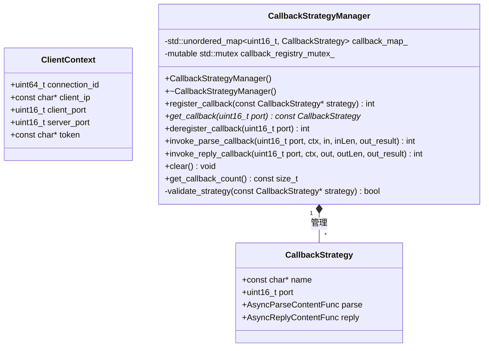
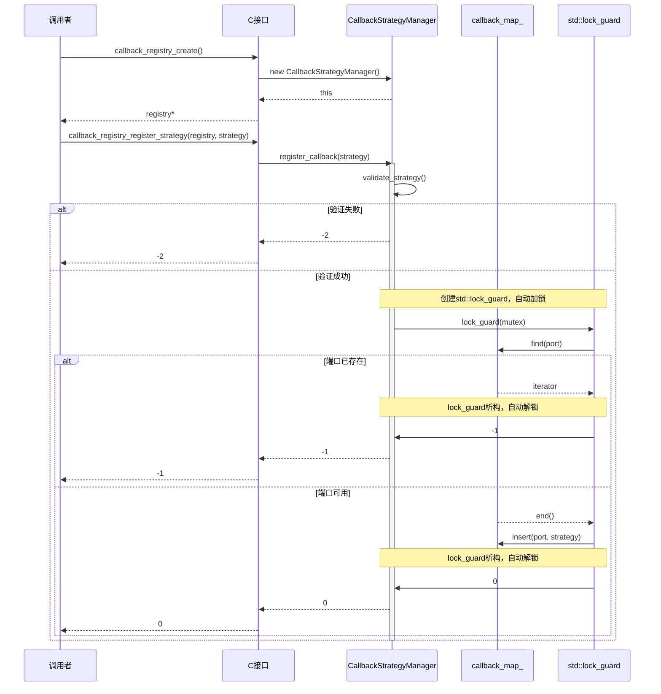
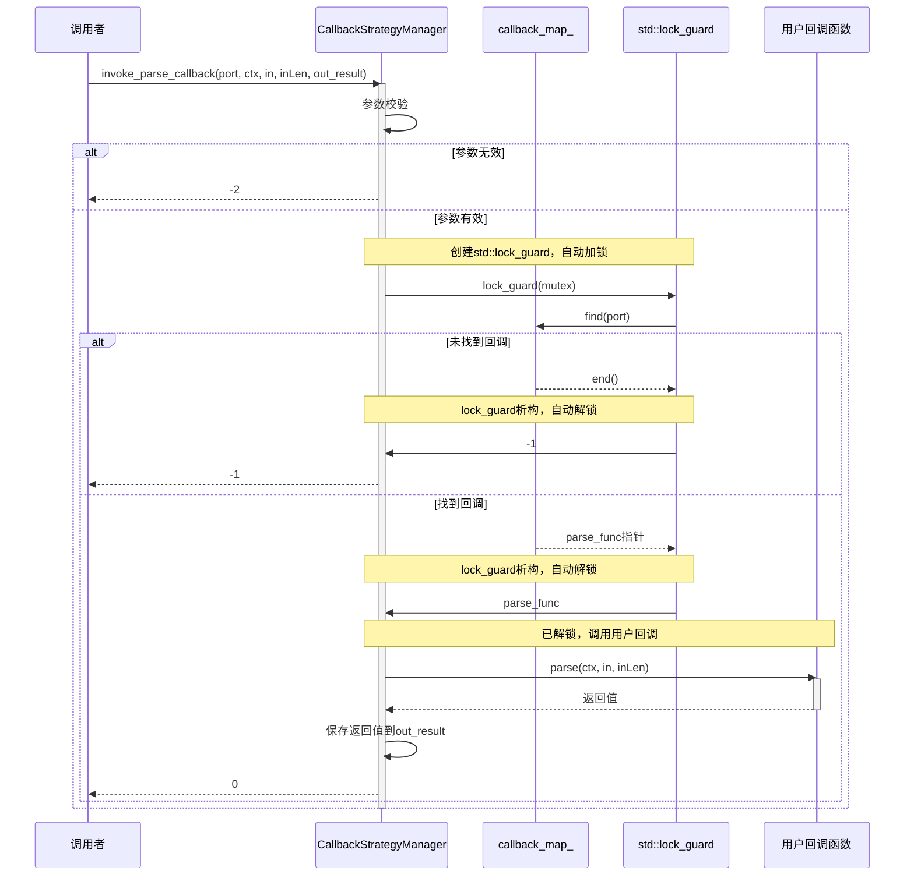
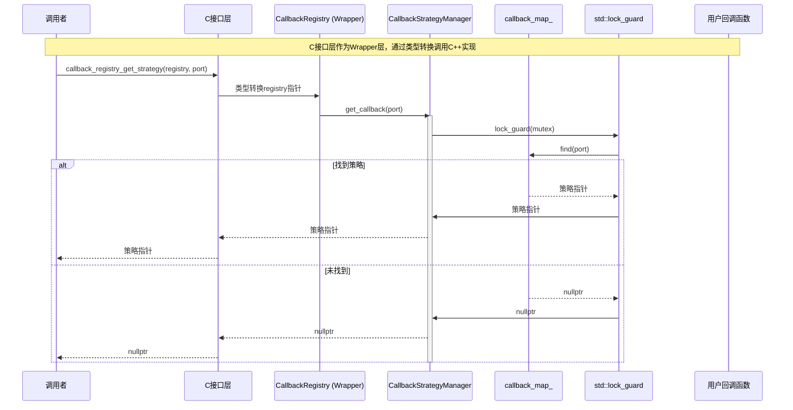

# HTTPS Server 模拟器 - Callback 模块详细设计文档

**版本**: v6
**创建日期**: 2026-02-16
**修改日期**: 2026-02-17
**状态**: 草稿

**修改记录**:
- v5 → v6: 根据检视意见报告修复所有问题（ClientContext位置、错误码、指针有效性、token说明、validate_strategy增强）
- v4 → v5: 初始完整详细设计

---

## 目录

1. [模块基本信息](#1-模块基本信息)
2. [设计概述](#2-设计概述)
3. [详细设计内容](#3-详细设计内容)
4. [开发落地指南](#4-开发落地指南)
5. [单元测试用例](#5-单元测试用例)
6. [设计验证](#6-设计验证)
7. [备注](#7-备注)

---

## 1. 模块基本信息

### 1.1 基本信息

| 项目 | 内容 |
|-----|------|
| 模块名称 | Callback |
| 模块唯一标识 | Module_Callback |
| 核心类型 | 逻辑控制类 |
| 模块路径 | codes/core/source/callback/ |
| 头文件路径 | codes/core/include/callback/ |
| 设计负责人 | 模块设计师Agent |
| 设计日期 | 2026-02-16 |

### 1.2 模块职责

**架构定义职责**:
- 回调策略管理
- 端口到回调的映射维护

**核心定位**:
Callback模块是HTTPS Server模拟器的回调策略管理中心，负责根据服务器端口号选择并调度对应的回调函数，实现请求内容的解析和响应内容的生成。

### 1.3 职责边界

| 该做什么 | 不该做什么 |
|---------|-----------|
| 管理回调策略的注册与注销 | 不负责具体的业务逻辑实现 |
| 维护端口到回调策略的映射关系 | 不处理网络IO |
| 提供回调策略查询接口 | 不处理连接状态管理 |
| 线程安全的回调策略访问 | 不负责TLS/HTTP协议解析 |

### 1.4 关联需求

| 需求ID | 需求描述 | 需求类型 |
|-------|---------|---------|
| REQ-001 | 支持多端口监听，每个端口可配置独立回调策略 | 功能性 |
| REQ-002 | 支持AsyncParseContent回调函数解析请求内容 | 功能性 |
| REQ-003 | 支持AsyncReplyContent回调函数生成响应内容 | 功能性 |
| REQ-004 | 支持回调策略的动态注册与查询 | 功能性 |
| REQ-010 | 支持多线程安全的回调调度 | 非功能性 |

### 1.5 依赖关系

| 依赖方向 | 模块名称 | 依赖用途 |
|---------|---------|---------|
| 被依赖 | Server | Server启动时注册回调策略 |
| 被依赖 | Protocol | 请求处理时查询并调用回调 |
| 被依赖 | MsgCenter | 工作线程中执行回调函数 |

### 1.6 跨模块接口依赖

本模块不依赖其他模块的接口，仅提供C接口供外部调用。

---

## 2. 设计概述

### 2.1 设计目标

基于架构约束，完成Callback模块内部细化设计，覆盖全部关联需求，支撑开发直接编码、单元测试落地。具体目标包括：
- 实现线程安全的回调策略注册与查询
- 实现高效的端口到回调映射机制
- 提供清晰的C接口供外部调用
- 确保模块内部高内聚、低耦合

### 2.2 遵循约束

| 约束类型 | 约束内容 |
|---------|---------|
| 架构约束 | 严格遵循架构设计文档中Callback模块的职责定义 |
| 接口约束 | 内部模块通过头文件关联，无外部依赖，提供C接口供Python调用 |
| 设计原则 | 纯功能驱动，不关注安全性；严格避免过度设计 |
| 语言约束 | C++17标准 |
| 并发约束 | 使用std::mutex保证线程安全 |

### 2.3 核心设计思路

1. **模块类型判定**: 逻辑控制类模块，核心职责是回调策略管理与调度
2. **内部结构划分**: 划分为CallbackStrategyManager类（核心管理类）、ClientContext结构体（上下文信息）
3. **核心逻辑**: 使用std::unordered_map维护端口到回调策略的映射，使用std::mutex保证线程安全
4. **回调方式**: 使用函数指针回调，不使用动态库加载
5. **图形化配套**: 绘制类图、时序图辅助说明
6. **测试覆盖**: 设计完整的单元测试用例，覆盖正常、异常、边界场景

### 2.4 设计范围

本次设计范围仅限于Callback模块内部，不涉及其他模块、跨模块联调、版本迭代等无关内容。

---

## 3. 详细设计内容

### 3.1 内部结构设计

#### 3.1.1 类/组件划分

| 类/组件名称 | 类型 | 职责描述 | 包含文件 |
|------------|------|---------|---------|
| ClientContext | 结构体 | 封装客户端上下文信息 | client_context.h |
| CallbackStrategy | 结构体 | 封装回调策略（包含函数指针） | callback.h |
| CallbackStrategyManager | 类 | 回调策略管理核心类（C++实现） | callback.hpp, callback.cpp |
| CallbackRegistry | 类型别名 | C接口Wrapper类型（CallbackStrategyManager的别名） | callback.h |
| C接口函数 | 函数 | 提供C接口供外部调用，内部调用CallbackStrategyManager | callback.h, callback.cpp |

#### 3.1.2 ClientContext 结构体设计

**文件路径**: codes/core/include/callback/client_context.h

**属性**:

| 属性名称 | 类型 | 默认值 | 用途 | 约束 |
|---------|------|-------|------|------|
| connection_id | uint64_t | 0 | 连接唯一标识 | 不可为0 |
| client_ip | const char* | NULL | 客户端IP地址字符串 | 可为NULL |
| client_port | uint16_t | 0 | 客户端端口号 | 0-65535 |
| server_port | uint16_t | 0 | 服务器监听端口号 | 1-65535 |
| token | const char* | NULL | 调测token字符串 | 可为NULL |

**token字段详细说明**:
- **设置时机**: 由Connection模块在接受新连接时设置
- **使用场景**: 主要供DebugChain模块进行调测功能验证使用
- **是否可为NULL**: 可以为NULL，非调测模式下通常为NULL
- **有效期管理**: token字符串的生命周期与连接生命周期一致，连接关闭后失效
- **内存管理**: 由设置者（Connection模块）负责内存分配与释放，Callback模块不拥有该指针

**完整定义**:

```cpp
typedef struct {
    uint64_t connection_id;      // 连接唯一标识
    const char* client_ip;        // 客户端IP地址（字符串，可为NULL）
    uint16_t client_port;         // 客户端端口号
    uint16_t server_port;         // 服务器监听端口号
    const char* token;            // 调测token（可为NULL，生命周期由Connection模块管理）
} ClientContext;
```

#### 3.1.3 CallbackStrategy 结构体设计

**文件路径**: codes/core/include/callback/callback.h

**属性**:

| 属性名称 | 类型 | 默认值 | 用途 | 约束 |
|---------|------|-------|------|------|
| name | const char* | NULL | 回调策略名称 | 不可为NULL，生命周期由调用者保证 |
| port | uint16_t | 0 | 监听端口号 | 1-65535 |
| parse | AsyncParseContentFunc | NULL | 请求解析回调函数指针 | 不可为NULL |
| reply | AsyncReplyContentFunc | NULL | 响应生成回调函数指针 | 不可为NULL |

**生命周期说明**:
- `name`指针：CallbackStrategyManager内部**不复制**name字符串，仅保存指针。调用者必须保证name指向的字符串在CallbackStrategy注册期间持续有效。建议使用静态字符串或确保字符串生命周期超过回调策略的注册周期。

**回调函数类型定义**:

```cpp
// AsyncParseContentFunc: 解析请求内容
// 参数:
//   ctx - 客户端上下文
//   in - 输入数据缓冲区
//   inLen - 输入数据长度
// 返回值: 用户自定义状态码
typedef uint32_t (*AsyncParseContentFunc)(const ClientContext* ctx,
                                           const uint8_t* in,
                                           uint32_t inLen);

// AsyncReplyContentFunc: 生成响应内容
// 参数:
//   ctx - 客户端上下文
//   out - 输出数据缓冲区
//   outLen - 输入时为缓冲区大小，输出时为实际数据长度
// 返回值: 用户自定义状态码
typedef uint32_t (*AsyncReplyContentFunc)(const ClientContext* ctx,
                                           uint8_t* out,
                                           uint32_t* outLen);
```

#### 3.1.4 CallbackStrategyManager 类设计

**文件路径**: codes/core/include/callback/callback.hpp

**类定位说明**:
- CallbackStrategyManager是C++实现的核心管理类，提供完整的回调策略管理功能
- CallbackRegistry是CallbackStrategyManager的C接口Wrapper类型别名，用于对外提供C兼容接口
- C接口函数内部通过将CallbackRegistry*转换为CallbackStrategyManager*来调用实际实现

**类定义**:

```cpp
namespace https_server_sim {

class CallbackStrategyManager {
public:
    CallbackStrategyManager();
    ~CallbackStrategyManager();

    // 禁止拷贝
    CallbackStrategyManager(const CallbackStrategyManager&) = delete;
    CallbackStrategyManager& operator=(const CallbackStrategyManager&) = delete;

    // ==================== 对外C接口对应方法 ====================
    // 注册回调策略（对应C接口：callback_registry_register_strategy）
    // @param strategy 回调策略指针
    // @return 0成功，-1端口已占用，-4参数无效
    int register_callback(const CallbackStrategy* strategy);

    // 获取指定端口的回调策略（对应C接口：callback_registry_get_strategy）
    // @param port 端口号
    // @return 回调策略指针，未找到返回NULL
    // @note 指针有效性保证：
    //   1. 返回的指针仅在无其他线程修改registry时有效
    //   2. 若其他线程调用deregister_callback或clear，该指针可能变为悬空指针
    //   3. 建议优先使用invoke_*_callback方法而非直接获取指针调用回调
    const CallbackStrategy* get_callback(uint16_t port) const;

    // 调用指定端口的解析回调函数
    // @param port 端口号
    // @param ctx 客户端上下文
    // @param in 输入数据缓冲区
    // @param inLen 输入数据长度
    // @param out_result 输出：回调返回值
    // @return 0成功调用回调，-3未找到回调，-4参数无效
    int invoke_parse_callback(uint16_t port,
                              const ClientContext* ctx,
                              const uint8_t* in,
                              uint32_t inLen,
                              uint32_t* out_result);

    // 调用指定端口的响应回调函数
    // @param port 端口号
    // @param ctx 客户端上下文
    // @param out 输出数据缓冲区
    // @param outLen 输入时为缓冲区大小，输出时为实际数据长度
    // @param out_result 输出：回调返回值
    // @return 0成功调用回调，-3未找到回调，-4参数无效
    int invoke_reply_callback(uint16_t port,
                              const ClientContext* ctx,
                              uint8_t* out,
                              uint32_t* outLen,
                              uint32_t* out_result);

    // ==================== 内部C++扩展方法（暂不暴露C接口）====================
    // 注销指定端口的回调策略（内部方法）
    // @param port 端口号
    // @return 0成功，-2端口未找到
    int deregister_callback(uint16_t port);

    // 清空所有回调策略（内部方法）
    void clear();

    // 获取已注册的策略数量（内部方法）
    size_t get_callback_count() const;

private:
    // 验证策略有效性
    bool validate_strategy(const CallbackStrategy* strategy) const;

    // 端口到策略的映射
    std::unordered_map<uint16_t, CallbackStrategy> callback_map_;

    // 互斥锁，保证线程安全
    mutable std::mutex callback_registry_mutex_;
};

} // namespace https_server_sim
```

**类成员详细说明**:

| 成员 | 访问权限 | 类型 | 用途 | 接口类型 |
|-----|---------|------|------|---------|
| callback_map_ | private | std::unordered_map<uint16_t, CallbackStrategy> | 存储端口到策略的映射 | - |
| callback_registry_mutex_ | private | mutable std::mutex | 保护callback_map_的线程安全 | - |
| CallbackStrategyManager() | public | 构造函数 | 初始化空的manager | 对应C接口 |
| ~CallbackStrategyManager() | public | 析构函数 | 清理资源 | 对应C接口 |
| register_callback() | public | 方法 | 注册回调策略 | 对应C接口 |
| get_callback() | public | 方法 | 查询回调策略 | 对应C接口 |
| invoke_parse_callback() | public | 方法 | 调用解析回调 | 内部方法 |
| invoke_reply_callback() | public | 方法 | 调用响应回调 | 内部方法 |
| deregister_callback() | public | 方法 | 注销回调策略 | 内部方法 |
| clear() | public | 方法 | 清空所有策略 | 内部方法 |
| get_callback_count() | public | 方法 | 获取策略数量 | 内部方法 |
| validate_strategy() | private | 方法 | 验证策略有效性 | - |

#### 3.1.5 类关系图

```
CallbackStrategyManager (核心管理类)
    ├── contains → std::unordered_map<uint16_t, CallbackStrategy>
    ├── contains → mutable std::mutex (callback_registry_mutex_)
    └── uses → CallbackStrategy
                      ├── uses → ClientContext
                      ├── uses → AsyncParseContentFunc (函数指针)
                      └── uses → AsyncReplyContentFunc (函数指针)
```

---

### 3.2 核心逻辑设计

#### 3.2.1 回调策略注册逻辑 (register_callback)

**功能描述**: 注册一个新的回调策略，指定端口号和回调函数指针

**核心步骤**:

```
1. 输入参数校验
   ├─ 检查strategy指针是否为NULL
   ├─ 检查strategy->name是否为NULL
   ├─ 检查strategy->name是否为空字符串
   ├─ 检查strategy->port是否在有效范围(1-65535)
   ├─ 检查strategy->parse是否为NULL
   └─ 检查strategy->reply是否为NULL

2. 加锁保护
   └─ 锁定callback_registry_mutex_

3. 端口冲突检查
   ├─ 在callback_map_中查找port
   └─ 若已存在，返回错误码CALLBACK_ERR_PORT_EXISTS(-1)

4. 插入策略
   ├─ 将strategy复制到callback_map_
   └─ 以port为key

5. 解锁
   └─ 解锁callback_registry_mutex_

6. 返回成功
   └─ 返回CALLBACK_SUCCESS(0)
```

**完整实现**:

```cpp
int CallbackStrategyManager::register_callback(const CallbackStrategy* strategy) {
    // 1. 参数校验
    if (!validate_strategy(strategy)) {
        return CALLBACK_ERR_INVALID_PARAM;
    }

    // 2. 加锁（使用std::lock_guard RAII自动管理锁）
    std::lock_guard<std::mutex> lock(callback_registry_mutex_);

    // 3. 检查端口是否已占用
    auto it = callback_map_.find(strategy->port);
    if (it != callback_map_.end()) {
        return CALLBACK_ERR_PORT_EXISTS;
    }

    // 4. 插入策略（复制结构体内容）
    callback_map_[strategy->port] = *strategy;

    // 5. 返回成功（lock_guard自动解锁）
    return 0;
}

bool CallbackStrategyManager::validate_strategy(const CallbackStrategy* strategy) const {
    if (strategy == nullptr) {
        return false;
    }
    if (strategy->name == nullptr) {
        return false;
    }
    // 检查name字符串是否为空字符串
    if (strategy->name[0] == '\0') {
        return false;
    }
    // 检查端口范围（1-65535）
    if (strategy->port == 0) {
        return false;
    }
    if (strategy->parse == nullptr) {
        return false;
    }
    if (strategy->reply == nullptr) {
        return false;
    }
    return true;
}
```

#### 3.2.2 回调策略查询逻辑 (get_callback)

**功能描述**: 根据端口号查询对应的回调策略

**指针有效期注意事项**:
- 返回的指针指向callback_map_内部存储的CallbackStrategy对象
- 该指针仅在以下条件下有效：
  1. 无其他线程调用deregister_callback()注销该端口的策略
  2. 无其他线程调用clear()清空所有策略
- 若需要安全地调用回调函数，建议使用invoke_parse_callback()和invoke_reply_callback()方法

**核心步骤**:

```
1. 加锁保护
   └─ 锁定callback_registry_mutex_

2. 查询映射
   ├─ 在callback_map_中查找port
   ├─ 若找到，返回策略指针
   └─ 若未找到，返回NULL

3. 解锁
   └─ 解锁callback_registry_mutex_
```

**完整实现**:

```cpp
const CallbackStrategy* CallbackStrategyManager::get_callback(uint16_t port) const {
    // 1. 加锁
    std::lock_guard<std::mutex> lock(callback_registry_mutex_);

    // 2. 查询
    auto it = callback_map_.find(port);
    if (it != callback_map_.end()) {
        return &(it->second);
    }

    // 3. 未找到
    return nullptr;
}
```

#### 3.2.3 回调策略注销逻辑 (deregister_callback)

**功能描述**: 注销指定端口的回调策略

**核心步骤**:

```
1. 加锁保护
   └─ 锁定callback_registry_mutex_

2. 查询并删除
   ├─ 在callback_map_中查找port
   ├─ 若找到，删除该条目
   └─ 若未找到，返回错误码CALLBACK_ERR_PORT_NOT_FOUND(-2)

3. 解锁
   └─ 解锁callback_registry_mutex_

4. 返回成功
   └─ 返回CALLBACK_SUCCESS(0)
```

**完整实现**:

```cpp
int CallbackStrategyManager::deregister_callback(uint16_t port) {
    // 1. 加锁
    std::lock_guard<std::mutex> lock(callback_registry_mutex_);

    // 2. 查询并删除
    auto it = callback_map_.find(port);
    if (it == callback_map_.end()) {
        return CALLBACK_ERR_PORT_NOT_FOUND;
    }
    callback_map_.erase(it);

    // 3. 返回成功
    return 0;
}
```

#### 3.2.4 解析回调调用逻辑 (invoke_parse_callback)

**功能描述**: 查找并调用指定端口的解析回调函数

**核心步骤**:

```
1. 参数校验
   ├─ 检查ctx是否为NULL
   ├─ 检查in是否为NULL（inLen>0时）
   └─ 检查out_result是否为NULL

2. 加锁保护
   └─ 锁定callback_registry_mutex_

3. 查询回调策略
   ├─ 在callback_map_中查找port
   └─ 若未找到，返回CALLBACK_ERR_STRATEGY_NOT_FOUND(-3)

4. 获取回调函数指针
   └─ 从策略中获取parse函数指针

5. 解锁
   └─ 解锁callback_registry_mutex_（在调用回调前解锁）

6. 调用回调函数
   └─ 调用parse(ctx, in, inLen)

7. 保存返回值
   └─ 将回调返回值存入out_result

8. 返回成功
   └─ 返回CALLBACK_SUCCESS(0)
```

**完整实现**:

```cpp
int CallbackStrategyManager::invoke_parse_callback(uint16_t port,
                                             const ClientContext* ctx,
                                             const uint8_t* in,
                                             uint32_t inLen,
                                             uint32_t* out_result) {
    // 1. 参数校验
    if (ctx == nullptr) {
        return CALLBACK_ERR_INVALID_PARAM;
    }
    if (inLen > 0 && in == nullptr) {
        return CALLBACK_ERR_INVALID_PARAM;
    }
    if (out_result == nullptr) {
        return CALLBACK_ERR_INVALID_PARAM;
    }

    AsyncParseContentFunc parse_func = nullptr;

    {
        // 2. 加锁（使用局部作用域控制锁粒度）
        std::lock_guard<std::mutex> lock(callback_registry_mutex_);

        // 3. 查询回调策略
        auto it = callback_map_.find(port);
        if (it == callback_map_.end()) {
            return CALLBACK_ERR_STRATEGY_NOT_FOUND;
        }

        // 4. 获取回调函数指针
        parse_func = it->second.parse;
    }
    // 5. 自动解锁（离开lock_guard作用域）

    // 6. 调用回调函数（在无锁状态下调用，避免死锁）
    uint32_t result = parse_func(ctx, in, inLen);

    // 7. 保存返回值
    *out_result = result;

    // 8. 返回成功
    return 0;
}
```

#### 3.2.5 响应回调调用逻辑 (invoke_reply_callback)

**功能描述**: 查找并调用指定端口的响应回调函数

**核心步骤**:

```
1. 参数校验
   ├─ 检查ctx是否为NULL
   ├─ 检查out是否为NULL
   ├─ 检查outLen是否为NULL
   └─ 检查out_result是否为NULL

2. 加锁保护
   └─ 锁定callback_registry_mutex_

3. 查询回调策略
   ├─ 在callback_map_中查找port
   └─ 若未找到，返回CALLBACK_ERR_STRATEGY_NOT_FOUND(-3)

4. 获取回调函数指针
   └─ 从策略中获取reply函数指针

5. 解锁
   └─ 解锁callback_registry_mutex_（在调用回调前解锁）

6. 调用回调函数
   └─ 调用reply(ctx, out, outLen)

7. 保存返回值
   └─ 将回调返回值存入out_result

8. 返回成功
   └─ 返回CALLBACK_SUCCESS(0)
```

**完整实现**:

```cpp
int CallbackStrategyManager::invoke_reply_callback(uint16_t port,
                                             const ClientContext* ctx,
                                             uint8_t* out,
                                             uint32_t* outLen,
                                             uint32_t* out_result) {
    // 1. 参数校验
    if (ctx == nullptr) {
        return CALLBACK_ERR_INVALID_PARAM;
    }
    if (out == nullptr) {
        return CALLBACK_ERR_INVALID_PARAM;
    }
    if (outLen == nullptr) {
        return CALLBACK_ERR_INVALID_PARAM;
    }
    if (out_result == nullptr) {
        return CALLBACK_ERR_INVALID_PARAM;
    }

    AsyncReplyContentFunc reply_func = nullptr;

    {
        // 2. 加锁（使用局部作用域控制锁粒度）
        std::lock_guard<std::mutex> lock(callback_registry_mutex_);

        // 3. 查询回调策略
        auto it = callback_map_.find(port);
        if (it == callback_map_.end()) {
            return CALLBACK_ERR_STRATEGY_NOT_FOUND;
        }

        // 4. 获取回调函数指针
        reply_func = it->second.reply;
    }
    // 5. 自动解锁（离开lock_guard作用域）

    // 6. 调用回调函数（在无锁状态下调用，避免死锁）
    uint32_t result = reply_func(ctx, out, outLen);

    // 7. 保存返回值
    *out_result = result;

    // 8. 返回成功
    return 0;
}
```

#### 3.2.6 清空与计数逻辑

**完整实现**:

```cpp
void CallbackStrategyManager::clear() {
    std::lock_guard<std::mutex> lock(callback_registry_mutex_);
    callback_map_.clear();
}

size_t CallbackStrategyManager::get_callback_count() const {
    std::lock_guard<std::mutex> lock(callback_registry_mutex_);
    return callback_map_.size();
}
```

---

### 3.3 线程安全设计

#### 3.3.1 互斥锁策略

CallbackStrategyManager使用单例互斥锁`callback_registry_mutex_`保护所有共享数据访问。

**核心设计原则**:
- **锁对象**: `mutable std::mutex callback_registry_mutex_`
  - mutable修饰允许const成员函数（如get_callback、get_callback_count）加锁
  - 递归使用非递归mutex（std::mutex），避免重入问题

#### 3.3.2 callback_registry_mutex_ 使用场景

| 操作 | 是否需要锁 | 锁持有时间 |
|-----|-----------|-----------|
| register_callback | 是 | 参数校验后 ~ 插入完成 |
| get_callback | 是 | 查询期间 |
| deregister_callback | 是 | 查询+删除期间 |
| clear | 是 | 清空整个map期间 |
| get_callback_count | 是 | 获取size期间 |
| invoke_parse_callback | 是（仅查询阶段） | 查找函数指针期间 |
| invoke_reply_callback | 是（仅查询阶段） | 查找函数指针期间 |

#### 3.3.3 锁粒度控制

**细粒度锁设计**:
1. **参数校验在锁外**: register_callback的validate_strategy在加锁前完成，减少锁持有时间
2. **回调调用在锁外**: invoke_*_callback中，仅在查找函数指针时持有锁，实际回调执行时已解锁

**锁粒度示例**:
```cpp
// invoke_parse_callback中的锁粒度控制
{
    std::lock_guard<std::mutex> lock(callback_registry_mutex_);
    // 仅在这个作用域内持有锁
    auto it = callback_map_.find(port);
    if (it == callback_map_.end()) {
        return CALLBACK_ERR_PORT_EXISTS;
    }
    parse_func = it->second.parse;
}
// 已解锁，回调函数执行期间不持有锁
uint32_t result = parse_func(ctx, in, inLen);
```

#### 3.3.4 死锁预防

**死锁预防措施**:

1. **锁顺序一致性**: 本模块只使用单个互斥锁，无多锁顺序问题
2. **RAII锁管理**: 始终使用std::lock_guard自动管理锁，避免异常导致锁泄漏
3. **回调期间不持有锁**: invoke_*_callback在调用用户回调前释放锁，防止用户回调再次进入本模块导致死锁
4. **禁止锁内阻塞**: 锁内不执行任何可能阻塞的操作（如IO、sleep等）

**潜在死锁场景与规避**:

| 风险场景 | 规避措施 |
|---------|---------|
| 用户回调内再次调用register_callback | 回调执行前已解锁，允许重入 |
| 用户回调内调用get_callback | 回调执行前已解锁，允许重入 |
| 异常抛出导致锁未释放 | 使用std::lock_guard自动解锁 |

---

### 3.4 可扩展性设计

本模块无需支持插件式扩展，回调策略通过函数指针注册即可。

**扩展约束**:
- 用户通过实现AsyncParseContentFunc和AsyncReplyContentFunc函数来自定义回调逻辑
- 通过register_callback()接口注册自定义回调策略
- 无需修改Callback模块内部代码
- 不使用动态库加载，模块间通过头文件关联

---

### 3.5 图形化设计

#### 3.5.1 类图



**图1: Callback模块内部类图**
说明: 展示Callback模块的核心类结构和关系，使用函数指针而非动态库。

#### 3.5.2 动态图 - 注册流程时序图



**图2: 回调策略注册时序图**
说明: 展示回调策略从创建到注册的完整交互流程。

#### 3.5.3 动态图 - 回调调用时序图



**图3: 回调调用时序图**
说明: 展示调用解析回调的完整流程，注意回调执行时已解锁。

#### 3.5.4 动态图 - C接口调用时序图



**图4: C接口调用时序图**
说明: 展示C接口作为Wrapper层，通过类型转换调用CallbackStrategyManager的流程。

---

## 4. 开发落地指南

### 4.1 术语与规范

#### 4.1.1 核心术语

| 术语 | 定义 |
|-----|------|
| Callback Strategy | 回调策略，包含端口号、名称、解析函数指针、响应函数指针 |
| Client Context | 客户端上下文，包含连接ID、IP、端口等信息 |
| CallbackStrategyManager | 回调策略管理器（C++类），管理所有回调策略的核心实现 |
| CallbackRegistry | C接口Wrapper类型，CallbackStrategyManager的类型别名，用于对外C接口 |
| Port Mapping | 端口映射，端口号到回调策略的映射关系 |
| Function Pointer | 函数指针，用于直接回调，不使用动态库加载 |

#### 4.1.2 命名规范

| 元素类型 | 命名规范 | 示例 |
|---------|---------|------|
| 类名 | PascalCase | CallbackStrategyManager |
| 结构体名 | PascalCase | ClientContext, CallbackStrategy |
| 成员变量 | snake_case_，下划线后缀 | callback_map_, callback_registry_mutex_ |
| 成员函数 | snake_case | register_callback(), get_callback() |
| 全局函数 | snake_case | callback_registry_create() |
| 宏定义 | UPPER_SNAKE_CASE | CALLBACK_H |
| 类型别名 | PascalCase，Func后缀 | AsyncParseContentFunc |
| 常量 | k前缀 + PascalCase | kMaxPortCount |

#### 4.1.3 编码规范

1. 使用C++17标准
2. 头文件使用#pragma once
3. 所有代码放入https_server_sim命名空间
4. 使用std::lock_guard管理锁，避免手动lock/unlock
5. 禁止拷贝构造和赋值操作（使用=delete）
6. 指针参数有效性检查，返回明确错误码
7. const成员函数声明为const
8. 调用用户回调前必须释放锁，防止死锁
9. 不使用动态库加载，模块间通过头文件关联

---

### 4.2 核心逻辑说明

#### 4.2.1 线程安全设计

**说明**: CallbackStrategyManager使用std::mutex保证thread-safe，所有访问callback_map_的操作都需要加锁。

**关键点**:
- mutable修饰callback_registry_mutex_，允许const成员函数加锁
- 使用std::lock_guard RAII机制保证锁释放
- 锁粒度尽可能小，仅在访问共享数据时加锁
- 回调函数执行期间不持有锁，避免死锁

#### 4.2.2 错误码定义

| 错误码宏定义 | 值 | 含义 | 使用场景 |
|-------------|---|------|---------|
| CALLBACK_SUCCESS | 0 | 操作成功 | 所有成功场景 |
| CALLBACK_ERR_PORT_EXISTS | -1 | 端口已存在 | register_callback时端口已被注册 |
| CALLBACK_ERR_PORT_NOT_FOUND | -2 | 端口未找到 | deregister_callback时端口不存在 |
| CALLBACK_ERR_STRATEGY_NOT_FOUND | -3 | 回调策略未找到 | invoke_*_callback时策略不存在 |
| CALLBACK_ERR_INVALID_PARAM | -4 | 参数无效 | 空指针、port=0、空字符串等无效参数 |

#### 4.2.3 策略复制存储

**说明**: register_callback()会复制CallbackStrategy结构体存储，调用者可释放传入的strategy指针。

---

### 4.3 数据结构定义

#### 4.3.1 完整头文件定义 (client_context.h 和 callback.h)

**client_context.h**:

```cpp
// codes/core/include/callback/client_context.h
#pragma once

#include <stdint.h>

#ifdef __cplusplus
extern "C" {
#endif

// ClientContext结构体定义
typedef struct {
    uint64_t connection_id;      // 连接唯一标识
    const char* client_ip;        // 客户端IP地址（字符串，可为NULL）
    uint16_t client_port;         // 客户端端口号
    uint16_t server_port;         // 服务器监听端口号
    const char* token;            // 调测token（可为NULL，生命周期由Connection模块管理）
} ClientContext;

#ifdef __cplusplus
}
#endif
```

**callback.h**:

```cpp
// codes/core/include/callback/callback.h
#pragma once

#include <stdint.h>
#include "callback/client_context.h"

#ifdef __cplusplus
extern "C" {
#endif

// ==================== 错误码定义 ====================
#define CALLBACK_SUCCESS              0   // 操作成功
#define CALLBACK_ERR_PORT_EXISTS     -1   // 端口已存在（注册时）
#define CALLBACK_ERR_PORT_NOT_FOUND  -2   // 端口未找到（注销时）
#define CALLBACK_ERR_STRATEGY_NOT_FOUND -3 // 回调策略未找到（调用时）
#define CALLBACK_ERR_INVALID_PARAM   -4   // 参数无效（空指针、空字符串等）

// 回调函数类型定义（函数指针，不使用动态库）
typedef uint32_t (*AsyncParseContentFunc)(const ClientContext* ctx,
                                           const uint8_t* in,
                                           uint32_t inLen);

typedef uint32_t (*AsyncReplyContentFunc)(const ClientContext* ctx,
                                           uint8_t* out,
                                           uint32_t* outLen);

// 回调策略结构
typedef struct {
    const char* name;              // 策略名称（不可为NULL）
    uint16_t port;                 // 监听端口（1-65535）
    AsyncParseContentFunc parse;   // 解析回调函数指针（不可为NULL）
    AsyncReplyContentFunc reply;   // 响应回调函数指针（不可为NULL）
} CallbackStrategy;

// CallbackStrategyManager前置声明（C接口仍使用CallbackRegistry名称保持兼容性）
typedef struct CallbackStrategyManager CallbackRegistry;

// ==================== 对外C接口（与架构文档一致）====================
CallbackRegistry* callback_registry_create(void);
void callback_registry_destroy(CallbackRegistry* registry);
int callback_registry_register_strategy(CallbackRegistry* registry,
                                        const CallbackStrategy* strategy);
const CallbackStrategy* callback_registry_get_strategy(CallbackRegistry* registry,
                                                        uint16_t port);

// ==================== 内部扩展C接口（暂不对外暴露）====================
// 注意：以下接口为内部扩展，未在架构文档中定义，暂不暴露
// int callback_registry_unregister_strategy(CallbackRegistry* registry,
//                                           uint16_t port);
// void callback_registry_clear(CallbackRegistry* registry);
// size_t callback_registry_get_strategy_count(CallbackRegistry* registry);

#ifdef __cplusplus
}
#endif
```

#### 4.3.2 完整C++类定义 (callback.hpp)

```cpp
// codes/core/include/callback/callback.hpp
#pragma once

#include "callback.h"
#include <unordered_map>
#include <mutex>

namespace https_server_sim {

class CallbackStrategyManager {
public:
    CallbackStrategyManager();
    ~CallbackStrategyManager();

    // 禁止拷贝
    CallbackStrategyManager(const CallbackStrategyManager&) = delete;
    CallbackStrategyManager& operator=(const CallbackStrategyManager&) = delete;

    // ==================== 对外C接口对应方法 ====================
    int register_callback(const CallbackStrategy* strategy);
    const CallbackStrategy* get_callback(uint16_t port) const;

    // ==================== 回调调用方法 ====================
    int invoke_parse_callback(uint16_t port,
                              const ClientContext* ctx,
                              const uint8_t* in,
                              uint32_t inLen,
                              uint32_t* out_result);

    int invoke_reply_callback(uint16_t port,
                              const ClientContext* ctx,
                              uint8_t* out,
                              uint32_t* outLen,
                              uint32_t* out_result);

    // ==================== 内部C++扩展方法 ====================
    int deregister_callback(uint16_t port);
    void clear();
    size_t get_callback_count() const;

private:
    bool validate_strategy(const CallbackStrategy* strategy) const;

    std::unordered_map<uint16_t, CallbackStrategy> callback_map_;
    mutable std::mutex callback_registry_mutex_;
};

} // namespace https_server_sim
```

#### 4.3.3 C接口实现代码示例 (callback.cpp)

**文件路径**: codes/core/source/callback/callback.cpp

```cpp
// codes/core/source/callback/callback.cpp
#include "callback/callback.hpp"

namespace https_server_sim {

// ==================== CallbackStrategyManager实现 ====================

CallbackStrategyManager::CallbackStrategyManager() = default;

CallbackStrategyManager::~CallbackStrategyManager() = default;

int CallbackStrategyManager::register_callback(const CallbackStrategy* strategy) {
    if (!validate_strategy(strategy)) {
        return CALLBACK_ERR_INVALID_PARAM;
    }

    std::lock_guard<std::mutex> lock(callback_registry_mutex_);

    auto it = callback_map_.find(strategy->port);
    if (it != callback_map_.end()) {
        return CALLBACK_ERR_PORT_EXISTS;
    }

    callback_map_[strategy->port] = *strategy;
    return CALLBACK_SUCCESS;
}

const CallbackStrategy* CallbackStrategyManager::get_callback(uint16_t port) const {
    std::lock_guard<std::mutex> lock(callback_registry_mutex_);

    auto it = callback_map_.find(port);
    if (it != callback_map_.end()) {
        return &(it->second);
    }
    return nullptr;
}

int CallbackStrategyManager::deregister_callback(uint16_t port) {
    std::lock_guard<std::mutex> lock(callback_registry_mutex_);

    auto it = callback_map_.find(port);
    if (it == callback_map_.end()) {
        return CALLBACK_ERR_PORT_NOT_FOUND;
    }
    callback_map_.erase(it);
    return CALLBACK_SUCCESS;
}

void CallbackStrategyManager::clear() {
    std::lock_guard<std::mutex> lock(callback_registry_mutex_);
    callback_map_.clear();
}

size_t CallbackStrategyManager::get_callback_count() const {
    std::lock_guard<std::mutex> lock(callback_registry_mutex_);
    return callback_map_.size();
}

int CallbackStrategyManager::invoke_parse_callback(uint16_t port,
                                             const ClientContext* ctx,
                                             const uint8_t* in,
                                             uint32_t inLen,
                                             uint32_t* out_result) {
    if (ctx == nullptr) {
        return CALLBACK_ERR_INVALID_PARAM;
    }
    if (inLen > 0 && in == nullptr) {
        return CALLBACK_ERR_INVALID_PARAM;
    }
    if (out_result == nullptr) {
        return CALLBACK_ERR_INVALID_PARAM;
    }

    AsyncParseContentFunc parse_func = nullptr;

    {
        std::lock_guard<std::mutex> lock(callback_registry_mutex_);

        auto it = callback_map_.find(port);
        if (it == callback_map_.end()) {
            return CALLBACK_ERR_STRATEGY_NOT_FOUND;
        }

        parse_func = it->second.parse;
    }

    uint32_t result = parse_func(ctx, in, inLen);
    *out_result = result;
    return CALLBACK_SUCCESS;
}

int CallbackStrategyManager::invoke_reply_callback(uint16_t port,
                                             const ClientContext* ctx,
                                             uint8_t* out,
                                             uint32_t* outLen,
                                             uint32_t* out_result) {
    if (ctx == nullptr) {
        return CALLBACK_ERR_INVALID_PARAM;
    }
    if (out == nullptr) {
        return CALLBACK_ERR_INVALID_PARAM;
    }
    if (outLen == nullptr) {
        return CALLBACK_ERR_INVALID_PARAM;
    }
    if (out_result == nullptr) {
        return CALLBACK_ERR_INVALID_PARAM;
    }

    AsyncReplyContentFunc reply_func = nullptr;

    {
        std::lock_guard<std::mutex> lock(callback_registry_mutex_);

        auto it = callback_map_.find(port);
        if (it == callback_map_.end()) {
            return CALLBACK_ERR_STRATEGY_NOT_FOUND;
        }

        reply_func = it->second.reply;
    }

    uint32_t result = reply_func(ctx, out, outLen);
    *out_result = result;
    return CALLBACK_SUCCESS;
}

bool CallbackStrategyManager::validate_strategy(const CallbackStrategy* strategy) const {
    if (strategy == nullptr) {
        return false;
    }
    if (strategy->name == nullptr) {
        return false;
    }
    // 检查name字符串是否为空字符串
    if (strategy->name[0] == '\0') {
        return false;
    }
    // 检查端口范围（1-65535）
    if (strategy->port == 0) {
        return false;
    }
    if (strategy->parse == nullptr) {
        return false;
    }
    if (strategy->reply == nullptr) {
        return false;
    }
    return true;
}

} // namespace https_server_sim

// ==================== C接口Wrapper实现 ====================

using namespace https_server_sim;

CallbackRegistry* callback_registry_create(void) {
    return reinterpret_cast<CallbackRegistry*>(new CallbackStrategyManager());
}

void callback_registry_destroy(CallbackRegistry* registry) {
    if (registry != nullptr) {
        delete reinterpret_cast<CallbackStrategyManager*>(registry);
    }
}

int callback_registry_register_strategy(CallbackRegistry* registry,
                                        const CallbackStrategy* strategy) {
    if (registry == nullptr) {
        return CALLBACK_ERR_INVALID_PARAM;
    }
    auto* manager = reinterpret_cast<CallbackStrategyManager*>(registry);
    return manager->register_callback(strategy);
}

const CallbackStrategy* callback_registry_get_strategy(CallbackRegistry* registry,
                                                        uint16_t port) {
    if (registry == nullptr) {
        return nullptr;
    }
    auto* manager = reinterpret_cast<CallbackStrategyManager*>(registry);
    return manager->get_callback(port);
}
```

---

### 4.4 可扩展性实现指南

本模块通过标准函数指针接口支持回调策略扩展，无需修改模块内部代码，不使用动态库加载。

#### 4.4.1 扩展步骤

1. **实现回调函数**:
   ```cpp
   uint32_t my_parse_func(const ClientContext* ctx,
                          const uint8_t* in,
                          uint32_t inLen) {
       // 自定义解析逻辑
       return 0;
   }

   uint32_t my_reply_func(const ClientContext* ctx,
                          uint8_t* out,
                          uint32_t* outLen) {
       // 自定义响应生成逻辑
       return 0;
   }
   ```

2. **填充CallbackStrategy**:
   ```cpp
   CallbackStrategy strategy;
   strategy.name = "MyStrategy";
   strategy.port = 8443;
   strategy.parse = my_parse_func;      // 直接赋值函数指针
   strategy.reply = my_reply_func;      // 直接赋值函数指针
   ```

3. **注册策略**:
   ```cpp
   callback_registry_register_strategy(registry, &strategy);
   ```

---

## 5. 单元测试用例

### 5.1 测试侧重点

Callback模块为逻辑控制类模块，单元测试侧重点为：
1. 回调策略注册与注销的正确性
2. 端口映射查询的准确性
3. 线程安全性验证（多线程并发访问）
4. 边界条件测试（端口范围、空指针等）
5. 错误场景测试（重复注册、注销不存在的端口等）
6. 回调调用功能验证
7. 死锁预防验证

**测试用例分类说明**：
- **C接口测试**：仅测试架构设计文档中定义的对外C接口
- **C++内部方法测试**：测试内部扩展方法（deregister_callback、clear、get_callback_count、invoke_*_callback）

### 5.2 测试用例表

| 用例ID | 测试模块 | 关联需求点 | 关联类/方法 | 测试类型 | 测试场景 | 输入参数 | 预期输出 | 测试步骤 | 备注 |
|-------|---------|-----------|-----------|---------|---------|---------|---------|---------|------|
| Callback_UC001 | Callback | REQ-004 | CallbackStrategyManager::register_callback | C++内部方法 | 正常注册单个策略 | port=8443, name="Test", parse=func, reply=func | 返回0，策略数量=1 | 1. 创建manager<br>2. 构造strategy<br>3. 调用register_callback<br>4. 验证返回值<br>5. 验证数量 | 正常场景 |
| Callback_UC002 | Callback | REQ-004 | CallbackStrategyManager::register_callback | C++内部方法 | 重复注册同一端口 | port=8443，注册两次 | 第一次返回0，第二次返回-1 | 1. 创建manager<br>2. 注册strategy1(port=8443)<br>3. 注册strategy2(port=8443)<br>4. 验证第二次返回-1 | 异常场景 |
| Callback_UC003 | Callback | REQ-004 | CallbackStrategyManager::register_callback | C++内部方法 | NULL strategy指针 | strategy=NULL | 返回-2 | 1. 创建manager<br>2. 调用register_callback(NULL)<br>3. 验证返回-2 | 异常场景 |
| Callback_UC004 | Callback | REQ-004 | CallbackStrategyManager::register_callback | C++内部方法 | NULL name | name=NULL | 返回-2 | 1. 创建manager<br>2. 构造strategy(name=NULL)<br>3. 验证返回-2 | 异常场景 |
| Callback_UC005 | Callback | REQ-004 | CallbackStrategyManager::register_callback | C++内部方法 | port=0 | port=0 | 返回-2 | 1. 创建manager<br>2. 构造strategy(port=0)<br>3. 验证返回-2 | 边界场景 |
| Callback_UC006 | Callback | REQ-004 | CallbackStrategyManager::register_callback | C++内部方法 | port=65535 | port=65535 | 返回0 | 1. 创建manager<br>2. 构造strategy(port=65535)<br>3. 验证返回0 | 边界场景 |
| Callback_UC007 | Callback | REQ-004 | CallbackStrategyManager::register_callback | C++内部方法 | NULL parse函数 | parse=NULL | 返回-2 | 1. 创建manager<br>2. 构造strategy(parse=NULL)<br>3. 验证返回-2 | 异常场景 |
| Callback_UC008 | Callback | REQ-004 | CallbackStrategyManager::register_callback | C++内部方法 | NULL reply函数 | reply=NULL | 返回-2 | 1. 创建manager<br>2. 构造strategy(reply=NULL)<br>3. 验证返回-2 | 异常场景 |
| Callback_UC009 | Callback | REQ-001, REQ-004 | CallbackStrategyManager::get_callback | C++内部方法 | 查询已注册端口 | port=8443(已注册) | 返回非NULL策略指针 | 1. 创建manager<br>2. 注册strategy(port=8443)<br>3. 调用get_callback(8443)<br>4. 验证返回非NULL<br>5. 验证port字段正确 | 正常场景 |
| Callback_UC010 | Callback | REQ-001, REQ-004 | CallbackStrategyManager::get_callback | C++内部方法 | 查询未注册端口 | port=9999(未注册) | 返回NULL | 1. 创建manager<br>2. 调用get_callback(9999)<br>3. 验证返回NULL | 正常场景 |
| Callback_UC011 | Callback | REQ-004 | CallbackStrategyManager::deregister_callback | C++内部方法 | 注销已注册端口 | port=8443(已注册) | 返回0，数量-1 | 1. 创建manager<br>2. 注册strategy(port=8443)<br>3. 调用deregister_callback(8443)<br>4. 验证返回0<br>5. 验证数量减少 | 正常场景 |
| Callback_UC012 | Callback | REQ-004 | CallbackStrategyManager::deregister_callback | C++内部方法 | 注销未注册端口 | port=9999(未注册) | 返回-1 | 1. 创建manager<br>2. 调用deregister_callback(9999)<br>3. 验证返回-1 | 异常场景 |
| Callback_UC013 | Callback | REQ-004 | CallbackStrategyManager::clear | C++内部方法 | 清空多个策略 | 已注册3个策略 | 数量变为0 | 1. 创建manager<br>2. 注册3个不同port的策略<br>3. 调用clear()<br>4. 验证数量为0<br>5. 验证查询均返回NULL | 正常场景 |
| Callback_UC014 | Callback | REQ-004 | CallbackStrategyManager::get_callback_count | C++内部方法 | 统计策略数量 | 已注册N个策略 | 返回N | 1. 创建manager<br>2. 注册N个策略<br>3. 调用get_callback_count()<br>4. 验证返回N | 正常场景 |
| Callback_UC015 | Callback | REQ-001, REQ-010 | CallbackStrategyManager::register/get | C++内部方法 | 多线程并发注册查询 | 10个线程并发操作 | 无数据竞争，所有操作正确 | 1. 创建manager<br>2. 启动5个线程注册不同port<br>3. 启动5个线程查询这些port<br>4. 等待线程结束<br>5. 验证所有策略存在 | 并发场景 |
| Callback_UC016 | Callback | REQ-001 | CallbackStrategyManager::register_callback | C++内部方法 | 注册多个不同端口策略 | port=8001,8002,...,8010 | 全部注册成功 | 1. 创建manager<br>2. 循环注册10个不同port的策略<br>3. 验证数量=10<br>4. 逐个查询验证存在 | 正常场景 |
| Callback_UC017 | Callback | REQ-004 | C接口 | C接口测试 | C接口完整流程（仅测试架构定义的C接口） | 创建→注册→查询→销毁 | 所有C接口正常工作 | 1. 调用callback_registry_create()，验证返回非NULL指针<br>2. 构造有效的CallbackStrategy（port=8443, name="Test", parse和reply非NULL）<br>3. 调用callback_registry_register_strategy()，验证返回0<br>4. 调用callback_registry_get_strategy(8443)，验证返回非NULL且port=8443<br>5. 调用callback_registry_get_strategy(9999)，验证返回NULL<br>6. 调用callback_registry_destroy() | 仅测试架构文档中定义的C接口 |
| Callback_UC018 | Callback | REQ-002 | CallbackStrategyManager::invoke_parse_callback | C++内部方法 | 调用已注册的解析回调 | port=8443已注册，ctx有效，in有效 | 返回0，out_result=回调返回值 | 1. 创建manager<br>2. 注册带parse回调的策略<br>3. 构造ctx和输入数据<br>4. 调用invoke_parse_callback<br>5. 验证返回0和out_result正确 | 正常场景 |
| Callback_UC019 | Callback | REQ-003 | CallbackStrategyManager::invoke_reply_callback | C++内部方法 | 调用已注册的响应回调 | port=8443已注册，ctx有效，out有效 | 返回0，out_result=回调返回值，outLen被更新 | 1. 创建manager<br>2. 注册带reply回调的策略<br>3. 构造ctx和输出缓冲区<br>4. 调用invoke_reply_callback<br>5. 验证返回0、out_result和outLen | 正常场景 |
| Callback_UC020 | Callback | REQ-010 | CallbackStrategyManager::invoke_*_callback | C++内部方法 | 回调内重入注册/查询 | 回调函数内调用register/get | 无死锁，操作成功 | 1. 创建manager<br>2. 注册策略，其回调内调用manager操作<br>3. 调用invoke_*_callback<br>4. 验证无死锁，操作成功 | 死锁预防验证 |

---

## 6. 设计验证

### 6.1 验证方式

1. **单元测试验证**: 通过第5章的单元测试用例，验证模块内部功能点是否正常
2. **架构约束验证**: 通过对照架构设计文档，验证设计是否符合约束
3. **需求覆盖验证**: 通过对照需求点，验证需求是否完全覆盖

### 6.2 验证要点

| 验证项 | 验证内容 | 验证结果 |
|-------|---------|---------|
| 类结构设计 | 是否符合高内聚原则 | 待验证 |
| 逻辑设计 | 是否覆盖全部需求点 | 待验证 |
| 接口实现 | 是否与架构定义一致 | 待验证 |
| 线程安全 | 是否正确使用互斥锁 | 待验证 |
| 错误处理 | 是否覆盖异常场景 | 待验证 |
| 架构约束 | 无动态库加载，模块通过头文件关联 | 待验证 |
| 死锁预防 | 回调期间不持有锁 | 待验证 |

---

## 7. 备注

### 7.1 未解决问题

无特殊未解决问题。

### 7.2 特殊约束说明

1. 本模块不负责具体回调逻辑的实现，仅负责管理调度
2. 本模块不关注安全性设计
3. 线程安全仅保证CallbackStrategyManager内部操作的原子性，不保证回调函数的线程安全
4. 回调函数指针的生命周期由调用者保证
5. **架构约束**: 不使用动态库加载，内部模块通过头文件关联，无外部依赖
6. **C接口约束**：对外C接口仅包含架构设计文档中定义的接口（create、destroy、register_strategy、get_strategy），deregister_callback、clear、get_callback_count、invoke_*_callback为内部C++方法，暂不暴露为C接口
7. **死锁预防**: 调用用户回调函数前必须释放callback_registry_mutex_锁

### 7.3 其他补充

无。

---

**文档结束**
