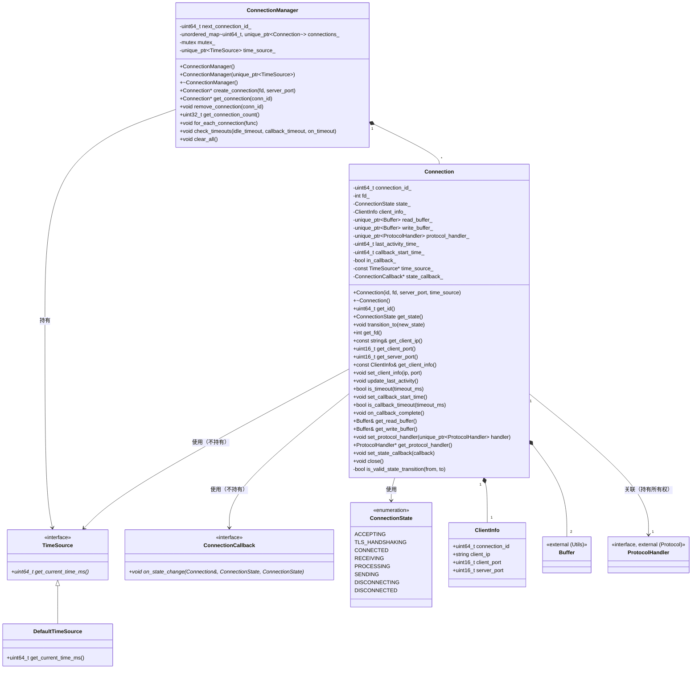
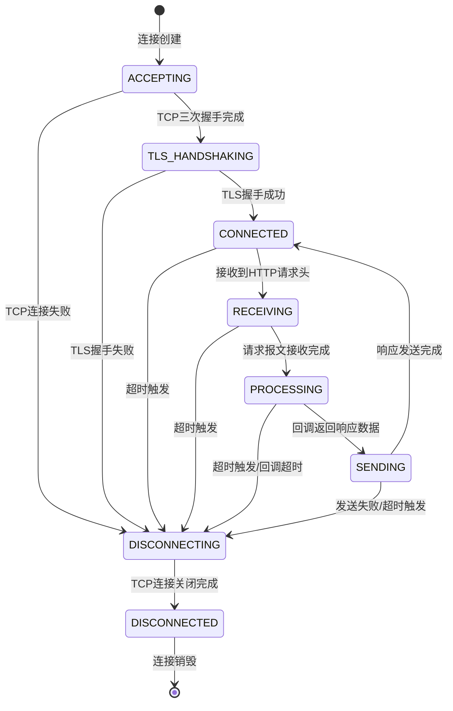
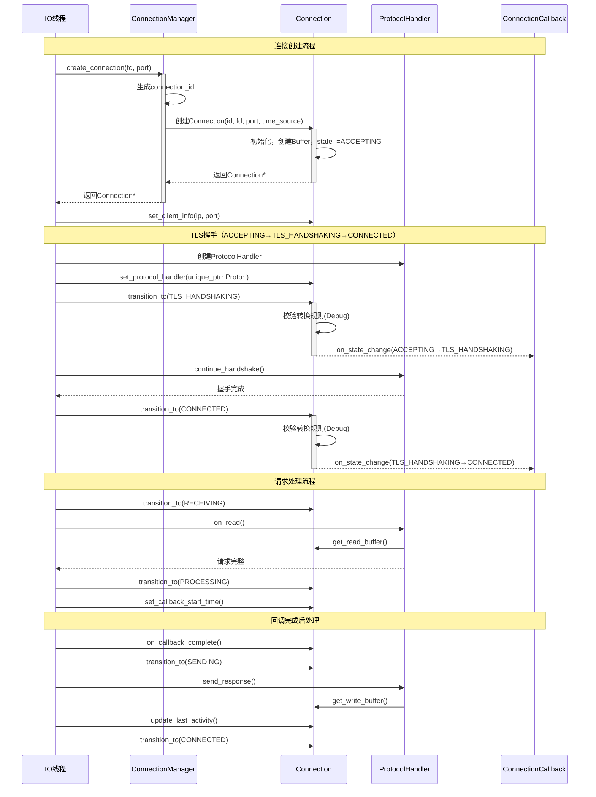
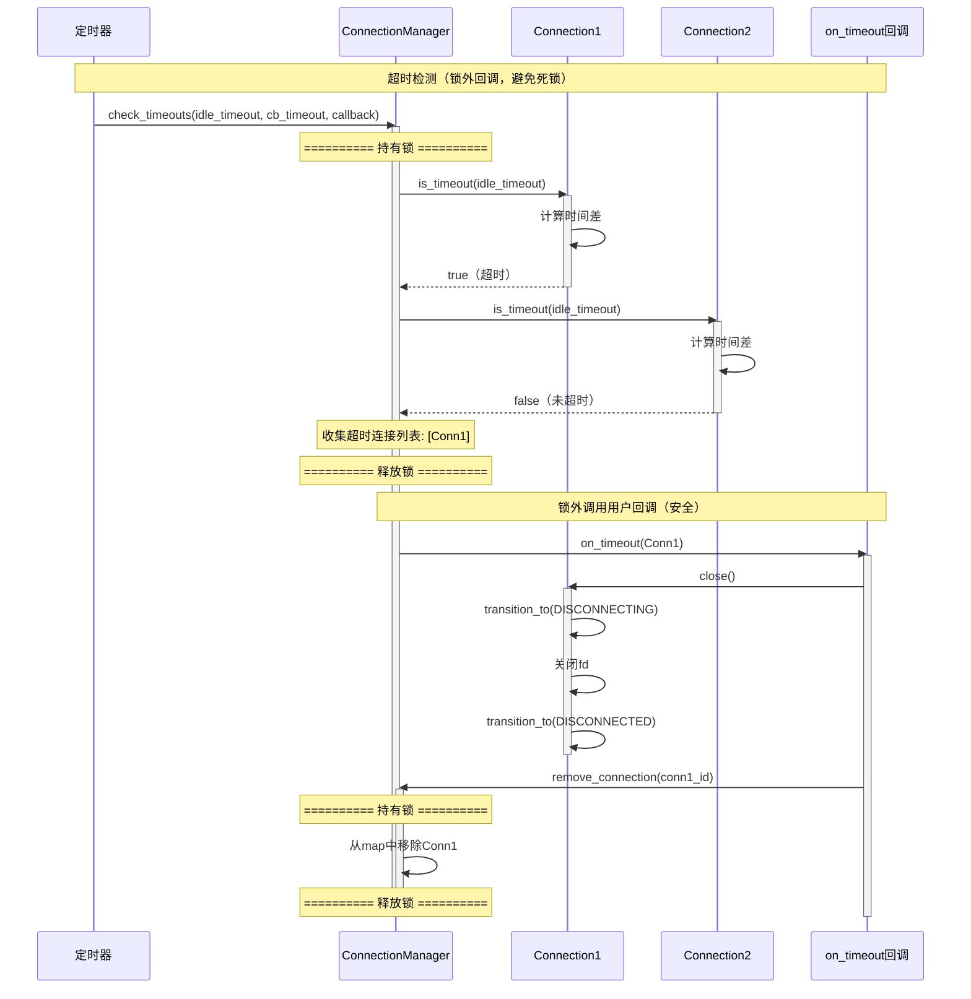

# HTTPS Server 模拟器 - Connection 模块详细设计文档 (LLD)

**版本**: v6
**创建日期**: 2026-02-16
**修改日期**: 2026-02-17
**状态**: 草稿

---

## 目录

1. [模块基本信息](#1-模块基本信息)
2. [设计概述](#2-设计概述)
3. [详细设计内容](#3-详细设计内容)
4. [开发落地指南](#4-开发落地指南)
5. [单元测试用例](#5-单元测试用例)
6. [设计验证](#6-设计验证)
7. [备注](#7-备注)

---

## 1. 模块基本信息

### 1.1 模块标识

| 属性 | 值 |
|-----|-----|
| 模块名称 | Connection |
| 模块唯一标识 | Module_Connection |
| 核心类型 | 逻辑控制类 + 数据处理类 |
| 模块路径 | codes/core/source/connection/ |
| 头文件路径 | codes/core/include/connection/ |
| 设计负责人 | 模块设计师Agent |
| 设计日期 | 2026-02-16 |

### 1.2 模块职责

**完整职责描述**（基于架构设计文档的合理细化）：
- 单个连接的生命周期管理
- 连接状态机实现
- 超时检测与处理
- 连接数据缓冲区管理
- Client信息维护
- **ConnectionManager负责多连接管理**
- 连接状态变化通知

**职责说明**："连接数据缓冲区管理"和"Client信息维护"是对架构核心职责"连接生命周期管理"的合理细化，用于支撑连接管理功能的完整实现。

**核心定位**：Connection模块负责管理单个TCP/TLS连接的完整生命周期，维护连接状态，提供数据缓冲区服务，跟踪Client信息，是Server与Protocol模块之间的桥梁。

### 1.3 职责边界

| 该做什么 | 不该做什么 |
|---------|-----------|
| 管理单个连接的生命周期 | 处理TLS握手细节（应由Protocol模块负责） |
| 实现连接状态机 | 解析HTTP协议（应由Protocol模块负责） |
| 检测连接超时、回调超时 | 执行用户回调（应由Callback模块负责） |
| 管理读写缓冲区 | 处理调测点逻辑（应由DebugChain模块负责） |
| 维护Client基本信息（IP、端口） |  |
| 提供状态查询与转换接口 |  |
| ConnectionManager管理多个连接 |  |
| 提供状态变化回调通知 |  |

**职责边界说明**：TLS握手由Protocol模块的TlsHandler负责，Connection模块仅提供状态转换支持（ACCEPTING→TLS_HANDSHAKING→CONNECTED）。

### 1.4 关联需求

**需求说明**：以下需求描述基于架构设计文档中定义的核心职责进行细化，需求ID为本模块详细设计阶段自行定义，用于需求覆盖追踪。

| 需求描述 | 需求类型 |
|---------|---------|
| 支持单个连接的创建、初始化、关闭 | 功能性 |
| 实现连接状态机（ACCEPTING→TLS_HANDSHAKING→CONNECTED→RECEIVING→PROCESSING→SENDING→DISCONNECTING→DISCONNECTED） | 功能性 |
| 支持连接超时检测（ idle timeout） | 功能性 |
| 支持回调超时检测（callback timeout） | 功能性 |
| 提供读写数据缓冲区 | 功能性 |
| 维护Client信息（IP、端口、连接ID） | 功能性 |
| 支持关联ProtocolHandler | 功能性 |
| 支持连接状态变化通知 | 功能性 |
| 支持时间注入以便单元测试 | 非功能性 |

### 1.5 依赖关系

| 依赖方向 | 模块名称 | 依赖用途 | 调用方式 |
|---------|---------|---------|---------|
| **依赖** | Utils（Buffer） | 提供数据缓冲区功能 | 头文件包含，直接调用 |
| **依赖** | Utils（time.hpp） | 提供时间获取函数 | 头文件包含，直接调用 |
| **依赖** | Protocol（ProtocolHandler） | 处理协议相关操作 | 头文件包含，指针关联 |
| **被依赖** | Server（ConnectionManager） | 创建、管理Connection实例 | 头文件包含，直接调用 |
| **被依赖** | MsgCenter | 事件处理时操作Connection | 头文件包含，直接调用 |

**依赖规则**：
- 内部模块通过头文件关联
- 无外部依赖，无需防腐层
- Connection持有ProtocolHandler所有权（使用unique_ptr管理）

**跨模块接口依赖说明**：
- **get_server_port()接口**：Connection提供该接口供Callback模块使用，用于根据server_port选择对应的回调策略
- **依赖流向**：Server → ConnectionManager → Connection（构造时传入server_port）→ Callback模块（通过get_server_port()获取）

---

## 2. 设计概述

### 2.1 设计目标

基于架构约束，完成Connection模块内部细化设计，覆盖全部关联需求，支撑开发直接编码、单元测试落地。

### 2.2 遵循约束

| 约束类型 | 约束内容 |
|---------|---------|
| **架构约束** | 严格遵循架构设计文档中Connection模块的职责边界 |
| **功能约束** | 纯功能驱动，不关注安全性；严格避免过度设计 |
| **编码约束** | 使用C++17标准，内部模块通过头文件关联 |
| **设计约束** | 不做冗余可靠性设计，仅满足功能需求 |

### 2.3 核心设计思路

1. **模块类型判定**：Connection模块为**逻辑控制类 + 数据处理类**混合模块
2. **高内聚设计**：
   - Connection类：核心状态管理、生命周期控制
   - ConnectionState枚举：状态定义
   - ClientInfo结构体：Client信息封装
   - ConnectionManager类：多连接管理
   - TimeSource接口：时间提供者抽象（用于可测试性）
   - ConnectionCallback接口：状态变化回调
3. **核心逻辑**：
   - 状态机驱动连接生命周期，支持合法转换校验（Debug模式）
   - 时间戳记录实现超时检测，支持时间注入
   - Buffer双缓冲区（读/写）管理数据
   - 锁外调用用户回调，避免死锁
4. **图形化配套**：类图、状态图、时序图、数据流图

### 2.4 设计范围

本次设计范围仅限于Connection模块内部，不涉及其他模块、跨模块联调等无关内容。

---

## 3. 详细设计内容

### 3.1 内部结构设计

#### 3.1.1 类/组件划分

| 类/组件名称 | 类型 | 核心职责 | 文件位置 |
|------------|------|---------|---------|
| TimeSource | 接口 | 时间提供者抽象，支持时间注入 | connection.hpp |
| DefaultTimeSource | 实现类 | 默认时间提供者，使用系统时间 | connection.hpp/connection.cpp |
| ConnectionCallback | 接口 | 连接状态变化回调接口 | connection.hpp |
| Connection | 核心类 | 连接生命周期管理、状态机、超时检测、缓冲区管理 | connection.hpp/connection.cpp |
| ConnectionState | 枚举 | 连接状态定义 | connection.hpp |
| ClientInfo | 结构体 | Client信息封装 | connection.hpp |
| ConnectionManager | 管理类 | 多Connection的创建、查找、删除、遍历 | connection_manager.hpp/connection_manager.cpp |

#### 3.1.2 类详细设计

**TimeSource 接口**

```cpp
namespace https_server_sim {

// 时间提供者接口（用于可测试性）
class TimeSource {
public:
    virtual ~TimeSource() = default;
    virtual uint64_t get_current_time_ms() const = 0;
};

// 默认时间提供者（使用系统时间）
class DefaultTimeSource : public TimeSource {
public:
    uint64_t get_current_time_ms() const override;
};

} // namespace https_server_sim
```

**ConnectionCallback 接口**

```cpp
namespace https_server_sim {

class Connection;

// 连接状态变化回调接口
class ConnectionCallback {
public:
    virtual ~ConnectionCallback() = default;
    virtual void on_state_change(Connection& conn, ConnectionState old_state, ConnectionState new_state) = 0;
};

} // namespace https_server_sim
```

**ConnectionState 枚举**

```cpp
namespace https_server_sim {

// 连接状态枚举
enum class ConnectionState {
    ACCEPTING = 1,      // TCP连接建立中，等待三次握手完成
    TLS_HANDSHAKING = 2,// TLS握手进行中
    CONNECTED = 3,       // 连接已建立，等待接收数据
    RECEIVING = 4,       // 正在接收请求报文
    PROCESSING = 5,      // 报文处理中（回调处理中）
    SENDING = 6,         // 正在发送响应报文
    DISCONNECTING = 7,   // 连接断开中
    DISCONNECTED = 8     // 连接已断开
};

} // namespace https_server_sim
```

**ClientInfo 结构体**

```cpp
namespace https_server_sim {

// Client信息结构体
struct ClientInfo {
    uint64_t connection_id;      // 连接唯一标识
    std::string client_ip;        // Client IP地址
    uint16_t client_port;         // Client端口
    uint16_t server_port;         // Server监听端口
};

} // namespace https_server_sim
```

**Connection 类**

| 属性 | 说明 |
|-----|------|
| 类名 | Connection |
| 命名空间 | https_server_sim |
| 头文件 | connection/connection.hpp |

**Connection 类 - 属性**

| 属性名 | 类型 | 访问权限 | 默认值 | 用途 |
|-------|------|---------|-------|-----|
| connection_id_ | uint64_t | private | 0 | 连接唯一标识 |
| fd_ | int | private | -1 | socket文件描述符 |
| state_ | ConnectionState | private | ACCEPTING | 当前连接状态 |
| client_info_ | ClientInfo | private | {} | Client信息 |
| read_buffer_ | std::unique_ptr&lt;Buffer&gt; | private | nullptr | 读数据缓冲区 |
| write_buffer_ | std::unique_ptr&lt;Buffer&gt; | private | nullptr | 写数据缓冲区 |
| protocol_handler_ | std::unique_ptr&lt;ProtocolHandler&gt; | private | nullptr | 协议处理器（持有所有权） |
| last_activity_time_ | uint64_t | private | 0 | 最后活动时间戳（毫秒） |
| callback_start_time_ | uint64_t | private | 0 | 回调开始时间戳（毫秒） |
| in_callback_ | bool | private | false | 是否正在执行回调 |
| time_source_ | const TimeSource* | private | nullptr | 时间提供者（不持有所有权） |
| state_callback_ | ConnectionCallback* | private | nullptr | 状态变化回调（不持有所有权） |

**Connection 类 - 方法**

| 方法名 | 参数 | 返回值 | 访问权限 | 核心逻辑 | 调用场景 |
|-------|------|-------|---------|---------|---------|
| Connection | id: uint64_t, fd: int, server_port: uint16_t, time_source: const TimeSource* | - | public | 初始化成员变量，创建Buffer，设置connection_id和server_port，state_=ACCEPTING，使用DefaultTimeSource | 创建连接时 |
| ~Connection | - | - | public | Buffer和ProtocolHandler由unique_ptr自动释放，**关闭fd** | 销毁连接时 |
| get_id | - | uint64_t | public | 返回connection_id_ | 查询连接ID |
| get_state | - | ConnectionState | public | 返回state_ | 查询当前状态 |
| transition_to | new_state: ConnectionState | void | public | 状态转换，更新last_activity_time_，Debug模式下校验转换规则，触发状态回调 | 状态变更时 |
| get_fd | - | int | public | 返回fd_ | IO操作时 |
| get_client_ip | - | const std::string&amp; | public | 返回client_info_.client_ip | 获取Client IP |
| get_client_port | - | uint16_t | public | 返回client_info_.client_port | 获取Client端口 |
| get_server_port | - | uint16_t | public | 返回client_info_.server_port | 获取Server端口 |
| get_client_info | - | const ClientInfo&amp; | public | 返回client_info_ | 获取完整Client信息 |
| set_client_info | ip: const string&amp;, port: uint16_t | void | public | 设置client_info_.client_ip和client_info_.client_port（connection_id和server_port在构造函数中设置） | accept连接后 |
| update_last_activity | - | void | public | 更新last_activity_time_为当前时间 | 有IO活动时 |
| is_timeout | timeout_ms: uint32_t | bool | public | 判断当前时间 - last_activity_time_ &gt; timeout_ms | 超时检测时 |
| set_callback_start_time | - | void | public | 记录callback_start_time_，设置in_callback_=true | 开始回调前 |
| is_callback_timeout | timeout_ms: uint32_t | bool | public | 若in_callback_，判断当前时间 - callback_start_time_ &gt; timeout_ms | 回调超时检测时 |
| on_callback_complete | - | void | public | 设置in_callback_=false | 回调完成后 |
| get_read_buffer | - | Buffer&amp; | public | 返回*read_buffer_，**外部修改需遵循线程安全约定** | 读取数据时 |
| get_write_buffer | - | Buffer&amp; | public | 返回*write_buffer_，**外部修改需遵循线程安全约定** | 写入数据时 |
| set_protocol_handler | handler: std::unique_ptr&lt;ProtocolHandler&gt; | void | public | 转移ProtocolHandler所有权到Connection | 关联协议处理器 |
| get_protocol_handler | - | ProtocolHandler* | public | 返回protocol_handler_.get() | 获取协议处理器指针 |
| set_state_callback | callback: ConnectionCallback* | void | public | 设置状态变化回调 | 注册状态监听 |
| close | - | void | public | 转换状态为DISCONNECTING，通知ProtocolHandler关闭，转换为DISCONNECTED，**关闭fd** | 关闭连接时 |

**ConnectionManager 类**

| 属性 | 说明 |
|-----|------|
| 类名 | ConnectionManager |
| 命名空间 | https_server_sim |
| 头文件 | connection/connection_manager.hpp |

**ConnectionManager 类 - 属性**

| 属性名 | 类型 | 访问权限 | 默认值 | 用途 |
|-------|------|---------|-------|-----|
| next_connection_id_ | uint64_t | private | 1 | 下一个连接ID |
| connections_ | std::unordered_map&lt;uint64_t, std::unique_ptr&lt;Connection&gt;&gt; | private | {} | 连接表 |
| mutex_ | std::mutex | private | - | 保护connections_的互斥锁 |
| time_source_ | std::unique_ptr&lt;TimeSource&gt; | private | nullptr | 时间提供者 |

**ConnectionManager 类 - 方法**

| 方法名 | 参数 | 返回值 | 访问权限 | 核心逻辑 | 调用场景 |
|-------|------|-------|---------|---------|---------|
| ConnectionManager | - | - | public | 初始化next_connection_id_=1，创建DefaultTimeSource | 创建管理器时 |
| ConnectionManager | time_source: std::unique_ptr&lt;TimeSource&gt; | - | public | 初始化next_connection_id_=1，接管TimeSource所有权 | 创建管理器时（测试用） |
| ~ConnectionManager | - | - | public | 清空connections_ | 销毁管理器时 |
| create_connection | fd: int, server_port: uint16_t | Connection* | public | 生成connection_id，创建Connection，插入map，**返回指针有效期至remove_connection调用** | accept新连接后 |
| get_connection | conn_id: uint64_t | Connection* | public | 查找map，返回指针或nullptr | 查询连接时 |
| remove_connection | conn_id: uint64_t | void | public | 从map中移除连接，释放资源 | 连接关闭后 |
| get_connection_count | - | uint32_t | public | 返回map.size() | 查询连接数 |
| for_each_connection | func: std::function&lt;void(Connection&amp;)&gt; | void | public | 遍历map，对每个连接调用func | 批量操作时 |
| check_timeouts | idle_timeout_ms: uint32_t, callback_timeout_ms: uint32_t, on_timeout: std::function&lt;void(Connection&amp;)&gt; | void | public | 锁内收集超时连接，**锁外调用回调** | 定时超时检测 |
| clear_all | - | void | public | 清空所有连接 | Server关闭时 |

#### 3.1.3 类关系图

```
ConnectionManager "1" *-- "*" Connection
Connection "1" *-- "2" Buffer (read/write)
Connection "1" --> "1" ProtocolHandler (关联)
Connection "1" *-- "1" ClientInfo
Connection --> ConnectionState (使用)
Connection --> TimeSource (使用，不持有)
Connection --> ConnectionCallback (使用，不持有)
ConnectionManager --> TimeSource (持有)
```

### 3.2 核心逻辑设计

#### 3.2.1 状态机设计

**状态定义**：

| 状态 | 含义 | 可转换至 | 触发事件 |
|-----|------|---------|---------|
| ACCEPTING | TCP连接建立中，等待三次握手完成 | TLS_HANDSHAKING, DISCONNECTING | TCP三次握手完成/连接失败 |
| TLS_HANDSHAKING | TLS握手进行中 | CONNECTED, DISCONNECTING | TLS握手成功/握手失败 |
| CONNECTED | 连接已建立，等待接收数据 | RECEIVING, DISCONNECTING | 接收到HTTP请求头/超时触发 |
| RECEIVING | 正在接收请求报文 | PROCESSING, DISCONNECTING | 请求报文接收完成/超时触发 |
| PROCESSING | 报文处理中（回调处理中） | SENDING, DISCONNECTING | 回调返回响应数据/超时触发 |
| SENDING | 正在发送响应报文 | CONNECTED, DISCONNECTING | 响应发送完成/发送失败/超时触发 |
| DISCONNECTING | 连接断开中 | DISCONNECTED | TCP连接关闭完成 |
| DISCONNECTED | 连接已断开 | - | 终态 |

**合法状态转换矩阵**：

```
当前状态\目标状态 | ACCEPTING | TLS_HANDSHAKING | CONNECTED | RECEIVING | PROCESSING | SENDING | DISCONNECTING | DISCONNECTED
-------------------|-----------|-----------------|-----------|-----------|------------|---------|---------------|------------
ACCEPTING          |     ✓     |        ✓        |           |           |            |         |       ✓       |
TLS_HANDSHAKING    |           |        ✓        |     ✓     |           |            |         |       ✓       |
CONNECTED          |           |                 |     ✓     |     ✓     |            |         |       ✓       |
RECEIVING          |           |                 |           |     ✓     |      ✓     |         |       ✓       |
PROCESSING         |           |                 |           |           |      ✓     |    ✓    |       ✓       |
SENDING            |           |                 |     ✓     |           |            |    ✓    |       ✓       |
DISCONNECTING      |           |                 |           |           |            |         |       ✓       |     ✓
DISCONNECTED       |           |                 |           |           |            |         |               |     ✓
```

**状态转换伪代码**：

```
function Connection::transition_to(new_state):
    if new_state == state_:
        return

    // 状态转换前检查
    if state_ == DISCONNECTED:
        return  // DISCONNECTED为终态，不可再转换

    // Debug模式下校验状态转换规则
    #ifdef NDEBUG
        // Release模式：纯功能驱动，不强制校验
    #else
        // Debug模式：校验转换规则
        if not is_valid_state_transition(state_, new_state):
            log_warning("Invalid state transition: %s -> %s", state_, new_state)
            // Debug模式下可选择断言或继续执行
    #endif

    // 执行状态转换
    old_state = state_
    state_ = new_state
    update_last_activity()

    // 触发状态变化回调（如果已设置）
    if state_callback_ != nullptr:
        state_callback_->on_state_change(*this, old_state, new_state)

    // 特定状态转换的附加逻辑
    if new_state == DISCONNECTED:
        // 清理逻辑
        in_callback_ = false

function Connection::is_valid_state_transition(from, to):
    // 根据状态转换矩阵判断是否合法
    switch from:
        case ACCEPTING:
            return to in {ACCEPTING, TLS_HANDSHAKING, DISCONNECTING}
        case TLS_HANDSHAKING:
            return to in {TLS_HANDSHAKING, CONNECTED, DISCONNECTING}
        case CONNECTED:
            return to in {CONNECTED, RECEIVING, DISCONNECTING}
        case RECEIVING:
            return to in {RECEIVING, PROCESSING, DISCONNECTING}
        case PROCESSING:
            return to in {PROCESSING, SENDING, DISCONNECTING}
        case SENDING:
            return to in {SENDING, CONNECTED, DISCONNECTING}
        case DISCONNECTING:
            return to in {DISCONNECTING, DISCONNECTED}
        case DISCONNECTED:
            return to == DISCONNECTED
    return false
```

#### 3.2.2 超时检测逻辑

**连接空闲超时检测**：

```
function Connection::is_timeout(timeout_ms):
    if state_ == DISCONNECTED:
        return false
    current_time = time_source_->get_current_time_ms()
    return (current_time - last_activity_time_) > timeout_ms
```

**回调超时检测**：

```
function Connection::is_callback_timeout(timeout_ms):
    if not in_callback_:
        return false
    current_time = time_source_->get_current_time_ms()
    return (current_time - callback_start_time_) > timeout_ms
```

**ConnectionManager批量超时检测**：

```
function ConnectionManager::check_timeouts(idle_timeout, callback_timeout, on_timeout):
    // 步骤1：锁内收集超时连接（仅收集，不调用回调）
    lock(mutex_)
    timeout_connections = []
    for each conn in connections_:
        is_idle_timeout = conn->is_timeout(idle_timeout)
        is_cb_timeout = conn->is_callback_timeout(callback_timeout)
        if is_idle_timeout or is_cb_timeout:
            timeout_connections.push_back(conn.get())
    unlock(mutex_)

    // 步骤2：锁外调用用户回调（避免死锁）
    for each conn_ptr in timeout_connections:
        // 注意：回调可能调用remove_connection，需确保conn_ptr在回调期间有效
        // 约定：回调中不应立即销毁Connection，应先标记关闭再异步清理
        on_timeout(*conn_ptr)
```

#### 3.2.3 缓冲区管理逻辑

Connection持有两个独立的Buffer：
- read_buffer_：存储从socket读取的未处理数据
- write_buffer_：存储待发送到socket的响应数据

**Buffer资源管理策略**：
- read_buffer_ 和 write_buffer_ 使用 `std::unique_ptr<Buffer>` 管理
- 在Connection构造函数中通过 `std::make_unique<Buffer>()` 创建
- 在Connection析构函数中由unique_ptr自动释放
- 不使用对象池，直接创建/释放

**Buffer线程安全性说明**：
- Buffer类**不保证线程安全**，内部无互斥锁保护
- Connection的read_buffer_和write_buffer_仅在Event Loop线程（IO线程）中访问，无需额外同步
- 多线程访问Buffer时需外部加锁保护

**缓冲区访问约定**：
- get_read_buffer()/get_write_buffer()返回非const引用
- **外部代码应仅在IO线程中访问Buffer**
- **外部代码修改Buffer后应及时通知Connection更新活动时间**
- 不建议在回调中长时间持有Buffer引用

**缓冲区使用流程**：
1. IO线程读取数据 → 写入read_buffer_
2. ProtocolHandler从read_buffer_读取并解析数据
3. ProtocolHandler将响应数据写入write_buffer_
4. IO线程从write_buffer_读取并发送数据

#### 3.2.4 连接创建与关闭流程

**连接创建流程**：
```
1. Server accept新连接，获得fd
2. 调用ConnectionManager::create_connection(fd, server_port)
3. ConnectionManager生成connection_id
4. 创建Connection对象（传入connection_id、fd、server_port、time_source_）
5. Connection初始化：
   - 设置connection_id_、fd_
   - 设置client_info_.connection_id和client_info_.server_port
   - state_ = ACCEPTING
   - 使用std::make_unique创建read_buffer_和write_buffer_
   - 记录last_activity_time_
6. 返回Connection指针（**注意：指针有效期至remove_connection调用前**）
7. 获取Client IP/Port，调用set_client_info()设置client_ip和client_port
8. 创建ProtocolHandler，通过set_protocol_handler()转移所有权到Connection
```

**连接关闭流程**：
```
1. 触发关闭（超时/错误/正常结束）
2. Connection::close()被调用
3. Connection::transition_to(DISCONNECTING)
4. 若protocol_handler_非空，调用protocol_handler_->close()通知ProtocolHandler关闭
5. **关闭socket fd**（由Connection::close()负责）
6. Connection::transition_to(DISCONNECTED)
7. 调用ConnectionManager::remove_connection(conn_id)
8. ConnectionManager从map中移除并销毁Connection对象（Buffer和ProtocolHandler由unique_ptr自动释放）
```

**fd所有权与生命周期契约**：
- **Connection持有fd所有权**
- fd在Connection构造函数中传入，在Connection::close()或析构函数中关闭
- IO线程可使用fd进行读写操作，但**不应自行关闭fd**
- fd有效性保证：在Connection状态不为DISCONNECTED时有效

#### 3.2.5 错误处理策略

**错误处理原则**：
- 采用错误码返回方式，不使用异常
- 关键错误记录日志（通过Utils模块的日志接口）
- 非关键错误可忽略或仅记录警告

**错误场景与处理方式**：

| 错误场景 | 处理方式 |
|---------|---------|
| 状态转换非法（Debug模式） | 记录警告日志，Release模式继续执行 |
| Buffer访问越界 | 由Buffer类自身处理（Utils模块） |
| fd读写错误 | 由IO线程处理，调用Connection::close() |
| 超时回调执行异常 | 由调用方处理，ConnectionManager不捕获 |
| remove_connection移除不存在的连接 | 静默忽略，记录Debug日志 |

### 3.3 可扩展性设计

本模块无需支持扩展，架构未要求插件式扩展能力。

但提供以下两个扩展点用于测试和监控：
1. **TimeSource接口**：可注入自定义时间提供者用于单元测试
2. **ConnectionCallback接口**：可监听连接状态变化用于监控

### 3.4 图形化设计

#### 3.4.1 类图



**图1：Connection模块内部类图**

#### 3.4.2 状态图



**图2：Connection状态机图**

#### 3.4.3 时序图 - 连接创建与请求处理



**图3：连接创建与请求处理时序图（注：ProtocolHandler来自Protocol模块）**

#### 3.4.4 时序图 - 超时检测（修复死锁问题）



**图4：超时检测时序图（修复死锁问题）**

#### 3.4.5 数据流图

```
┌──────────────┐
│   Client     │
└──────┬───────┘
       │ TCP数据流
       ▼
┌─────────────────────────────────────────────────────────┐
│                    Connection模块                         │
│                                                           │
│  ┌───────────────────────────────────────────────────┐  │
│  │              数据接收方向                          │  │
│  │  ┌─────────┐     ┌─────────────┐     ┌───────┐ │  │
│  │  │ socket  │ ──▶ │ read_buffer │ ──▶ │ Proto │ │  │
│  │  └─────────┘     └─────────────┘     └───────┘ │  │
│  └───────────────────────────────────────────────────┘  │
│                                                           │
│  ┌───────────────────────────────────────────────────┐  │
│  │              数据发送方向                          │  │
│  │  ┌─────────┐     ┌─────────────┐     ┌───────┐ │  │
│  │  │ socket  │ ◀── │ write_buffer│ ◀── │ Proto │ │  │
│  │  └─────────┘     └─────────────┘     └───────┘ │  │
│  └───────────────────────────────────────────────────┘  │
│                                                           │
│  ┌───────────────────────────────────────────────────┐  │
│  │              状态与时间管理                        │  │
│  │  ┌─────────────────────────────────────────────┐ │  │
│  │  │  state_: ACCEPTING → CONNECTED → ... → DISCONNECTED │ │  │
│  │  │  last_activity_time_: 时间戳                │ │  │
│  │  │  callback_start_time_: 回调开始时间         │ │  │
│  │  │  TimeSource: 可注入时间提供者               │ │  │
│  │  └─────────────────────────────────────────────┘ │  │
│  └───────────────────────────────────────────────────┘  │
│                                                           │
│  ┌───────────────────────────────────────────────────┐  │
│  │              状态变化通知                          │  │
│  │  ┌─────────────────────────────────────────────┐ │  │
│  │  │  ConnectionCallback: on_state_change()      │ │  │
│  │  └─────────────────────────────────────────────┘ │  │
│  └───────────────────────────────────────────────────┘  │
│                                                           │
└─────────────────────────────────────────────────────────┘
```

**图5：Connection模块数据流图**

---

## 4. 开发落地指南

### 4.1 术语与规范

#### 4.1.1 核心术语

| 术语 | 定义 |
|-----|------|
| Connection | 单个TCP/TLS连接的封装 |
| ConnectionManager | 多个Connection的容器与管理器 |
| ConnectionState | 连接状态枚举 |
| ClientInfo | Client端信息（IP、端口等） |
| Buffer | 数据缓冲区（来自Utils模块） |
| ProtocolHandler | 协议处理器（来自Protocol模块） |
| TimeSource | 时间提供者接口 |
| ConnectionCallback | 连接状态变化回调接口 |
| 空闲超时 (Idle Timeout) | 连接无活动的最长时间 |
| 回调超时 (Callback Timeout) | 回调执行的最长时间 |

#### 4.1.2 命名规范

| 元素 | 规范 | 示例 |
|-----|-----|------|
| 类名 | PascalCase | Connection, ConnectionManager |
| 枚举名 | PascalCase | ConnectionState |
| 枚举值 | UPPER_SNAKE_CASE | INIT, CONNECTED |
| 成员变量 | snake_case_，后缀下划线 | connection_id_, state_ |
| 方法名 | snake_case | get_id(), transition_to() |
| 函数参数 | snake_case | new_state, timeout_ms |
| 常量 | kPascalCase | kDefaultIdleTimeoutMs |
| 文件名 | snake_case | connection.hpp, connection_manager.cpp |

#### 4.1.3 编码规范

- 使用C++17标准
- 头文件使用#pragma once
- 命名空间：https_server_sim
- 使用nullptr代替NULL
- 使用智能指针管理资源（ConnectionManager使用unique_ptr，Buffer使用unique_ptr）
- 遵循RAII原则
- Debug模式下使用assert或日志校验状态转换
- Release模式下保持"纯功能驱动"，不强制校验状态转换
- **锁内不要调用用户回调**（遵循check_timeouts的实现模式）

### 4.2 核心逻辑说明

#### 4.2.1 时间获取与注入

**TimeSource设计**：
- TimeSource为抽象接口，DefaultTimeSource为默认实现
- Connection构造时可注入TimeSource，ConnectionManager可持有TimeSource

```cpp
// 包含Utils模块的时间头文件
#include "utils/time.hpp"

// TimeSource接口使用
uint64_t DefaultTimeSource::get_current_time_ms() const {
    return ::get_current_time_ms();  // 调用Utils模块函数
}

// Connection使用TimeSource
uint64_t Connection::get_current_time() const {
    return time_source_->get_current_time_ms();
}
```

**测试时注入Mock TimeSource**：
```cpp
// 测试用例伪代码
class MockTimeSource : public TimeSource {
public:
    uint64_t current_time_ms = 0;
    uint64_t get_current_time_ms() const override {
        return current_time_ms;
    }
};

// 测试时使用
auto mock_time = std::make_unique<MockTimeSource>();
ConnectionManager manager(std::move(mock_time));
```

#### 4.2.2 状态转换验证

状态转换策略：
- **Debug模式**：校验转换规则，非法转换记录警告日志
- **Release模式**：纯功能驱动，不强制校验转换规则

```cpp
// 伪代码 - Connection::transition_to()
void Connection::transition_to(ConnectionState new_state) {
    if (state_ == new_state) return;
    if (state_ == ConnectionState::DISCONNECTED) return;  // DISCONNECTED为终态，不可再转换

    ConnectionState old_state = state_;

#ifndef NDEBUG
    // Debug模式：校验转换规则
    if (!is_valid_state_transition(old_state, new_state)) {
        // 记录警告日志
        LOG_WARN("Invalid state transition: %d -> %d (conn_id=%lu)",
                 static_cast<int>(old_state), static_cast<int>(new_state),
                 connection_id_);
        // 可选择assert终止或继续执行
    }
#endif

    // 执行状态转换
    state_ = new_state;
    update_last_activity();

    // 触发状态变化回调
    if (state_callback_ != nullptr) {
        state_callback_->on_state_change(*this, old_state, new_state);
    }

    // 特定状态转换的附加逻辑
    if (new_state == ConnectionState::DISCONNECTED) {
        in_callback_ = false;
    }
}

bool Connection::is_valid_state_transition(ConnectionState from, ConnectionState to) const {
    // 根据状态转换矩阵实现
    switch (from) {
        case ConnectionState::ACCEPTING:
            return to == ConnectionState::ACCEPTING ||
                   to == ConnectionState::TLS_HANDSHAKING ||
                   to == ConnectionState::DISCONNECTING;
        // ... 其他状态的判断
        default:
            return false;
    }
}
```

#### 4.2.3 ConnectionManager并发控制

使用std::lock_guard保护connections_，**锁外调用用户回调**：

```cpp
// 伪代码 - 安全的check_timeouts实现
void ConnectionManager::check_timeouts(uint32_t idle_timeout_ms,
                                        uint32_t callback_timeout_ms,
                                        std::function<void(Connection&)> on_timeout) {
    std::vector<Connection*> timeout_conns;

    // 步骤1：锁内仅收集超时连接
    {
        std::lock_guard<std::mutex> lock(mutex_);
        for (auto& pair : connections_) {
            Connection* conn = pair.second.get();
            bool is_idle_timeout = conn->is_timeout(idle_timeout_ms);
            bool is_cb_timeout = conn->is_callback_timeout(callback_timeout_ms);
            if (is_idle_timeout || is_cb_timeout) {
                timeout_conns.push_back(conn);
            }
        }
    }  // 锁在这里释放

    // 步骤2：锁外调用用户回调（避免死锁）
    for (Connection* conn : timeout_conns) {
        // 注意：回调可能调用remove_connection，但conn指针在回调期间仍然有效
        // 因为unique_ptr只有在remove_connection从map中erase后才会销毁对象
        on_timeout(*conn);
    }
}

// 伪代码 - create_connection
Connection* ConnectionManager::create_connection(int fd, uint16_t server_port) {
    std::lock_guard<std::mutex> lock(mutex_);
    uint64_t id = next_connection_id_++;
    auto conn = std::make_unique<Connection>(id, fd, server_port, time_source_.get());
    Connection* ptr = conn.get();
    connections_[id] = std::move(conn);
    return ptr;  // 返回指针，有效期至remove_connection调用前
}
```

#### 4.2.4 Buffer创建与释放，fd关闭

```cpp
// Connection构造函数中创建Buffer
Connection::Connection(uint64_t id, int fd, uint16_t server_port, const TimeSource* time_source)
    : connection_id_(id)
    , fd_(fd)
    , state_(ConnectionState::ACCEPTING)
    , read_buffer_(std::make_unique<Buffer>())
    , write_buffer_(std::make_unique<Buffer>())
    , protocol_handler_(nullptr)
    , last_activity_time_(0)
    , callback_start_time_(0)
    , in_callback_(false)
    , time_source_(time_source ? time_source : &DefaultTimeSource::instance())
    , state_callback_(nullptr)
{
    client_info_.connection_id = id;
    client_info_.server_port = server_port;
    last_activity_time_ = time_source_->get_current_time_ms();
}

// close()方法关闭fd
void Connection::close() {
    if (state_ == ConnectionState::DISCONNECTED) {
        return;
    }

    transition_to(ConnectionState::DISCONNECTING);

    // 通知ProtocolHandler关闭
    if (protocol_handler_) {
        protocol_handler_->close();
    }

    // 关闭fd（Connection负责fd生命周期）
    if (fd_ >= 0) {
        ::close(fd_);
        fd_ = -1;
    }

    transition_to(ConnectionState::DISCONNECTED);
}

// 析构函数确保fd关闭（双保险）
Connection::~Connection() {
    // Buffer和ProtocolHandler由unique_ptr自动释放

    // 确保fd已关闭
    if (fd_ >= 0) {
        ::close(fd_);
    }
}
```

### 4.3 数据结构定义

#### 4.3.1 ConnectionState 枚举

```cpp
#pragma once

#include <cstdint>

namespace https_server_sim {

enum class ConnectionState : uint8_t {
    ACCEPTING = 1,
    TLS_HANDSHAKING = 2,
    CONNECTED = 3,
    RECEIVING = 4,
    PROCESSING = 5,
    SENDING = 6,
    DISCONNECTING = 7,
    DISCONNECTED = 8
};

} // namespace https_server_sim
```

#### 4.3.2 TimeSource 接口

```cpp
#pragma once

#include <cstdint>

namespace https_server_sim {

class TimeSource {
public:
    virtual ~TimeSource() = default;
    virtual uint64_t get_current_time_ms() const = 0;
};

class DefaultTimeSource : public TimeSource {
public:
    static DefaultTimeSource& instance();
    uint64_t get_current_time_ms() const override;

private:
    DefaultTimeSource() = default;
    ~DefaultTimeSource() = default;
    DefaultTimeSource(const DefaultTimeSource&) = delete;
    DefaultTimeSource& operator=(const DefaultTimeSource&) = delete;
};

} // namespace https_server_sim
```

#### 4.3.3 ConnectionCallback 接口

```cpp
#pragma once

namespace https_server_sim {

class Connection;
enum class ConnectionState : uint8_t;

class ConnectionCallback {
public:
    virtual ~ConnectionCallback() = default;
    virtual void on_state_change(Connection& conn,
                                   ConnectionState old_state,
                                   ConnectionState new_state) = 0;
};

} // namespace https_server_sim
```

#### 4.3.4 ClientInfo 结构体

```cpp
#pragma once

#include <cstdint>
#include <string>

namespace https_server_sim {

struct ClientInfo {
    uint64_t connection_id;
    std::string client_ip;
    uint16_t client_port;
    uint16_t server_port;

    ClientInfo()
        : connection_id(0)
        , client_port(0)
        , server_port(0)
    {}
};

} // namespace https_server_sim
```

### 4.4 可扩展性实现指南

本模块无需支持业务扩展，但提供以下两个测试/监控扩展点：

#### 4.4.1 时间注入（用于单元测试）

**实现步骤**：
1. 继承TimeSource接口，实现get_current_time_ms()方法
2. 创建ConnectionManager时通过构造函数注入自定义TimeSource
3. 测试时可通过Mock TimeSource控制时间流逝

**示例**：
```cpp
class MockTimeSource : public TimeSource {
public:
    mutable uint64_t mock_time_ms = 0;

    uint64_t get_current_time_ms() const override {
        return mock_time_ms;
    }

    void advance_time(uint64_t ms) {
        mock_time_ms += ms;
    }
};

// 使用
auto mock_time = std::make_unique<MockTimeSource>();
MockTimeSource* mock_ptr = mock_time.get();
ConnectionManager manager(std::move(mock_time));

// 模拟时间流逝
mock_ptr->advance_time(30000);  // 前进30秒
```

#### 4.4.2 状态变化监听（用于监控）

**实现步骤**：
1. 继承ConnectionCallback接口，实现on_state_change()方法
2. 通过Connection::set_state_callback()注册回调
3. 状态变化时会自动触发回调

**示例**：
```cpp
class StateMonitor : public ConnectionCallback {
public:
    void on_state_change(Connection& conn,
                          ConnectionState old_state,
                          ConnectionState new_state) override {
        printf("Connection %lu state changed: %d -> %d\n",
               conn.get_id(),
               static_cast<int>(old_state),
               static_cast<int>(new_state));
    }
};

// 使用
StateMonitor monitor;
Connection* conn = manager.create_connection(fd, 443);
conn->set_state_callback(&monitor);
```

---

## 5. 单元测试用例

### 5.1 测试侧重点

Connection模块单元测试侧重点：
1. **状态机测试**：状态转换正确性，Debug模式下的非法转换校验
2. **超时检测测试**：空闲超时、回调超时逻辑（通过TimeSource注入时间）
3. **缓冲区测试**：读写缓冲区访问
4. **ClientInfo测试**：信息设置与获取
5. **ConnectionManager测试**：连接的创建、查找、删除、遍历
6. **并发安全测试**：check_timeouts锁外调用不导致死锁
7. **fd管理测试**：fd正确关闭，不重复关闭
8. **状态回调测试**：状态变化时正确触发回调

### 5.2 测试用例表

| 用例ID | 测试模块 | 关联类/方法 | 测试场景 | 输入参数 | 预期输出 | 测试步骤 | 备注 |
|-------|---------|-----------|---------|---------|---------|---------|------|
| Conn_UT_001 | Connection | Connection::get_state() | 正常场景：初始状态 | 创建Connection | state == ACCEPTING | 1. 创建Connection对象；2. 调用get_state() | 无 |
| Conn_UT_002 | Connection | Connection::transition_to() | 正常场景：ACCEPTING→TLS_HANDSHAKING→CONNECTED | new_state依次为TLS_HANDSHAKING、CONNECTED | 状态按顺序变化 | 1. 创建Connection；2. transition_to(TLS_HANDSHAKING)；3. transition_to(CONNECTED)；4. get_state() | 无 |
| Conn_UT_003 | Connection | Connection::transition_to() | 正常场景：CONNECTED→RECEIVING→PROCESSING→SENDING→CONNECTED | 依次转换状态 | 状态按顺序变化 | 1. 创建并转为CONNECTED；2. 转RECEIVING；3. 转PROCESSING；4. 转SENDING；5. 转CONNECTED | 无 |
| Conn_UT_004 | Connection | Connection::transition_to() | 边界场景：DISCONNECTED后不可再转 | new_state=CONNECTED | 保持DISCONNECTED | 1. 创建Connection；2. 转DISCONNECTED；3. 尝试转CONNECTED；4. 验证仍为DISCONNECTED | 无 |
| Conn_UT_005 | Connection | Connection::is_valid_state_transition() | Debug模式：非法转换检测 | from=DISCONNECTED, to=CONNECTED | 返回false | 1. 测试is_valid_state_transition各组合；2. 验证非法转换返回false | 仅Debug模式 |
| Conn_UT_006 | Connection | Connection::set_client_info(), get_client_ip(), get_client_port() | 正常场景：设置并获取Client信息 | ip="127.0.0.1", port=54321 | get_client_ip()=="127.0.0.1", get_client_port()==54321 | 1. 创建Connection；2. set_client_info("127.0.0.1", 54321)；3. 验证IP和端口 | 无 |
| Conn_UT_007 | Connection | Connection::get_id(), get_fd(), get_server_port() | 正常场景：获取基本属性 | 创建时传入id=100, fd=5, port=443 | get_id()==100, get_fd()==5, get_server_port()==443 | 1. 创建Connection(id=100, fd=5, port=443)；2. 验证各属性 | 无 |
| Conn_UT_008 | Connection | Connection::update_last_activity(), is_timeout() | 正常场景：未超时 | timeout_ms=1000, MockTime不前进 | is_timeout()==false | 1. 注入MockTimeSource；2. 创建Connection；3. update_last_activity()；4. 调用is_timeout(1000) | 使用MockTime |
| Conn_UT_009 | Connection | Connection::update_last_activity(), is_timeout() | 边界场景：超时 | timeout_ms=100, MockTime前进150ms | is_timeout()==true | 1. 注入MockTimeSource；2. 创建Connection；3. update_last_activity()；4. MockTime前进150ms；5. 调用is_timeout(100) | 使用MockTime |
| Conn_UT_010 | Connection | Connection::set_callback_start_time(), is_callback_timeout() | 正常场景：回调未超时 | timeout_ms=5000, MockTime不前进 | is_callback_timeout()==false | 1. 注入MockTimeSource；2. 创建Connection；3. set_callback_start_time()；4. 调用is_callback_timeout(5000) | 使用MockTime |
| Conn_UT_011 | Connection | Connection::set_callback_start_time(), is_callback_timeout(), on_callback_complete() | 正常场景：回调完成后不再超时 | timeout_ms=100 | is_callback_timeout()==false | 1. 创建Connection；2. set_callback_start_time()；3. on_callback_complete()；4. is_callback_timeout(100) | 无 |
| Conn_UT_012 | Connection | Connection::get_read_buffer(), get_write_buffer() | 正常场景：获取缓冲区 | - | 返回有效Buffer引用 | 1. 创建Connection；2. 调用get_read_buffer()；3. 调用get_write_buffer() | 需Buffer类可用 |
| Conn_UT_013 | Connection | Connection::set_protocol_handler(), get_protocol_handler() | 正常场景：设置/获取ProtocolHandler | unique_ptr&lt;ProtocolHandler&gt; | get_protocol_handler()==handler_ptr | 1. 创建Connection；2. set_protocol_handler(move(handler_ptr))；3. 验证get_protocol_handler() | 需Mock ProtocolHandler |
| Conn_UT_014 | Connection | Connection::set_state_callback(), transition_to() | 正常场景：状态变化回调 | transition_to(CONNECTED) | on_state_change被调用 | 1. 创建Connection；2. 设置MockCallback；3. transition_to(TLS_HANDSHAKING)；4. 验证回调被调用 | 需Mock Callback |
| Conn_UT_015 | Connection | Connection::close() | 正常场景：关闭连接 | - | state==DISCONNECTED, fd&lt;0 | 1. 创建Connection(fd=5)；2. 转为CONNECTED；3. 调用close()；4. 验证state和fd | 无 |
| ConnMgr_UT_001 | ConnectionManager | ConnectionManager::create_connection() | 正常场景：创建连接 | fd=10, port=443 | 返回非nullptr，id≥1 | 1. 创建ConnectionManager；2. create_connection(10, 443)；3. 验证返回值 | 无 |
| ConnMgr_UT_002 | ConnectionManager | ConnectionManager::get_connection() | 正常场景：查找存在的连接 | conn_id（刚创建的） | 返回对应Connection* | 1. 创建Manager；2. 创建Connection得id；3. get_connection(id)；4. 验证 | 无 |
| ConnMgr_UT_003 | ConnectionManager | ConnectionManager::get_connection() | 异常场景：查找不存在的连接 | conn_id=99999 | 返回nullptr | 1. 创建Manager；2. get_connection(99999)；3. 验证返回nullptr | 无 |
| ConnMgr_UT_004 | ConnectionManager | ConnectionManager::remove_connection() | 正常场景：删除连接 | conn_id | get_connection返回nullptr | 1. 创建Manager；2. 创建Connection得id；3. remove_connection(id)；4. get_connection验证 | 无 |
| ConnMgr_UT_005 | ConnectionManager | ConnectionManager::get_connection_count() | 正常场景：获取连接数 | 创建3个连接 | get_connection_count()==3 | 1. 创建Manager；2. 创建3个Connection；3. 验证count==3 | 无 |
| ConnMgr_UT_006 | ConnectionManager | ConnectionManager::for_each_connection() | 正常场景：遍历连接 | 创建2个连接，回调计数 | 回调被调用2次 | 1. 创建Manager；2. 创建2个Connection；3. for_each_connection计数；4. 验证 | 无 |
| ConnMgr_UT_007 | ConnectionManager | ConnectionManager::check_timeouts() | 正常场景：超时检测 + 锁外回调 | 空闲超时30s，回调超时30s | 超时连接被回调，无死锁 | 1. 注入MockTimeSource；2. 创建2个连接；3. MockTime前进31秒；4. check_timeouts检测超时；5. 验证回调被调用且无死锁 | 使用MockTime，验证锁外回调 |
| ConnMgr_UT_008 | ConnectionManager | ConnectionManager::clear_all() | 正常场景：清空所有连接 | 创建3个连接后clear_all | count==0 | 1. 创建Manager；2. 创建3个Connection；3. clear_all()；4. 验证count==0 | 无 |
| ConnMgr_UT_009 | ConnectionManager | ConnectionManager(unique_ptr&lt;TimeSource&gt;) | 正常场景：注入TimeSource | MockTimeSource | 使用注入的时间 | 1. 创建MockTimeSource；2. 注入到ConnectionManager；3. 创建连接；4. 验证使用Mock时间 | 无 |

---

## 6. 设计验证

### 6.1 验证方式

1. **单元测试验证**：通过单元测试用例，验证模块内部功能点是否正常
2. **架构约束验证**：对照架构设计文档，验证设计是否符合约束
3. **需求覆盖验证**：对照需求点，验证需求是否完全覆盖
4. **检视问题修复验证**：对照检视意见报告，验证所有问题已修复

### 6.2 验证要点

| 验证项 | 验证内容 |
|-------|---------|
| 类结构 | 是否符合高内聚原则，职责划分清晰 |
| 逻辑设计 | 是否覆盖全部关联需求 |
| 状态机 | 状态转换是否完整、正确，Debug模式是否有校验 |
| 接口实现 | 是否与架构定义一致 |
| 单元测试 | 是否覆盖正常、异常、边界场景，是否支持时间注入 |
| 设计约束 | 是否纯功能驱动，无过度设计，不关注安全性 |
| Buffer管理 | 明确使用unique_ptr管理，创建/释放策略清晰，线程安全性明确 |
| 时序图 | 完整展示连接创建、请求处理、超时检测流程 |
| 并发安全 | check_timeouts是否锁外调用回调，避免死锁 |
| fd管理 | 是否明确fd所有权，Connection是否负责关闭fd |
| 可测试性 | 是否提供TimeSource接口用于时间注入 |
| 状态通知 | 是否提供ConnectionCallback接口用于状态变化监听 |

---

## 7. 备注

### 7.1 未解决问题

无特殊未解决问题。

### 7.2 特殊约束说明

- 本模块无需插件式扩展，但提供TimeSource和ConnectionCallback用于测试和监控
- 需严格遵循架构定义的接口标准
- 纯功能驱动，不关注安全性，不做冗余可靠性设计
- 不涉及跨模块联调，仅聚焦Connection模块内部
- ConnectionManager属于Connection模块的一部分，符合架构定义
- **Debug模式**：校验状态转换规则；**Release模式**：纯功能驱动，不强制校验
- **重要**：ConnectionManager::check_timeouts必须锁外调用用户回调
- **重要**：Connection持有fd所有权，负责fd的关闭

### 7.3 其他补充

- TimeSource接口用于可测试性，DefaultTimeSource使用Utils模块的get_current_time_ms()
- Buffer类来自Utils模块，使用std::unique_ptr管理
- ProtocolHandler为接口类，Connection使用std::unique_ptr持有其所有权
- connection_id和server_port在Connection构造函数中设置，set_client_info()仅设置client_ip和client_port
- ConnectionManager::create_connection返回的指针有效期至remove_connection调用前
- ClientInfo中移除了token字段（原为预留，用途不明确）
- Connection::close()和析构函数都会关闭fd，确保资源释放

---

## 版本历史

| 版本 | 日期 | 作者 | 说明 |
|------|------|------|------|
| v1 | 2026-02-16 | 模块设计师Agent | 初始版本 |
| v2 | 2026-02-16 | 模块设计师Agent | 根据检视意见修改：统一文件结构、明确Buffer管理、补充WorkerPool回调流程、明确时间函数来源、完善set_client_info说明、确认ConnectionManager归属 |
| v3 | 2026-02-16 | 模块设计师Agent | 根据检视意见修改：1) 明确TLS握手由Protocol模块负责，补充职责边界说明；2) 删除设计验证章节中的4+1视图相关内容；3) 补充Buffer线程安全性说明；4) 补充get_server_port()跨模块接口依赖关系说明 |
| v4 | 2026-02-16 | 模块设计师Agent | 根据第一次检视报告修改：1) 统一ConnectionState枚举为ACCEPTING, TLS_HANDSHAKING, CONNECTED, RECEIVING, PROCESSING, SENDING, DISCONNECTING, DISCONNECTED；2) 统一ProtocolHandler所有权为unique_ptr；3) 补充职责边界扩展说明；4) 明确状态转换策略；5) 删除时间获取备选实现；6) 补充关闭流程中ProtocolHandler通知；7) 补充需求ID来源说明；8) 简化类图，外部类仅展示关联；9) 时序图标注外部模块 |
| v5 | 2026-02-16 | 模块设计师Agent | 优化文档细节：1) 修复类图中模板符号"~"为"&lt;&gt;"；2) 统一章节编号（6→5, 7→6, 8→7）；3) 验证要点中移除REQ_CONN_* ID引用，改用自然语言描述 |
| v6 | 2026-02-17 | 模块设计师Agent | **根据第二次检视报告修复所有问题**：<br>1. **CONN-001（严重）**：修复check_timeouts死锁问题 - 锁内收集超时连接，锁外调用回调<br>2. **CONN-002（一般）**：完善状态机设计 - Debug模式下校验转换规则，提供状态转换矩阵<br>3. **CONN-003（一般）**：明确fd关闭职责 - Connection持有fd所有权，close()和析构函数中关闭fd<br>4. **CONN-004（一般）**：添加TimeSource接口 - 支持时间注入，提升可测试性<br>5. **CONN-005（建议）**：明确Buffer访问约定 - 文档中说明线程安全规则和使用限制<br>6. **CONN-006（建议）**：明确指针有效期 - 文档中说明create_connection返回指针的有效期<br>7. **CONN-007（建议）**：移除ClientInfo::token字段 - 用途不明确<br>8. **CONN-008（建议）**：补充错误处理策略 - 明确错误处理原则和方式<br>9. **CONN-009（建议）**：添加ConnectionCallback接口 - 支持状态变化通知<br>10. 更新类图、时序图、数据流图，补充单元测试用例 |

---

**文档结束**
