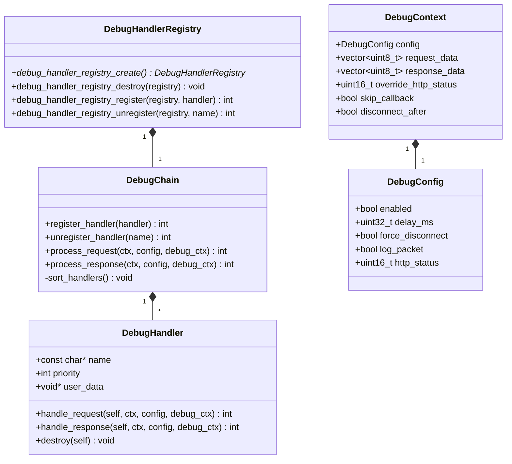
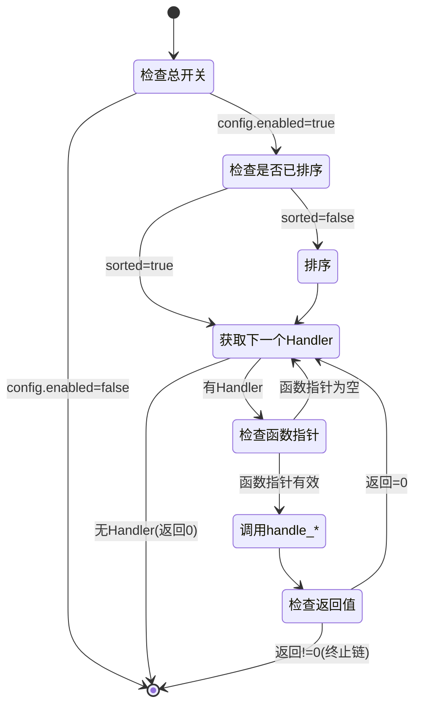

# HTTPS Server 模拟器 - DebugChain模块详细设计文档 (LLD)

**版本**: v5
**创建日期**: 2026-02-16
**修改日期**: 2026-02-17
**状态**: 草稿
**模块名称**: DebugChain
**模块路径**: codes/core/source/debug_chain/

---

## 目录

1. [模块基本信息](#1-模块基本信息)
2. [设计概述](#2-设计概述)
3. [详细设计内容](#3-详细设计内容)
4. [跨模块接口依赖](#4-跨模块接口依赖)
5. [单元测试用例](#5-单元测试用例)
6. [设计验证](#6-设计验证)
7. [备注](#7-备注)

---

## 1. 模块基本信息

### 1.1 基本信息

| 项目 | 内容 |
|-----|------|
| 模块名称 | DebugChain |
| 模块唯一标识 | Module_DebugChain |
| 核心类型 | 逻辑控制类 |
| 设计负责人 | 模块设计师Agent |
| 设计日期 | 2026-02-16 |

### 1.2 模块职责

**职责描述（来自架构设计文档）**：
- 调测点职责链管理
- 各调测点实现（延迟响应、强制断开、日志记录、错误码）
- 调测点注册与扩展

**核心定位**：DebugChain模块采用职责链设计模式，按优先级顺序执行各个调测点处理器，实现请求/响应的调测功能（延迟、断开、日志、错误码），支持动态注册扩展调测点。

### 1.3 职责边界

| 该做什么 | 不该做什么 |
|---------|-----------|
| 维护调测点处理器列表 | 处理业务逻辑（如HTTP协议解析） |
| 按优先级执行职责链 | 管理连接生命周期 |
| 提供默认调测点实现（延迟、断开、日志、错误码） | 直接修改请求/响应数据 |
| 支持调测点动态注册/注销 | 处理TLS握手 |
| 提供配置化的调测功能 | 不涉及线程安全设计（调用方保证） |

### 1.4 关联需求

| 需求ID | 需求描述 | 需求类型 |
|-------|---------|---------|
| REQ_DEBUG_001 | 支持延迟响应调测 | 功能性 |
| REQ_DEBUG_002 | 支持强制断开调测 | 功能性 |
| REQ_DEBUG_003 | 支持请求/响应日志记录 | 功能性 |
| REQ_DEBUG_004 | 支持自定义错误码返回 | 功能性 |
| REQ_DEBUG_005 | 支持调测点扩展 | 非功能性（可扩展性） |
| REQ_DEBUG_006 | 支持调测点启用/禁用配置 | 功能性 |

### 1.5 依赖关系

| 依赖方向 | 模块名称 | 依赖用途 | 调用方式 |
|---------|---------|---------|---------|
| DebugChain → Utils | 日志、配置解析 | 使用日志记录、读取Debug配置 | 头文件包含 |
| DebugChain → Callback | ClientContext | 使用ClientContext获取客户端信息 | 头文件包含 |
| Server → DebugChain | 调测功能调用 | 调用process_request/process_response | 头文件包含 |

---

## 2. 设计概述

### 2.1 设计目标

基于架构约束，完成DebugChain模块内部细化设计，覆盖全部关联需求，实现职责链模式管理调测点，提供默认调测点实现（延迟、断开、日志、错误码），支持动态注册扩展，支撑开发直接编码、单元测试落地。

### 2.2 遵循约束

| 约束类型 | 约束内容 |
|---------|---------|
| 架构约束 | 严格遵循架构设计文档中的模块职责、接口定义 |
| 设计原则约束 | 纯功能驱动，不关注安全性；严格避免过度设计 |
| 跨模块依赖约束 | 内部模块通过头文件关联 |
| 需求约束 | 覆盖REQ_DEBUG_001至REQ_DEBUG_006全部需求 |
| 语言约束 | C++17标准 |

### 2.3 核心设计思路

1. **模块类型判定**：逻辑控制类模块，核心职责为职责链管理、任务调度
2. **设计模式**：采用职责链（Chain of Responsibility）设计模式
3. **内部结构划分**：
   - C风格结构：DebugHandler（包含函数指针的调测点处理器接口）
   - 具体实现：DelayHandler、DisconnectHandler、LogHandler、ErrorCodeHandler（基于DebugHandler）
   - 管理类：DebugChain（职责链管理器）
4. **核心逻辑**：按优先级排序调测点，依次执行，支持提前终止链
5. **配置优先级**：使用DebugConfig配置
6. **可扩展性**：通过实现DebugHandler结构的函数指针实现扩展

### 2.4 设计范围

本次设计范围仅限于DebugChain模块内部，不涉及其他模块、跨模块联调、版本迭代等无关内容。

---

## 3. 详细设计内容

### 3.1 内部结构设计

#### 3.1.1 子组件/类划分

| 结构/类名 | 职责 | 所属子组件 |
|-----|------|-----------|
| DebugHandler | 调测点处理器C风格结构，包含函数指针 | 核心接口 |
| DebugChain | 职责链管理器，按顺序执行调测点 | 链管理 |
| DebugConfig | 调测配置数据结构 | 数据结构 |
| DebugContext | 调测上下文数据结构 | 数据结构 |
| DelayHandler | 延迟响应调测点实现（基于DebugHandler） | 默认调测点 |
| DisconnectHandler | 强制断开调测点实现（基于DebugHandler） | 默认调测点 |
| LogHandler | 日志记录调测点实现（基于DebugHandler） | 默认调测点 |
| ErrorCodeHandler | 错误码调测点实现（基于DebugHandler） | 默认调测点 |

#### 3.1.2 DebugHandler结构设计

**结构名**: DebugHandler

**职责**: 定义调测点处理器接口，使用C风格函数指针

**文件路径**: codes/core/include/debug_chain/debug_handler.hpp

**字段**:
| 名称 | 类型 | 用途 |
|-----|------|------|
| name | const char* | 调测点名称 |
| priority | int | 优先级（越小越先执行） |
| user_data | void* | 用户数据 |
| handle_request | 函数指针 | 处理请求函数指针 |
| handle_response | 函数指针 | 处理响应函数指针 |
| destroy | 函数指针 | 销毁函数指针 |

**函数指针签名**:
```cpp
// 处理请求
int (*handle_request)(DebugHandler* self,
                     const ClientContext* ctx,
                     const DebugConfig* config,
                     DebugContext* debug_ctx);

// 处理响应
int (*handle_response)(DebugHandler* self,
                      const ClientContext* ctx,
                      const DebugConfig* config,
                      DebugContext* debug_ctx);

// 销毁资源
void (*destroy)(DebugHandler* self);
```

#### 3.1.3 DelayHandler实现

**实现名称**: DelayHandler

**职责**: 实现延迟响应功能

**实现方式**: 基于DebugHandler结构

**参数**:
| 名称 | 类型 | 默认值 | 用途 |
|-----|------|-------|------|
| name | const char* | "DelayHandler" | 调测点名称 |
| priority | int | 100 | 优先级 |

**实现函数**:
| 函数名 | 功能 |
|-------|------|
| delay_handler_handle_request | 处理请求：延迟config->delay_ms毫秒，返回0 |
| delay_handler_handle_response | 处理响应：延迟config->delay_ms毫秒，返回0 |
| delay_handler_destroy | 销毁资源 |

**创建函数**:
```cpp
DebugHandler* create_delay_handler();
```

#### 3.1.4 DisconnectHandler实现

**实现名称**: DisconnectHandler

**职责**: 实现强制断开功能

**实现方式**: 基于DebugHandler结构

**参数**:
| 名称 | 类型 | 默认值 | 用途 |
|-----|------|-------|------|
| name | const char* | "DisconnectHandler" | 调测点名称 |
| priority | int | 200 | 优先级 |

**实现函数**:
| 函数名 | 功能 |
|-------|------|
| disconnect_handler_handle_request | 处理请求：若config->force_disconnect=true，设置debug_ctx->disconnect_after=true，返回1 |
| disconnect_handler_handle_response | 处理响应：若config->force_disconnect=true，设置debug_ctx->disconnect_after=true，返回1 |
| disconnect_handler_destroy | 销毁资源 |

**创建函数**:
```cpp
DebugHandler* create_disconnect_handler();
```

#### 3.1.5 LogHandler实现

**实现名称**: LogHandler

**职责**: 实现日志记录功能

**实现方式**: 基于DebugHandler结构

**参数**:
| 名称 | 类型 | 默认值 | 用途 |
|-----|------|-------|------|
| name | const char* | "LogHandler" | 调测点名称 |
| priority | int | 300 | 优先级 |

**实现函数**:
| 函数名 | 功能 |
|-------|------|
| log_handler_handle_request | 处理请求：若config->log_packet=true，记录请求信息，返回0 |
| log_handler_handle_response | 处理响应：若config->log_packet=true，记录响应信息，返回0 |
| log_handler_destroy | 销毁资源 |

**创建函数**:
```cpp
DebugHandler* create_log_handler();
```

#### 3.1.6 ErrorCodeHandler实现

**实现名称**: ErrorCodeHandler

**职责**: 实现自定义错误码返回功能

**实现方式**: 基于DebugHandler结构

**参数**:
| 名称 | 类型 | 默认值 | 用途 |
|-----|------|-------|------|
| name | const char* | "ErrorCodeHandler" | 调测点名称 |
| priority | int | 400 | 优先级 |

**实现函数**:
| 函数名 | 功能 |
|-------|------|
| errorcode_handler_handle_request | 处理请求：设置debug_ctx->override_http_status=config->http_status，返回0 |
| errorcode_handler_handle_response | 处理响应：若debug_ctx->override_http_status为0，则设置为config->http_status，返回0 |
| errorcode_handler_destroy | 销毁资源 |

**创建函数**:
```cpp
DebugHandler* create_errorcode_handler();
```

#### 3.1.7 DebugChain类设计

**类名**: DebugChain

**职责**: 职责链管理器，按优先级顺序执行调测点

**文件路径**: codes/core/include/debug_chain/debug_chain.hpp

**属性**:
| 名称 | 类型 | 默认值 | 访问权限 | 用途 |
|-----|------|-------|---------|------|
| handlers_ | std::vector&lt;DebugHandler*&gt; | empty | private | 调测点列表 |
| sorted_ | bool | false | private | 是否已排序 |

**方法**:
| 名称 | 参数 | 返回值 | 访问权限 | 核心逻辑 | 线程安全 |
|-----|------|-------|---------|---------|---------|
| DebugChain | - | - | public | 构造函数 | - |
| ~DebugChain | - | - | public | 析构函数：遍历handlers_，对非空destroy指针的handler调用destroy()，然后清空列表 | - |
| register_handler | handler: DebugHandler* | int | public | 注册调测点，sorted_置为false，成功返回0 | 否（仅启动前调用） |
| unregister_handler | name: const char* | int | public | 注销调测点，成功返回0，未找到返回-1 | 否（仅启动前调用） |
| process_request | ctx: const ClientContext*,<br/>config: const DebugConfig*,<br/>debug_ctx: DebugContext* | int | public | 先sort_handlers()，遍历调用handle_request()，返回0继续，非0终止链 | 是 |
| process_response | ctx: const ClientContext*,<br/>config: const DebugConfig*,<br/>debug_ctx: DebugContext* | int | public | 先sort_handlers()，遍历调用handle_response()，返回0继续，非0终止链 | 是 |
| sort_handlers | - | void | private | 按priority升序排序，sorted_置为true | - |

#### 3.1.8 DebugHandlerRegistry C接口

**接口名称**: debug_handler_registry_create / debug_handler_registry_destroy / debug_handler_registry_register / debug_handler_registry_unregister

**职责**: 调测点注册器C接口

**文件路径**: codes/core/include/debug_chain/debug_chain.hpp

**接口定义**:
```cpp
#ifdef __cplusplus
extern "C" {
#endif

// DebugHandlerRegistry前置声明
typedef struct DebugHandlerRegistry DebugHandlerRegistry;

// 创建DebugHandlerRegistry实例
DebugHandlerRegistry* debug_handler_registry_create(void);

// 销毁DebugHandlerRegistry实例
void debug_handler_registry_destroy(DebugHandlerRegistry* registry);

// 注册调测点
int debug_handler_registry_register(DebugHandlerRegistry* registry,
                                     DebugHandler* handler);

// 注销调测点
int debug_handler_registry_unregister(DebugHandlerRegistry* registry,
                                       const char* name);

#ifdef __cplusplus
}
#endif
```

**说明**:
- debug_handler_registry_create：创建注册表实例，内部自动注册4个默认Handler（DelayHandler、DisconnectHandler、LogHandler、ErrorCodeHandler）
- debug_handler_registry_destroy：销毁注册表实例，内部调用所有已注册Handler的destroy()函数
- debug_handler_registry_register：注册调测点，成功返回0，已存在返回-1
- debug_handler_registry_unregister：注销调测点，成功返回0，未找到返回-1
- 仅在Server启动前调用，不保证线程安全

#### 3.1.9 头文件包含声明

**头文件依赖关系**:
```cpp
// debug_config.hpp - 无依赖
// debug_context.hpp - 依赖 debug_config.hpp
// debug_handler.hpp - 依赖 debug_config.hpp, debug_context.hpp, callback/client_context.hpp
// debug_chain.hpp - 依赖 debug_handler.hpp, debug_config.hpp, debug_context.hpp, callback/client_context.hpp
```

**典型包含顺序**:
```cpp
#include "debug_chain/debug_config.hpp"
#include "debug_chain/debug_context.hpp"
#include "debug_chain/debug_handler.hpp"
#include "debug_chain/debug_chain.hpp"
```

#### 3.1.10 DebugConfig结构体设计

**结构体名**: DebugConfig

**职责**: 存储调测配置

**文件路径**: codes/core/include/debug_chain/debug_config.hpp

**字段**:
| 名称 | 类型 | 默认值 | 用途 |
|-----|------|-------|------|
| enabled | bool | false | 总开关 |
| delay_ms | uint32_t | 0 | 延迟时间（毫秒） |
| force_disconnect | bool | false | 强制断开连接 |
| log_packet | bool | false | 记录请求/响应报文 |
| http_status | uint16_t | 200 | 返回的HTTP状态码 |

**方法**: 无（纯数据结构）

#### 3.1.11 DebugContext结构体设计

**结构体名**: DebugContext

**职责**: 存储调测上下文信息，在调测点之间传递数据

**文件路径**: codes/core/include/debug_chain/debug_context.hpp

**字段**:
| 名称 | 类型 | 默认值 | 用途 |
|-----|------|-------|------|
| config | DebugConfig | 默认值 | 调测配置 |
| request_data | std::vector&lt;uint8_t&gt; | 空 | 请求数据 |
| response_data | std::vector&lt;uint8_t&gt; | 空 | 响应数据 |
| override_http_status | uint16_t | 0 | 覆盖的HTTP状态码 |
| skip_callback | bool | false | 是否跳过回调 |
| disconnect_after | bool | false | 处理后是否断开连接 |

**方法**: 无（纯数据结构）

#### 3.1.12 类关系总结

| 关系类型 | 源类/结构 | 目标类/结构 | 说明 |
|---------|------|-------|------|
| 实现 | DelayHandler | DebugHandler | 基于DebugHandler结构实现 |
| 实现 | DisconnectHandler | DebugHandler | 基于DebugHandler结构实现 |
| 实现 | LogHandler | DebugHandler | 基于DebugHandler结构实现 |
| 实现 | ErrorCodeHandler | DebugHandler | 基于DebugHandler结构实现 |
| 组合 | DebugChain | DebugHandler | has-a关系，1对多 |
| 组合 | DebugHandlerRegistry | DebugChain | has-a关系，1对1 |
| 组合 | DebugContext | DebugConfig | has-a关系，1对1 |
| 依赖 | DebugChain | DebugConfig | uses-a关系 |
| 依赖 | DebugChain | DebugContext | uses-a关系 |
| 依赖 | DebugChain | ClientContext | uses-a关系 |

### 3.2 核心逻辑设计

#### 3.2.1 process_request处理流程

**功能点**: 按优先级顺序执行请求阶段调测点

**伪代码**:
```
function process_request(client_ctx, config, debug_ctx) -> int:
    if not config.enabled:
        return 0

    if not sorted:
        sort_handlers()

    for handler in handlers:
        if handler->handle_request == nullptr:
            continue

        result = handler->handle_request(handler, client_ctx, config, debug_ctx)

        if result != 0:
            // 非0值：终止链
            return result

    return 0
```

**说明**:
- 返回值：0=继续处理，非0=终止链
- 若config.enabled为false，直接跳过所有调测点
- handler返回非0时立即终止职责链

#### 3.2.2 process_response处理流程

**功能点**: 按优先级顺序执行响应阶段调测点

**伪代码**:
```
function process_response(client_ctx, config, debug_ctx) -> int:
    if not config.enabled:
        return 0

    if not sorted:
        sort_handlers()

    for handler in handlers:
        if handler->handle_response == nullptr:
            continue

        result = handler->handle_response(handler, client_ctx, config, debug_ctx)

        if result != 0:
            // 非0值：终止链
            return result

    return 0
```

**说明**: 与process_request逻辑一致，仅调用handle_response

#### 3.2.3 sort_handlers排序逻辑

**功能点**: 按priority升序排序调测点

**伪代码**:
```
function sort_handlers():
    sort handlers_ by handler->priority ascending
    sorted_ = true
```

**说明**: priority数值越小，优先级越高，越先执行

#### 3.2.4 delay_handler_handle_request延迟逻辑

**功能点**: 执行延迟

**伪代码**:
```
function delay_handler_handle_request(self, client_ctx, config, debug_ctx):
    if config.delay_ms > 0:
        std::this_thread::sleep_for(std::chrono::milliseconds(config.delay_ms))

    return 0
```

#### 3.2.5 disconnect_handler_handle_request断开逻辑

**功能点**: 请求阶段强制断开

**伪代码**:
```
function disconnect_handler_handle_request(self, client_ctx, config, debug_ctx):
    if config.force_disconnect:
        debug_ctx->disconnect_after = true
        return 1  // 返回非0表示终止链

    return 0
```

#### 3.2.6 log_handler_handle_request日志逻辑

**功能点**: 记录请求日志

**伪代码**:
```
function log_handler_handle_request(self, client_ctx, config, debug_ctx):
    if config.log_packet:
        // 记录请求信息
        log_message = "[Debug] Request: "
        log_message += "conn_id=" + client_ctx->connection_id
        log_message += ", client=" + client_ctx->client_ip + ":" + client_ctx->client_port
        log_message += ", server_port=" + client_ctx->server_port

        Utils::Logger::info(log_message)

    return 0
```

#### 3.2.7 errorcode_handler_handle_request错误码逻辑

**功能点**: 设置自定义HTTP状态码

**伪代码**:
```
function errorcode_handler_handle_request(self, client_ctx, config, debug_ctx):
    debug_ctx->override_http_status = config->http_status
    return 0
```

#### 3.2.8 errorcode_handler_handle_response错误码逻辑

**功能点**: 响应阶段设置自定义HTTP状态码

**伪代码**:
```
function errorcode_handler_handle_response(self, client_ctx, config, debug_ctx):
    if debug_ctx->override_http_status == 0:
        debug_ctx->override_http_status = config->http_status
    return 0
```

#### 3.2.9 debug_handler_registry_create初始化逻辑

**功能点**: 创建注册表并自动注册默认Handler

**伪代码**:
```
function debug_handler_registry_create():
    registry = new DebugHandlerRegistry()
    registry->chain = new DebugChain()

    // 自动注册4个默认Handler
    registry->chain->register_handler(create_delay_handler())
    registry->chain->register_handler(create_disconnect_handler())
    registry->chain->register_handler(create_log_handler())
    registry->chain->register_handler(create_errorcode_handler())

    return registry
```

**说明**: 默认Handler在创建注册表时自动注册，注册顺序为Delay→Disconnect→Log→ErrorCode，优先级分别为100、200、300、400

#### 3.2.10 debug_handler_registry_destroy销毁逻辑

**功能点**: 销毁注册表并清理所有Handler

**伪代码**:
```
function debug_handler_registry_destroy(registry):
    if registry == nullptr:
        return
    if registry->chain != nullptr:
        delete registry->chain  // DebugChain析构函数会调用所有handler的destroy()
    delete registry
```

### 3.3 可扩展性设计

#### 3.3.1 扩展接口标准

**扩展方式**: 实现DebugHandler结构，设置函数指针

**扩展步骤**:
1. 定义DebugHandler结构实例
2. 实现handle_request函数（按需）
3. 实现handle_response函数（按需）
4. 实现destroy函数（按需，用于释放资源）
5. 在Server启动前调用debug_handler_registry_register注册

#### 3.3.2 扩展约束

| 约束项 | 要求 |
|-------|------|
| 名称唯一性 | handler名称必须全局唯一 |
| 优先级范围 | 建议范围100-1000，默认调测点使用100,200,300,400 |
| 返回值约定 | 返回0继续，非0终止链 |
| 线程安全 | handle_request和handle_response必须是线程安全的 |
| 资源管理 | 若分配资源，必须在destroy中释放 |
| 注册时机 | 调测点注册必须在server启动前完成 |

#### 3.3.3 扩展示例（伪代码）

```cpp
// 自定义handle_request函数
int custom_handle_request(DebugHandler* self,
                         const ClientContext* ctx,
                         const DebugConfig* config,
                         DebugContext* debug_ctx) {
    // 自定义逻辑
    return 0;
}

// 自定义handle_response函数
int custom_handle_response(DebugHandler* self,
                          const ClientContext* ctx,
                          const DebugConfig* config,
                          DebugContext* debug_ctx) {
    // 自定义逻辑
    return 0;
}

// 自定义destroy函数
void custom_destroy(DebugHandler* self) {
    // 清理资源
    free(self);
}

// 创建并注册
DebugHandler* create_custom_handler() {
    DebugHandler* handler = (DebugHandler*)malloc(sizeof(DebugHandler));
    handler->name = "CustomHandler";
    handler->priority = 500;
    handler->user_data = nullptr;
    handler->handle_request = custom_handle_request;
    handler->handle_response = custom_handle_response;
    handler->destroy = custom_destroy;
    return handler;
}

// 注册
DebugHandlerRegistry* registry = debug_handler_registry_create();
DebugHandler* handler = create_custom_handler();
debug_handler_registry_register(registry, handler);
```

### 3.4 图形化设计

#### 3.4.1 类图



**图1：DebugChain类图**

#### 3.4.2 职责链执行活动图



**图2：职责链执行活动图**

---

## 4. 跨模块接口依赖

### 4.1 依赖模块概述

DebugChain模块仅依赖以下模块：

| 依赖模块 | 依赖用途 |
|---------|---------|
| ClientContext | Client上下文，获取客户端信息 |

### 4.2 ClientContext依赖

**说明**: DebugChain仅依赖ClientContext类型，不依赖Connection、ServerConfig、Protocol模块。

---

## 5. 单元测试用例

### 5.1 测试侧重点

- 重点测试：职责链执行顺序、Handler返回值处理、配置开关
- 次要测试：各默认Handler功能逻辑
- 异常测试：空指针、重复注册、未找到Handler
- 边界测试：priority边界值、delay_ms=0

### 5.2 测试用例表

| 用例ID | 测试模块 | 关联需求点 | 测试场景 | 预期输出 |
|-------|---------|-----------|---------|---------|
| DebugChain_UC001 | DebugChain | REQ_DEBUG_005 | 正常注册Handler | 返回0 |
| DebugChain_UC002 | DebugChain | REQ_DEBUG_005 | 正常注销Handler | 返回0 |
| DebugChain_UC003 | DebugChain | REQ_DEBUG_005 | 注销不存在的Handler | 返回-1 |
| DebugChain_UC004 | DebugChain | REQ_DEBUG_001/002/003/004 | 按priority顺序执行 | 执行顺序100→200→300 |
| DebugChain_UC005 | DebugChain | REQ_DEBUG_002 | Handler返回非0终止链 | 后续Handler不执行 |
| DebugChain_UC006 | DebugChain | 配置 | config.enabled=false | 直接返回0，无Handler执行 |
| Delay_UC001 | DelayHandler | REQ_DEBUG_001 | 正常延迟 | 延迟约delay_ms毫秒 |
| Delay_UC002 | DelayHandler | REQ_DEBUG_001 | delay_ms=0 | 无延迟立即返回 |
| Disconnect_UC001 | DisconnectHandler | REQ_DEBUG_002 | force_disconnect=true | disconnect_after=true，返回1 |
| Log_UC001 | LogHandler | REQ_DEBUG_003 | log_packet=true | 记录请求/响应日志 |
| ErrorCode_UC001 | ErrorCodeHandler | REQ_DEBUG_004 | http_status=404 | override_http_status=404 |

---

## 6. 设计验证

### 6.1 验证方式

| 验证方式 | 说明 |
|---------|------|
| 架构约束对照 | 对照架构设计文档，验证设计是否符合约束 |
| 需求覆盖对照 | 对照REQ_DEBUG_001至REQ_DEBUG_006，验证需求是否完全覆盖 |
| 设计评审 | 评审类结构、逻辑流程是否合理 |

### 6.2 验证要点

| 验证项 | 验证内容 |
|-------|---------|
| 数据结构 | DebugConfig/DebugContext与架构子文档一致 |
| 接口定义 | DebugHandler/DebugChain与架构子文档一致 |
| 全局C接口 | 已实现debug_handler_registry_create/destroy/register/unregister |
| 默认Handler自动注册 | debug_handler_registry_create自动注册4个默认Handler |
| 析构函数职责 | DebugChain析构函数调用handler的destroy() |
| 线程安全约定 | 遵循"仅启动前调用"的约定，无过度设计 |
| 跨模块依赖 | 仅依赖ClientContext，无额外依赖 |

### 6.3 需求覆盖矩阵

| 需求ID | 需求描述 | 对应设计章节 | 覆盖状态 |
|-------|---------|-------------|---------|
| REQ_DEBUG_001 | 支持延迟响应调测 | 3.1.3, 3.2.4 | 已覆盖 |
| REQ_DEBUG_002 | 支持强制断开调测 | 3.1.4, 3.2.5 | 已覆盖 |
| REQ_DEBUG_003 | 支持请求/响应日志记录 | 3.1.5, 3.2.6 | 已覆盖 |
| REQ_DEBUG_004 | 支持自定义错误码返回 | 3.1.6, 3.2.7, 3.2.8 | 已覆盖 |
| REQ_DEBUG_005 | 支持调测点扩展 | 3.3 | 已覆盖 |
| REQ_DEBUG_006 | 支持调测点启用/禁用配置 | 3.1.10 | 已覆盖 |

---

## 7. 备注

### 7.1 特殊约束说明

- 本模块不涉及安全性设计
- 纯功能驱动，无过度设计
- 调测点注册必须在Server启动前完成
- 仅依赖ClientContext，不依赖Connection/ServerConfig/Protocol模块
- 严格遵循架构子文档的接口定义

### 7.2 其他补充

- 本模块聚焦DebugChain内部设计
- 图形化设计使用Mermaid语法，可直接渲染
- 所有数据结构和接口与架构子文档保持一致

---

## 版本历史

| 版本 | 日期 | 作者 | 说明 |
|------|------|------|------|
| v1 | 2026-02-16 | 模块设计师Agent | 初始版本 |
| v2 | 2026-02-16 | 模块设计师Agent | 调整DebugConfig/DebugContext数据结构，统一为架构子文档定义 |
| v3 | 2026-02-16 | 模块设计师Agent | 根据第一次检视报告修改：1) 统一DebugConfig为enabled/delay_ms/force_disconnect/log_packet/http_status；2) 统一DebugContext为config/request_data/response_data/override_http_status/skip_callback/disconnect_after；3) DebugHandler改为C风格struct；4) DebugChain接口改为register_handler/unregister_handler；5) 删除DebugHandlerRegistry过度设计；6) 删除线程安全设计过度设计；7) 删除Connection/ServerConfig/Protocol依赖；8) 补充RegisterDebugHandler/UnregisterDebugHandler全局C接口 |
| v4 | 2026-02-16 | 模块设计师Agent | 修复类图中模板符号"~"为"&lt;&gt;" |
| v5 | 2026-02-17 | 模块设计师Agent | 根据第二次检视报告修改：1) 全局C接口命名统一为debug_handler_registry_register/unregister（与HLD一致）；2) 添加debug_handler_registry_create/destroy接口；3) 明确debug_handler_registry_create自动注册4个默认Handler；4) 明确DebugChain析构函数调用所有handler的destroy()；5) 补充ErrorCodeHandler响应阶段逻辑（若override_http_status为0则设置）；6) 添加头文件包含声明说明；7) 更新类图添加DebugHandlerRegistry |

---

**文档结束**
