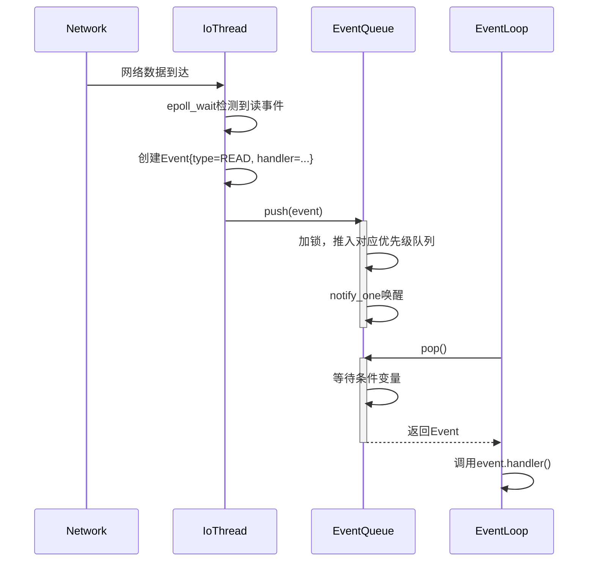
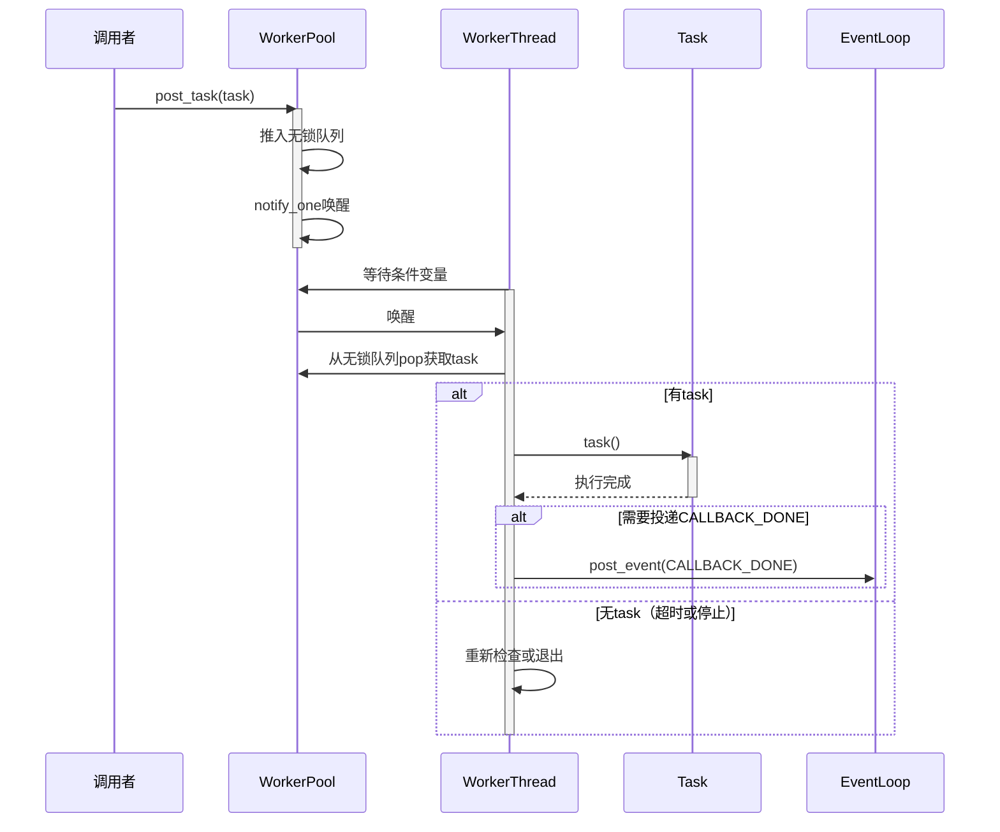

# HTTPS Server 模拟器 - MsgCenter 模块详细设计文档

**版本**: v5
**创建日期**: 2026-02-16
**修改日期**: 2026-02-17
**状态**: 最终版（第4版检视意见修复）

---

## 目录

1. [模块基本信息](#1-模块基本信息)
2. [设计概述](#2-设计概述)
3. [详细设计内容](#3-详细设计内容)
4. [开发落地指南](#4-开发落地指南)
5. [单元测试用例](#5-单元测试用例)
6. [设计验证](#6-设计验证)
7. [备注](#7-备注)

---

## 1. 模块基本信息

### 1.1 基本信息

| 项 | 值 |
|---|---|
| 模块名称 | MsgCenter |
| 模块唯一标识 | Module_MsgCenter |
| 核心类型 | 逻辑控制类 |
| 模块路径 | codes/core/source/msg_center/ |
| 设计负责人 | 模块设计师Agent |
| 设计日期 | 2026-02-17 |

### 1.2 模块职责

**架构定义职责**:
- Event Loop实现
- 事件优先级队列管理
- 事件分发处理
- 线程间通信
- IO线程管理
- 工作线程池管理

**核心定位**: MsgCenter是系统的核心调度中枢，负责事件驱动模型的实现、线程资源管理和任务调度，是连接IO层与业务处理层的桥梁。

### 1.3 职责边界

| 该做什么 | 不该做什么 |
|---------|-----------|
| 提供Event Loop主循环实现 | 具体的业务逻辑处理（如HTTP协议解析） |
| 管理事件优先级队列 | 连接生命周期管理（由Connection模块负责） |
| 实现线程间通信机制 | TLS握手、加密解密（由Protocol模块负责） |
| 管理IO线程（accept、read/write事件） | 回调策略选择（由Callback模块负责） |
| 管理工作线程池（执行回调任务） | 调测逻辑（由DebugChain模块负责） |
| 提供事件投递接口 | 配置管理（由Utils模块负责） |

### 1.4 关联需求

| 需求ID | 需求描述 | 需求类型 |
|--------|---------|---------|
| REQ-001 | 支持Event Loop事件驱动模型 | 功能性需求 |
| REQ-002 | 支持多IO线程处理网络事件 | 功能性需求 |
| REQ-003 | 支持工作线程池执行回调任务 | 功能性需求 |
| REQ-004 | 支持线程间安全通信 | 功能性需求 |
| REQ-005 | 支持事件优先级调度 | 功能性需求 |
| NFR-001 | 事件调度延迟 < 1ms | 非功能性需求 |

### 1.5 依赖关系

| 依赖方向 | 模块名称 | 依赖用途 |
|---------|---------|---------|
| MsgCenter → Utils | Utils模块 | 使用日志、无锁队列等工具（内部模块，通过头文件关联） |
| Server → MsgCenter | MsgCenter模块 | Server启动/停止MsgCenter，投递事件 |
| Connection → MsgCenter | MsgCenter模块 | Connection投递事件到EventLoop |
| Protocol → MsgCenter | MsgCenter模块 | Protocol投递事件到EventLoop |

---

## 2. 设计概述

### 2.1 设计目标

基于架构约束，完成MsgCenter模块内部细化设计，覆盖全部关联需求，提供完整的Event Loop实现、事件优先级队列管理、IO线程管理、工作线程池管理，支撑开发直接编码、单元测试落地。

### 2.2 遵循约束

- **架构约束**: 严格遵循架构设计文档中MsgCenter模块的职责定义，不越权、不缺失
- **设计原则约束**: 纯功能驱动，不关注安全性；严格避免过度设计
- **依赖约束**: 内部模块通过头文件关联
- **开发规范约束**: 使用C++17，遵循统一命名规范
- **需求约束**: 覆盖全部关联需求点

### 2.3 核心设计思路

1. **模块类型判定**: 逻辑控制类模块，核心职责为任务调度、事件分发、状态管理
2. **内部结构划分**: 遵循高内聚原则，划分为MsgCenter（门面）、EventLoop（主循环）、EventQueue（事件队列）、IoThread（IO线程）、WorkerPool（工作线程池）五大核心类
3. **核心逻辑设计**: 重点设计事件分发流程、线程间通信机制、任务调度逻辑
4. **图形化设计**: 配套绘制类图、时序图、状态图，确保设计直观
5. **测试设计**: 覆盖所有功能点、异常场景、边界场景

### 2.4 设计范围

本次设计范围仅限于MsgCenter模块内部，不涉及其他模块、跨模块联调、版本迭代、可靠性冗余设计等无关内容。

---

## 3. 详细设计内容

### 3.1 内部结构设计

#### 3.1.1 子组件/类划分

MsgCenter模块采用门面模式，由MsgCenter类作为统一入口，内部包含多个高内聚的子组件：

| 类名 | 职责描述 | 所在文件 |
|------|---------|---------|
| MsgCenter | 模块门面，统一管理EventLoop、IoThread、WorkerPool | msg_center.hpp |
| EventLoop | 事件主循环，负责事件分发处理 | event_loop.hpp |
| EventQueue | 事件优先级队列，线程安全的事件存储 | event_queue.hpp |
| Event | 事件结构，定义事件数据 | event.hpp |
| IoThread | IO线程，负责监听网络IO事件 | io_thread.hpp |
| WorkerPool | 工作线程池，执行回调任务 | worker_pool.hpp |

#### 3.1.2 核心类详细设计

**结构1: Event（事件结构）**

```cpp
namespace https_server_sim {

enum class EventType : uint8_t {
    SHUTDOWN = 0,
    ERROR = 1,
    ACCEPT = 2,
    READ = 3,
    WRITE = 4,
    CALLBACK_DONE = 5,
    TIMEOUT = 6,
    STATISTICS = 7
};

// Event优先级数量常量，基于EventType枚举自动计算
// 使用该常量避免硬编码，新增EventType时无需修改多处代码
constexpr size_t kEventPriorityCount = static_cast<size_t>(EventType::STATISTICS) + 1;

// 错误码枚举
enum class MsgCenterError : int {
    SUCCESS = 0,
    ALREADY_RUNNING = 1,
    THREAD_CREATE_FAILED = 2,
    INVALID_PARAMETER = 3
};

struct Event {
    EventType type;
    uint64_t conn_id;
    int fd;
    void* user_data;
    std::function<void()> handler;
};

} // namespace https_server_sim
```

**设计说明**:
- 新增`kEventPriorityCount`常量，避免硬编码8，与EventType枚举解耦
- 新增`MsgCenterError`错误码枚举，统一错误处理
- Event结构保持现有设计，这是在通用性和便利性之间的合理权衡
  - 对于通过handler处理的事件，前面字段可能冗余
  - 对于简单事件，handler可能为空
  - 统一结构简化了EventQueue的实现

**类2: EventQueue（事件优先级队列）**

```cpp
namespace https_server_sim {

class EventQueue {
public:
    EventQueue(size_t max_size = 10000);
    ~EventQueue();

    // 入队
    bool push(const Event& event);

    // 出队（阻塞）
    Event pop();

    // 出队（非阻塞）
    bool try_pop(Event& event);

    // 批量出队
    std::vector<Event> pop_all(size_t max_count);

    // 队列是否为空
    bool empty() const;

    // 获取队列大小
    size_t size() const;

    // 队列是否已关闭
    bool is_closed() const;

    // 唤醒所有等待线程（用于停止时调用）
    void wake_up();

private:
    // 按优先级分层的队列数组，索引0为最高优先级
    // 每层一个FIFO队列，保证同优先级事件按插入顺序处理
    std::vector<std::queue<Event>> priority_queues_;

    mutable std::mutex mutex_;
    std::condition_variable not_empty_;
    size_t max_size_;
    size_t size_;           // 队列当前大小（在mutex_保护下访问）
    std::atomic<bool> queue_closed_;

    // 获取最高优先级的非空队列索引
    int get_highest_priority_queue() const;
};

} // namespace https_server_sim
```

**设计说明**:
- 新增`is_closed()`方法，用于明确查询队列状态
- 使用`kEventPriorityCount`替代硬编码的8

**类3: EventLoop（事件主循环）**

```cpp
namespace https_server_sim {

class EventLoop {
public:
    EventLoop(EventQueue* event_queue);
    ~EventLoop();

    // 禁止拷贝
    EventLoop(const EventLoop&) = delete;
    EventLoop& operator=(const EventLoop&) = delete;

    // 运行事件循环（阻塞当前线程）
    void run();

    // 停止事件循环
    void stop();

    // 投递事件
    void post_event(const Event& event);

    // 检查是否在事件循环线程
    bool is_in_loop_thread() const;

    // 获取EventQueue指针（供WorkerPool等使用）
    EventQueue* get_event_queue() { return event_queue_; }

private:
    EventQueue* event_queue_;
    std::atomic<bool> running_;
    std::thread::id loop_thread_id_;
};

} // namespace https_server_sim
```

**设计说明**:
- 新增`get_event_queue()`方法，供WorkerPool投递回调完成事件
- 将在后续补充`post_event()`的实现逻辑

**类4: MsgCenter（模块门面）**

```cpp
namespace https_server_sim {

class MsgCenter {
public:
    // 构造函数：可配置IO线程数量和工作线程数量
    // io_thread_count默认值为2，worker_thread_count默认值为2
    explicit MsgCenter(size_t io_thread_count = 2, size_t worker_thread_count = 2);
    ~MsgCenter();

    // 禁止拷贝
    MsgCenter(const MsgCenter&) = delete;
    MsgCenter& operator=(const MsgCenter&) = delete;

    // 启动消息中心
    // 返回值：0表示成功，非0表示错误码（参见MsgCenterError枚举）
    int start();

    // 停止消息中心
    void stop();

    // 提交事件
    void post_event(const Event& event);

    // 提交回调任务
    void post_callback_task(std::function<void()> task);

    // 获取EventLoop
    EventLoop* get_event_loop() { return event_loop_.get(); }

private:
    std::unique_ptr<EventQueue> event_queue_;
    std::unique_ptr<EventLoop> event_loop_;
    std::unique_ptr<WorkerPool> worker_pool_;
    std::vector<std::unique_ptr<IoThread>> io_threads_;
    std::thread event_loop_thread_;
    std::atomic<bool> running_;

    size_t io_thread_count_;
    size_t worker_thread_count_;
};

} // namespace https_server_sim
```

**设计说明**:
- 构造函数新增`io_thread_count`和`worker_thread_count`参数，支持配置IO线程数量
- 默认值均为2，保持向后兼容
- 明确start()返回值含义：0成功，非0为错误码

**类5: IoThread（IO线程）**

```cpp
namespace https_server_sim {

class IoThread {
public:
    IoThread(int thread_id, EventQueue* event_queue);
    ~IoThread();

    // 禁止拷贝
    IoThread(const IoThread&) = delete;
    IoThread& operator=(const IoThread&) = delete;

    // 启动IO线程
    void start();

    // 停止IO线程
    void stop();

    // 添加监听socket
    // 【线程安全】此方法可从任意线程调用，内部使用fd_mutex_保护
    void add_listen_fd(int fd, uint16_t port);

    // 添加连接socket
    // 【线程安全】此方法可从任意线程调用，内部使用fd_mutex_保护
    void add_conn_fd(int fd, uint64_t conn_id);

    // 移除socket
    // 【线程安全】此方法可从任意线程调用，内部使用fd_mutex_保护
    void remove_fd(int fd);

private:
    // IO线程主函数
    void io_thread_func();

    // 平台特定的事件循环
    void event_loop_linux();
    void event_loop_mac();
    void event_loop_windows();

    // 唤醒IO线程（用于添加/移除fd时唤醒）
    void wake_up();

    int thread_id_;
    EventQueue* event_queue_;
    std::thread thread_;
    std::atomic<bool> running_;

    // 平台特定的事件循环fd
    int epoll_fd_;     // Linux: epoll fd
    int kq_fd_;         // Mac: kqueue fd
    void* iocp_handle_; // Windows: IOCP handle

    // 唤醒fd
    int wakeup_fd_;     // Linux: eventfd, Mac: pipe write fd

    // fd到conn_id的映射
    std::unordered_map<int, uint64_t> fd_to_conn_id_;

    // 监听fd到端口的映射
    std::unordered_map<int, uint16_t> listen_fd_to_port_;

    // 监听fd列表（用于快速遍历，数据冗余设计）
    // 保留vector是为了在某些场景下需要快速遍历所有监听fd
    std::vector<int> listen_fds_;

    // 连接fd列表（用于快速遍历，数据冗余设计）
    // 保留vector是为了在某些场景下需要快速遍历所有连接fd
    std::vector<int> conn_fds_;

    // 保护fd管理的锁
    mutable std::mutex fd_mutex_;
};

} // namespace https_server_sim
```

**设计说明**:
- 明确标注`add_listen_fd`、`add_conn_fd`、`remove_fd`为线程安全方法
- 添加注释说明同时维护vector和map的原因（快速遍历）
- fd_mutex_保护所有fd相关数据结构的访问

**类6: WorkerPool（工作线程池）**

```cpp
namespace https_server_sim {

class WorkerPool {
public:
    // 构造函数：可配置工作线程数量，可选关联EventLoop
    // num_workers: 工作线程数量，默认2
    // event_loop: 可选的EventLoop指针，用于投递CALLBACK_DONE事件
    //             若为nullptr，则不投递回调完成事件
    WorkerPool(size_t num_workers = 2, EventLoop* event_loop = nullptr);
    ~WorkerPool();

    // 禁止拷贝
    WorkerPool(const WorkerPool&) = delete;
    WorkerPool& operator=(const WorkerPool&) = delete;

    // 启动线程池
    void start();

    // 停止线程池
    void stop();

    // 投递任务
    void post_task(std::function<void()> task);

    // 获取线程数
    size_t get_thread_count() const;

    // 设置是否投递CALLBACK_DONE事件
    void set_post_callback_done(bool enable);

private:
    // 工作线程函数
    void worker_thread();

    // 投递回调完成事件（内部辅助方法）
    void post_callback_done_event();

    size_t num_workers_;
    std::vector<std::thread> workers_;

    // 任务队列：std::queue + mutex（MPMC线程安全）
    // 头文件: #include <queue>, #include <mutex>
    std::queue<std::function<void()>> task_queue_;
    mutable std::mutex task_queue_mutex_;

    std::atomic<bool> running_;
    std::atomic<bool> queue_closed_;

    // 关联的EventLoop（可选，用于投递CALLBACK_DONE事件）
    EventLoop* event_loop_;

    // 是否投递CALLBACK_DONE事件
    std::atomic<bool> post_callback_done_;

    // 条件变量，用于替代sleep轮询
    std::mutex cv_mutex_;
    std::condition_variable task_cv_;
};

} // namespace https_server_sim
```

**设计说明**:
- 新增`EventLoop* event_loop_`成员变量，用于关联EventLoop
- 构造函数新增`event_loop`参数，支持可选关联
- **构造函数初始化说明**: `post_callback_done_`初始化为`false`，避免在EventLoop未启动时投递事件
- 新增`set_post_callback_done()`方法，控制是否投递CALLBACK_DONE事件
- 新增条件变量`task_cv_`，替代sleep轮询，减少CPU占用和延迟
- 新增`post_callback_done_event()`内部辅助方法

#### 3.1.3 类关系

- **MsgCenter** 组合 **EventQueue**、**EventLoop**、**IoThread**、**WorkerPool**（1:1:1:N:1关系）
- **EventLoop** 关联 **EventQueue**（EventLoop通过指针访问MsgCenter创建的EventQueue）
- **EventQueue** 存储 **Event**（1:N关系）
- **IoThread** 关联 **EventQueue**（用于投递事件）
- **WorkerPool** 关联 **EventLoop**（可选，用于投递回调完成事件）
  - WorkerPool通过构造函数接收EventLoop指针
  - WorkerPool可通过event_loop_->post_event()投递CALLBACK_DONE事件
  - 此关联为可选，若不需要投递回调完成事件，event_loop_可为nullptr

### 3.2 核心逻辑设计

#### 3.2.1 EventLoop主循环逻辑

```
EventLoop::run() 伪代码:
------------------------------------------------
1. 记录当前线程ID为loop_thread_id_
2. 设置running_ = true
3. // 通知等待的线程：EventLoop已启动
4. lock start_mutex_
5. 设置started_ = true
6. unlock start_mutex_
7. 调用start_cv_.notify_all()
8. while running_:
9.     从event_queue_弹出事件（阻塞）
10.    if 事件.type != SHUTDOWN:
11.        if event.handler不为空:
12.            调用event.handler()
13.    else:
14.        break  // 收到SHUTDOWN事件，退出循环
15. end while
16. 清理资源
```

```
EventLoop::stop() 伪代码:
------------------------------------------------
1. 设置running_ = false
2. 创建SHUTDOWN事件 = Event::make_shutdown_event()
3. 调用event_queue_->push(shutdown_event)
4. 调用event_queue_->wake_up()  // 唤醒等待线程
```

```
EventLoop::wait_for_started(timeout_ms) 伪代码:
------------------------------------------------
1. std::unique_lock<std::mutex> lock(start_mutex_)
2. return start_cv_.wait_for(lock, timeout_ms, [this]() {
3.     return started_.load()
4. })
```

```
EventLoop::post_event() 伪代码:
------------------------------------------------
1. 检查event_queue_是否为空指针
2. 调用event_queue_->push(event)
3. 返回
```

**设计说明**:
- 补充`post_event()`方法实现，直接委托给EventQueue::push()

#### 3.2.2 事件优先级队列逻辑

```
EventQueue::push(event) 伪代码:
------------------------------------------------
1. 获取mutex_锁
2. // 在锁保护下检查队列总大小（使用size_）
3. if size_ >= max_size_:
4.     释放锁
5.     返回false
6. priority = static_cast<uint8_t>(event.type)
7. 将event推入priority_queues_[priority]的队尾
8. ++size_
9. 释放锁
10.调用not_empty_.notify_one()唤醒等待线程
11.返回true
```

```
EventQueue::pop() 伪代码:
------------------------------------------------
1. 获取mutex_锁
2. while 所有队列为空 且 !queue_closed_:
3.     not_empty_.wait(lock)
4. if 所有队列为空:
5.     释放锁
6.     返回Event::make_shutdown_event()
7. idx = get_highest_priority_queue()
8. 从priority_queues_[idx]队首取出event
9. --size_
10.释放锁
11.返回event
```

```
EventQueue::empty() 伪代码:
------------------------------------------------
1. 获取mutex_锁
2. result = (size_ == 0)
3. 释放锁
4. return result
```

```
EventQueue::size() 伪代码:
------------------------------------------------
1. 获取mutex_锁
2. result = size_
3. 释放锁
4. return result
```

```
EventQueue::get_highest_priority_queue() 伪代码:
------------------------------------------------
1. for i from 0 to (kEventPriorityCount - 1):
2.     if !priority_queues_[i].empty():
3.         return i
4. return -1
```

```
EventQueue::is_closed() 伪代码:
------------------------------------------------
1. 返回queue_closed_.load()
```

```
EventQueue::wake_up() 伪代码:
------------------------------------------------
1. 获取mutex_锁
2. 设置queue_closed_ = true
3. 释放锁
4. 调用not_empty_.notify_all()
```

**优先级排序规则**:
- 按EventType枚举值从小到大排序（值越小优先级越高）
- 同优先级事件按FIFO顺序处理
- READ和WRITE事件枚举值分别为3和4，但优先级相同（均为3级）
  - 在优先级队列中，READ事件会排在WRITE事件前面
  - 若需要完全相同优先级，可调整枚举值或在比较逻辑中特殊处理

#### 3.2.3 IO线程逻辑（以Linux epoll为例）

```
IoThread::event_loop_linux() 伪代码:
------------------------------------------------
1. 创建epoll_fd_ = epoll_create1(0)
2. 创建wakeup_fd_ = eventfd(0, EFD_NONBLOCK)
3. 注册wakeup_fd_到epoll_fd_（监听EPOLLIN）
4. while running_:
5.     调用epoll_wait等待事件，超时时间100ms
6.     if 超时:
7.         continue
8.     for each 就绪事件:
9.         if fd == wakeup_fd_:
10.             读取eventfd数据，清空事件
11.             continue
12.         获取fd_mutex_锁
13.         if fd 在 listen_fd_to_port_中:
14.             释放fd_mutex_锁
15.             while true:
16.                 调用accept()接受新连接
17.                 if accept失败:
18.                     if errno == EAGAIN or errno == EWOULDBLOCK:
19.                         break
20.                     else if errno == EMFILE or errno == ENFILE:
21.                         记录日志，等待后重试
22.                         break
23.                     else:
24.                         记录错误日志
25.                         break
26.                 创建Event{type=ACCEPT, fd=新连接fd, conn_id=生成conn_id}
27.                 调用event_queue_->push(event)
28.         else if fd 在 fd_to_conn_id_中:
29.             conn_id = fd_to_conn_id_[fd]
30.             释放fd_mutex_锁
31.             if 是EPOLLIN事件:
32.                 创建Event{type=READ, fd=fd, conn_id=conn_id}
33.                 调用event_queue_->push(event)
34.             if 是EPOLLOUT事件:
35.                 创建Event{type=WRITE, fd=fd, conn_id=conn_id}
36.                 调用event_queue_->push(event)
37.             if 是EPOLLERR或EPOLLHUP:
38.                 创建Event{type=ERROR, fd=fd, conn_id=conn_id}
39.                 调用event_queue_->push(event)
40.         else:
41.             释放fd_mutex_锁
42. end while
43. 注销所有fd
44. 关闭wakeup_fd_
45. 关闭epoll_fd_
```

#### 3.2.4 工作线程池逻辑

```
WorkerPool::worker_thread() 伪代码:
------------------------------------------------
1. while running_.load():
2.     std::function<void()> task
3.     bool has_task = false
4.     // 在单一mutex_保护下等待任务
5.     std::unique_lock<std::mutex> lock(mutex_)
6.     // 等待任务或停止信号
7.     task_cv_.wait(lock, [this]() {
8.         return !task_queue_.empty() ||
9.                !running_.load() ||
10.               queue_closed_.load()
11.    })
12.    // 检查是否应该退出
13.    if !running_.load() or queue_closed_.load():
14.        break
15.    // 获取任务
16.    if !task_queue_.empty():
17.        task = std::move(task_queue_.front())
18.        task_queue_.pop()
19.        has_task = true
20.    unlock mutex_
21.    // 执行任务（在锁外执行，避免阻塞其他线程）
22.    if has_task:
23.        try:
24.            调用task()
25.        catch (...):
26.            捕获所有异常，记录日志
27.        // 任务执行完成后，可选投递CALLBACK_DONE事件
28.        if post_callback_done_.load() && event_loop_ != nullptr:
29.            post_callback_done_event()
30. end while
```

**设计说明**:
- 使用单一互斥锁`mutex_`保护任务队列和条件变量，避免锁顺序死锁风险
- 使用条件变量+谓词等待模式，简化逻辑并避免虚假唤醒问题
- 任务在锁外执行，避免长时间持有锁阻塞其他线程
- 任务执行完成后，根据配置可选投递CALLBACK_DONE事件

```
WorkerPool::post_task(task) 伪代码:
------------------------------------------------
1. 调用task_queue_.push(task)
2. 调用task_cv_.notify_one()唤醒一个工作线程
```

```
WorkerPool::post_callback_done_event() 伪代码:
------------------------------------------------
1. if event_loop_ == nullptr:
2.     return
3. 创建Event event = Event::make_callback_done_event()
4. 调用event_loop_->post_event(event)
```

```
WorkerPool::stop() 伪代码:
------------------------------------------------
1. 设置running_ = false
2. 设置queue_closed_ = true
3. 调用task_cv_.notify_all()唤醒所有工作线程
4. for each worker in workers_:
5.     if worker.joinable():
6.         worker.join()
```

**设计权衡说明**:
- 原设计使用`sleep_for(1ms)`轮询，优点是实现简单
- 新设计使用条件变量 + std::queue + mutex，优点是低延迟、低CPU占用
- 使用std::queue + mutex实现MPMC（多生产者多消费者）线程安全队列，避免SPSC无锁队列的场景限制

#### 3.2.5 线程间通信机制

MsgCenter使用两种线程间通信机制：

1. **EventQueue**: 用于任意线程向EventLoop线程投递事件
   - 实现: std::vector<std::queue<Event>> + std::mutex + std::condition_variable
   - 用途: IO线程 → EventLoop，Worker线程 → EventLoop，其他模块 → EventLoop

2. **eventfd/signalfd**: 用于唤醒IO线程
   - Linux: eventfd
   - Mac: kqueue EVFILT_USER
   - Windows: PostQueuedCompletionStatus
   - 用途: 其他线程 → IO线程（添加/移除fd时唤醒）

#### 3.2.6 锁策略与死锁预防

**锁策略设计**:

| 数据结构 | 锁类型 | 锁粒度 | 用途 |
|---------|--------|--------|------|
| EventQueue::priority_queues_ | std::mutex | 队列级 | 保护优先级队列的插入和删除 |
| IoThread::fd_to_conn_id_等 | std::mutex | fd管理级 | 保护fd映射表的访问 |
| WorkerPool::task_queue_ | std::mutex | 队列级 | 单一互斥锁保护任务队列和条件变量 |

**死锁预防策略**:
1. **避免嵌套锁**: WorkerPool使用单一互斥锁，不存在锁嵌套问题
2. **原子变量优先**: 状态标志（running_、queue_closed_）使用std::atomic，不需要锁保护
3. **最小化锁持有时间**: 任务在锁外执行，避免长时间持有锁

### 3.3 可扩展性设计

**本模块无需支持插件式扩展**，但预留以下扩展点：

1. **Event扩展**: 可通过设置不同的handler函数自定义事件处理
2. **WorkerPool任务扩展**: 可通过std::function封装任意任务
3. **IoThread平台扩展**: 可添加新的平台特定event_loop_*()函数
4. **EventType扩展**: 新增EventType枚举值时，只需在event.hpp中添加，`kEventPriorityCount`会自动更新

### 3.4 图形化设计

#### 3.4.1 类图

```mermaid
classDiagram
    class EventType {
        <<enumeration>>
        SHUTDOWN
        ERROR
        ACCEPT
        READ
        WRITE
        CALLBACK_DONE
        TIMEOUT
        STATISTICS
    }

    class MsgCenterError {
        <<enumeration>>
        SUCCESS
        ALREADY_RUNNING
        THREAD_CREATE_FAILED
        INVALID_PARAMETER
    }

    class Event {
        +EventType type
        +uint64_t conn_id
        +int fd
        +void* user_data
        +function~void()~ handler
    }

    class EventQueue {
        -vector~queue~Event~~ priority_queues_
        -mutex mutex_
        -condition_variable not_empty_
        -size_t max_size_
        -atomic~bool~ queue_closed_
        +EventQueue(size_t)
        +push(Event) bool
        +pop() Event
        +try_pop(Event&) bool
        +pop_all(size_t) vector~Event~
        +empty() bool
        +size() size_t
        +is_closed() bool
        +wake_up() void
        -get_highest_priority_queue() int
    }

    class EventLoop {
        -EventQueue* event_queue_
        -atomic~bool~ running_
        -thread::id loop_thread_id_
        +EventLoop(EventQueue*)
        +run() void
        +stop() void
        +post_event(Event) void
        +is_in_loop_thread() bool
        +get_event_queue() EventQueue*
    }

    class IoThread {
        -EventQueue* event_queue_
        -thread thread_
        -atomic~bool~ running_
        -int epoll_fd_
        -int kq_fd_
        -void* iocp_handle_
        -int wakeup_fd_
        -unordered_map~int,uint64_t~ fd_to_conn_id_
        -unordered_map~int,uint16_t~ listen_fd_to_port_
        -vector~int~ listen_fds_
        -vector~int~ conn_fds_
        -mutex fd_mutex_
        +IoThread(int, EventQueue*)
        +start() void
        +stop() void
        +add_listen_fd(int, uint16_t) void
        +add_conn_fd(int, uint64_t) void
        +remove_fd(int) void
        -io_thread_func() void
        -event_loop_linux() void
        -event_loop_mac() void
        -event_loop_windows() void
        -wake_up() void
    }

    class WorkerPool {
        -size_t num_workers_
        -vector~thread~ workers_
        -queue~function~ task_queue_
        -mutex task_queue_mutex_
        -atomic~bool~ running_
        -atomic~bool~ queue_closed_
        -EventLoop* event_loop_
        -atomic~bool~ post_callback_done_
        -mutex cv_mutex_
        -condition_variable task_cv_
        +WorkerPool(size_t, EventLoop*)
        +start() void
        +stop() void
        +post_task(function~void()~) void
        +get_thread_count() size_t
        +set_post_callback_done(bool) void
        -worker_thread() void
        -post_callback_done_event() void
    }

    class MsgCenter {
        -unique_ptr~EventQueue~ event_queue_
        -unique_ptr~EventLoop~ event_loop_
        -unique_ptr~WorkerPool~ worker_pool_
        -vector~unique_ptr~IoThread~~ io_threads_
        -thread event_loop_thread_
        -atomic~bool~ running_
        -size_t io_thread_count_
        -size_t worker_thread_count_
        +MsgCenter(size_t, size_t)
        +start() int
        +stop() void
        +post_event(Event) void
        +post_callback_task(function~void()~) void
        +get_event_loop() EventLoop*
    }

    Event "1" *-- "1" EventType
    EventQueue "1" *-- "*" Event
    EventLoop --> EventQueue : 使用
    IoThread --> EventQueue : 投递事件
    WorkerPool --> EventLoop : 投递回调完成事件（可选）
    MsgCenter "1" *-- "1" EventQueue
    MsgCenter "1" *-- "1" EventLoop
    MsgCenter "1" *-- "N" IoThread
    MsgCenter "1" *-- "1" WorkerPool
```



**图1: MsgCenter模块内部类图**

此图展示了MsgCenter模块内部所有类的结构、属性、方法以及类之间的关系。MsgCenter作为门面类，组合了EventQueue、EventLoop、IoThread、WorkerPool四大核心组件。WorkerPool与EventLoop的关联为可选关系。

#### 3.4.2 动态图 - 事件处理流程时序图



**图2: IO事件处理流程时序图**

此图展示了从IO线程检测到事件，到EventLoop处理事件的完整流程。

#### 3.4.3 动态图 - 任务执行流程时序图



**图3: 工作线程池任务执行流程时序图**

此图展示了任务从投递到WorkerPool，到Worker线程执行，再到可选投递回调完成事件的完整流程。

#### 3.4.4 专项设计图 - 数据流图

```mermaid
flowchart TB
    subgraph External["外部模块"]
        Server["Server等"]
        Callback["外部模块<br/>(回调)"]
    end

    subgraph MsgCenter["MsgCenter 模块"]
        EventLoop["EventLoop<br/>(事件处理)"]
        EventQueue["EventQueue<br/>(优先级队列)"]
        IoThread["IoThread<br/>(IO事件检测)"]
        WorkerPool["WorkerPool<br/>(任务执行)"]
        CallbackDone["CALLBACK_DONE<br/>(事件投递)"]
    end

    subgraph Network["网络IO"]
        Accept["accept/read"]
    end

    Server -->|post_event()| EventQueue
    EventQueue -->|事件弹出| EventLoop
    IoThread -->|投递事件| EventQueue
    WorkerPool -->|投递完成事件| CallbackDone
    CallbackDone -->|可选| EventQueue

    IoThread -->|监听| Accept
    Callback -->|提交回调任务| WorkerPool
    WorkerPool -->|执行| Task["Task执行<br/>(用户回调)"]
```

**图4: MsgCenter数据流图**

此图展示了事件和任务在MsgCenter模块内部的流转路径，包括可选的CALLBACK_DONE事件投递。

---

## 4. 开发落地指南

### 4.1 术语与规范

#### 4.1.1 核心术语

| 术语 | 定义 |
|------|------|
| Event | 事件，由EventLoop处理的工作单元 |
| EventLoop | 事件循环，MsgCenter的核心调度器 |
| EventQueue | 事件队列，存储待处理事件的优先级队列 |
| IoThread | IO线程，负责监听网络IO事件 |
| WorkerPool | 工作线程池，执行回调任务 |
| kEventPriorityCount | 事件优先级数量常量，基于EventType自动计算 |

#### 4.1.2 命名规范

- **类命名**: 大驼峰命名法（PascalCase），如 `MsgCenter`、`EventLoop`
- **方法命名**: 下划线分隔命名法（snake_case），如 `post_event`、`get_event_loop`
- **变量命名**: 下划线分隔命名法（snake_case），成员变量加后缀 `_`，如 `event_queue_`、`running_`
- **常量命名**: 全大写下划线分隔，前缀加k，如 `kEventPriorityCount`、`kMaxEventSize`
- **枚举命名**: 大驼峰命名法，枚举值大驼峰格式（如 `EventType::READ`）
- **文件命名**: 全小写下划线分隔，如 `msg_center.hpp`、`event_loop.cpp`

#### 4.1.3 编码规范

- 使用C++17标准
- 使用 `namespace https_server_sim` 命名空间
- 头文件使用 `#pragma once` 保护
- 禁止拷贝的类使用 `delete` 关键字
- 使用智能指针管理资源（`std::unique_ptr`、`std::shared_ptr`）
- 使用 `std::atomic` 管理原子变量
- 使用 `std::mutex` 和 `std::condition_variable` 进行线程同步
- 所有公共方法需添加注释说明用途、参数、返回值
- 使用 `constexpr` 定义编译时常量，避免硬编码
- 错误处理使用统一的错误码枚举 `MsgCenterError`

### 4.2 核心逻辑说明

#### 4.2.1 EventQueue优先级队列实现逻辑

EventQueue使用`std::vector<std::queue<Event>>`实现分层优先级队列：

```cpp
// EventQueue构造函数
EventQueue::EventQueue(size_t max_size)
    : max_size_(max_size)
    , queue_closed_(false)
{
    // 使用kEventPriorityCount常量，避免硬编码
    priority_queues_.resize(kEventPriorityCount);
}

// 获取最高优先级非空队列索引
int EventQueue::get_highest_priority_queue() const
{
    for (size_t i = 0; i < kEventPriorityCount; ++i) {
        if (!priority_queues_[i].empty()) {
            return static_cast<int>(i);
        }
    }
    return -1;
}

// 队列是否已关闭
bool EventQueue::is_closed() const
{
    return queue_closed_.load(std::memory_order_acquire);
}
```

**设计说明**:
- 删除了多余的闭合大括号
- 使用`kEventPriorityCount`替代硬编码的8
- 新增EventType枚举时无需修改此代码

#### 4.2.2 任务队列实现说明

WorkerPool使用std::queue + mutex实现MPMC（多生产者多消费者）线程安全队列：

```cpp
// 头文件包含
#include <queue>
#include <mutex>

// 关键API
// std::queue<std::function<void()>> task_queue_;
// mutable std::mutex task_queue_mutex_;
```

#### 4.2.3 MsgCenter::start()实现逻辑

```
MsgCenter::start() 伪代码:
------------------------------------------------
1. 检查running_是否已为true，若是则返回MsgCenterError::ALREADY_RUNNING
2. 创建EventQueue
3. 创建EventLoop（传入EventQueue指针）
4. 创建WorkerPool（传入worker_thread_count_和EventLoop指针）
   - WorkerPool构造时post_callback_done_默认为false
   - 避免在EventLoop未启动时投递CALLBACK_DONE事件
5. 创建io_thread_count_个IoThread（每个传入EventQueue指针）
6. 启动WorkerPool
7. 启动所有IoThread
8. 在独立线程启动EventLoop::run()
9. 调用worker_pool_->set_post_callback_done(true)
   - 此时EventLoop已启动，安全启用回调完成事件投递
10. 设置running_ = true
11. 返回MsgCenterError::SUCCESS（0）
```

**初始化顺序说明**:
- WorkerPool构造时post_callback_done_默认为false，确保EventLoop未启动时不会投递CALLBACK_DONE事件
- 待EventLoop线程启动后，通过set_post_callback_done(true)安全启用回调完成事件投递
- 此设计避免了EventLoop未就绪时WorkerPool尝试投递事件导致的竞态条件

**返回值说明**:
- 0 (SUCCESS): 启动成功
- 1 (ALREADY_RUNNING): 已经在运行
- 2 (THREAD_CREATE_FAILED): 线程创建失败
- 3 (INVALID_PARAMETER): 参数无效

### 4.3 数据结构定义

#### 4.3.1 EventType枚举

| 枚举值 | 值 | 优先级 | 用途 |
|--------|---|-------|------|
| SHUTDOWN | 0 | 0（最高） | 系统关闭事件 |
| ERROR | 1 | 1 | 错误处理事件 |
| ACCEPT | 2 | 2 | 新连接建立事件 |
| READ | 3 | 3 | 连接可读事件 |
| WRITE | 4 | 3 | 连接可写事件 |
| CALLBACK_DONE | 5 | 4 | 回调完成事件 |
| TIMEOUT | 6 | 5 | 连接超时事件 |
| STATISTICS | 7 | 6（最低） | 定期统计事件 |

**说明**:
- READ枚举值为3，WRITE枚举值为4，二者优先级相同（均为3级）
- 由于枚举值不同，在优先级队列中READ事件会排在WRITE事件前面
- 这是当前设计的权衡，若需要完全相同的优先级，可调整枚举值

#### 4.3.2 MsgCenterError错误码枚举

| 枚举值 | 值 | 用途 |
|--------|---|------|
| SUCCESS | 0 | 操作成功 |
| ALREADY_RUNNING | 1 | 模块已在运行 |
| THREAD_CREATE_FAILED | 2 | 线程创建失败 |
| INVALID_PARAMETER | 3 | 无效参数 |

---

## 5. 单元测试用例

### 5.1 测试侧重点

MsgCenter模块的单元测试侧重点为：
1. **事件优先级队列**: 测试事件按优先级排序、同优先级FIFO
2. **线程安全**: 测试多线程下EventQueue、WorkerPool的正确性
3. **事件分发**: 测试EventLoop正确分发事件到handler
4. **任务调度**: 测试WorkerPool正确调度任务执行
5. **生命周期**: 测试MsgCenter启动、停止的正确性
6. **异常/边界场景**: 测试队列满、停止并发唤醒、任务异常等
7. **新功能测试**: WorkerPool与EventLoop关联、IO线程配置、条件变量唤醒

### 5.2 测试用例表

| 用例ID | 测试模块 | 关联需求点 | 关联类/方法 | 测试场景 | 输入参数 | 预期输出 | 测试步骤 | 备注 |
|--------|---------|-----------|------------|---------|---------|---------|---------|------|
| MsgCenter_UseCase001 | MsgCenter | REQ-001 | EventQueue::push/pop | 正常场景：单线程推入弹出事件 | Event(READ) | 弹出相同事件 | 1. 创建EventQueue；2. push事件；3. pop事件；4. 验证事件类型 | 无特殊约束 |
| MsgCenter_UseCase002 | MsgCenter | REQ-005 | EventQueue::push/pop | 优先级场景：高优先级事件先处理 | 3个事件（READ, SHUTDOWN, STATISTICS） | 按SHUTDOWN→READ→STATISTICS顺序弹出 | 1. 创建EventQueue；2. 依次push STATISTICS、READ、SHUTDOWN；3. 依次pop并验证顺序 | 验证优先级排序 |
| MsgCenter_UseCase003 | MsgCenter | REQ-005 | EventQueue::push/pop | 同优先级FIFO场景：同优先级事件按插入顺序处理 | 3个READ事件 | 按插入顺序弹出 | 1. 创建EventQueue；2. 依次push READ1、READ2、READ3；3. 依次pop并验证顺序 | 验证同优先级FIFO |
| MsgCenter_UseCase004 | MsgCenter | REQ-004 | EventQueue::push/pop | 多线程场景：多生产者单消费者 | 2个线程各push 100个事件 | 消费者收到全部200个事件 | 1. 创建EventQueue；2. 创建原子计数器count=0；3. 启动消费者线程：循环pop直到收到200个事件，每收到一个count++；4. 启动生产者线程1：循环100次push READ事件；5. 启动生产者线程2：循环100次push WRITE事件；6. join所有生产者线程；7. join消费者线程；8. 验证count==200 | 验证线程安全，多生产者并发入队，消费者正确接收全部事件 |
| MsgCenter_UseCase005 | MsgCenter | REQ-001 | EventQueue::push | 边界场景：队列满时push返回false | 连续push超过max_size个事件 | 超过max_size后push返回false | 1. 创建EventQueue(max_size=10)；2. push 10个事件返回true；3. push第11个事件返回false | 验证队列满边界 |
| MsgCenter_UseCase006 | MsgCenter | REQ-001 | EventQueue::pop/wake_up/is_closed | 异常场景：wake_up唤醒阻塞pop，is_closed返回正确状态 | wake_up后pop立即返回，is_closed返回true | 1. 创建EventQueue；2. 启动线程调用pop()阻塞；3. 调用wake_up()；4. 验证线程退出；5. 验证is_closed()==true | 验证唤醒机制和is_closed方法 |
| MsgCenter_UseCase007 | MsgCenter | REQ-001 | EventLoop::run/post_event | 正常场景：EventLoop处理事件 | Event{handler=计数函数} | 计数加1 | 1. 创建EventQueue；2. 创建EventLoop；3. 在独立线程run；4. post Event；5. 验证计数 | 验证事件处理 |
| MsgCenter_UseCase008 | MsgCenter | REQ-001 | EventLoop::run/stop | 正常场景：EventLoop优雅停止 | stop()调用 | EventLoop线程退出 | 1. 创建EventQueue；2. 创建EventLoop；3. 在独立线程run；4. 调用stop()；5. join线程 | 验证停止机制 |
| MsgCenter_UseCase009 | MsgCenter | REQ-003 | WorkerPool::post_task | 正常场景：WorkerPool执行任务 | task=计数函数 | 计数加1 | 1. 创建WorkerPool；2. start；3. post task；4. 验证计数 | 验证任务执行 |
| MsgCenter_UseCase010 | MsgCenter | REQ-003 | WorkerPool::post_task | 异常场景：任务函数抛异常 | task=抛异常函数 | WorkerPool继续运行 | 1. 创建WorkerPool；2. start；3. post抛异常task；4. post正常task；5. 验证正常task执行 | 验证异常处理 |
| MsgCenter_UseCase011 | MsgCenter | REQ-003 | WorkerPool::stop | 边界场景：stop()可靠唤醒工作线程 | 无任务时调用stop() | 所有工作线程退出 | 1. 创建WorkerPool；2. start；3. 等待100ms；4. 调用stop()；5. 验证所有线程join | 验证优雅停止 |
| MsgCenter_UseCase012 | MsgCenter | REQ-001<br>REQ-002<br>REQ-003 | MsgCenter::start/stop | 完整生命周期：启动运行停止 | 默认参数 | 启动成功、运行正常、停止成功 | 1. 创建MsgCenter；2. start；3. 验证状态；4. stop | 验证完整生命周期 |
| MsgCenter_UseCase013 | MsgCenter | REQ-004 | MsgCenter::stop | 并发场景：多线程并发调用stop() | 2个线程同时调用stop() | 无崩溃、无死锁 | 1. 创建MsgCenter；2. start；3. 启动2个线程同时调用stop()；4. 验证无异常 | 验证并发安全 |
| MsgCenter_UseCase014 | MsgCenter | REQ-003 | WorkerPool::post_task/EventLoop | 新增功能：WorkerPool投递CALLBACK_DONE事件 | WorkerPool关联EventLoop | EventLoop收到CALLBACK_DONE事件 | 1. 创建EventQueue和EventLoop；2. 创建WorkerPool(2, event_loop)；3. set_post_callback_done(true)；4. start WorkerPool和EventLoop；5. post task；6. 验证EventLoop收到CALLBACK_DONE | 验证WorkerPool与EventLoop关联 |
| MsgCenter_UseCase015 | MsgCenter | REQ-002 | MsgCenter::MsgCenter/start | 新增功能：配置IO线程数量 | io_thread_count=4 | 创建4个IO线程 | 1. 创建MsgCenter(4, 2)；2. start；3. 验证io_threads_.size()==4；4. stop | 验证IO线程数量配置 |
| MsgCenter_UseCase016 | MsgCenter | REQ-003 | WorkerPool::post_task | 新增功能：条件变量唤醒机制 | post task后立即执行 | 任务在10ms内开始执行 | 1. 创建WorkerPool；2. start；3. 记录时间戳post task；4. task中记录执行时间戳；5. 验证时间差<10ms | 验证条件变量低延迟 |
| MsgCenter_UseCase017 | MsgCenter | 架构一致性 | EventQueue构造函数 | 新增功能：使用kEventPriorityCount常量 | EventType枚举新增值 | 无需修改EventQueue代码 | 1. 验证EventQueue使用kEventPriorityCount；2. 验证kEventPriorityCount定义正确 | 验证无硬编码 |

---

## 6. 设计验证

### 6.1 验证方式

1. **单元测试验证**: 通过执行第5章的单元测试用例，验证模块内部功能点是否正常
2. **架构对照验证**: 通过对照架构设计文档，验证设计是否符合约束
3. **需求覆盖验证**: 通过对照关联需求点，验证需求是否完全覆盖
4. **代码走查验证**: 通过走查代码与设计文档的一致性，验证设计是否正确落地
5. **检视意见回溯**: 通过对照第2版检视意见报告，验证所有问题已修复

### 6.2 验证要点

| 验证项 | 验证内容 | 验证方法 |
|--------|---------|---------|
| 类结构验证 | 类结构是否符合高内聚原则，职责是否清晰 | 对照类图、架构文档 |
| 逻辑设计验证 | 核心逻辑是否覆盖全部需求 | 对照需求列表、逻辑设计 |
| 接口实现验证 | 接口实现是否与架构一致 | 对照架构接口定义 |
| 线程安全验证 | 共享数据是否正确加锁 | 代码走查、单元测试 |
| 需求覆盖验证 | 每个关联需求是否有对应的设计 | 对照需求-设计映射表 |
| 命名一致性验证 | 命名空间、枚举值、方法名与架构一致 | 对照架构文档 |
| 检视问题修复验证 | 所有第2版检视问题是否已修复 | 对照检视意见报告逐一验证 |

### 6.3 检视问题修复清单

| 问题ID | 问题描述 | 修复状态 | 修复位置 |
|--------|---------|---------|---------|
| MC-GEN-001 | WorkerPool缺少与EventLoop的关联机制 | 已修复 | 3.1.2 类6: WorkerPool，3.2.4 工作线程池逻辑 |
| MC-GEN-002 | Event优先级队列的优先级数量硬编码为8 | 已修复 | 3.1.2 结构1: Event，4.2.1 EventQueue优先级队列实现 |
| MC-GEN-003 | IoThread缺少配置IO线程数量的机制 | 已修复 | 3.1.2 类4: MsgCenter |
| MC-SUG-001 | WorkerPool::worker_thread()使用sleep_for(1ms)轮询 | 已修复 | 3.2.4 工作线程池逻辑 |
| MC-SUG-002 | Event结构存在数据冗余 | 已说明 | 3.1.2 结构1: Event（设计权衡说明） |
| MC-SUG-003 | EventQueue缺少队列状态查询方法 | 已修复 | 3.1.2 类2: EventQueue，3.2.2 事件优先级队列逻辑 |
| MC-SUG-004 | IoThread数据冗余，fd_mutex_保护范围 | 已说明 | 3.1.2 类5: IoThread（设计说明） |
| MC-SUG-005 | 第885行多余的闭合大括号 | 已修复 | 4.2.1 EventQueue优先级队列实现逻辑 |
| MC-SUG-006 | MsgCenter::start()缺少错误码定义 | 已修复 | 3.1.2 结构1: Event（MsgCenterError枚举） |
| MC-SUG-007 | READ和WRITE事件优先级说明 | 已说明 | 3.2.2 事件优先级队列逻辑，4.3.1 EventType枚举 |
| MC-SUG-008 | EventLoop::post_event缺少实现说明 | 已修复 | 3.2.1 EventLoop主循环逻辑 |
| MC-SUG-009 | IoThread方法线程安全说明 | 已修复 | 3.1.2 类5: IoThread |
| MC-SUG-010 | 缺少错误码统一设计 | 已修复 | 3.1.2 结构1: Event（MsgCenterError枚举） |

---

## 7. 备注

### 7.1 未解决的问题

无特殊未解决问题。

### 7.2 特殊约束说明

1. 本模块不关注安全性设计
2. 本模块严格避免过度设计，仅实现架构定义的功能
3. 内部模块通过头文件关联
4. 本模块无需支持插件式扩展（仅预留handler函数扩展）
5. 所有命名（命名空间、枚举值、方法名）严格对齐架构定义
6. WorkerPool使用std::queue + std::mutex实现MPMC线程安全队列
7. WorkerPool与EventLoop的关联为可选，通过构造函数传入EventLoop指针
8. IO线程数量可通过MsgCenter构造函数配置，默认值为2
9. 使用kEventPriorityCount常量替代硬编码，与EventType枚举解耦
10. 错误处理统一使用MsgCenterError枚举

### 7.3 其他补充

无。

---

**文档结束**
