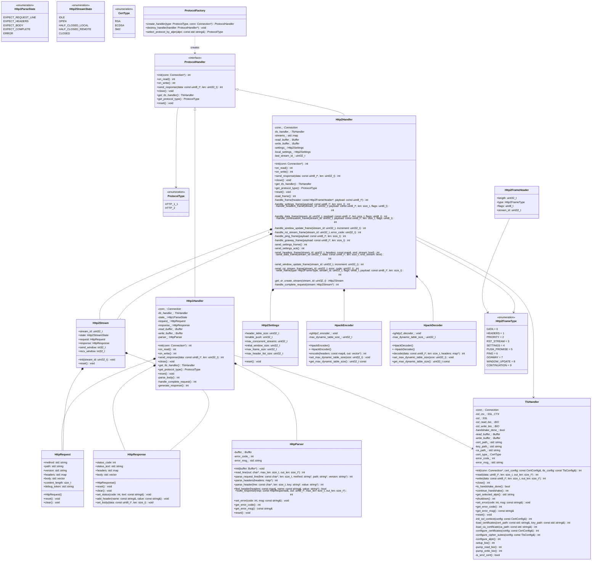
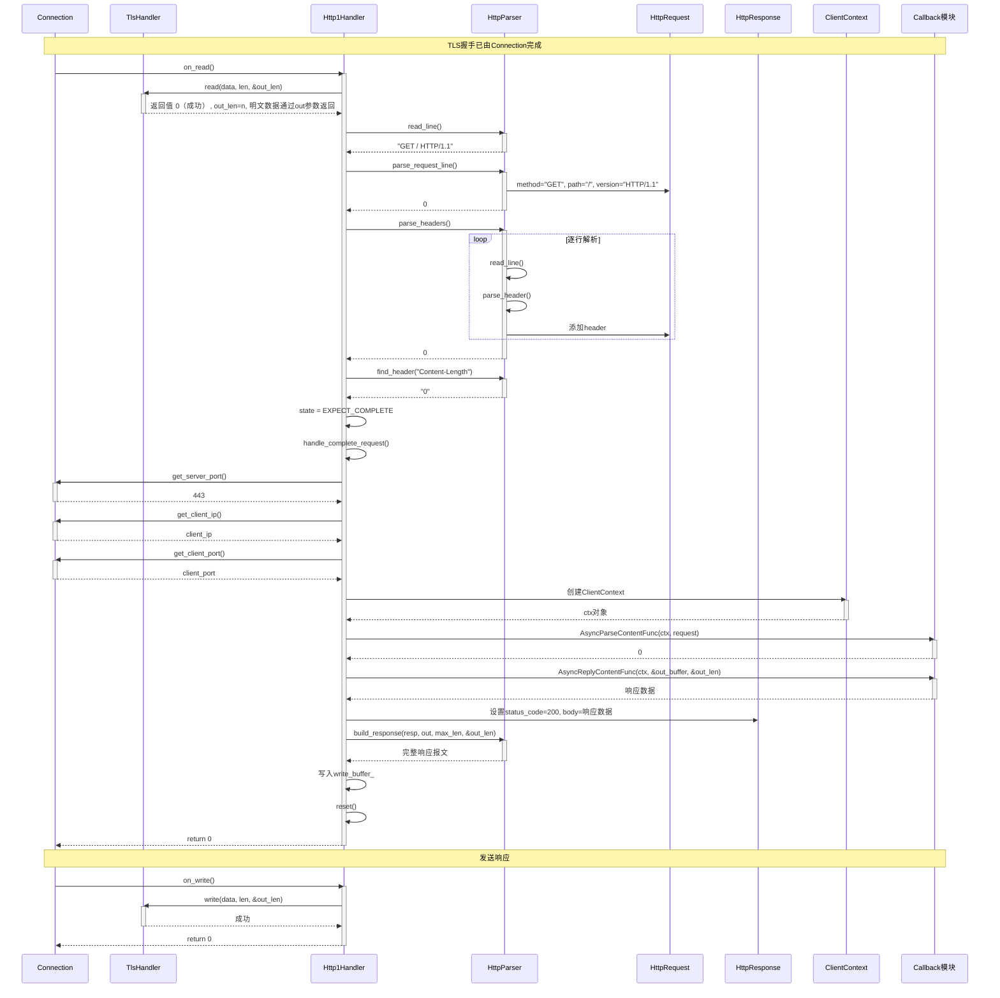
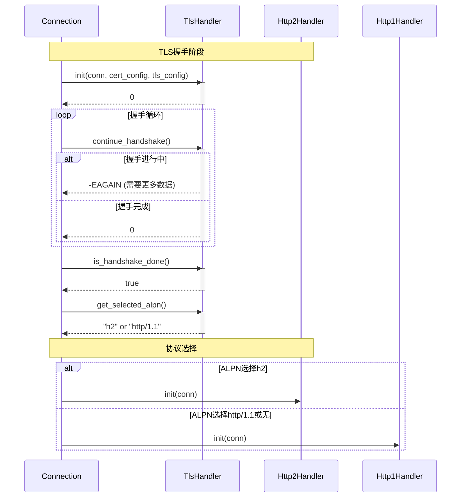
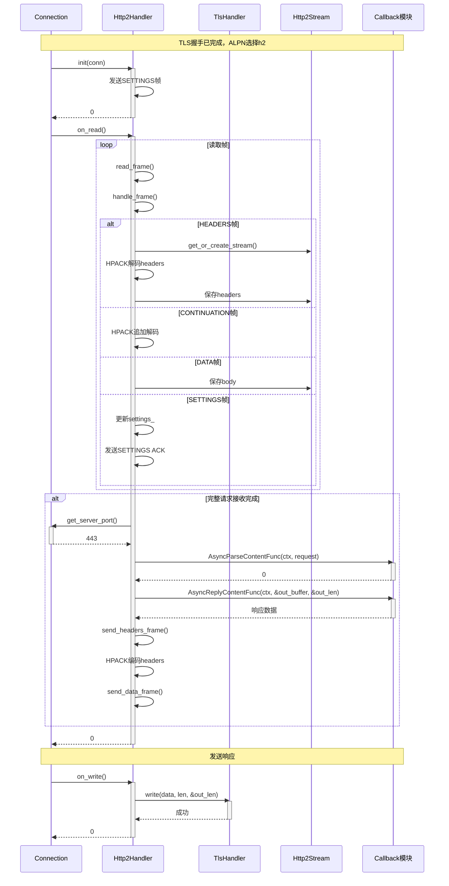
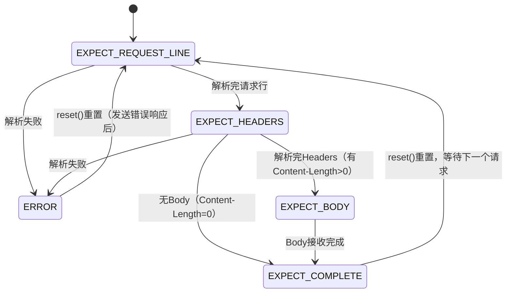
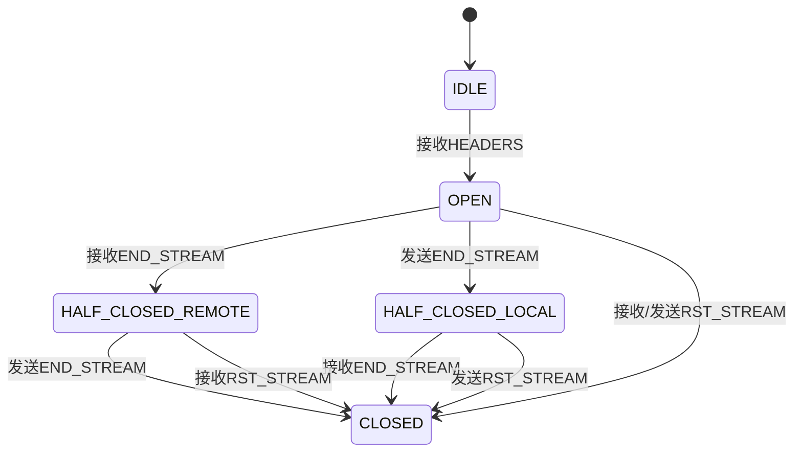

# HTTPS Server 模拟器 - Protocol 模块详细设计文档 (LLD)

**版本**: v5
**创建日期**: 2026-02-16
**修改日期**: 2026-02-17
**状态**: 已修改（根据第2版检视意见）

---

## 目录

1. [模块基本信息](#1-模块基本信息)
2. [设计概述](#2-设计概述)
3. [详细设计内容](#3-详细设计内容)
4. [开发落地指南](#4-开发落地指南)
5. [单元测试用例](#5-单元测试用例)
6. [设计验证](#6-设计验证)
7. [备注](#7-备注)

---

## 1. 模块基本信息

### 1.1 模块标识

| 属性 | 值 |
|-----|-----|
| 模块名称 | Protocol |
| 模块唯一标识 | Module_Protocol |
| 核心类型 | 数据处理类 + 接口适配类 |
| 模块路径 | codes/core/source/protocol/ |
| 头文件路径 | codes/core/include/protocol/ |

### 1.2 模块职责

#### 1.2.1 核心职责（来自架构设计文档）

- **HTTP/1.1协议解析与生成**: 解析HTTP/1.1请求报文，生成HTTP/1.1响应报文
- **HTTP/2协议解析与生成**: 解析HTTP/2帧，生成HTTP/2帧，支持多路复用
- **证书与Cipher Suites管理**: 加载证书/私钥，配置TLS加密套件
- **国密SM2证书支持**: 支持国密SM2/SM3/SM4算法套件

#### 1.2.2 核心定位

Protocol模块是HTTPS协议栈的核心实现模块，专注于协议解析与生成。TLS握手和连接生命周期由Connection模块负责，Protocol通过TlsHandler提供TLS数据加解密能力。

### 1.3 职责边界

| 该做什么 | 不该做什么 |
|---------|-----------|
| HTTP/1.1请求解析 | TCP连接管理（由Connection模块负责） |
| HTTP/1.1响应生成 | TLS握手状态机（由Connection模块负责） |
| HTTP/2帧处理 | 连接生命周期管理（由Connection模块负责） |
| TLS数据加解密（通过TlsHandler） | 网络IO读写（由Connection/IO线程负责） |
| 证书与Cipher配置 | 回调业务逻辑（由Callback模块负责） |
| 国密算法支持 | 事件调度（由MsgCenter模块负责） |
| | 调测功能（由DebugChain模块负责） |
| | 日志记录（由Utils模块负责） |

### 1.4 关联需求

| 需求ID | 需求描述 | 需求类型 |
|-------|---------|---------|
| REQ_PROTO_001 | 支持TLS 1.2/1.3协议（通过TlsHandler） | 功能性 |
| REQ_PROTO_002 | 支持HTTP/1.1协议解析与生成 | 功能性 |
| REQ_PROTO_003 | 支持HTTP/2协议解析与生成 | 功能性 |
| REQ_PROTO_004 | 支持国密SM2证书与SM2/SM3/SM4算法套件 | 功能性 |
| REQ_PROTO_005 | 支持证书与Cipher Suites配置 | 功能性 |
| REQ_PROTO_006 | 支持ALPN协议协商（HTTP/1.1与HTTP/2切换） | 功能性 |

### 1.5 依赖关系

| 依赖方向 | 模块名称 | 依赖用途 | 调用方式 |
|---------|---------|---------|---------|
| **Protocol依赖** | Utils | 日志、Buffer、配置 | 头文件包含 |
| **Protocol依赖** | OpenSSL（通过TlsHandler防腐层） | TLS算法实现 | 防腐层封装 |
| **被依赖** | Connection | 协议处理入口 | 头文件包含 |

### 1.5.1 对Connection模块的接口依赖

Protocol模块依赖Connection模块提供以下接口：

| 接口名 | 用途 | 说明 |
|-------|------|------|
| `Connection::get_server_port()` | 获取服务器端口 | 构建ClientContext时使用，用于填充server_port字段 |
| `Connection::get_client_ip()` | 获取客户端IP | 构建ClientContext时使用 |
| `Connection::get_client_port()` | 获取客户端端口 | 构建ClientContext时使用 |
| `Connection::get_read_buffer()` | 获取读缓冲区 | 用于读取接收到的数据 |
| `Connection::get_write_buffer()` | 获取写缓冲区 | 用于写入待发送的数据 |

**接口调用方式说明**: Http1Handler/Http2Handler通过内部保存的conn_指针直接调用Connection提供的接口方法。

### 1.6 设计信息

| 属性 | 值 |
|-----|-----|
| 设计负责人 | 模块设计师Agent |
| 设计日期 | 2026-02-16 |

---

## 2. 设计概述

### 2.1 设计目标

基于架构约束，完成Protocol模块内部细化设计，覆盖全部关联需求，支撑开发直接编码、单元测试落地。具体目标：

1. 实现TlsHandler防腐层，隔离OpenSSL依赖，仅提供数据加解密能力
2. 实现HTTP/1.1、HTTP/2双协议支持，通过ALPN自动切换
3. 实现国密SM2证书与算法套件支持
4. 提供统一的ProtocolHandler接口供Connection模块调用
5. 纯功能驱动，不关注安全性，严格避免过度设计
6. **明确职责划分**：Connection负责TLS握手和连接生命周期，Protocol专注于协议解析

### 2.2 TLS握手与协议解析的职责划分

| 职责 | 所属模块 | 说明 |
|-----|---------|------|
| TLS握手状态机 | Connection | Connection管理握手状态，驱动TLS握手流程 |
| TLS握手执行 | TlsHandler | 提供`continue_handshake()`方法供Connection调用 |
| TLS握手完成判断 | TlsHandler | 提供`is_handshake_done()`方法供Connection查询 |
| ALPN协议获取 | TlsHandler | 提供`get_selected_alpn()`方法供Connection查询 |
| TLS数据加解密 | TlsHandler | 提供`read()`/`write()`方法进行明文/密文转换 |
| HTTP协议解析 | Protocol | Http1Handler/Http2Handler负责解析HTTP请求 |
| HTTP响应生成 | Protocol | Http1Handler/Http2Handler负责生成HTTP响应 |
| 连接生命周期 | Connection | 管理连接建立、关闭、错误处理等 |

**关键设计原则**：
- Protocol模块**不维护**TLS握手状态
- Http1Handler/Http2Handler的`on_read()`方法**假设**TLS握手已完成
- Connection模块在TLS握手完成前，直接调用TlsHandler的握手相关方法
- TLS握手完成后，Connection才调用ProtocolHandler的协议解析方法

### 2.3 遵循约束

#### 2.3.1 架构约束

- 内部模块通过头文件关联
- 外部依赖（OpenSSL）需搭建防腐层（TlsHandler）
- 严格遵循架构定义的接口标准
- 不涉及跨模块联调、其他模块设计
- Connection负责TLS握手和连接生命周期，Protocol仅负责协议解析

#### 2.3.2 需求约束

- 仅实现需求明确要求的功能
- 支持TLS 1.2/1.3、HTTP/1.1、HTTP/2
- 支持国密SM2证书

#### 2.3.3 设计原则约束

- 纯功能驱动，不关注安全性
- 严格避免过度设计
- 高内聚、低耦合（模块内部）

### 2.4 核心设计思路

1. **模块类型判定**: 数据处理类 + 接口适配类混合类型
2. **分层设计**:
   - 底层：TlsHandler防腐层（封装OpenSSL，证书管理内聚在此，提供加解密能力）
   - 中间层：协议处理器抽象（ProtocolHandler接口）
   - 上层：具体协议实现（Http1Handler、Http2Handler）
3. **协议协商**: 通过ALPN在TLS握手阶段确定使用HTTP/1.1还是HTTP/2，Connection通过ProtocolFactory创建具体Handler
4. **设计优先级**:
   - 优先级1：TlsHandler防腐层（加解密、证书管理）
   - 优先级2：HTTP/1.1协议解析与生成
   - 优先级3：HTTP/2协议解析与生成（含HPACK）
   - 优先级4：国密SM2证书支持

### 2.5 设计范围

本次设计范围仅限Protocol模块内部，不涉及：
- Connection模块、MsgCenter模块等其他模块的内部设计
- 跨模块联调流程
- 版本迭代、接口升降级
- 可靠性冗余设计

---

## 3. 详细设计内容

### 3.1 内部结构设计

#### 3.1.1 子组件划分

Protocol模块按功能划分为以下子组件：

| 子组件名称 | 包含类 | 核心职责 |
|-----------|-------|---------|
| 协议抽象子组件 | ProtocolHandler（接口）、ProtocolType | 定义协议处理器统一接口 |
| HTTP/1.1子组件 | Http1Handler、Http1ParseState、HttpRequest、HttpResponse、HttpParser | HTTP/1.1协议解析与生成 |
| HTTP/2子组件 | Http2Handler、Http2Stream、Http2StreamState、Http2FrameHeader、Http2Settings、HpackEncoder、HpackDecoder | HTTP/2协议解析与生成（含HPACK、CONTINUATION帧） |
| TLS防腐子组件 | TlsHandler、CertType | 封装OpenSSL，提供TLS加解密能力，证书管理内聚在此 |
| 协议工厂子组件 | ProtocolFactory | 创建具体协议处理器 |

#### 3.1.2 类设计详解

##### 3.1.2.1 ProtocolHandler 接口类

**核心职责**: 定义协议处理器的统一接口，供Connection模块调用

**前置类型说明**:
- Connection类型来自Connection模块，需前置声明或包含"connection/connection.hpp"
- Buffer类型来自Utils模块，需包含"utils/buffer.hpp"
- 本模块中使用class Connection;进行前置声明

**属性**: 无（接口类）

**方法**:

| 方法名 | 参数 | 返回值 | 核心逻辑 | 访问权限 |
|-------|------|-------|---------|---------|
| init | conn: Connection*, cert_config: const CertConfig&, tls_config: const TlsConfig& | int | 初始化协议处理器，绑定Connection对象，传递证书和TLS配置 | public |
| on_read | 无 | int | 处理读事件，解析协议数据（假设TLS已握手完成） | public |
| on_write | 无 | int | 处理写事件，发送协议数据 | public |
| send_response | data: const uint8_t*, len: uint32_t | int | 发送响应数据 | public |
| close | 无 | void | 关闭协议处理器，清理资源 | public |
| get_tls_handler | 无 | TlsHandler* | 获取TLS处理器指针 | public |
| get_protocol_type | 无 | ProtocolType | 获取协议类型（HTTP_1_1或HTTP_2） | public |

##### 3.1.2.2 HttpParser 类

**核心职责**: HTTP/1.1协议解析工具类，提供行读取、头部解析等功能

**属性**:

| 属性名 | 类型 | 默认值 | 用途 | 访问权限 |
|-------|------|-------|------|---------|
| buffer_ | Buffer* | nullptr | 输入缓冲区指针 | private |
| error_code_ | int | 0 | 解析错误码 | private |
| error_msg_ | std::string | "" | 错误信息 | private |

**方法**:

| 方法名 | 参数 | 返回值 | 核心逻辑 | 访问权限 |
|-------|------|-------|---------|---------|
| init | buffer: Buffer* | void | 绑定缓冲区 | public |
| read_line | out: char*, max_len: size_t, out_len: size_t* | int | 从buffer读取一行（以\\r\\n结尾） | public |
| parse_request_line | line: const char*, len: size_t, method: string*, path: string*, version: string* | int | 解析请求行 | public |
| parse_headers | headers: map<string,string>* | int | 解析所有头部直到空行 | public |
| parse_header | line: const char*, len: size_t, key: string*, value: string* | int | 解析单条头部行 | public |
| find_header | headers: const map<string,string>&, name: const string&, value: string* | bool | 查找指定头部（大小写不敏感） | public |
| build_response | resp: const HttpResponse&, out: uint8_t*, max_len: size_t, out_len: size_t* | int | 构建HTTP响应报文 | public |
| set_error | code: int, msg: const string& | void | 设置错误信息 | public |
| get_error_code | 无 | int | 获取错误码 | public |
| get_error_msg | 无 | const string& | 获取错误信息 | public |
| reset | 无 | void | 重置解析器状态 | public |

##### 3.1.2.3 Http1Handler 类

**核心职责**: HTTP/1.1协议的具体实现

**属性**:

| 属性名 | 类型 | 默认值 | 用途 | 访问权限 |
|-------|------|-------|------|---------|
| conn_ | Connection* | nullptr | 关联的Connection对象 | private |
| tls_handler_ | TlsHandler* | nullptr | TLS处理器 | private |
| state_ | Http1ParseState | EXPECT_REQUEST_LINE | 解析状态机状态 | private |
| request_ | HttpRequest | - | 当前请求对象 | private |
| response_ | HttpResponse | - | 当前响应对象 | private |
| read_buffer_ | Buffer* | nullptr | 读缓冲区指针（来自Connection，存密文） | private |
| write_buffer_ | Buffer* | nullptr | 写缓冲区指针（来自Connection，存密文） | private |
| plaintext_buffer_ | Buffer* | nullptr | 内部明文缓冲区（存储解密后的HTTP数据） | private |
| parser_ | HttpParser | - | HTTP解析器 | private |

**方法**:

| 方法名 | 参数 | 返回值 | 核心逻辑 | 访问权限 |
|-------|------|-------|---------|---------|
| init | conn: Connection*, cert_config: const CertConfig&, tls_config: const TlsConfig& | int | 1. 保存conn指针<br>2. 创建TlsHandler<br>3. 调用tls_handler_->init(conn, cert_config, tls_config)<br>4. 获取Buffer指针<br>5. 初始化状态机<br>6. 初始化parser_ | public |
| on_read | 无 | int | 1. 调用TlsHandler.read()读取明文<br>2. 根据state_解析数据<br>3. 处理完整请求 | public |
| on_write | 无 | int | 1. 调用TlsHandler.write()发送write_buffer_中的数据 | public |
| send_response | data: const uint8_t*, len: uint32_t | int | 1. 构建HttpResponse<br>2. generate_response()<br>3. 写入write_buffer_ | public |
| close | 无 | void | 1. 调用TlsHandler.close()<br>2. 重置request_、response_ | public |
| get_tls_handler | 无 | TlsHandler* | 返回tls_handler_ | public |
| get_protocol_type | 无 | ProtocolType | 返回ProtocolType::HTTP_1_1 | public |
| parse_body | 无 | int | 1. 根据Content-Length读取body<br>2. 保存到request_.body | private |
| handle_complete_request | 无 | int | 1. 提取request_.debug_token<br>2. 构建ClientContext（调用conn_->get_server_port()等）<br>3. 调用Callback模块回调函数 | private |
| generate_response | 无 | int | 1. 使用parser_.build_response()构建响应<br>2. 写入write_buffer_ | private |
| reset | 无 | void | 重置状态机、request_、response_ | public |

##### 3.1.2.4 HttpRequest 类

**核心职责**: 存储HTTP请求数据

**属性**:

| 属性名 | 类型 | 默认值 | 用途 | 访问权限 |
|-------|------|-------|------|---------|
| method | std::string | "" | HTTP方法（GET、POST等） | public |
| path | std::string | "" | 请求路径 | public |
| version | std::string | "HTTP/1.1" | HTTP版本 | public |
| headers | std::map<std::string, std::string> | {} | 请求头集合 | public |
| body | std::vector<uint8_t> | {} | 请求体 | public |
| content_length | size_t | 0 | Content-Length值 | public |
| debug_token | std::string | "" | Debug-Token值 | public |

**方法**:

| 方法名 | 参数 | 返回值 | 核心逻辑 | 访问权限 |
|-------|------|-------|---------|---------|
| HttpRequest | 无 | - | 默认构造函数，初始化所有属性 | public |
| reset | 无 | void | 重置所有属性为默认值 | public |
| clear | 无 | void | 清空请求数据（同reset） | public |

##### 3.1.2.5 HttpResponse 类

**核心职责**: 存储HTTP响应数据

**属性**:

| 属性名 | 类型 | 默认值 | 用途 | 访问权限 |
|-------|------|-------|------|---------|
| status_code | int | 200 | HTTP状态码 | public |
| status_text | std::string | "OK" | 状态文本 | public |
| headers | std::map<std::string, std::string> | {} | 响应头集合 | public |
| body | std::vector<uint8_t> | {} | 响应体 | public |

**方法**:

| 方法名 | 参数 | 返回值 | 核心逻辑 | 访问权限 |
|-------|------|-------|---------|---------|
| HttpResponse | 无 | - | 默认构造函数，初始化所有属性 | public |
| reset | 无 | void | 重置所有属性为默认值 | public |
| clear | 无 | void | 清空响应数据（同reset） | public |
| set_status | code: int, text: const string& | void | 设置状态码和状态文本 | public |
| add_header | name: const string&, value: const string& | void | 添加响应头 | public |
| set_body | data: const uint8_t*, len: size_t | void | 设置响应体 | public |

##### 3.1.2.6 Http2Handler 类

**核心职责**: HTTP/2协议的具体实现

**属性**:

| 属性名 | 类型 | 默认值 | 用途 | 访问权限 |
|-------|------|-------|------|---------|
| conn_ | Connection* | nullptr | 关联的Connection对象 | private |
| tls_handler_ | TlsHandler* | nullptr | TLS处理器 | private |
| streams_ | std::map<uint32_t, Http2Stream*> | {} | 流集合，key为stream_id（按stream_id有序） | private |
| read_buffer_ | Buffer* | nullptr | 读缓冲区指针 | private |
| write_buffer_ | Buffer* | nullptr | 写缓冲区指针 | private |
| settings_ | Http2Settings | - | 对端SETTINGS | private |
| local_settings_ | Http2Settings | - | 本地SETTINGS | private |
| last_stream_id_ | uint32_t | 0 | 最后处理的stream_id | private |
| hpack_encoder_ | HpackEncoder* | nullptr | HPACK编码器 | private |
| hpack_decoder_ | HpackDecoder* | nullptr | HPACK解码器 | private |

**方法**:

| 方法名 | 参数 | 返回值 | 核心逻辑 | 访问权限 |
|-------|------|-------|---------|---------|
| init | conn: Connection*, cert_config: const CertConfig&, tls_config: const TlsConfig& | int | 1. 保存conn指针<br>2. 创建TlsHandler<br>3. 调用tls_handler_->init(conn, cert_config, tls_config)<br>4. 初始化settings<br>5. 准备发送SETTINGS帧 | public |
| on_read | 无 | int | 1. 读取解密数据<br>2. 循环read_frame()并处理 | public |
| on_write | 无 | int | 1. 调用TlsHandler.write()发送数据 | public |
| send_response | data: const uint8_t*, len: uint32_t | int | 1. 在stream 1上发送响应<br>2. 先发送HEADERS帧<br>3. 再发送DATA帧（分片处理大报文） | public |
| close | 无 | void | 1. 发送GOAWAY帧<br>2. 关闭所有streams<br>3. 调用TlsHandler.close() | public |
| get_tls_handler | 无 | TlsHandler* | 返回tls_handler_ | public |
| get_protocol_type | 无 | ProtocolType | 返回ProtocolType::HTTP_2 | public |
| reset | 无 | void | 重置所有状态和streams | public |
| read_frame | 无 | int | 1. 读取9字节帧头<br>2. 解析Http2FrameHeader<br>3. 读取payload<br>4. 调用handle_frame() | private |
| handle_frame | header: const Http2FrameHeader*, payload: const uint8_t* | int | 1. 根据frame.type分发到各处理函数 | private |
| handle_settings_frame | payload: const uint8_t*, len: size_t | int | 1. 解析各SETTINGS参数<br>2. 更新settings_<br>3. 若未ACK，发送SETTINGS ACK | private |
| handle_headers_frame | stream_id: uint32_t, payload: const uint8_t*, len: size_t, flags: uint8_t | int | 1. HPACK解析headers<br>2. 保存到对应stream的request_<br>3. 检查END_HEADERS/END_STREAM标志 | private |
| handle_data_frame | stream_id: uint32_t, payload: const uint8_t*, len: size_t, flags: uint8_t | int | 1. 保存到对应stream的request_.body<br>2. 检查END_STREAM标志 | private |
| handle_continuation_frame | stream_id: uint32_t, payload: const uint8_t*, len: size_t, flags: uint8_t | int | 1. HPACK追加解码headers<br>2. 检查END_HEADERS标志 | private |
| handle_window_update_frame | stream_id: uint32_t, increment: uint32_t | int | 1. 更新对应stream的send_window<br>2. 或更新连接级send_window | private |
| handle_rst_stream_frame | stream_id: uint32_t, error_code: uint32_t | int | 1. 设置对应stream的state为CLOSED<br>2. 清理stream资源 | private |
| handle_ping_frame | payload: const uint8_t*, len: size_t | int | 1. 若不是ACK，发送PING ACK（相同payload） | private |
| handle_goaway_frame | payload: const uint8_t*, len: size_t | int | 1. 解析last_stream_id、error_code<br>2. 停止接受新stream | private |
| send_settings_frame | 无 | int | 1. 构建SETTINGS帧<br>2. 写入write_buffer_ | private |
| send_settings_ack | 无 | int | 1. 构建SETTINGS ACK帧<br>2. 写入write_buffer_ | private |
| send_headers_frame | stream_id: uint32_t, headers: const map<string,string>&, end_stream: bool | int | 1. HPACK压缩headers<br>2. 构建HEADERS帧（如需要，分割为CONTINUATION帧）<br>3. 写入write_buffer_ | private |
| send_data_frame | stream_id: uint32_t, data: const uint8_t*, len: size_t, end_stream: bool | int | 1. 按max_frame_size分片<br>2. 构建DATA帧<br>3. 写入write_buffer_ | private |
| send_window_update_frame | stream_id: uint32_t, increment: uint32_t | int | 1. 构建WINDOW_UPDATE帧<br>2. 写入write_buffer_ | private |
| send_rst_stream_frame | stream_id: uint32_t, error_code: uint32_t | int | 1. 构建RST_STREAM帧<br>2. 写入write_buffer_ | private |
| write_frame | type: Http2FrameType, stream_id: uint32_t, flags: uint8_t, payload: const uint8_t*, len: size_t | int | 1. 构建帧头<br>2. 写入write_buffer_ | private |
| get_or_create_stream | stream_id: uint32_t | Http2Stream* | 1. 查找streams_<br>2. 若不存在，创建新stream<br>3. 返回指针 | private |
| handle_complete_request | stream: Http2Stream* | int | 1. 提取debug_token<br>2. 构建ClientContext<br>3. 调用Callback模块回调函数 | private |

##### 3.1.2.7 Http2Stream 类

**核心职责**: 存储HTTP/2流的状态与数据

**属性**:

| 属性名 | 类型 | 默认值 | 用途 | 访问权限 |
|-------|------|-------|------|---------|
| stream_id | uint32_t | 0 | 流ID | public |
| state | Http2StreamState | IDLE | 流状态 | public |
| request | HttpRequest | - | 该流的请求 | public |
| response | HttpResponse | - | 该流的响应 | public |
| send_window | int32_t | 65535 | 发送窗口大小 | public |
| recv_window | int32_t | 65535 | 接收窗口大小 | public |

**方法**:

| 方法名 | 参数 | 返回值 | 核心逻辑 | 访问权限 |
|-------|------|-------|---------|---------|
| init | stream_id: uint32_t | void | 1. 设置stream_id<br>2. 初始化state为IDLE<br>3. 重置request、response | public |
| reset | 无 | void | 1. 重置所有属性为默认值 | public |

##### 3.1.2.8 HpackEncoder 类

**核心职责**: HPACK头部编码器，使用nghttp2库实现

**属性**:

| 属性名 | 类型 | 默认值 | 用途 | 访问权限 |
|-------|------|-------|------|---------|
| nghttp2_encoder_ | void* | nullptr | nghttp2编码器上下文 | private |
| max_dynamic_table_size_ | uint32_t | 4096 | 动态表最大大小 | private |

**方法**:

| 方法名 | 参数 | 返回值 | 核心逻辑 | 访问权限 |
|-------|------|-------|---------|---------|
| HpackEncoder | 无 | - | 构造函数，初始化nghttp2编码器 | public |
| ~HpackEncoder | 无 | - | 析构函数，释放nghttp2资源 | public |
| encode | headers: const map<string,string>&, out: vector<uint8_t>* | int | 使用nghttp2编码头部 | public |
| set_max_dynamic_table_size | size: uint32_t | void | 设置动态表最大大小 | public |
| get_max_dynamic_table_size | 无 | uint32_t | 获取当前动态表最大大小 | public |

##### 3.1.2.9 HpackDecoder 类

**核心职责**: HPACK头部解码器，使用nghttp2库实现

**属性**:

| 属性名 | 类型 | 默认值 | 用途 | 访问权限 |
|-------|------|-------|------|---------|
| nghttp2_decoder_ | void* | nullptr | nghttp2解码器上下文 | private |
| max_dynamic_table_size_ | uint32_t | 4096 | 动态表最大大小 | private |

**方法**:

| 方法名 | 参数 | 返回值 | 核心逻辑 | 访问权限 |
|-------|------|-------|---------|---------|
| HpackDecoder | 无 | - | 构造函数，初始化nghttp2解码器 | public |
| ~HpackDecoder | 无 | - | 析构函数，释放nghttp2资源 | public |
| decode | data: const uint8_t*, len: size_t, headers: map<string,string>* | int | 使用nghttp2解码头部 | public |
| set_max_dynamic_table_size | size: uint32_t | void | 设置动态表最大大小 | public |
| get_max_dynamic_table_size | 无 | uint32_t | 获取当前动态表最大大小 | public |

##### 3.1.2.10 TlsHandler 类（防腐层，含证书管理）

**核心职责**: 封装OpenSSL，隔离外部依赖，内聚证书管理功能，提供TLS数据加解密能力

**注意**: TLS握手状态机由Connection模块管理，本类仅提供握手执行方法

**属性**:

| 属性名 | 类型 | 默认值 | 用途 | 访问权限 |
|-------|------|-------|------|---------|
| conn_ | Connection* | nullptr | 关联的Connection对象（来自Connection模块） | private |
| ssl_ctx_ | SSL_CTX* | nullptr | SSL上下文 | private |
| ssl_ | SSL* | nullptr | SSL对象 | private |
| handshake_done_ | bool | false | TLS握手是否完成 | private |
| read_buffer_ | Buffer* | nullptr | 读缓冲区指针 | private |
| write_buffer_ | Buffer* | nullptr | 写缓冲区指针 | private |
| cert_path_ | std::string | "" | 证书文件路径 | private |
| key_path_ | std::string | "" | 私钥文件路径 | private |
| ca_path_ | std::string | "" | CA证书文件路径 | private |
| cert_type_ | CertType | RSA | 证书类型 | private |
| ssl_read_bio_ | BIO* | nullptr | SSL读内存BIO | private |
| ssl_write_bio_ | BIO* | nullptr | SSL写内存BIO | private |
| error_code_ | int | 0 | 错误码 | private |
| error_msg_ | std::string | "" | 错误信息 | private |

**方法**:

| 方法名 | 参数 | 返回值 | 核心逻辑 | 访问权限 |
|-------|------|-------|---------|---------|
| init | conn: Connection*, cert_config: const CertConfig&, tls_config: const TlsConfig& | int | 1. 保存conn指针<br>2. 保存cert_config和tls_config<br>3. 调用load_certificates(cert_config)<br>4. 调用init_ssl_context(cert_config)<br>5. 调用configure_certificates(cert_config)<br>6. 调用configure_cipher_suites(tls_config)<br>7. 调用configure_alpn()<br>8. SSL_new()创建ssl_<br>9. setup_bio() | public |
| read | data: uint8_t*, len: size_t, out_len: size_t* | int | 1. 调用SSL_read()<br>2. 处理WANT_READ/WANT_WRITE<br>3. 输出读取长度 | public |
| write | data: const uint8_t*, len: size_t, out_len: size_t* | int | 1. 调用SSL_write()<br>2. 处理WANT_READ/WANT_WRITE<br>3. 输出写入长度 | public |
| close | 无 | int | 1. 调用SSL_shutdown()<br>2. 释放ssl_、ssl_ctx_ | public |
| is_handshake_done | 无 | bool | 返回handshake_done_ | public |
| continue_handshake | 无 | int | 1. 调用SSL_do_handshake()<br>2. 若成功，设置handshake_done_=true<br>3. 获取ALPN协商结果 | public |
| get_selected_alpn | 无 | std::string | 返回SSL_get0_alpn_selected()的结果 | public |
| shutdown | 无 | int | 调用SSL_shutdown() | public |
| set_error | code: int, msg: const string& | void | 设置错误信息 | public |
| get_error_code | 无 | int | 获取错误码 | public |
| get_error_msg | 无 | const string& | 获取错误信息 | public |
| reset | 无 | void | 重置TLS状态（用于连接复用） | public |
| init_ssl_context | config: const CertConfig& | int | 1. SSL_CTX_new(TLS_server_method())<br>2. 设置SSL_CTX选项 | private |
| load_certificates | config: const CertConfig& | int | 1. 保存路径<br>2. 解析证书类型<br>3. 设置cert_type_ | private |
| load_ca_certificate | ca_path: const std::string& | int | 1. 保存CA路径 | private |
| configure_certificates | config: const CertConfig& | int | 1. SSL_CTX_use_certificate_chain_file()<br>2. SSL_CTX_use_PrivateKey_file() | private |
| configure_cipher_suites | config: const TlsConfig& | int | 1. 若启用国密，配置SM2/SM3/SM4套件<br>2. 否则配置常规TLS套件<br>3. SSL_CTX_set_cipher_list() | private |
| configure_alpn | 无 | int | 1. 设置ALPN协议列表: "h2,http/1.1"<br>2. SSL_CTX_set_alpn_select_cb() | private |
| setup_bio | 无 | int | 1. 创建内存BIO对<br>2. SSL_set_bio() | private |
| pump_read_bio | 无 | int | 从read_buffer_读取数据写入ssl_read_bio_ | private |
| pump_write_bio | 无 | int | 从ssl_write_bio_读取数据写入write_buffer_ | private |
| is_sm2_cert | 无 | bool | 返回cert_type_ == SM2 | private |

##### 3.1.2.11 ProtocolFactory 类

**核心职责**: 创建具体的协议处理器

**属性**: 无

**方法**:

| 方法名 | 参数 | 返回值 | 核心逻辑 | 访问权限 |
|-------|------|-------|---------|---------|
| create_handler | type: ProtocolType, conn: Connection* | ProtocolHandler* | 1. 若type==HTTP_1_1，new Http1Handler<br>2. 若type==HTTP_2，new Http2Handler<br>3. 返回指针 | public |
| destroy_handler | handler: ProtocolHandler* | void | 1. delete handler | public |
| select_protocol_by_alpn | alpn: const std::string& | ProtocolType | 1. 若alpn=="h2"，返回HTTP_2<br>2. 否则返回HTTP_1_1 | public |

#### 3.1.3 类关系总结

| 关系类型 | 源类 | 目标类 | 说明 |
|---------|------|-------|------|
| 继承 | Http1Handler | ProtocolHandler | HTTP/1.1实现协议接口 |
| 继承 | Http2Handler | ProtocolHandler | HTTP/2实现协议接口 |
| 关联 | Http1Handler | TlsHandler | Http1Handler持有TlsHandler指针（非拥有） |
| 关联 | Http2Handler | TlsHandler | Http2Handler持有TlsHandler指针（非拥有） |
| 组合 | Http1Handler | HttpRequest | Http1Handler包含HttpRequest对象 |
| 组合 | Http1Handler | HttpResponse | Http1Handler包含HttpResponse对象 |
| 组合 | Http1Handler | HttpParser | Http1Handler包含HttpParser对象 |
| 组合 | Http2Handler | Http2Stream | Http2Handler包含多个Http2Stream |
| 组合 | Http2Stream | HttpRequest | Http2Stream包含HttpRequest对象 |
| 组合 | Http2Stream | HttpResponse | Http2Stream包含HttpResponse对象 |
| 创建 | ProtocolFactory | ProtocolHandler | ProtocolFactory创建ProtocolHandler实例 |

### 3.2 核心逻辑设计

#### 3.2.1 HttpParser::read_line 完整实现

**功能点**: 从Buffer中读取一行（以\\r\\n结尾）

**常量说明**:
- MAX_HEADER_LINE_LEN: 最大头部行长度，取值为8192（详见4.3.1节常量定义）

**伪代码**:

```cpp
int HttpParser::read_line(char* out, size_t max_len, size_t* out_len) {
    if (!buffer_) {
        set_error(-1, "Buffer not initialized");
        return -1;
    }

    size_t readable = buffer_->readable_bytes();
    if (readable == 0) {
        *out_len = 0;
        return -EAGAIN;
    }

    // 查找 "\r\n"
    const uint8_t* data = buffer_->peek();
    size_t pos = 0;
    bool found = false;

    for (pos = 0; pos < readable - 1; ++pos) {
        if (data[pos] == '\r' && data[pos + 1] == '\n') {
            found = true;
            break;
        }
    }

    if (!found) {
        *out_len = 0;
        return -EAGAIN;
    }

    // 检查输出缓冲区大小
    if (pos >= max_len) {
        set_error(-2, "Line too long");
        return -2;
    }

    // 复制数据（不包含\r\n）
    if (pos > 0) {
        memcpy(out, data, pos);
    }
    out[pos] = '\0';
    *out_len = pos;

    // 消耗缓冲区数据（包含\r\n）
    buffer_->skip(pos + 2);

    return 0;
}
```

#### 3.2.2 HttpParser::parse_headers 完整实现

**功能点**: 解析所有HTTP头部直到遇到空行

**伪代码**:

```cpp
int HttpParser::parse_headers(std::map<std::string, std::string>* headers) {
    if (!buffer_) {
        set_error(-1, "Buffer not initialized");
        return -1;
    }

    headers->clear();
    char line[MAX_HEADER_LINE_LEN];
    size_t line_len = 0;
    int header_count = 0;

    while (true) {
        int ret = read_line(line, sizeof(line), &line_len);
        if (ret != 0) {
            return ret;
        }

        // 空行表示头部结束
        if (line_len == 0) {
            break;
        }

        // 检查头部数量限制
        if (header_count >= MAX_HEADERS) {
            set_error(-3, "Too many headers");
            return -3;
        }

        std::string key, value;
        ret = parse_header(line, line_len, &key, &value);
        if (ret != 0) {
            return ret;
        }

        (*headers)[key] = value;
        header_count++;
    }

    return 0;
}
```

#### 3.2.3 HttpParser::parse_header 完整实现

**功能点**: 解析单条HTTP头部行

**伪代码**:

```cpp
int HttpParser::parse_header(const char* line, size_t len,
                              std::string* key, std::string* value) {
    // 查找冒号分隔符
    const char* colon = nullptr;
    for (size_t i = 0; i < len; ++i) {
        if (line[i] == ':') {
            colon = line + i;
            break;
        }
    }

    if (!colon) {
        set_error(-2, "Invalid header format");
        return -2;
    }

    // 提取key（冒号之前，trim whitespace）
    const char* key_start = line;
    const char* key_end = colon;
    while (key_end > key_start && (*(key_end - 1) == ' ' || *(key_end - 1) == '\t')) {
        key_end--;
    }

    if (key_end - key_start == 0) {
        set_error(-2, "Empty header name");
        return -2;
    }

    if ((size_t)(key_end - key_start) > MAX_HEADER_NAME_LEN) {
        set_error(-2, "Header name too long");
        return -2;
    }

    *key = std::string(key_start, key_end - key_start);

    // 提取value（冒号之后，trim whitespace）
    const char* value_start = colon + 1;
    const char* value_end = line + len;
    while (value_start < value_end && (*value_start == ' ' || *value_start == '\t')) {
        value_start++;
    }
    while (value_end > value_start && (*(value_end - 1) == ' ' || *(value_end - 1) == '\t')) {
        value_end--;
    }

    if ((size_t)(value_end - value_start) > MAX_HEADER_VALUE_LEN) {
        set_error(-2, "Header value too long");
        return -2;
    }

    *value = std::string(value_start, value_end - value_start);

    return 0;
}
```

#### 3.2.4 HttpParser::find_header 完整实现

**功能点**: 查找指定HTTP头部（大小写不敏感）

**伪代码**:

```cpp
bool HttpParser::find_header(const std::map<std::string, std::string>& headers,
                              const std::string& name,
                              std::string* value) {
    // 大小写不敏感比较
    for (const auto& pair : headers) {
        if (strcasecmp(pair.first.c_str(), name.c_str()) == 0) {
            if (value) {
                *value = pair.second;
            }
            return true;
        }
    }
    return false;
}
```

#### 3.2.5 HttpParser::build_response 完整实现

**功能点**: 构建完整的HTTP响应报文

**伪代码**:

```cpp
int HttpParser::build_response(const HttpResponse& resp,
                                uint8_t* out, size_t max_len,
                                size_t* out_len) {
    size_t offset = 0;

    // 1. 写入状态行
    std::string status_line = "HTTP/1.1 " + std::to_string(resp.status_code) +
                              " " + resp.status_text + "\r\n";
    if (offset + status_line.size() > max_len) {
        set_error(-1, "Buffer too small");
        return -1;
    }
    memcpy(out + offset, status_line.data(), status_line.size());
    offset += status_line.size();

    // 2. 写入Headers
    for (const auto& header : resp.headers) {
        std::string header_line = header.first + ": " + header.second + "\r\n";
        if (offset + header_line.size() > max_len) {
            set_error(-1, "Buffer too small");
            return -1;
        }
        memcpy(out + offset, header_line.data(), header_line.size());
        offset += header_line.size();
    }

    // 3. 如果没有Content-Length且有body，自动添加
    bool has_content_length = false;
    for (const auto& header : resp.headers) {
        if (strcasecmp(header.first.c_str(), "Content-Length") == 0) {
            has_content_length = true;
            break;
        }
    }
    if (!has_content_length && !resp.body.empty()) {
        std::string cl_header = "Content-Length: " + std::to_string(resp.body.size()) + "\r\n";
        if (offset + cl_header.size() > max_len) {
            set_error(-1, "Buffer too small");
            return -1;
        }
        memcpy(out + offset, cl_header.data(), cl_header.size());
        offset += cl_header.size();
    }

    // 4. 写入空行（头部结束）
    if (offset + 2 > max_len) {
        set_error(-1, "Buffer too small");
        return -1;
    }
    out[offset++] = '\r';
    out[offset++] = '\n';

    // 5. 写入Body
    if (!resp.body.empty()) {
        if (offset + resp.body.size() > max_len) {
            set_error(-1, "Buffer too small");
            return -1;
        }
        memcpy(out + offset, resp.body.data(), resp.body.size());
        offset += resp.body.size();
    }

    *out_len = offset;
    return 0;
}
```


#### 3.2.6 HttpParser::parse_request_line 完整实现

**功能点**: 解析HTTP请求行（格式: "METHOD PATH HTTP/1.1"）

**伪代码**:

```cpp
int HttpParser::parse_request_line(const char* line, size_t len,
                                    std::string* method,
                                    std::string* path,
                                    std::string* version) {
    // 清空输出
    method->clear();
    path->clear();
    version->clear();

    // 按空格拆分三部分
    // 第一部分: method
    size_t pos = 0;
    while (pos < len && line[pos] != ' ') {
        pos++;
    }
    if (pos == 0 || pos >= len) {
        set_error(-2, "Invalid request line format");
        return -2;
    }
    *method = std::string(line, pos);

    // 跳过中间空格
    while (pos < len && line[pos] == ' ') {
        pos++;
    }
    if (pos >= len) {
        set_error(-2, "Invalid request line format");
        return -2;
    }

    // 第二部分: path
    size_t path_start = pos;
    while (pos < len && line[pos] != ' ') {
        pos++;
    }
    if (pos == path_start || pos >= len) {
        set_error(-2, "Invalid request line format");
        return -2;
    }
    *path = std::string(line + path_start, pos - path_start);

    // 跳过中间空格
    while (pos < len && line[pos] == ' ') {
        pos++;
    }
    if (pos >= len) {
        set_error(-2, "Invalid request line format");
        return -2;
    }

    // 第三部分: version
    *version = std::string(line + pos, len - pos);

    // 校验HTTP版本（仅支持HTTP/1.1）
    if (*version != "HTTP/1.1") {
        set_error(-3, "HTTP version not supported");
        return -3;  // 返回-3表示505 HTTP Version Not Supported
    }

    return 0;
}
```

**错误码说明**:
- 返回 0: 解析成功
- 返回 -2: 请求行格式错误，返回 400 Bad Request
- 返回 -3: HTTP版本不支持，返回 505 HTTP Version Not Supported

#### 3.2.7 HTTP/1.1解析状态机逻辑


**功能点**: HTTP/1.1请求解析（假设TLS握手已完成）

**缓冲区管理说明**:
- **数据流向统一说明**:
  - Http1Handler::read_buffer_ 指向 Connection 的 Buffer（存储密文数据）
  - Http2Handler::read_buffer_ 指向 Connection 的 Buffer（存储密文数据）
  - **必须先通过 TlsHandler::read() 解密获取明文，再进行协议解析**
  - 解密后的明文数据存储在临时缓冲区中，用于HTTP协议解析
- 每次从 明文缓冲区 读取数据后，通过 skip() 消耗已处理的数据
- 具体 data 指针移动逻辑：
  - 使用 peek() 获取当前读指针（data 指针），不移动指针
  - 解析数据后，调用 skip(n) 移动读指针，消耗已处理的 n 字节数据
  - 未处理的数据（如不完整的行）保留在缓冲区中，peek() 指针保持不变，等待下次 on_read() 调用
- state_ 记录当前解析状态，确保跨调用的连续性

**伪代码**:

```
function Http1Handler::on_read():
    // 注意：TLS握手应由Connection模块处理
    // 本方法假设TLS握手已完成
    //
    // 数据流向说明（统一）：
    // 1. Connection的read_buffer_中存储的是密文数据
    // 2. **必须先调用TlsHandler::read()解密获取明文**
    //    - pump_read_bio(): 从Connection的read_buffer_（密文）读取 -> 写入SSL read BIO
    //    - SSL_read(): 从SSL读取明文数据
    //    - pump_write_bio(): 从SSL write BIO读取 -> 写入Connection的write_buffer_（密文）
    // 3. 解密后的明文数据用于HTTP协议解析
    // 4. write_buffer_用于存储待发送的密文数据

    // 步骤1: 先调用TlsHandler::read()解密，获取明文到临时缓冲区
    // plaintext_buffer_ 是 Http1Handler 内部的临时 Buffer，用于存储解密后的明文
    uint8_t temp_buf[4096]
    size_t read_len = 0
    ret = tls_handler_->read(temp_buf, sizeof(temp_buf), &read_len)
    if ret == -EAGAIN:
        return 0  // 需要更多数据
    if ret < 0:
        state_ = ERROR
        // 解析错误，返回400
        response_.status_code = 400
        response_.status_text = "Bad Request"
        generate_response()
        return -1

    // 将解密后的明文追加到内部 plaintext_buffer_
    plaintext_buffer_->write(temp_buf, read_len)

    // 初始化parser_绑定到plaintext_buffer_（仅第一次需要）
    parser_.init(plaintext_buffer_)

    // 步骤2: 从plaintext_buffer_（明文）解析缓冲区中的数据
    while true:
        switch state_:
            case EXPECT_REQUEST_LINE:
                line = [buffer]
                line_len = 0
                ret = parser_.read_line(line, MAX_LINE_LEN, &line_len)
                if ret == -EAGAIN:
                    break  // 等待更多数据
                if ret < 0:
                    state_ = ERROR
                    break
                if parser_.parse_request_line(line, line_len,
                                              &request_.method,
                                              &request_.path,
                                              &request_.version) < 0:
                    state_ = ERROR
                    break
                state_ = EXPECT_HEADERS
                break

            case EXPECT_HEADERS:
                ret = parser_.parse_headers(&request_.headers)
                if ret == -EAGAIN:
                    break  // 等待更多数据
                if ret < 0:
                    state_ = ERROR
                    break

                // 检测 Transfer-Encoding: chunked，不支持则返回400
                std::string te_value;
                if parser_.find_header(request_.headers, "Transfer-Encoding", &te_value):
                    // 检查是否包含 "chunked"（大小写不敏感）
                    if te_value.find("chunked") != std::string::npos or
                       te_value.find("CHUNKED") != std::string::npos:
                        state_ = ERROR
                        break

                // 查找特殊头部
                std::string value;
                if parser_.find_header(request_.headers, "Debug-Token", &value):
                    request_.debug_token = value
                if parser_.find_header(request_.headers, "Content-Length", &value):
                    request_.content_length = strtoull(value.c_str(), nullptr, 10)
                else:
                    request_.content_length = 0

                if request_.content_length > 0:
                    state_ = EXPECT_BODY
                else:
                    state_ = EXPECT_COMPLETE
                break

            case EXPECT_BODY:
                remaining = request_.content_length - request_.body.size()
                // 从 plaintext_buffer_ 读取明文数据（已通过TlsHandler解密）
                readable = plaintext_buffer_->readable_bytes()
                to_read = min(readable, remaining)
                if to_read > 0:
                    data = plaintext_buffer_->peek()
                    request_.body.append(data, to_read)
                    plaintext_buffer_->skip(to_read)  // 消耗已读取的数据
                if request_.body.size() == request_.content_length:
                    state_ = EXPECT_COMPLETE
                else:
                    break  // 等待更多数据
                break

            case EXPECT_COMPLETE:
                handle_complete_request()
                reset()  // 重置状态机，等待下一个请求
                break

            case ERROR:
                // 解析错误，返回400
                response_.status_code = 400
                response_.status_text = "Bad Request"
                generate_response()
                return -1

    return 0
```

#### 3.2.7 HTTP/2帧处理逻辑

**功能点**: HTTP/2帧读取与分发，含HPACK和CONTINUATION帧处理

**HPACK实现策略**: 推荐使用nghttp2库的HPACK部分，提供简化的封装接口

**HPACK接口设计**:

```cpp
// HPACK编码器接口
class HpackEncoder {
public:
    HpackEncoder();
    ~HpackEncoder();

    // 编码头部，返回编码后的二进制数据
    int encode(const std::map<std::string, std::string>& headers,
               std::vector<uint8_t>* out);

    // 设置动态表大小
    void set_max_dynamic_table_size(uint32_t size);

    // 获取当前动态表大小
    uint32_t get_max_dynamic_table_size() const;

private:
    void* nghttp2_encoder_;  // nghttp2编码器上下文
    uint32_t max_dynamic_table_size_;
};

// HPACK解码器接口
class HpackDecoder {
public:
    HpackDecoder();
    ~HpackDecoder();

    // 解码二进制数据，返回解析后的头部
    int decode(const uint8_t* data, size_t len,
               std::map<std::string, std::string>* headers);

    // 设置动态表大小
    void set_max_dynamic_table_size(uint32_t size);

    // 获取当前动态表大小
    uint32_t get_max_dynamic_table_size() const;

private:
    void* nghttp2_decoder_;  // nghttp2解码器上下文
    uint32_t max_dynamic_table_size_;
};

// 简化的编码/解码函数（无需创建对象）
int hpack_encode(const std::map<std::string, std::string>& headers,
                 std::vector<uint8_t>* out);
int hpack_decode(const uint8_t* data, size_t len,
                 std::map<std::string, std::string>* headers);
```

**HPACK编码伪代码**:

```
function hpack_encode(headers, out):
    // 使用nghttp2库进行编码
    // 初始化nghttp2_hd_deflater
    deflater = nghttp2_hd_deflate_new()
    if deflater == nullptr:
        return -1

    // 准备nghttp2_nv数组
    nv = []
    for each (key, value) in headers:
        nv.push_back(nghttp2_nv{key, value})

    // 估算输出缓冲区大小
    max_len = nghttp2_hd_deflate_bound(deflater, nv.size(), nv.data())
    out->resize(max_len)

    // 执行编码
    len = nghttp2_hd_deflate_deflate(deflater, out->data(), out->size(),
                                      nv.data(), nv.size())
    if len < 0:
        nghttp2_hd_deflate_del(deflater)
        return -1

    out->resize(len)
    nghttp2_hd_deflate_del(deflater)
    return 0
```

**HPACK解码伪代码**:

```
function hpack_decode(data, len, headers):
    // 使用nghttp2库进行解码
    // 初始化nghttp2_hd_inflater
    inflater = nghttp2_hd_inflate_new()
    if inflater == nullptr:
        return -1

    // 准备输出头部集合
    headers->clear()

    // 执行解码
    result = nghttp2_hd_inflate_hd(inflater,
        [](void* user_data, const nghttp2_nv* nv) -> int {
            // 回调函数：处理每个解码出的头部
            headers = static_cast<map<string,string>*>(user_data)
            key = string(nv->name, nv->namelen)
            value = string(nv->value, nv->valuelen)
            (*headers)[key] = value
            return 0
        },
        headers, data, len)

    if result != 0:
        nghttp2_hd_inflate_del(inflater)
        return -1

    nghttp2_hd_inflate_del(inflater)
    return 0
```

**伪代码**:

```
function Http2Handler::read_frame():
    // 读取9字节帧头
    if read_buffer_->readable_bytes() < 9:
        return -EAGAIN

    header_data = read_buffer_->peek(9)
    header = Http2FrameHeader()
    header.length = (header_data[0] << 16) | (header_data[1] << 8) | header_data[2]
    header.type = header_data[3]
    header.flags = header_data[4]
    header.stream_id = (header_data[5] << 24) | (header_data[6] << 16) |
                       (header_data[7] << 8) | header_data[8]
    header.stream_id &= 0x7FFFFFFF  // 清除保留位

    // 检查是否有足够的payload
    if read_buffer_->readable_bytes() < 9 + header.length:
        return -EAGAIN

    read_buffer_->skip(9)
    payload = read_buffer_->peek(header.length)
    handle_frame(&header, payload)
    read_buffer_->skip(header.length)

    return 0

function Http2Handler::handle_frame(header, payload):
    switch header.type:
        case FRAME_SETTINGS:
            handle_settings_frame(payload, header.length)
            break
        case FRAME_HEADERS:
            handle_headers_frame(header.stream_id, payload, header.length, header.flags)
            break
        case FRAME_DATA:
            handle_data_frame(header.stream_id, payload, header.length, header.flags)
            break
        case FRAME_CONTINUATION:
            handle_continuation_frame(header.stream_id, payload, header.length, header.flags)
            break
        case FRAME_WINDOW_UPDATE:
            increment = (payload[0] << 24) | (payload[1] << 16) |
                       (payload[2] << 8) | payload[3]
            increment &= 0x7FFFFFFF
            handle_window_update_frame(header.stream_id, increment)
            break
        case FRAME_RST_STREAM:
            error_code = (payload[0] << 24) | (payload[1] << 16) |
                        (payload[2] << 8) | payload[3]
            handle_rst_stream_frame(header.stream_id, error_code)
            break
        case FRAME_PING:
            handle_ping_frame(payload, header.length)
            break
        case FRAME_GOAWAY:
            handle_goaway_frame(payload, header.length)
            break

function Http2Handler::handle_headers_frame(stream_id, payload, len, flags):
    // 获取或创建流
    stream = get_or_create_stream(stream_id)
    if stream == nullptr:
        return -1

    // 更新流状态（从IDLE变为OPEN）
    if stream.state == IDLE:
        stream.state = OPEN

    // HPACK解码 - 使用nghttp2库
    headers = std::map<std::string, std::string>{}
    ret = hpack_decode(payload, len, &headers)
    if ret < 0:
        return -1

    // 合并headers到stream的request
    for (key, value) in headers:
        stream.request.headers[key] = value

    // 检查是否有END_HEADERS标志
    if !(flags & END_HEADERS):
        // 等待CONTINUATION帧，不处理完整请求
        return 0

    // 检查是否有END_STREAM标志
    if flags & END_STREAM:
        stream.state = HALF_CLOSED_REMOTE
        // 头部接收完成，处理完整请求
        return handle_complete_request(stream)

    return 0

function Http2Handler::handle_continuation_frame(stream_id, payload, len, flags):
    stream = get_stream(stream_id)
    if stream == nullptr:
        return -1

    // HPACK追加解码
    headers = hpack_decode(payload, len)
    stream.request.headers.merge(headers)

    if flags & END_HEADERS:
        // 头部块结束
        if stream.state == HALF_CLOSED_REMOTE:
            handle_complete_request(stream)

function Http2Handler::send_headers_frame(stream_id, headers, end_stream):
    // HPACK编码 - 使用nghttp2库
    payload = hpack_encode(headers)

    // 检查是否需要分割为CONTINUATION帧
    max_payload_size = local_settings_.max_frame_size
    if payload.size() <= max_payload_size:
        // 单帧
        flags = END_HEADERS
        if end_stream:
            flags |= END_STREAM
        write_frame(FRAME_HEADERS, stream_id, flags, payload.data(), payload.size())
    else:
        // 分割为HEADERS + CONTINUATION帧
        first_chunk = payload.substr(0, max_payload_size)
        write_frame(FRAME_HEADERS, stream_id, 0, first_chunk.data(), first_chunk.size())

        remaining = payload.substr(max_payload_size)
        while remaining.size() > max_payload_size:
            chunk = remaining.substr(0, max_payload_size)
            write_frame(FRAME_CONTINUATION, stream_id, 0, chunk.data(), chunk.size())
            remaining = remaining.substr(max_payload_size)

        // 最后一个CONTINUATION帧，带END_HEADERS
        flags = END_HEADERS
        if end_stream:
            flags |= END_STREAM
        write_frame(FRAME_CONTINUATION, stream_id, flags, remaining.data(), remaining.size())

function Http2Handler::write_frame(type, stream_id, flags, payload, len):
    // 构建帧头（9字节）
    frame_header = uint8_t[9]{}

    // Length (24 bits, big-endian)
    frame_header[0] = (len >> 16) & 0xFF
    frame_header[1] = (len >> 8) & 0xFF
    frame_header[2] = len & 0xFF

    // Type (8 bits)
    frame_header[3] = static_cast<uint8_t>(type)

    // Flags (8 bits)
    frame_header[4] = flags

    // Stream ID (31 bits, big-endian, clear reserved bit)
    frame_header[5] = (stream_id >> 24) & 0x7F
    frame_header[6] = (stream_id >> 16) & 0xFF
    frame_header[7] = (stream_id >> 8) & 0xFF
    frame_header[8] = stream_id & 0xFF

    // 写入帧头
    write_buffer_->write(frame_header, 9)

    // 写入payload（如果有）
    if len > 0 and payload != nullptr:
        write_buffer_->write(payload, len)

    return 0
```

#### 3.2.8 国密SM2支持逻辑

**功能点**: 配置国密SM2证书与算法套件

**伪代码**:

```
function TlsHandler::configure_cipher_suites(config):
    #ifdef USE_GMSSL
        if config.use_gmssl:
            // 配置国密套件
            // 使用SM2-WITH-SMS4-SM3
            SSL_CTX_set_cipher_list(ssl_ctx_, "SM2-WITH-SMS4-SM3")
            // 配置国密相关选项
            SSL_CTX_set_options(ssl_ctx_, SSL_OP_NO_TLSv1_3)  // 国密主要用TLS 1.2
        else:
            // 配置常规套件
            SSL_CTX_set_cipher_list(ssl_ctx_,
                "ECDHE-ECDSA-AES128-GCM-SHA256:"
                "ECDHE-RSA-AES128-GCM-SHA256:"
                "ECDHE-ECDSA-AES256-GCM-SHA384:"
                "ECDHE-RSA-AES256-GCM-SHA384")
    #else
        // 常规套件（无国密）
        SSL_CTX_set_cipher_list(ssl_ctx_,
            "ECDHE-ECDSA-AES128-GCM-SHA256:"
            "ECDHE-RSA-AES128-GCM-SHA256:"
            "ECDHE-ECDSA-AES256-GCM-SHA384:"
            "ECDHE-RSA-AES256-GCM-SHA384")
    #endif

function TlsHandler::load_certificates(cert_path, key_path):
    cert_path_ = cert_path
    key_path_ = key_path

    // 证书类型识别函数定义（read_certificate）
    // 输入：证书文件路径
    // 输出：证书类型（RSA/ECDSA/SM2）
    function read_certificate(cert_path):
        // 使用OpenSSL的PEM_read_X509读取证书文件
        x509 = PEM_read_X509(cert_path, nullptr, nullptr, nullptr)
        if x509 == nullptr:
            return CertType::RSA  // 默认返回RSA

        // 获取证书公钥
        pkey = X509_get_pubkey(x509)
        if pkey == nullptr:
            X509_free(x509)
            return CertType::RSA

        // 判断公钥类型
        key_type = EVP_PKEY_id(pkey)
        if key_type == EVP_PKEY_SM2:
            cert_type = CertType::SM2
        elif key_type == EVP_PKEY_EC:
            cert_type = CertType::ECDSA
        else:
            cert_type = CertType::RSA

        EVP_PKEY_free(pkey)
        X509_free(x509)
        return cert_type

    // 尝试解析证书类型 - 使用OpenSSL API
    // 注意：实际实现通过OpenSSL的SSL_CTX_use_certificate_chain_file()
    // 和SSL_CTX_use_PrivateKey_file()加载证书，证书类型由OpenSSL自动识别
    // 国密证书需要支持国密的OpenSSL版本（如GmSSL或tongsuo）

    // 调用证书类型识别（可选，用于记录）
    detected_type = read_certificate(cert_path_)
    cert_type_ = detected_type

    // 本模块不强制要求识别证书类型，仅记录即可
    // 证书加载的核心逻辑在configure_certificates()中

    return 0
```

#### 3.2.9 与Callback模块的交互逻辑

**功能点**: 通过Callback模块的接口触发回调

**交互说明**:
1. 构建ClientContext结构体，传递connection_id、client_ip、port、debug_token
2. 调用Connection::get_server_port()获取服务器端口
3. 调用AsyncParseContentFunc处理请求数据
4. 调用AsyncReplyContentFunc获取响应数据

### 3.3 Buffer 线程安全说明

#### 3.3.1 Buffer类的线程安全模型

Buffer类**不是**线程安全的，需要外部同步。Protocol模块对Buffer的使用遵循以下约定：

| 场景 | 线程安全保证 | 说明 |
|-----|-----------|------|
| 读缓冲区访问 | Connection模块保证 | 同一时间只有一个线程调用on_read() |
| 写缓冲区访问 | Connection模块保证 | 同一时间只有一个线程调用on_write() |
| Buffer所有权 | Connection拥有 | Buffer的创建和销毁由Connection管理 |
| 并发访问 | 禁止 | Protocol模块不会在多个线程同时访问Buffer |

#### 3.3.2 使用约束

1. **单线程访问**: Http1Handler/Http2Handler的on_read()和on_write()方法由Connection模块在同一个IO线程中调用，无需内部同步
2. **Buffer指针有效期**: Buffer指针在init()时获取，在close()前保持有效
3. **数据一致性**: 读取数据后必须立即消耗（skip），避免与后续读取冲突

### 3.4 图形化设计

#### 3.4.1 类图



**图名称**: 图1：Protocol模块内部类图

**说明**: 展示Protocol模块所有类的结构、属性、方法及类之间的关系，包括ProtocolHandler接口、Http1Handler、Http2Handler、HttpParser、TlsHandler等核心类，证书管理已内聚到TlsHandler中。

**类型来源说明**:
- Connection类型来自Connection模块，需包含"connection/connection.hpp"
- Buffer类型来自Utils模块，需包含"utils/buffer.hpp"
- HttpHeaders未定义单独类型，直接使用std::map<std::string, std::string>

#### 3.4.2 动态图

##### 完整HTTP/1.1请求解析+响应时序图



**图名称**: 图2：完整HTTP/1.1请求解析+响应时序图

**说明**: 展示从Connection调用on_read()开始，到完整解析HTTP请求、调用Callback模块、生成响应、通过on_write()发送的完整流程。

---

##### TLS握手时序图



**图名称**: 图3：TLS握手与协议选择时序图

**说明**: 展示Connection模块驱动TLS握手、选择协议的流程，TlsHandler作为防腐层提供握手执行能力。

---

##### HTTP/2请求处理时序图



**图名称**: 图4：HTTP/2请求处理时序图

**说明**: 展示HTTP/2帧处理、HPACK编解码、流管理、与Callback模块交互的完整流程。

#### 3.4.3 专项设计图

**图名称**: 图5：HTTP/1.1解析状态机状态图



**说明**: 展示Http1Handler的解析状态流转，包含错误处理状态。

---

**图名称**: 图6：HTTP/2流状态图



**说明**: 展示Http2Stream的状态流转（简化版，仅覆盖核心场景，服务器端不处理PUSH_PROMISE，仅作为HTTP/2服务器）。

---

**图名称**: 图7：Protocol模块数据流图（DFD）

```
┌──────────┐     ┌───────────┐     ┌────────────────┐     ┌──────────┐
│  网络IO  │────▶│ TlsHandler│────▶│ ProtocolHandler│────▶│ Callback  │
│  (密文)  │     │ (加解密)  │     │  (协议解析)    │     │  模块     │
└──────────┘     └───────────┘     └────────────────┘     └──────────┘
     ▲                  ▲                    ▲                    │
     │                  │                    │                    │
     │                  │                    │                    ▼
┌──────────┐     ┌───────────┐     ┌────────────────┐     ┌──────────┐
│  网络IO  │◀────│ TlsHandler│◀────│ ProtocolHandler│◀────│ Callback  │
│  (密文)  │     │ (加解密)  │     │  (协议生成)    │     │  模块     │
└──────────┘     └───────────┘     └────────────────┘     └──────────┘
```

**说明**: 展示数据在Protocol模块内部的流转路径：密文→TLS解密→明文→协议解析→回调处理→响应生成→TLS加密→密文。

---

## 4. 开发落地指南

### 4.1 术语与规范

#### 4.1.1 核心术语

| 术语 | 定义 |
|-----|------|
| TLS | Transport Layer Security，传输层安全协议 |
| ALPN | Application-Layer Protocol Negotiation，应用层协议协商 |
| HTTP/1.1 | 超文本传输协议1.1版本 |
| HTTP/2 | 超文本传输协议2版本，二进制分帧、多路复用 |
| Frame | HTTP/2帧，HTTP/2协议的最小传输单元 |
| Stream | HTTP/2流，HTTP/2连接中的双向数据流 |
| Cipher Suites | 加密套件，TLS握手时协商的加密算法组合 |
| HPACK | HTTP/2头部压缩算法 |
| CONTINUATION | HTTP/2延续帧，用于继续传输头部块 |
| SM2 | 国密椭圆曲线密码算法 |
| SM3 | 国密哈希算法 |
| SM4 | 国密分组密码算法 |
| nghttp2 | HTTP/2实现库，推荐用于HPACK |

#### 4.1.2 命名规范

| 类别 | 规范 | 示例 |
|-----|------|------|
| 类名 | 大驼峰命名（PascalCase） | Http1Handler、TlsHandler、HttpParser |
| 接口类名 | 大驼峰命名，以Handler结尾 | ProtocolHandler |
| 枚举名 | enum class | ProtocolType、Http1ParseState |
| 枚举值 | 全大写下划线分隔 | HTTP_1_1、EXPECT_REQUEST_LINE |
| 成员变量 | 小写下划线分隔，尾部下划线 | conn_、tls_handler_ |
| 成员函数 | 小写下划线分隔 | init()、on_read() |
| 常量 | 全大写下划线分隔 | HTTP2_FRAME_HEADER_SIZE、MAX_HEADERS |
| 文件名 | 小写下划线分隔 | http1_handler.hpp、tls_handler.cpp |

#### 4.1.3 编码规范

- 使用C++17标准
- 缩进4空格
- 每行不超过120字符
- 头文件使用#pragma once
- 命名空间: https_server_sim::protocol
- 不使用异常，使用返回值错误码（0成功，负数失败）
- 使用enum class代替enum
- 明确指针所有权语义
- 内部类/函数使用private/protected访问权限

### 4.2 核心逻辑说明

#### 4.2.1 TlsHandler 初始化流程

**配置来源说明**: CertConfig和TlsConfig数据来源于Utils模块的Config组件（与7.3节第4点保持一致）

**TlsHandler::init() 参数传递流程**:
1. Connection模块从Config组件获取 CertConfig 和 TlsConfig
2. Connection调用 ProtocolHandler::init(conn, cert_config, tls_config)
3. Http1Handler/Http2Handler::init() 接收 cert_config 和 tls_config
4. Http1Handler/Http2Handler::init() 调用 tls_handler_->init(conn, cert_config, tls_config)
5. TlsHandler::init() 使用这些配置初始化SSL上下文、加载证书、配置Cipher Suites

```
初始化步骤:
1. 接收CertConfig和TlsConfig作为参数
2. SSL_CTX_new() 创建SSL上下文
3. 调用load_certificates()加载证书并识别类型
4. 配置证书: SSL_CTX_use_certificate_chain_file()
5. 配置私钥: SSL_CTX_use_PrivateKey_file()
6. 配置Cipher Suites: SSL_CTX_set_cipher_list()
7. 配置ALPN: SSL_CTX_set_alpn_select_cb()
8. SSL_new() 创建SSL对象
9. 设置内存BIO: BIO_new_bio_pair() + SSL_set_bio()

注意事项:
- 所有OpenSSL调用均需检查返回值
- 内存BIO需要手动读写数据
- 错误码通过SSL_get_error()获取
- Connection模块负责TLS握手状态机
```

**内存BIO与Buffer的交互**:

内存BIO对(read BIO/write BIO)用于在SSL和Connection的Buffer之间传输数据。

**何时调用pump_read_bio()和pump_write_bio()**:
- 在调用 `continue_handshake()` 之前调用 `pump_read_bio()`
- 在调用 `continue_handshake()` 之后调用 `pump_write_bio()`
- 在调用 `read()` 之前调用 `pump_read_bio()`
- 在调用 `read()` 之后调用 `pump_write_bio()`
- 在调用 `write()` 之前调用 `pump_read_bio()`
- 在调用 `write()` 之后调用 `pump_write_bio()`

**BIO_CTRL_PENDING处理**:
- 使用 `BIO_ctrl_pending(ssl_write_bio_)` 检查SSL写BIO中待读取的数据量
- 循环读取直到 `BIO_ctrl_pending()` 返回0

**部分写入处理**:
- `BIO_write()` 可能返回部分写入的字节数（小于请求写入的长度）
- 需要循环写入直到所有数据都写入BIO或返回错误

```
交互流程:
1. 从网络接收的密文数据 → Connection的read_buffer_
2. TlsHandler::continue_handshake() / read()时:
   - 调用 pump_read_bio(): 从read_buffer_读取数据 → 写入SSL的read BIO
   - 调用SSL_do_handshake() / SSL_read()
   - 调用 pump_write_bio(): 从SSL的write BIO读取数据 → 写入Connection的write_buffer_
3. SSL需要发送数据时:
   - pump_write_bio() 负责将数据从SSL write BIO → Connection write_buffer_
4. Connection负责将write_buffer_中的数据发送到网络
```

**pump_read_bio() 完整伪代码**:

```cpp
int TlsHandler::pump_read_bio() {
    // 从Connection read_buffer_读取数据，写入SSL read BIO
    // 处理部分写入的情况
    if (!read_buffer_ || !ssl_read_bio_) {
        return -1;
    }

    size_t readable = read_buffer_->readable_bytes();
    if (readable == 0) {
        return 0;  // 没有数据需要读取
    }

    const uint8_t* data = read_buffer_->peek();
    size_t total_written = 0;

    while (total_written < readable) {
        // 尝试写入剩余数据
        int written = BIO_write(ssl_read_bio_,
                               data + total_written,
                               readable - total_written);
        if (written <= 0) {
            // BIO_WRITE返回0或负数表示错误或重试
            int err = SSL_get_error(ssl_, written);
            if (err != SSL_ERROR_WANT_WRITE && err != SSL_ERROR_WANT_READ) {
                // 真实错误
                set_error(-10, "BIO_write failed");
                return -1;
            }
            // WANT_READ/WANT_WRITE，退出循环，等待下次调用
            break;
        }
        total_written += written;
    }

    if (total_written > 0) {
        // 消耗已写入BIO的数据
        read_buffer_->skip(total_written);
    }

    return total_written;
}
```

**pump_write_bio() 完整伪代码**:

```cpp
int TlsHandler::pump_write_bio() {
    // 从SSL write BIO读取数据，写入Connection write_buffer_
    // 使用BIO_ctrl_pending检查待读取数据量
    if (!write_buffer_ || !ssl_write_bio_) {
        return -1;
    }

    size_t total_read = 0;
    uint8_t buf[4096];  // 临时缓冲区

    while (true) {
        // 检查SSL write BIO中有多少待读取的数据
        size_t pending = BIO_ctrl_pending(ssl_write_bio_);
        if (pending == 0) {
            break;  // 没有更多数据
        }

        // 读取数据（每次最多读取sizeof(buf)）
        int to_read = (sizeof(buf) < pending) ? sizeof(buf) : (int)pending;
        int read = BIO_read(ssl_write_bio_, buf, to_read);
        if (read <= 0) {
            // BIO_read返回0或负数表示错误或重试
            int err = SSL_get_error(ssl_, read);
            if (err != SSL_ERROR_WANT_WRITE && err != SSL_ERROR_WANT_READ) {
                // 真实错误
                set_error(-10, "BIO_read failed");
                return -1;
            }
            // WANT_READ/WANT_WRITE，退出循环
            break;
        }

        // 将读取的数据写入Connection的write_buffer_
        if (write_buffer_->write(buf, read) != read) {
            set_error(-4, "Write buffer full");
            return -1;
        }

        total_read += read;
    }

    return total_read;
}
```

**continue_handshake() 完整伪代码（含pump调用）**:

```cpp
int TlsHandler::continue_handshake() {
    if (!ssl_) {
        set_error(-1, "SSL not initialized");
        return -1;
    }

    // 步骤1: 从Connection read_buffer_读取密文 -> SSL read BIO
    int ret = pump_read_bio();
    if (ret < 0) {
        return ret;
    }

    // 步骤2: 执行握手
    ret = SSL_do_handshake(ssl_);
    if (ret != 1) {
        int err = SSL_get_error(ssl_, ret);
        if (err == SSL_ERROR_WANT_READ || err == SSL_ERROR_WANT_WRITE) {
            // 握手进行中，需要更多数据
            // 步骤3: 将SSL write BIO中的数据 -> Connection write_buffer_
            pump_write_bio();
            return -EAGAIN;
        } else {
            // 真实错误
            set_error(-10, "SSL_do_handshake failed");
            return -1;
        }
    }

    // 握手成功
    handshake_done_ = true;

    // 步骤3: 将SSL write BIO中的数据 -> Connection write_buffer_
    pump_write_bio();

    return 0;
}
```

**read() 完整伪代码（含pump调用）**:

```cpp
int TlsHandler::read(uint8_t* data, size_t len, size_t* out_len) {
    if (!ssl_ || !handshake_done_) {
        set_error(-1, "SSL not initialized or handshake not done");
        return -1;
    }

    if (out_len == nullptr) {
        set_error(-2, "out_len is null");
        return -1;
    }

    *out_len = 0;

    // 步骤1: 从Connection read_buffer_读取密文 -> SSL read BIO
    int ret = pump_read_bio();
    if (ret < 0) {
        return ret;
    }

    // 步骤2: 从SSL读取明文
    ret = SSL_read(ssl_, data, len);
    if (ret <= 0) {
        int err = SSL_get_error(ssl_, ret);
        if (err == SSL_ERROR_WANT_READ || err == SSL_ERROR_WANT_WRITE) {
            // 需要更多数据
            // 步骤3: 将SSL write BIO中的数据 -> Connection write_buffer_
            pump_write_bio();
            return -EAGAIN;
        } else {
            // 真实错误
            set_error(-10, "SSL_read failed");
            return -1;
        }
    }

    *out_len = ret;

    // 步骤3: 将SSL write BIO中的数据 -> Connection write_buffer_
    pump_write_bio();

    return 0;
}
```

**write() 完整伪代码（含pump调用）**:

```cpp
int TlsHandler::write(const uint8_t* data, size_t len, size_t* out_len) {
    if (!ssl_ || !handshake_done_) {
        set_error(-1, "SSL not initialized or handshake not done");
        return -1;
    }

    if (out_len == nullptr) {
        set_error(-2, "out_len is null");
        return -1;
    }

    *out_len = 0;

    // 步骤1: 从Connection read_buffer_读取密文 -> SSL read BIO
    // (SSL_write可能需要读取数据)
    int ret = pump_read_bio();
    if (ret < 0) {
        return ret;
    }

    // 步骤2: 写入明文到SSL
    ret = SSL_write(ssl_, data, len);
    if (ret <= 0) {
        int err = SSL_get_error(ssl_, ret);
        if (err == SSL_ERROR_WANT_READ || err == SSL_ERROR_WANT_WRITE) {
            // 需要更多数据或等待写入
            // 步骤3: 将SSL write BIO中的数据 -> Connection write_buffer_
            pump_write_bio();
            return -EAGAIN;
        } else {
            // 真实错误
            set_error(-10, "SSL_write failed");
            return -1;
        }
    }

    *out_len = ret;

    // 步骤3: 将SSL write BIO中的数据 -> Connection write_buffer_
    pump_write_bio();

    return 0;
}
```

#### 4.2.2 HTTP/1.1 请求行解析

```
请求行格式: "METHOD PATH HTTP/1.1\r\n"

解析逻辑:
1. 按空格拆分三部分
2. 第一部分: method（GET、POST等）
3. 第二部分: path（/index.html等）
4. 第三部分: version（HTTP/1.1）

错误处理:
- 若不是三部分，返回400 Bad Request
- 若version不是HTTP/1.1，返回505 HTTP Version Not Supported
```

#### 4.2.3 HTTP/2 帧头解析

```
HTTP/2帧头格式 (9字节):
+-----------------------------------------------+
|                 Length (24)                   |
+---------------+---------------+---------------+
|   Type (8)    |   Flags (8)   |
+-+-------------+---------------+-----------------------+
|R|                 Stream Identifier (31)             |
+=+=====================================================+

解析逻辑:
1. 读取9字节
2. Length: 前3字节，uint24，最大16384
3. Type: 第4字节
4. Flags: 第5字节
5. Stream ID: 后4字节，最高位保留（必须为0）

注意事项:
- Length不能超过16384（可通过SETTINGS_MAX_FRAME_SIZE修改）
- Stream ID不能为0（部分帧除外）
- 客户端发起的Stream ID为奇数，服务端为偶数
```

#### 4.2.4 HPACK 实现策略

```
推荐方案: 使用nghttp2库的HPACK部分

接口封装示例:
- hpack_encode(headers): 将std::map<std::string, std::string>编码为二进制
- hpack_decode(payload, len): 将二进制解码为std::map<std::string, std::string>

最小实现要求（如不使用nghttp2）:
- 支持静态表（Static Table）
- 支持字面量头部（Literal Header Field）
- 可选支持动态表（Dynamic Table）
```

#### 4.2.5 与Callback模块交互

**结构体与回调来源说明**:
1. ClientContext结构体来自Callback模块
2. AsyncParseContentFunc/AsyncReplyContentFunc通过CallbackRegistry获取回调函数指针

```
交互步骤:
1. 构建ClientContext结构体
   - connection_id: 连接ID
   - client_ip: 客户端IP（来自Connection）
   - client_port: 客户端端口（来自Connection）
   - server_port: 服务器端口（调用conn_->get_server_port()）
   - token: Debug-Token值
2. 调用AsyncParseContentFunc(ctx, request_data, request_len)
3. 调用AsyncReplyContentFunc(ctx, out_buffer, &out_len)
4. 使用返回的out_buffer构建HTTP响应
```

### 4.3 数据结构定义

#### 4.3.1 常量定义

```cpp
namespace https_server_sim {
namespace protocol {

// HTTP解析相关常量
constexpr size_t MAX_LINE_LEN = 8192;              // 最大行长度
constexpr size_t MAX_HEADER_LINE_LEN = 8192;        // 最大头部行长度
constexpr size_t MAX_HEADERS = 100;                  // 最大头部数量
constexpr size_t MAX_HEADER_NAME_LEN = 256;          // 最大头部名称长度
constexpr size_t MAX_HEADER_VALUE_LEN = 4096;        // 最大头部值长度
constexpr size_t MAX_BODY_SIZE = 64 * 1024 * 1024;  // 最大Body大小（64MB）

// HTTP/2相关常量
constexpr size_t HTTP2_FRAME_HEADER_SIZE = 9;
constexpr uint32_t HTTP2_DEFAULT_MAX_FRAME_SIZE = 16384;
constexpr uint32_t HTTP2_DEFAULT_INITIAL_WINDOW_SIZE = 65535;

// 错误码定义
constexpr int PROTOCOL_OK = 0;
constexpr int PROTOCOL_ERROR_EAGAIN = -EAGAIN;
constexpr int PROTOCOL_ERROR_INVALID = -1;
constexpr int PROTOCOL_ERROR_TOO_LONG = -2;
constexpr int PROTOCOL_ERROR_TOO_MANY = -3;
constexpr int PROTOCOL_ERROR_BUFFER = -4;
constexpr int PROTOCOL_ERROR_TLS = -10;

} // namespace protocol
} // namespace https_server_sim
```

#### 4.3.2 ClientContext 结构体

**说明**: ClientContext结构体来自Callback模块，需包含 "callback/client_context.h"，本模块不重复定义。

#### 4.3.3 CertConfig 结构体

```cpp
namespace https_server_sim {
namespace protocol {

// 证书配置
struct CertConfig {
    std::string cert_path;        // 证书文件路径
    std::string key_path;         // 私钥文件路径
    std::string ca_path;          // CA证书文件路径（可选）
    bool use_gmssl;               // 是否使用国密
};

} // namespace protocol
} // namespace https_server_sim
```

#### 4.3.4 TlsConfig 结构体

```cpp
namespace https_server_sim {
namespace protocol {

// TLS配置
struct TlsConfig {
    std::string cipher_suites;    // 加密套件列表（可选，使用默认则为空）
    std::string alpn_protocols;   // ALPN协议列表（默认: "h2,http/1.1"）
    bool enable_tls_1_3;          // 是否启用TLS 1.3
    bool enable_tls_1_2;          // 是否启用TLS 1.2
};

} // namespace protocol
} // namespace https_server_sim
```

#### 4.3.5 HttpHeaders 类型定义

```cpp
namespace https_server_sim {
namespace protocol {

// HTTP头部集合，使用std::map实现
using HttpHeaders = std::map<std::string, std::string>;

} // namespace protocol
} // namespace https_server_sim
```

#### 4.3.6 ProtocolType 枚举

```cpp
namespace https_server_sim {
namespace protocol {

enum class ProtocolType {
    UNKNOWN = 2,
    HTTP_1_1 = 0,
    HTTP_2 = 1
};

} // namespace protocol
} // namespace https_server_sim
```

#### 4.3.7 ParseResult 枚举

```cpp
namespace https_server_sim {
namespace protocol {

enum class ParseResult {
    OK = 0,
    NEED_MORE = 1,
    ERROR = 2
};

} // namespace protocol
} // namespace https_server_sim
```

#### 4.3.8 Http1ParseState 枚举

```cpp
namespace https_server_sim {
namespace protocol {

enum class Http1ParseState {
    EXPECT_REQUEST_LINE = 0,
    EXPECT_HEADERS = 1,
    EXPECT_BODY = 2,
    EXPECT_COMPLETE = 3,
    ERROR = 4
};

} // namespace protocol
} // namespace https_server_sim
```

#### 4.3.9 Http2StreamState 枚举

```cpp
namespace https_server_sim {
namespace protocol {

enum class Http2StreamState {
    IDLE = 0,
    OPEN = 1,
    HALF_CLOSED_LOCAL = 2,
    HALF_CLOSED_REMOTE = 3,
    CLOSED = 4
};

} // namespace protocol
} // namespace https_server_sim
```

#### 4.3.10 Http2FrameType 枚举

```cpp
namespace https_server_sim {
namespace protocol {

enum class Http2FrameType : uint8_t {
    DATA = 0x0,
    HEADERS = 0x1,
    PRIORITY = 0x2,
    RST_STREAM = 0x3,
    SETTINGS = 0x4,
    PUSH_PROMISE = 0x5,
    PING = 0x6,
    GOAWAY = 0x7,
    WINDOW_UPDATE = 0x8,
    CONTINUATION = 0x9
};

} // namespace protocol
} // namespace https_server_sim
```

#### 4.3.11 Http2FrameHeader 结构体

```cpp
namespace https_server_sim {
namespace protocol {

struct Http2FrameHeader {
    uint32_t length;      // 24 bits
    Http2FrameType type;  // 8 bits
    uint8_t flags;        // 8 bits
    uint32_t stream_id;   // 31 bits

    static constexpr size_t SIZE = 9;
};

} // namespace protocol
} // namespace https_server_sim
```

#### 4.3.12 Http2Settings 结构体

```cpp
namespace https_server_sim {
namespace protocol {

struct Http2Settings {
    uint32_t header_table_size;       // SETTINGS_HEADER_TABLE_SIZE
    uint32_t enable_push;             // SETTINGS_ENABLE_PUSH
    uint32_t max_concurrent_streams;  // SETTINGS_MAX_CONCURRENT_STREAMS
    uint32_t initial_window_size;     // SETTINGS_INITIAL_WINDOW_SIZE
    uint32_t max_frame_size;          // SETTINGS_MAX_FRAME_SIZE
    uint32_t max_header_list_size;    // SETTINGS_MAX_HEADER_LIST_SIZE

    void reset() {
        header_table_size = 4096;
        enable_push = 0;  // 禁用服务器推送
        max_concurrent_streams = 100;
        initial_window_size = 65535;
        max_frame_size = 16384;
        max_header_list_size = 0xFFFFFFFF;  // unlimited
    }

    Http2Settings() {
        reset();
    }
};

} // namespace protocol
} // namespace https_server_sim
```

#### 4.3.13 CertType 枚举

```cpp
namespace https_server_sim {
namespace protocol {

enum class CertType {
    RSA = 0,
    ECDSA = 1,
    SM2 = 2
};

} // namespace protocol
} // namespace https_server_sim
```

### 4.4 可扩展性实现指南

#### 4.4.1 添加新协议

**步骤1**: 继承ProtocolHandler接口

```cpp
// codes/core/include/protocol/new_protocol_handler.hpp
#pragma once
#include "protocol/protocol_handler.hpp"

namespace https_server_sim {
namespace protocol {

class NewProtocolHandler : public ProtocolHandler {
public:
    NewProtocolHandler();
    ~NewProtocolHandler() override;

    int init(Connection* conn, const CertConfig& cert_config, const TlsConfig& tls_config) override;
    int on_read() override;
    int on_write() override;
    int send_response(const uint8_t* data, uint32_t len) override;
    void close() override;
    TlsHandler* get_tls_handler() override;
    ProtocolType get_protocol_type() override;
    void reset() override;

private:
    // 私有实现
};

} // namespace protocol
} // namespace https_server_sim
```

**步骤2**: 在ProtocolFactory中添加创建逻辑

```cpp
// codes/core/include/protocol/protocol_factory.hpp
#include "protocol/protocol_factory.hpp"
#include "protocol/new_protocol_handler.hpp"

namespace https_server_sim {
namespace protocol {

ProtocolHandler* ProtocolFactory::create_handler(ProtocolType type, Connection* conn) {
    switch (type) {
        case ProtocolType::HTTP_1_1:
            return new Http1Handler();
        case ProtocolType::HTTP_2:
            return new Http2Handler();
        // 添加新协议类型
        case ProtocolType::NEW_PROTOCOL:
            return new NewProtocolHandler();
        default:
            return nullptr;
    }
}

} // namespace protocol
} // namespace https_server_sim
```

**步骤3**: 在ProtocolType枚举中添加新协议类型

```cpp
enum class ProtocolType {
    HTTP_1_1 = 0,
    HTTP_2 = 1,
    NEW_PROTOCOL = 2  // 添加新协议
};
```

**步骤4**: 在select_protocol_by_alpn中添加ALPN映射（如需要）

```cpp
ProtocolType ProtocolFactory::select_protocol_by_alpn(const std::string& alpn) {
    if (alpn == "h2") {
        return ProtocolType::HTTP_2;
    } else if (alpn == "http/1.1") {
        return ProtocolType::HTTP_1_1;
    } else if (alpn == "new-proto") {  // 添加新协议的ALPN
        return ProtocolType::NEW_PROTOCOL;
    }
    return ProtocolType::HTTP_1_1;  // 默认回退
}
```

---

## 5. 单元测试用例

### 5.1 测试侧重点

- **数据处理类重点**: 数据校验、格式转换、协议解析
- **HttpParser重点**: read_line、parse_headers、build_response、find_header的完整实现
- **TlsHandler重点**: 防腐层接口正确性、TLS加解密功能（不包括握手状态机）
- **Http1Handler重点**: HTTP/1.1请求解析、响应生成、状态机流转
- **Http2Handler重点**: HTTP/2帧处理、流状态管理、HPACK、CONTINUATION帧、大报文

### 5.2 测试用例表

| 用例ID | 测试模块 | 关联需求点 | 关联类/方法 | 测试场景 | 输入参数 | 预期输出 | 测试步骤 | 备注 |
|-------|---------|-----------|------------|---------|---------|---------|---------|------|
| Protocol_TC001 | Protocol | REQ_PROTO_001 | TlsHandler::init() | 正常初始化TlsHandler | 有效的证书路径、私钥路径 | 返回0，ssl_ctx_、ssl_非空 | 1. 创建TlsHandler对象<br>2. 调用init()<br>3. 检查返回值 | 使用测试证书 |
| Protocol_TC002 | Protocol | REQ_PROTO_001 | TlsHandler::is_handshake_done() | 初始状态 | 无 | 返回false | 1. init()后<br>2. 调用is_handshake_done()<br>3. 检查返回值 | - |
| Protocol_TC003 | Protocol | REQ_PROTO_002 | HttpParser::read_line() | 读取完整行 | "GET / HTTP/1.1\\r\\n" | 返回0，out_len=14 | 1. 写入数据到buffer<br>2. 调用read_line()<br>3. 检查输出 | - |
| Protocol_TC004 | Protocol | REQ_PROTO_002 | HttpParser::read_line() | 行数据不完整（无\\r\\n） | "GET / HTTP/1.1" | 返回-EAGAIN | 1. 写入不完整数据<br>2. 调用read_line()<br>3. 检查返回值 | 边界场景 |
| Protocol_TC005 | Protocol | REQ_PROTO_002 | HttpParser::read_line() | 空行 | "\\r\\n" | 返回0，out_len=0 | 1. 写入\\r\\n<br>2. 调用read_line()<br>3. 检查输出 | 边界场景 |
| Protocol_TC006 | Protocol | REQ_PROTO_002 | HttpParser::read_line() | 超长行 | >MAX_LINE_LEN字符 | 返回错误 | 1. 写入超长数据<br>2. 调用read_line()<br>3. 检查返回值 | 边界场景 |
| Protocol_TC007 | Protocol | REQ_PROTO_002 | HttpParser::parse_header() | 解析合法Header | "Host: example.com\\r\\n" | 返回0，key="Host", value="example.com" | 1. 调用parse_header()<br>2. 检查输出 | - |
| Protocol_TC008 | Protocol | REQ_PROTO_002 | HttpParser::parse_header() | Header带前后空格 | "  Host  :   example.com   \\r\\n" | 返回0，key="Host", value="example.com" | 1. 调用parse_header()<br>2. 检查输出 | 边界场景 |
| Protocol_TC009 | Protocol | REQ_PROTO_002 | HttpParser::parse_header() | 无冒号的非法Header | "InvalidHeader" | 返回-1 | 1. 调用parse_header()<br>2. 检查返回值 | 边界场景 |
| Protocol_TC010 | Protocol | REQ_PROTO_002 | HttpParser::parse_headers() | 解析多个Headers | "Host:a\\r\\nContent-Length:10\\r\\n\\r\\n" | 返回0，headers包含2项 | 1. 调用parse_headers()<br>2. 检查headers | - |
| Protocol_TC011 | Protocol | REQ_PROTO_002 | HttpParser::parse_headers() | 超过MAX_HEADERS | >MAX_HEADERS个头部 | 返回错误 | 1. 写入超量头部<br>2. 调用parse_headers()<br>3. 检查返回值 | 边界场景 |
| Protocol_TC012 | Protocol | REQ_PROTO_002 | HttpParser::find_header() | 查找存在的Header | headers包含"Host" | 返回true | 1. 构造headers<br>2. 调用find_header()<br>3. 检查结果 | - |
| Protocol_TC013 | Protocol | REQ_PROTO_002 | HttpParser::find_header() | 大小写不敏感查找 | headers包含"HOST" | 返回true | 1. 构造headers<br>2. 用"host"查找<br>3. 检查结果 | 边界场景 |
| Protocol_TC014 | Protocol | REQ_PROTO_002 | HttpParser::find_header() | 查找不存在的Header | headers不包含该字段 | 返回false | 1. 构造headers<br>2. 调用find_header()<br>3. 检查结果 | 边界场景 |
| Protocol_TC015 | Protocol | REQ_PROTO_002 | HttpParser::build_response() | 构建200响应 | status_code=200, body="hello" | "HTTP/1.1 200 OK\\r\\nContent-Length:5\\r\\n\\r\\nhello" | 1. 设置response<br>2. 调用build_response()<br>3. 检查输出 | - |
| Protocol_TC016 | Protocol | REQ_PROTO_002 | HttpParser::build_response() | 构建无Body响应 | status_code=404, body为空 | 响应无Body | 1. 设置response<br>2. 调用build_response()<br>3. 检查输出 | 边界场景 |
| Protocol_TC017 | Protocol | REQ_PROTO_002 | HttpParser::build_response() | 已有Content-Length | headers已有Content-Length | 使用已有值，不重复添加 | 1. 设置response<br>2. 调用build_response()<br>3. 检查输出 | 边界场景 |
| Protocol_TC018 | Protocol | REQ_PROTO_002 | Http1Handler::parse_request_line() | 解析合法请求行 | "GET / HTTP/1.1\\r\\n" | 返回0，method="GET", path="/", version="HTTP/1.1" | 1. 调用parse_request_line()<br>2. 检查request_字段 | - |
| Protocol_TC019 | Protocol | REQ_PROTO_002 | Http1Handler::parse_request_line() | 解析非法请求行（格式错误） | "GET /\\r\\n" | 返回-1 | 1. 调用parse_request_line()<br>2. 检查返回值 | 边界场景 |
| Protocol_TC020 | Protocol | REQ_PROTO_002 | Http1Handler状态机 | 完整请求解析 | GET请求+Headers+空行 | state到EXPECT_COMPLETE | 1. 输入完整请求<br>2. 调用on_read()<br>3. 检查state | - |
| Protocol_TC021 | Protocol | REQ_PROTO_002 | Http1Handler状态机 | 解析错误后reset() | 非法请求行 | reset后state回到EXPECT_REQUEST_LINE | 1. 输入非法请求<br>2. 检查state变为ERROR<br>3. 调用reset()<br>4. 检查state重置 | 边界场景 |
| Protocol_TC022 | Protocol | REQ_PROTO_002 | HttpRequest::HttpRequest() | 构造函数 | 无 | 所有属性为默认值 | 1. 创建HttpRequest<br>2. 检查属性 | - |
| Protocol_TC023 | Protocol | REQ_PROTO_002 | HttpRequest::clear() | 清空请求 | 已设置的request | 所有属性恢复默认值 | 1. 设置method/path/headers<br>2. 调用clear()<br>3. 检查属性 | - |
| Protocol_TC024 | Protocol | REQ_PROTO_002 | HttpRequest::reset() | 重置请求 | 已设置的request | 所有属性恢复默认值 | 1. 设置method/path/headers<br>2. 调用reset()<br>3. 检查属性 | - |
| Protocol_TC025 | Protocol | REQ_PROTO_002 | HttpResponse::HttpResponse() | 构造函数 | 无 | 所有属性为默认值 | 1. 创建HttpResponse<br>2. 检查属性 | - |
| Protocol_TC026 | Protocol | REQ_PROTO_002 | HttpResponse::clear() | 清空响应 | 已设置的response | 所有属性恢复默认值 | 1. 设置status_code/headers/body<br>2. 调用clear()<br>3. 检查属性 | - |
| Protocol_TC027 | Protocol | REQ_PROTO_002 | HttpResponse::reset() | 重置响应 | 已设置的response | 所有属性恢复默认值 | 1. 设置status_code/headers/body<br>2. 调用reset()<br>3. 检查属性 | - |
| Protocol_TC028 | Protocol | REQ_PROTO_003 | Http2Handler::read_frame() | 解析SETTINGS帧 | 9字节SETTINGS帧头（length=0） | 返回0，识别为SETTINGS帧 | 1. 写入9字节帧头<br>2. 调用read_frame()<br>3. 检查处理结果 | - |
| Protocol_TC029 | Protocol | REQ_PROTO_003 | Http2Handler::get_or_create_stream() | 创建新stream | stream_id=1 | 返回非空指针，state=IDLE | 1. 调用get_or_create_stream(1)<br>2. 检查返回值 | - |
| Protocol_TC030 | Protocol | REQ_PROTO_003 | Http2Stream::init() | 初始化stream | stream_id=3 | stream_id=3, state=IDLE | 1. 创建Http2Stream对象<br>2. 调用init(3)<br>3. 检查属性 | - |
| Protocol_TC031 | Protocol | REQ_PROTO_004 | TlsHandler::is_sm2_cert() | SM2证书 | SM2证书路径 | 返回true | 1. 调用load_certificates()<br>2. 调用is_sm2_cert()<br>3. 检查返回值 | 使用测试SM2证书 |
| Protocol_TC032 | Protocol | REQ_PROTO_004 | TlsHandler::is_sm2_cert() | RSA证书 | RSA证书路径 | 返回false | 1. 调用load_certificates()<br>2. 调用is_sm2_cert()<br>3. 检查返回值 | 使用测试RSA证书 |
| Protocol_TC033 | Protocol | REQ_PROTO_006 | ProtocolFactory::select_protocol_by_alpn() | 选择h2 | "h2" | ProtocolType::HTTP_2 | 1. 调用select_protocol_by_alpn("h2")<br>2. 检查返回值 | - |
| Protocol_TC034 | Protocol | REQ_PROTO_006 | ProtocolFactory::select_protocol_by_alpn() | 选择http/1.1 | "http/1.1" | ProtocolType::HTTP_1_1 | 1. 调用select_protocol_by_alpn("http/1.1")<br>2. 检查返回值 | - |
| Protocol_TC035 | Protocol | REQ_PROTO_005 | TlsHandler::load_certificates() | 加载不存在的证书 | 无效路径 | 返回-1 | 1. 调用load_certificates()<br>2. 检查返回值 | 边界场景 |
| Protocol_TC036 | Protocol | REQ_PROTO_003 | Http2Handler::handle_data_frame() | 处理DATA帧（END_STREAM） | stream_id=1, END_STREAM标志 | stream.state=HALF_CLOSED_REMOTE | 1. 创建stream 1<br>2. 调用handle_data_frame(END_STREAM)<br>3. 检查state | - |
| Protocol_TC037 | Protocol | REQ_PROTO_003 | Http2Handler::handle_headers_frame() + handle_continuation_frame() | 处理CONTINUATION帧 | HEADERS帧（无END_HEADERS）+ CONTINUATION帧（END_HEADERS） | headers完整合并 | 1. 发送HEADERS帧（无END_HEADERS）<br>2. 发送CONTINUATION帧（END_HEADERS）<br>3. 检查headers是否完整 | - |
| Protocol_TC038 | Protocol | REQ_PROTO_003 | Http2Handler::send_headers_frame() | 发送需要CONTINUATION的大头部 | headers超过max_frame_size | HEADERS帧 + CONTINUATION帧 | 1. 设置大headers<br>2. 调用send_headers_frame()<br>3. 检查是否生成CONTINUATION帧 | - |
| Protocol_TC039 | Protocol | REQ_PROTO_003 | HPACK编码/解码 | HPACK压缩/解压缩 | 简单headers（:method, :path, :scheme） | 解码后headers与原数据一致 | 1. HPACK编码headers<br>2. HPACK解码<br>3. 比较结果 | 使用nghttp2或简化实现 |
| Protocol_TC040 | Protocol | REQ_PROTO_003 | HPACK编码/解码 | HPACK静态表 | 使用静态表索引的headers | 解码正确 | 1. 构造静态表索引头部<br>2. HPACK解码<br>3. 验证结果 | - |
| Protocol_TC041 | Protocol | REQ_PROTO_003 | Http2Handler::send_data_frame() | 大报文分片传输 | 20KB数据（>16KB） | 多个DATA帧，每个<=max_frame_size | 1. 调用send_data_frame()发送20KB数据<br>2. 检查是否分片<br>3. 验证所有分片的END_STREAM标志 | max_frame_size=16384 |
| Protocol_TC042 | Protocol | REQ_PROTO_003 | Http2Handler::handle_data_frame() | 接收大报文分片 | 多个DATA帧，合计20KB | request.body完整接收 | 1. 分多次发送DATA帧<br>2. 检查request.body是否完整 | - |
| Protocol_TC043 | Protocol | REQ_PROTO_002 | Http1Handler::reset() | 重置状态机 | 处理完一个请求后 | 状态、request_、response_都重置 | 1. 处理一个请求<br>2. 调用reset()<br>3. 检查状态 | - |
| Protocol_TC044 | Protocol | REQ_PROTO_001 | TlsHandler::reset() | 重置TLS状态 | reset()调用 | handshake_done_=false等 | 1. 握手完成后<br>2. 调用reset()<br>3. 检查状态 | - |
| Protocol_TC045 | Protocol | REQ_PROTO_001 | TlsHandler错误处理 | SSL_read错误 | 错误输入 | get_error_code()/get_error_msg()返回正确信息 | 1. 触发错误<br>2. 检查错误码和信息 | - |
| Protocol_TC046 | Protocol | REQ_PROTO_002 | HttpParser::parse_request_line() | 正常GET请求行 | "GET / HTTP/1.1" | 返回0, method="GET", path="/", version="HTTP/1.1" | 1. 调用parse_request_line()<br>2. 检查输出参数 | 正常场景 |
| Protocol_TC047 | Protocol | REQ_PROTO_002 | HttpParser::parse_request_line() | HTTP版本不支持（HTTP/1.0） | "GET / HTTP/1.0" | 返回-3（版本不支持） | 1. 调用parse_request_line()<br>2. 检查返回值 | 边界场景（505） |
| Protocol_TC048 | Protocol | REQ_PROTO_002 | HttpParser::parse_request_line() | 格式错误的请求行 | "GET /" | 返回-2（格式错误） | 1. 调用parse_request_line()<br>2. 检查返回值 | 异常场景（400） |

---

## 6. 设计验证

### 6.1 验证方式

1. **单元测试验证**: 通过5.2章节的单元测试用例，验证模块内部功能点是否正常
2. **架构约束验证**: 通过对照架构设计文档，验证设计是否符合约束（防腐层、接口标准等）
3. **需求覆盖验证**: 通过对照需求点，验证需求是否完全覆盖（REQ_PROTO_001至REQ_PROTO_006）

### 6.2 验证要点

| 验证要点 | 验证内容 | 验证方法 |
|---------|---------|---------|
| 类结构 | 是否符合高内聚原则 | 检查类职责是否单一，CertManager已合并入TlsHandler |
| 逻辑设计 | 是否覆盖全部需求 | 对照需求点，检查每个需求都有对应的逻辑设计 |
| 接口实现 | 是否与架构一致 | 对照架构设计文档的接口定义 |
| 防腐层 | 是否隔离OpenSSL依赖 | 检查核心类是否不直接包含openssl.h，仅通过TlsHandler |
| 可扩展性 | 是否支持协议扩展 | 检查ProtocolHandler接口是否可继承、ProtocolFactory是否可扩展 |
| 单元测试 | 用例是否覆盖核心功能 | 检查测试用例表，覆盖正常/异常/边界场景，含HPACK、CONTINUATION、大报文 |
| 图形准确性 | 时序图、类图是否逻辑正确 | 检查时序图、类图关系、状态机错误处理 |
| Buffer线程安全 | Buffer访问是否线程安全 | 检查Buffer的使用是否符合单线程访问约束 |
| 职责划分 | TLS握手与协议解析职责是否清晰 | 检查Connection负责握手状态机，Protocol专注协议解析 |
| Connection依赖 | 是否正确依赖get_server_port等接口 | 检查ClientContext构建是否使用Connection接口 |

---

## 7. 备注

### 7.1 未解决问题

无特殊未解决问题。

### 7.2 特殊约束说明

1. **纯功能驱动，不关注安全性**: 本模块仅实现协议功能，不进行安全加固（如Certificate Transparency、OCSP Stapling等）
2. **严格避免过度设计**: 仅实现需求明确要求的功能，不添加额外功能
3. **防腐层约束**: 核心业务逻辑类（Http1Handler、Http2Handler）不得直接包含openssl.h，必须通过TlsHandler
4. **HTTP版本支持**: HttpParser::parse_request_line() 仅支持 "HTTP/1.1" 版本；若收到 "HTTP/1.0" 或其他版本，返回 -3 错误码，对应 HTTP 505 Version Not Supported
5. **HTTP/1.1分块传输编码**:
   - 本实现不支持HTTP/1.1分块传输编码 (Transfer-Encoding: chunked)，仅支持Content-Length方式
   - Http1Handler在解析头部时会检测 "Transfer-Encoding" 头部；若检测到值包含 "chunked"，则进入 ERROR 状态，返回 400 Bad Request
6. **国密支持**: 依赖支持国密的OpenSSL版本（如GmSSL或OpenSSL 1.1.1+国密补丁），通过编译期宏USE_GMSSL控制
7. **HPACK实现**: 推荐使用nghttp2库的HPACK部分
8. **职责划分**: Connection模块负责TLS握手状态机和连接生命周期，Protocol模块专注于协议解析和生成
9. **Buffer线程安全**: Buffer非线程安全，依赖Connection模块保证单线程访问

### 7.3 其他补充

1. **HTTP/2 HPACK压缩**: 推荐使用nghttp2库的HPACK部分，或实现简化版（至少支持静态表）
2. **测试证书**: 单元测试需准备测试用的RSA、ECDSA、SM2证书
3. **错误码**: 模块内部使用统一错误码定义（0成功，负数为错误）
4. **配置数据来源**: CertConfig和TlsConfig从Utils模块的Config组件获取
5. **协议切换逻辑**: 初始创建Http1Handler，TLS握手完成后根据ALPN结果由Connection通过ProtocolFactory切换到Http2Handler

---

**文档结束**
