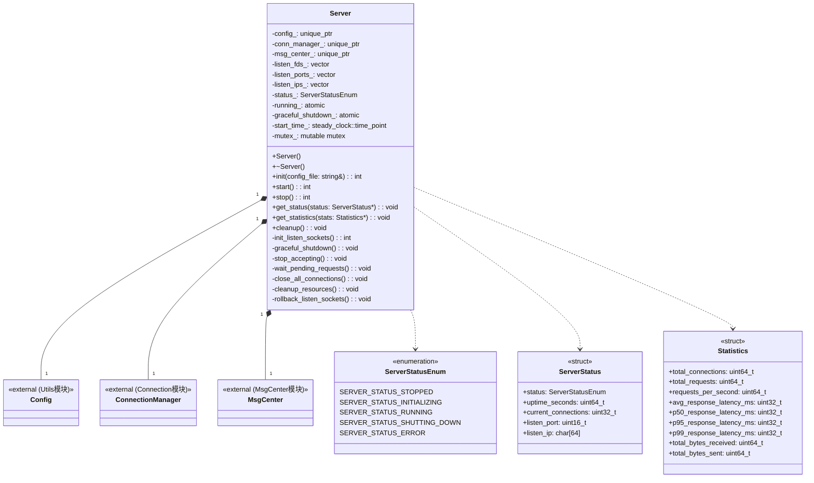
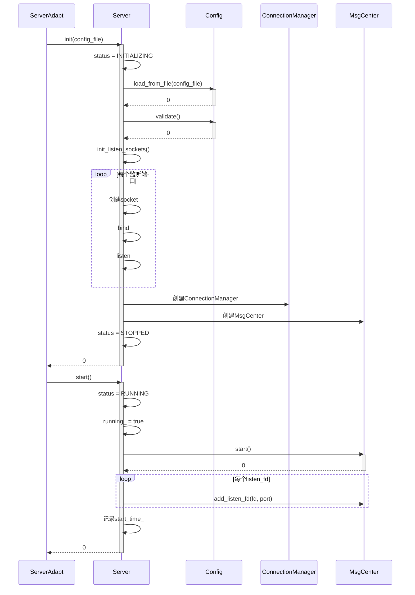
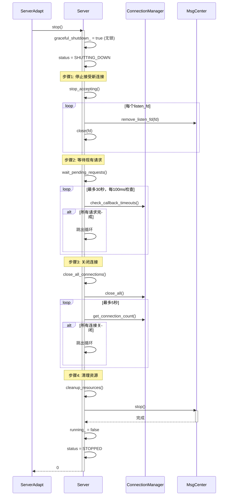
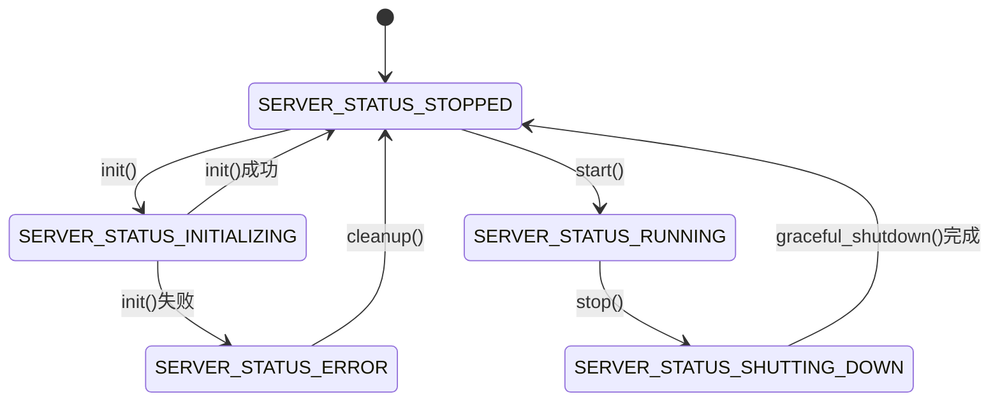

# HTTPS Server 模拟器 - Server 模块详细设计文档

**版本**: v8
**创建日期**: 2026-02-16
**修改日期**: 2026-02-17
**设计负责人**: 模块设计师Agent

---

## 目录

1. [模块基本信息](#1-模块基本信息)
2. [设计概述](#2-设计概述)
3. [详细设计内容](#3-详细设计内容)
4. [开发落地指南](#4-开发落地指南)
5. [单元测试用例](#5-单元测试用例)
6. [设计验证](#6-设计验证)
7. [备注](#7-备注)

---

## 1. 模块基本信息

### 1.1 基本信息

| 属性 | 值 |
|-----|-----|
| 模块名称 | Server |
| 模块唯一标识 | Module_Server |
| 核心类型 | 逻辑控制类 |
| 模块路径 | codes/core/source/server/ |

### 1.2 模块职责

**完整职责描述（来自架构设计文档）**：
- Server实例的创建与销毁
- 监听socket的创建与绑定
- 全局资源初始化与清理
- Graceful Shutdown流程控制
- 配置使用（通过Utils模块的Config类）
- 各子模块（ConnectionManager、MsgCenter）的协调

**核心定位**：Server模块是整个HTTPS Server模拟器的核心控制单元，负责统筹管理所有子模块的生命周期，协调整体运行流程。

### 1.3 职责边界

| 该做什么 | 不该做什么 |
|---------|-----------|
| Server生命周期管理（init/start/stop/cleanup） | 具体连接的处理（由Connection模块负责） |
| 监听socket的创建与绑定 | 协议解析（由Protocol模块负责） |
| Graceful Shutdown流程控制 | 事件循环（由MsgCenter模块负责） |
| 配置使用（通过Config类） | 配置加载与校验的具体实现（由Utils模块负责） |
| 协调ConnectionManager、MsgCenter等子模块 | 数据报文处理（由Protocol模块负责） |
| 状态查询与统计信息收集 | 回调函数执行（由Callback模块负责） |
| | 调测链处理（由DebugChain模块负责） |

### 1.4 关联需求

| 需求点ID | 需求描述 | 需求类型 |
|---------|---------|---------|
| REQ-001 | 支持HTTPS Server启动与停止 | 功能性 |
| REQ-002 | 支持配置加载与校验 | 功能性 |
| REQ-003 | 支持Graceful Shutdown | 功能性 |
| REQ-004 | 支持状态查询与统计信息 | 功能性 |
| REQ-005 | 支持多端口监听 | 功能性 |
| NF-REQ-001 | 启动时间不超过2秒 | 非功能性 |

### 1.5 依赖关系

| 类型 | 模块名称 | 用途 | 调用方式 |
|-----|---------|------|---------|
| 依赖 | Config（Utils模块） | 配置使用 | 头文件包含 |
| 依赖 | ConnectionManager（Connection模块） | 连接生命周期管理 | 头文件包含 |
| 依赖 | MsgCenter（MsgCenter模块） | 事件循环与消息分发 | 头文件包含 |
| 被依赖 | ServerAdapt（Adapt模块） | C接口封装 | 头文件包含 |

**跨模块接口约定**：

| 接口 | 提供模块 | 用途 |
|-----|---------|------|
| MsgCenter::add_listen_fd(int fd, uint16_t port) | MsgCenter | 添加监听fd到消息中心 |
| MsgCenter::remove_listen_fd(int fd) | MsgCenter | 从消息中心移除监听fd |
| MsgCenter::start() | MsgCenter | 启动消息中心 |
| MsgCenter::stop() | MsgCenter | 停止消息中心 |
| ConnectionManager::check_callback_timeouts(uint32_t timeout_seconds) | ConnectionManager | 检查回调超时 |
| ConnectionManager::for_each_connection(Func&& func) | ConnectionManager | 遍历所有连接 |
| ConnectionManager::close_all() | ConnectionManager | 关闭所有连接 |
| ConnectionManager::get_connection_count() | ConnectionManager | 获取当前连接数 |
| ConnectionManager::get_statistics(ConnectionStats* stats) | ConnectionManager | 获取连接统计信息 |
| MsgCenter::get_statistics(MsgCenterStats* stats) | MsgCenter | 获取消息中心统计信息 |

### 1.6 设计信息

- 设计负责人：模块设计师Agent
- 设计日期：2026-02-16

---

## 2. 设计概述

### 2.1 设计目标

基于架构约束，完成Server模块内部细化设计，覆盖全部关联需求，支撑开发直接编码、单元测试落地。

### 2.2 遵循约束

| 约束类型 | 约束内容 |
|---------|---------|
| 架构约束 | 严格遵循架构设计文档中Server模块的职责定义 |
| 需求约束 | 覆盖REQ-001至REQ-005及NF-REQ-001 |
| 设计原则 | 纯功能驱动，不关注安全性；严格避免过度设计 |
| 跨模块依赖 | 内部模块通过头文件关联；外部依赖通过防腐层 |

### 2.3 核心设计思路

先判定模块类型为逻辑控制类，遵循高内聚原则划分内部类，重点设计Server生命周期管理与Graceful Shutdown流程，配套绘制类图、状态图、时序图，设计单元测试用例，确保满足需求与架构要求。

### 2.4 设计范围

本次设计的范围是Server模块内部，不涉及其他模块、跨模块联调等无关内容。

---

## 3. 详细设计内容

### 3.1 内部结构设计

#### 3.1.1 类划分与职责

| 类名 | 职责 | 所属文件 |
|-----|------|---------|
| Server | 核心控制类，负责生命周期管理、Graceful Shutdown、子模块协调 | server.hpp, server.cpp |

#### 3.1.2 Server类详细设计

**类名**: Server

**访问权限**: public

**核心职责**:
- Server生命周期管理（init/start/stop/cleanup）
- 监听socket管理
- Graceful Shutdown流程控制
- 子模块（ConnectionManager、MsgCenter）协调
- 状态查询与统计信息收集

**属性**:

| 属性名 | 类型 | 访问权限 | 默认值 | 用途 |
|-------|------|---------|-------|------|
| config_ | std::unique_ptr<Config> | private | nullptr | 配置对象 |
| conn_manager_ | std::unique_ptr<ConnectionManager> | private | nullptr | 连接管理器 |
| msg_center_ | std::unique_ptr<MsgCenter> | private | nullptr | 消息中心 |
| listen_fds_ | std::vector<int> | private | empty | 监听socket fd列表 |
| listen_ports_ | std::vector<uint16_t> | private | empty | 监听端口列表（与listen_fds_一一对应） |
| listen_ips_ | std::vector<std::string> | private | empty | 监听IP列表（与listen_fds_一一对应） |
| status_ | ServerStatusEnum | private | SERVER_STATUS_STOPPED | 当前状态 |
| running_ | std::atomic<bool> | private | false | 运行标志 |
| graceful_shutdown_ | std::atomic<bool> | private | false | 优雅关闭标志（原子变量，无需加锁保护） |
| start_time_ | std::chrono::steady_clock::time_point | private | epoch | 启动时间 |
| mutex_ | mutable std::mutex | private | - | 状态保护互斥锁 |

**方法**:

| 方法名 | 参数 | 返回值 | 访问权限 | 核心逻辑描述 | 调用场景 |
|-------|------|-------|---------|-------------|---------|
| Server | 无 | - | public | 初始化所有成员变量为默认值 | 创建Server实例时 |
| ~Server | 无 | - | public | 调用cleanup()清理资源 | 销毁Server实例时 |
| init | config_file: const std::string& | int | public | 1. 状态设为INITIALIZING<br>2. 加载并校验配置<br>3. 初始化监听socket<br>4. 创建子模块<br>5. 状态设为STOPPED | ServerAdapt::init()调用 |
| start | 无 | int | public | 1. 状态设为RUNNING<br>2. 设置running_=true<br>3. 启动MsgCenter<br>4. 注册监听fd<br>5. 记录启动时间 | ServerAdapt::start()调用 |
| stop | 无 | int | public | 1. 检查当前状态，仅允许从RUNNING状态调用<br>2. 调用graceful_shutdown()<br>3. 返回执行结果 | ServerAdapt::stop()调用 |
| get_status | status: ServerStatus* | void | public | 1. 加锁保护<br>2. 填充status结构体<br>3. 解锁 | ServerAdapt::get_status()调用 |
| get_statistics | stats: Statistics* | void | public | 1. 从ConnectionManager获取连接统计<br>2. 从MsgCenter获取消息统计<br>3. 聚合填充stats结构体 | ServerAdapt::get_statistics()调用 |
| cleanup | 无 | void | public | 1. 清理监听socket<br>2. 销毁子模块<br>3. 清理配置<br>4. 状态设为STOPPED | ServerAdapt::cleanup()调用 |
| init_listen_sockets | 无 | int | private | 1. 遍历配置中的监听端口<br>2. 对每个端口创建socket fd<br>3. 执行bind和listen<br>4. 加入listen_fds_列表<br>5. 失败时清理已创建的socket | init()内部调用 |
| graceful_shutdown | 无 | void | private | 1. 设置graceful_shutdown_=true（无锁）<br>2. 状态设为SHUTTING_DOWN<br>3. 调用stop_accepting()<br>4. 调用wait_pending_requests()<br>5. 调用close_all_connections()<br>6. 调用cleanup_resources()<br>7. 状态设为STOPPED | stop()内部调用 |
| stop_accepting | 无 | void | private | 1. 遍历listen_fds_<br>2. 从MsgCenter移除fd<br>3. 逐个关闭监听socket fd | graceful_shutdown()内部调用 |
| wait_pending_requests | 无 | void | private | 1. 循环最多MAX_CALLBACK_TIMEOUT_SECONDS(30)秒<br>2. 每100ms检查一次<br>3. 调用conn_manager_->check_callback_timeouts()<br>4. 所有请求完成或超时后退出 | graceful_shutdown()内部调用 |
| close_all_connections | 无 | void | private | 1. 调用conn_manager_->close_all()关闭所有连接<br>2. 循环最多5秒等待连接关闭<br>3. 超时后继续执行 | graceful_shutdown()内部调用 |
| cleanup_resources | 无 | void | private | 1. 停止MsgCenter<br>2. 清理监听socket资源<br>3. 设置running_=false | graceful_shutdown()内部调用 |
| rollback_listen_sockets | 无 | void | private | 1. 关闭所有已创建的socket<br>2. 清空listen_fds_、listen_ports_、listen_ips_列表 | init_listen_sockets()失败时调用 |

#### 3.1.3 类之间的关系

- Server与Config：组合关系，Server拥有唯一的Config实例
- Server与ConnectionManager：组合关系，Server拥有唯一的ConnectionManager实例
- Server与MsgCenter：组合关系，Server拥有唯一的MsgCenter实例

### 3.2 核心逻辑设计

#### 3.2.1 Server初始化流程（init方法）

**功能描述**: 初始化Server，加载配置，创建监听socket，初始化子模块

**核心逻辑**:

```
伪代码：
int Server::init(const std::string& config_file) {
    // 步骤1: 设置状态（仅在修改status_时加锁）
    {
        std::lock_guard<std::mutex> lock(mutex_);
        if (status_ != SERVER_STATUS_STOPPED) {
            return -1;
        }
        status_ = SERVER_STATUS_INITIALIZING;
    }

    try {
        // 步骤2: 创建并加载配置（不加锁）
        config_ = make_unique<Config>();
        int ret = config_->load_from_file(config_file);
        if (ret != 0) {
            cleanup();  // 清理已创建的资源
            std::lock_guard<std::mutex> lock(mutex_);
            status_ = SERVER_STATUS_ERROR;
            return ret;
        }

        // 步骤3: 校验配置（不加锁）
        ret = config_->validate();
        if (ret != 0) {
            cleanup();  // 清理已创建的资源
            std::lock_guard<std::mutex> lock(mutex_);
            status_ = SERVER_STATUS_ERROR;
            return ret;
        }

        // 步骤4: 初始化监听socket（不加锁）
        ret = init_listen_sockets();
        if (ret != 0) {
            cleanup();  // 清理已创建的资源
            std::lock_guard<std::mutex> lock(mutex_);
            status_ = SERVER_STATUS_ERROR;
            return ret;
        }

        // 步骤5: 创建子模块（不加锁）
        conn_manager_ = make_unique<ConnectionManager>();
        msg_center_ = make_unique<MsgCenter>();

        // 步骤6: 设置状态（仅在修改status_时加锁）
        {
            std::lock_guard<std::mutex> lock(mutex_);
            status_ = SERVER_STATUS_STOPPED;
        }
        return 0;
    } catch (...) {
        cleanup();  // 清理已创建的资源
        std::lock_guard<std::mutex> lock(mutex_);
        status_ = SERVER_STATUS_ERROR;
        return -1;
    }
}
```

**异常处理**:
- 配置加载失败：调用cleanup()清理资源，设置status_=ERROR，返回错误码
- 配置校验失败：调用cleanup()清理资源，设置status_=ERROR，返回错误码
- 监听socket创建失败：调用cleanup()清理资源，设置status_=ERROR，返回错误码
- 任意异常：调用cleanup()清理资源，设置status_=ERROR，返回-1

**ERROR状态处理说明**：
- 进入ERROR状态后，允许再次调用init()进行重试（init()仅允许从STOPPED状态调用，需先通过cleanup()回到STOPPED状态）
- ERROR状态下调用cleanup()会执行完整的资源清理，将状态恢复为STOPPED
- cleanup()是从ERROR状态退出的唯一途径

#### 3.2.2 Server启动流程（start方法）

**功能描述**: 启动Server，启动MsgCenter，注册监听socket

**核心逻辑**:

```
伪代码：
int Server::start() {
    // 步骤1: 检查当前状态并设置RUNNING（加锁）
    {
        std::lock_guard<std::mutex> lock(mutex_);
        if (status_ != SERVER_STATUS_STOPPED) {
            return -1;  // 状态错误
        }
        status_ = SERVER_STATUS_RUNNING;
        running_ = true;
    }

    // 步骤2: 启动MsgCenter（不加锁）
    int ret = msg_center_->start();
    if (ret != 0) {
        // MsgCenter启动失败，清理资源
        {
            std::lock_guard<std::mutex> lock(mutex_);
            status_ = SERVER_STATUS_ERROR;
            running_ = false;
        }
        cleanup();  // 清理已创建的资源
        return ret;
    }

    // 步骤3: 注册监听socket（不加锁）
    for (size_t i = 0; i < listen_fds_.size(); ++i) {
        msg_center_->add_listen_fd(listen_fds_[i], listen_ports_[i]);
    }

    // 步骤4: 记录启动时间（不加锁）
    start_time_ = std::chrono::steady_clock::now();

    return 0;
}
```

**异常处理**:
- MsgCenter启动失败：设置status_=ERROR，调用cleanup()清理资源，返回错误码

#### 3.2.3 Graceful Shutdown流程（graceful_shutdown方法）

**功能描述**: 执行优雅关闭流程，停止接受新连接，等待现有请求处理，关闭连接，清理资源

**核心逻辑**:

**stop() 伪代码**：
```
int Server::stop() {
    // 步骤1: 检查当前状态（加锁）
    {
        std::lock_guard<std::mutex> lock(mutex_);
        if (status_ != SERVER_STATUS_RUNNING) {
            return -1;  // 仅允许从RUNNING状态调用
        }
    }

    // 步骤2: 执行优雅关闭（不加锁）
    graceful_shutdown();

    return 0;
}
```

**graceful_shutdown() 伪代码**：
```
void Server::graceful_shutdown() {
    // 步骤1: 设置标志（无锁，原子变量）和状态（加锁保护）
    graceful_shutdown_ = true;  // 原子变量，无需加锁
    {
        std::lock_guard<std::mutex> lock(mutex_);
        status_ = SERVER_STATUS_SHUTTING_DOWN;
    }

    // 步骤2: 停止接受新连接（不加锁）
    stop_accepting();

    // 步骤3: 等待现有请求处理（最多30秒，不加锁）
    wait_pending_requests();

    // 步骤4: 关闭所有连接（最多5秒等待，不加锁）
    close_all_connections();

    // 步骤5: 清理资源（不加锁，避免耗时操作在锁内）
    cleanup_resources();

    // 步骤6: 设置最终状态（加锁保护）
    {
        std::lock_guard<std::mutex> lock(mutex_);
        status_ = SERVER_STATUS_STOPPED;
    }
}
```

**stop_accepting() 伪代码**：
```
void Server::stop_accepting() {
    for (size_t i = 0; i < listen_fds_.size(); ++i) {
        int fd = listen_fds_[i];
        // 先从MsgCenter移除fd
        msg_center_->remove_listen_fd(fd);
        // 再关闭fd
        close(fd);
    }
}
```

**wait_pending_requests() 伪代码**：
```
const int MAX_CALLBACK_TIMEOUT_SECONDS = 30;

void Server::wait_pending_requests() {
    auto start = std::chrono::steady_clock::now();
    while (true) {
        // 检查回调超时
        conn_manager_->check_callback_timeouts(MAX_CALLBACK_TIMEOUT_SECONDS);

        // 判断条件说明：
        // 此处通过get_connection_count() == 0判断"所有请求处理完成"
        // 设计假设：
        //   1. 连接的生命周期与请求处理生命周期绑定
        //   2. 请求处理完成后连接会被ConnectionManager主动关闭
        //   3. get_connection_count()返回活跃连接数，活跃连接数为0表示所有请求已处理完毕
        // 若实际设计中ConnectionManager提供更精确的"未完成请求数"接口，可替换此判断
        if (conn_manager_->get_connection_count() == 0) {
            break;
        }

        auto elapsed = std::chrono::duration_cast<std::chrono::seconds>(
            std::chrono::steady_clock::now() - start).count();
        if (elapsed >= MAX_CALLBACK_TIMEOUT_SECONDS) {
            break;
        }

        std::this_thread::sleep_for(std::chrono::milliseconds(100));
    }
}
```

**close_all_connections() 伪代码**：
```
const int MAX_CONN_CLOSE_WAIT_SECONDS = 5;

void Server::close_all_connections() {
    // 调用ConnectionManager关闭所有连接
    conn_manager_->close_all();

    // 等待连接完全关闭
    auto start = std::chrono::steady_clock::now();
    while (true) {
        if (conn_manager_->get_connection_count() == 0) {
            break;
        }

        auto elapsed = std::chrono::duration_cast<std::chrono::seconds>(
            std::chrono::steady_clock::now() - start).count();
        if (elapsed >= MAX_CONN_CLOSE_WAIT_SECONDS) {
            break;
        }

        std::this_thread::sleep_for(std::chrono::milliseconds(100));
    }
}
```

**cleanup_resources() 伪代码**：
```
void Server::cleanup_resources() {
    // 停止MsgCenter
    msg_center_->stop();

    // 清空监听socket列表（socket已在stop_accepting中关闭）
    listen_fds_.clear();
    listen_ports_.clear();
    listen_ips_.clear();

    // 设置运行标志为false
    running_ = false;
}
```

**步骤分解**:

1. **stop_accepting()**:
   - 遍历所有listen_fds_，先从MsgCenter中移除fd
   - 调用close()关闭fd

2. **wait_pending_requests()**:
   - 循环最多30秒
   - 每100ms检查一次连接状态
   - 调用conn_manager_->check_callback_timeouts()
   - 所有请求完成或超时后退出
   - 判断条件说明：通过get_connection_count() == 0判断，假设连接生命周期与请求处理生命周期绑定

3. **close_all_connections()**:
   - 调用conn_manager_->close_all()关闭所有连接
   - 循环最多5秒（MAX_CONN_CLOSE_WAIT_SECONDS）等待连接关闭
   - 超时后继续执行

4. **cleanup_resources()**:
   - 调用msg_center_->stop()
   - 清空listen_fds_、listen_ports_、listen_ips_列表
   - 设置running_ = false

#### 3.2.4 监听socket初始化（init_listen_sockets方法）

**功能描述**: 为每个配置的监听端口创建socket fd，执行bind和listen

**核心逻辑**:

```
伪代码：
int Server::init_listen_sockets() {
    int ret;  // 声明返回值变量
    // 获取配置中的监听端口列表
    auto& server_config = config_->get_server();
    auto& listen_configs = server_config.listen_configs;

    // 遍历每个监听配置
    for (auto& listen_cfg : listen_configs) {
        // 创建socket
        int fd = socket(AF_INET, SOCK_STREAM, 0);
        if (fd < 0) {
            rollback_listen_sockets();  // 清理已创建的socket
            return -1;
        }

        // 设置SO_REUSEADDR选项
        int opt = 1;
        ret = setsockopt(fd, SOL_SOCKET, SO_REUSEADDR, &opt, sizeof(opt));
        if (ret < 0) {
            close(fd);
            rollback_listen_sockets();  // 清理已创建的socket
            return ret;
        }

        // 填充sockaddr_in结构
        struct sockaddr_in addr;
        memset(&addr, 0, sizeof(addr));
        addr.sin_family = AF_INET;
        addr.sin_port = htons(listen_cfg.port);
        inet_pton(AF_INET, listen_cfg.ip.c_str(), &addr.sin_addr);

        // 绑定
        ret = bind(fd, (struct sockaddr*)&addr, sizeof(addr));
        if (ret < 0) {
            close(fd);
            rollback_listen_sockets();  // 清理已创建的socket
            return ret;
        }

        // 监听
        ret = listen(fd, server_config.backlog);
        if (ret < 0) {
            close(fd);
            rollback_listen_sockets();  // 清理已创建的socket
            return ret;
        }

        // 加入列表
        listen_fds_.push_back(fd);
        listen_ports_.push_back(listen_cfg.port);
        listen_ips_.push_back(listen_cfg.ip);
    }

    return 0;
}

void Server::rollback_listen_sockets() {
    // 关闭所有已创建的socket
    for (int fd : listen_fds_) {
        close(fd);
    }
    // 清空列表
    listen_fds_.clear();
    listen_ports_.clear();
    listen_ips_.clear();
}
```

**网络栈兼容性说明**：
- 当前仅支持IPv4（AF_INET），不支持IPv6（AF_INET6）
- IPv6支持作为后续扩展功能

**backlog参数说明**：
- backlog参数来自Config模块的Server配置（server_config.backlog）
- 默认值：通常为128（具体由Config模块定义）
- 有效范围：1~SOMAXCONN（系统最大值，通常为128或更高）
- 含义：TCP连接建立队列的最大长度

**异常处理**：
- socket() 失败：清理已创建的socket，返回 -1
- setsockopt() 失败：关闭当前fd，清理已创建的socket，返回错误码
- bind() 失败：关闭当前fd，清理已创建的socket，返回错误码
- listen() 失败：关闭当前fd，清理已创建的socket，返回错误码

#### 3.2.5 资源清理（cleanup方法）

**功能描述**: 清理Server所有资源，包括监听socket、子模块、配置对象，将状态恢复为STOPPED

**核心逻辑**:
```
伪代码：
void Server::cleanup() {
    // 加锁保护状态修改
    std::lock_guard<std::mutex> lock(mutex_);

    // 无论当前状态如何，都执行清理

    // 步骤1: 清理监听socket
    for (int fd : listen_fds_) {
        if (fd >= 0) {
            close(fd);
        }
    }
    listen_fds_.clear();
    listen_ports_.clear();
    listen_ips_.clear();

    // 步骤2: 销毁子模块（reset会自动销毁）
    msg_center_.reset();
    conn_manager_.reset();

    // 步骤3: 清理配置
    config_.reset();

    // 步骤4: 重置标志
    running_ = false;
    graceful_shutdown_ = false;

    // 步骤5: 恢复状态为STOPPED（ERROR状态也会回到STOPPED）
    status_ = SERVER_STATUS_STOPPED;
}
```

**cleanup()与graceful_shutdown()的区别**：
- graceful_shutdown()：优雅关闭流程，仅在RUNNING状态调用，有等待超时机制
- cleanup()：强制资源清理，可在任意状态调用，直接清理资源无等待，是ERROR状态退出的唯一途径

### 3.3 可扩展性设计

本模块无需支持插件式扩展，仅需通过头文件关联内部模块，通过防腐层关联外部依赖。

**扩展约束**:
- 不支持动态加载扩展模块
- 子模块替换需通过修改代码并重新编译实现
- 配置项扩展通过Config模块实现

### 3.4 图形化设计

#### 3.4.1 类图（完整）



**图1：Server模块内部类图** - 展示Server模块内部类的结构、属性、方法及类之间的关系，外部模块仅展示类名

#### 3.4.2 动态图 - Server启动时序



**图2：Server启动时序图** - 展示Server初始化与启动的完整交互流程

#### 3.4.3 动态图 - Graceful Shutdown时序



**图3：Graceful Shutdown时序图** - 展示Server优雅关闭的完整交互流程

#### 3.4.4 状态图 - Server状态转换



**图4：Server状态转换图** - 展示Server在生命周期中的状态切换

---

## 4. 开发落地指南

### 4.1 术语与规范

#### 4.1.1 核心术语

| 术语 | 定义 |
|-----|------|
| Server | HTTPS Server模拟器的核心控制类 |
| Graceful Shutdown | 优雅关闭流程，先停止接受新连接，再等待现有请求处理完成 |
| ServerStatusEnum | Server状态枚举 |
| ConnectionManager | 连接管理器（来自Connection模块） |
| MsgCenter | 消息中心（来自MsgCenter模块） |

#### 4.1.2 命名规范

| 元素 | 规范 | 示例 |
|-----|------|------|
| 类名 | PascalCase | Server |
| 方法名 | snake_case | init(), start(), graceful_shutdown() |
| 成员变量 | snake_case，后缀下划线 | config_, listen_fds_ |
| 局部变量 | snake_case | ret, config_file |
| 常量 | UPPER_SNAKE_CASE | MAX_CALLBACK_TIMEOUT_SECONDS, MAX_CONN_CLOSE_WAIT_SECONDS |
| 枚举值 | UPPER_SNAKE_CASE | SERVER_STATUS_STOPPED |

#### 4.1.3 编码规范

- 使用C++17标准
- 头文件包含顺序：标准库 → 外部依赖（通过防腐层） → 内部模块
- 使用smart_ptr管理对象生命周期
- 成员变量使用private访问权限，通过public方法访问
- 线程安全：使用std::mutex保护共享状态，std::atomic用于标志位
- 错误处理：返回int错误码，0表示成功，非0表示失败

### 4.2 核心逻辑说明

#### 4.2.1 init()方法详细说明

**功能**: 初始化Server

**步骤**:
1. 设置状态为INITIALIZING（仅在修改status_时加锁）
2. 创建Config对象并加载配置文件
3. 校验配置
4. 调用init_listen_sockets()初始化监听socket
5. 创建ConnectionManager和MsgCenter子模块
6. 设置状态为STOPPED（仅在修改status_时加锁）

**伪代码补充**:
```cpp
int Server::init(const std::string& config_file) {
    // 步骤1: 设置状态（仅在修改status_时加锁）
    {
        std::lock_guard<std::mutex> lock(mutex_);
        if (status_ != SERVER_STATUS_STOPPED) {
            return -1;  // 只能从STOPPED状态初始化
        }
        status_ = SERVER_STATUS_INITIALIZING;
    }

    try {
        // 步骤2: 创建并加载配置（不加锁）
        config_ = std::make_unique<Config>();
        int ret = config_->load_from_file(config_file);
        if (ret != 0) {
            cleanup();  // 清理已创建的资源
            std::lock_guard<std::mutex> lock(mutex_);
            status_ = SERVER_STATUS_ERROR;
            return ret;
        }

        // 步骤3: 校验配置（不加锁）
        ret = config_->validate();
        if (ret != 0) {
            cleanup();  // 清理已创建的资源
            std::lock_guard<std::mutex> lock(mutex_);
            status_ = SERVER_STATUS_ERROR;
            return ret;
        }

        // 步骤4: 初始化监听socket（不加锁）
        ret = init_listen_sockets();
        if (ret != 0) {
            cleanup();  // 清理已创建的资源
            std::lock_guard<std::mutex> lock(mutex_);
            status_ = SERVER_STATUS_ERROR;
            return ret;
        }

        // 步骤5: 创建子模块（不加锁）
        conn_manager_ = std::make_unique<ConnectionManager>();
        msg_center_ = std::make_unique<MsgCenter>();

        // 步骤6: 设置状态（仅在修改status_时加锁）
        {
            std::lock_guard<std::mutex> lock(mutex_);
            status_ = SERVER_STATUS_STOPPED;
        }
        return 0;
    } catch (...) {
        cleanup();  // 清理已创建的资源
        std::lock_guard<std::mutex> lock(mutex_);
        status_ = SERVER_STATUS_ERROR;
        return -1;
    }
}
```

#### 4.2.2 graceful_shutdown()方法详细说明

**功能**: 执行优雅关闭

**超时参数（具名常量）**:
- 等待请求完成超时：MAX_CALLBACK_TIMEOUT_SECONDS = 30秒
- 等待连接关闭超时：MAX_CONN_CLOSE_WAIT_SECONDS = 5秒

**关键设计说明**:
- 锁粒度细化：仅在修改共享状态（status_）时加锁，graceful_shutdown_是原子变量，无需加锁
- wait_pending_requests()期间不持有锁，避免阻塞其他API调用

**"请求完成"判断条件说明**:
- wait_pending_requests()中通过conn_manager_->get_connection_count() == 0判断所有请求处理完成
- 设计假设：
  1. 连接的生命周期与请求处理生命周期绑定
  2. 请求处理完成后连接会被ConnectionManager主动关闭
  3. get_connection_count()返回活跃连接数，活跃连接数为0表示所有请求已处理完毕

**伪代码补充**:
```cpp
const int MAX_CALLBACK_TIMEOUT_SECONDS = 30;

void Server::graceful_shutdown() {
    // 步骤1: 设置标志（无锁，原子变量）和状态（加锁保护）
    graceful_shutdown_ = true;  // 原子变量，无需加锁
    {
        std::lock_guard<std::mutex> lock(mutex_);
        status_ = SERVER_STATUS_SHUTTING_DOWN;
    }

    // 步骤2: 停止接受新连接（不加锁）
    stop_accepting();

    // 步骤3: 等待现有请求（最多30秒，不加锁）
    const int MAX_WAIT_REQUESTS_SEC = MAX_CALLBACK_TIMEOUT_SECONDS;
    auto start = std::chrono::steady_clock::now();
    while (true) {
        // 注意：check_callback_timeouts()不能持有mutex_锁
        conn_manager_->check_callback_timeouts(MAX_CALLBACK_TIMEOUT_SECONDS);

        if (conn_manager_->get_connection_count() == 0) {
            break;
        }

        auto elapsed = std::chrono::duration_cast<std::chrono::seconds>(
            std::chrono::steady_clock::now() - start).count();
        if (elapsed >= MAX_WAIT_REQUESTS_SEC) {
            break;
        }

        std::this_thread::sleep_for(std::chrono::milliseconds(100));
    }

    // 步骤4: 关闭连接（最多5秒等待，不加锁）
    close_all_connections();

    // 步骤5: 清理资源（不加锁，避免耗时操作在锁内）
    cleanup_resources();

    // 步骤6: 设置最终状态（加锁保护）
    {
        std::lock_guard<std::mutex> lock(mutex_);
        status_ = SERVER_STATUS_STOPPED;
    }
}
```

**stop_accepting() 伪代码补充**:
```cpp
void Server::stop_accepting() {
    for (size_t i = 0; i < listen_fds_.size(); ++i) {
        int fd = listen_fds_[i];
        // 先从MsgCenter移除fd
        msg_center_->remove_listen_fd(fd);
        // 再关闭fd
        close(fd);
    }
}
```

### 4.3 数据结构定义

**头文件位置**: 以下数据结构定义位于 `codes/api/adapt/include/server_adapt.h`，与架构设计文档（HLD）第4.1节一致。

#### 4.3.1 ServerStatusEnum枚举

```cpp
typedef enum {
    SERVER_STATUS_STOPPED = 0,      // 已停止
    SERVER_STATUS_INITIALIZING = 1,  // 初始化中
    SERVER_STATUS_RUNNING = 2,        // 运行中
    SERVER_STATUS_SHUTTING_DOWN = 3,  // 关闭中
    SERVER_STATUS_ERROR = 4           // 错误状态
} ServerStatusEnum;
```

#### 4.3.2 ServerStatus结构体

```cpp
typedef struct {
    ServerStatusEnum status;           // 当前状态
    uint64_t uptime_seconds;           // 运行时间（秒）
    uint32_t current_connections;      // 当前连接数
    uint16_t listen_port;              // 监听端口（第一个监听端口）
    char listen_ip[64];                // 监听IP（第一个监听IP）
} ServerStatus;
```

**多端口监听说明**：
- 当配置多个监听端口时，listen_port 字段取第一个监听端口的值
- listen_ip 字段取第一个监听IP的值
- 如需获取所有监听端口列表，可通过扩展接口或遍历配置获取
- listen_port/listen_ip始终为初始配置的第一个端口/IP，与监听socket是否关闭（如stop_accepting()执行后）无关，不随运行时状态变化

#### 4.3.3 Statistics结构体

```cpp
typedef struct {
    uint64_t total_connections;        // 总连接数
    uint64_t total_requests;           // 总请求数
    uint64_t requests_per_second;      // QPS
    uint32_t avg_response_latency_ms;  // 平均响应延迟
    uint32_t p50_response_latency_ms;  // P50延迟
    uint32_t p95_response_latency_ms;  // P95延迟
    uint32_t p99_response_latency_ms;  // P99延迟
    uint64_t total_bytes_received;     // 总接收字节数
    uint64_t total_bytes_sent;         // 总发送字节数
} Statistics;
```

### 4.4 可扩展性实现指南

本模块无需支持插件式扩展。如需修改子模块实现，通过替换头文件并重新编译实现。

---

## 5. 单元测试用例

### 5.1 测试侧重点

- 重点测试Server生命周期管理（init/start/stop/cleanup）
- 重点测试Graceful Shutdown流程，特别是锁粒度设计
- 重点测试状态转换逻辑
- 覆盖正常场景、异常场景、边界场景

### 5.2 单元测试用例表

| 用例ID | 测试模块 | 关联需求点 | 关联类/方法 | 测试场景 | 输入参数 | 预期输出 | 测试步骤 | 备注 |
|-------|---------|-----------|------------|---------|---------|---------|---------|------|
| Server_UseCase001 | Server | REQ-001 | Server::init() | 正常初始化，传入有效配置文件 | config_file="valid_config.json" | 返回0，状态为STOPPED | 1. 创建Server实例<br>2. 调用init()<br>3. 检查返回值和状态 | 无特殊约束 |
| Server_UseCase002 | Server | REQ-001 | Server::init() | 异常初始化，配置文件不存在 | config_file="not_exist.json" | 返回非0，状态为ERROR | 1. 创建Server实例<br>2. 调用init()<br>3. 检查返回值和状态 | 无特殊约束 |
| Server_UseCase003 | Server | REQ-001 | Server::init() | 异常初始化，配置文件内容无效 | config_file="invalid_config.json" | 返回非0，状态为ERROR | 1. 创建Server实例<br>2. 调用init()<br>3. 检查返回值和状态 | 无特殊约束 |
| Server_UseCase004 | Server | REQ-001 | Server::start() | 正常启动，init后调用start | 无 | 返回0，状态为RUNNING | 1. 创建Server实例<br>2. 调用init()<br>3. 调用start()<br>4. 检查返回值和状态 | 无特殊约束 |
| Server_UseCase005 | Server | REQ-001 | Server::start() | 异常启动，未init直接start | 无 | 返回非0，状态不变 | 1. 创建Server实例<br>2. 调用start()<br>3. 检查返回值和状态 | 无特殊约束 |
| Server_UseCase006 | Server | REQ-001 | Server::start() | 边界场景，重复调用start | 无 | 第二次返回非0 | 1. 创建Server实例<br>2. init()后start()<br>3. 再次调用start()<br>4. 检查返回值 | 无特殊约束 |
| Server_UseCase007 | Server | REQ-003 | Server::stop() | 正常停止，start后调用stop | 无 | 返回0，状态为STOPPED | 1. 创建Server实例<br>2. init()后start()<br>3. 调用stop()<br>4. 检查返回值和状态 | 无特殊约束 |
| Server_UseCase008 | Server | REQ-003 | Server::stop() | 异常停止，未start直接stop | 无 | 返回非0 | 1. 创建Server实例<br>2. 调用stop()<br>3. 检查返回值 | 无特殊约束 |
| Server_UseCase009 | Server | REQ-004 | Server::get_status() | 正常查询状态，处于RUNNING状态 | status（输出参数） | status填充正确 | 1. 创建Server实例<br>2. init()和start()<br>3. 调用get_status()<br>4. 检查status内容 | 无特殊约束 |
| Server_UseCase010 | Server | REQ-004 | Server::get_statistics() | 正常查询统计信息 | stats（输出参数） | stats填充正确 | 1. 创建Server实例<br>2. init()和start()<br>3. 调用get_statistics()<br>4. 检查stats内容 | 无特殊约束 |
| Server_UseCase011 | Server | REQ-005 | Server::init() | 正常初始化，多端口监听配置 | config_file="multi_port_config.json" | 返回0，创建多个listen_fd | 1. 创建Server实例<br>2. 调用init()<br>3. 检查listen_fds_数量 | 无特殊约束 |
| Server_UseCase012 | Server | REQ-003 | Server::graceful_shutdown() | Graceful Shutdown超时场景 | 有未完成请求 | 30秒后继续关闭 | 1. 创建Server实例<br>2. 模拟未完成请求<br>3. 调用stop()<br>4. 验证超时后关闭 | 无特殊约束 |
| Server_UseCase013 | Server | REQ-001 | Server::cleanup() | 正常清理资源 | 无 | 资源清理完成 | 1. 创建Server实例<br>2. init()<br>3. 调用cleanup()<br>4. 验证资源清理 | 无特殊约束 |
| Server_UseCase014 | Server | - | init_listen_sockets() | 正常创建socket | ip="127.0.0.1", port=8443 | 返回0，fd有效 | 1. 测试init_listen_sockets内部逻辑 | 无特殊约束 |
| Server_UseCase015 | Server | - | init_listen_sockets() | 异常绑定，端口被占用 | 无 | 返回非0 | 1. 测试端口被占用场景 | 需要预先占用端口 |
| Server_UseCase016 | Server | REQ-003 | Server::graceful_shutdown() | 测试graceful_shutdown期间get_status不被阻塞 | 无 | get_status()调用在100ms内返回，返回状态为SHUTTING_DOWN | 1. 创建Server实例并准备测试同步工具（条件变量+原子标志）<br>2. 调用init()和start()使Server进入RUNNING状态<br>3. 创建Mock ConnectionManager，使get_connection_count()始终返回>0（模拟长时间运行的请求）<br>4. 启动线程A：在该线程中调用stop()<br>5. 在线程A中设置条件：在wait_pending_requests()开始循环时，通过条件变量通知主线程<br>6. 主线程等待条件变量通知<br>7. 收到通知后，主线程立即调用get_status()，记录调用开始和结束时间<br>8. 验证get_status()调用耗时<100ms，且状态为SHUTTING_DOWN<br>9. 设置Mock使get_connection_count()返回0，允许graceful_shutdown()完成<br>10. 等待线程A结束 | 验证锁粒度细化有效 |
| Server_UseCase017 | Server | - | rollback_listen_sockets() | 多端口初始化失败时资源回滚 | 第二个端口绑定失败 | 所有已创建的socket被关闭 | 1. 测试多端口初始化失败场景<br>2. 验证资源回滚 | 无特殊约束 |

---

## 6. 设计验证

### 6.1 验证方式

- 通过单元测试用例，验证Server模块内部功能点是否正常
- 通过对照架构设计文档，验证设计是否符合约束
- 通过对照需求点，验证需求是否完全覆盖

### 6.2 验证要点

| 验证要点 | 验证内容 |
|---------|---------|
| 类结构 | 是否符合高内聚原则，职责划分清晰 |
| 逻辑设计 | 是否覆盖全部关联需求（REQ-001至REQ-005） |
| 接口实现 | 是否与架构定义的接口一致 |
| Graceful Shutdown | 流程是否完整，超时机制是否合理，锁粒度是否细化 |
| 状态转换 | 状态机是否正确，状态切换是否符合预期 |
| 单元测试 | 测试用例是否覆盖正常、异常、边界场景 |
| 跨模块接口 | ConnectionManager和MsgCenter的接口调用符合架构定义 |
| 资源管理 | 监听socket初始化失败时是否有回滚逻辑 |

---

## 7. 备注

### 7.1 设计中未解决的问题

无特殊未解决问题。

### 7.2 特殊约束说明

- 本模块不支持插件式扩展
- 需严格遵循架构定义的接口标准
- 纯功能驱动设计，不关注安全性
- graceful_shutdown()方法采用细化锁粒度设计，避免长时间持有锁
- 跨模块接口已在1.5节"跨模块接口约定"中明确定义，由对应模块提供实现
- graceful_shutdown_为原子变量，无需加锁保护
- 超时值使用具名常量MAX_CALLBACK_TIMEOUT_SECONDS(30)和MAX_CONN_CLOSE_WAIT_SECONDS(5)，避免硬编码
- wait_pending_requests()中"请求完成"判断条件依赖设计假设：连接生命周期与请求处理生命周期绑定

### 7.3 其他补充

- 文档版本v3修改内容：
  1. 删除了"4+1视图设计"章节（不属于LLD范畴）
  2. 移除了ListenSocket类过度设计，改用std::vector<int> listen_fds_直接管理fd
  3. 补充了listen_ports_和listen_ips_向量，与listen_fds_一一对应
  4. 统一了锁策略，init()也采用细化锁粒度，仅在修改status_时加锁
  5. 删除了重复的时序图
  6. 在备注中明确了跨模块接口的依赖关系

- 文档版本v4修改内容（根据第一次检视报告）：
  1. **SRV-003**：明确配置职责边界，Server模块仅使用Config，配置加载与校验由Utils模块负责
  2. **SRV-004**：补充setsockopt()返回值检查逻辑与异常处理说明
  3. **SRV-005**：在1.5节新增"跨模块接口约定"表格，明确定义所有假设的接口
  4. **SRV-006**：在类图中补充ServerStatus和Statistics结构体的依赖关系
  5. **SRV-007**：统一状态图中的状态命名，使用完整枚举值（SERVER_STATUS_*）
  6. **SRV-008**：补充ServerStatus多端口监听说明，listen_port取第一个端口
  7. **SRV-009**：完善stop_accepting()伪代码，体现先从MsgCenter移除fd再关闭的逻辑
  8. **SRV-002**：确认cleanup_resources()在锁外调用，避免耗时操作在锁内执行

- 文档版本v5修改内容（根据第二次检视报告）：
  1. **SRV-001**：在Server类方法表中补充wait_pending_requests()、close_all_connections()和rollback_listen_sockets()方法定义
  2. **SRV-001**：在类图中补充缺失的私有方法
  3. **SRV-002**：在1.5节"跨模块接口约定"中补充ConnectionManager::close_all()接口，明确close_all_connections()调用conn_manager_->close_all()
  4. **SRV-003**：在1.5节"跨模块接口约定"中补充统计信息获取接口（ConnectionManager::get_statistics()、MsgCenter::get_statistics()），明确get_statistics()的数据来源
  5. **SRV-004**：在init_listen_sockets()方法中增加rollback_listen_sockets()回滚逻辑，当某个端口初始化失败时，关闭已创建的所有socket并清空相关列表
  6. **SRV-005**：在Graceful Shutdown时序图的stop_accepting()步骤中补充msg_center_->remove_listen_fd(fd)的调用，确保图形与文字描述一致
  7. **SRV-006**：明确graceful_shutdown_为原子变量，无需加锁保护，在graceful_shutdown()方法中调整设置顺序，先无锁设置graceful_shutdown_，再加锁设置status_
  8. **SRV-007**：将硬编码超时值替换为具名常量MAX_CALLBACK_TIMEOUT_SECONDS(30)，在命名规范中补充该常量
  9. 补充Server_UseCase017测试用例，验证资源回滚逻辑

- 文档版本v6修改内容（根据第三次检视报告）：
  1. **SRV-2-004**：在4.3节"数据结构定义"中明确头文件位置为 `codes/api/adapt/include/server_adapt.h`
  2. **SRV-2-006**：在wait_pending_requests()伪代码中补充"请求完成"判断条件的详细说明，明确设计假设（连接生命周期与请求处理生命周期绑定）
  3. **SRV-2-001**：在cleanup_resources()伪代码中补充清空listen_fds_、listen_ports_、listen_ips_列表的逻辑
  4. **SRV-2-002**：补充close_all_connections()的完整伪代码实现
  5. **SRV-2-003**：补充cleanup_resources()的完整伪代码实现
  6. **SRV-2-005**：完善Server_UseCase016预期输出描述，明确为"get_status()调用在100ms内返回，返回状态为SHUTTING_DOWN"
  7. **SRV-2-007**：新增具名常量MAX_CONN_CLOSE_WAIT_SECONDS = 5，替换close_all_connections()中的硬编码值，在命名规范中补充该常量

- 文档版本v7修改内容（根据第三次检视报告）：
  1. **SRV-3-005**（一般级别）：完善init()方法的异常处理与状态回滚策略
     - 在init()的所有失败分支中调用cleanup()清理已创建的资源
     - 补充ERROR状态处理说明，明确进入ERROR状态后允许再次init()（需先通过cleanup()回到STOPPED）
     - 明确ERROR状态下调用cleanup()的行为定义
  2. **SRV-3-001**（建议级别）：补充cleanup()方法的完整伪代码实现
     - 新增3.2.5节"资源清理（cleanup方法）"
     - 明确cleanup()与graceful_shutdown()的关系与差异
  3. **SRV-3-002**（建议级别）：补充ERROR状态处理说明
     - 在3.2.1节"异常处理"中新增"ERROR状态处理说明"小节
     - 明确cleanup()是从ERROR状态退出的唯一途径
  4. **SRV-3-003**（建议级别）：补充init_listen_sockets()网络栈兼容性说明
     - 在3.2.4节中新增"网络栈兼容性说明"，明确当前仅支持IPv4，IPv6作为后续扩展
  5. **SRV-3-004**（建议级别）：明确ServerStatus.listen_port/listen_ip与多端口监听的关系
     - 在4.3.2节中补充说明listen_port/listen_ip始终为初始配置的第一个端口/IP，与监听socket是否关闭无关
  6. **SRV-3-006**（建议级别）：完善start()方法的MsgCenter启动失败回滚
     - 在start()的MsgCenter启动失败分支中调用cleanup()清理已创建的子模块和监听socket
  7. **SRV-3-007**（建议级别）：补充listen()的backlog参数来源说明
     - 在3.2.4节中新增"backlog参数说明"，明确来源、默认值、有效范围和含义

- 文档版本v8修改内容（根据第四次检视报告）：
  1. **SRV-4-001**（一般级别）：修正init_listen_sockets()伪代码中ret变量未声明问题
     - 在init_listen_sockets()方法开头添加 `int ret;` 变量声明
  2. **SRV-4-002**（建议级别）：补充stop()方法状态检查说明
     - 在3.2.3节新增stop()完整伪代码，明确仅允许从RUNNING状态调用
     - 在Server类方法表中更新stop()方法的核心逻辑描述
  3. **SRV-4-003**（建议级别）：细化Server_UseCase016测试步骤
     - 补充多线程同步机制说明（条件变量+原子标志）
     - 明确Mock ConnectionManager的使用方式
     - 细化10个具体测试执行步骤

---

**文档结束**
