# HTTPS Server 模拟器 - Utils模块详细设计文档 (LLD)

**版本**: v6
**创建日期**: 2026-02-16
**修改日期**: 2026-02-17
**状态**: 正式版

---

## 目录

1. [模块基本信息](#1-模块基本信息)
2. [设计概述](#2-设计概述)
3. [详细设计内容](#3-详细设计内容)
4. [开发落地指南](#4-开发落地指南)
5. [单元测试用例](#5-单元测试用例)
6. [设计验证](#6-设计验证)
7. [备注](#7-备注)

---

## 1. 模块基本信息

### 1.1 模块标识

| 属性 | 值 |
|------|-----|
| 模块名称 | Utils |
| 模块唯一标识 | Module_Utils |
| 核心类型 | 数据处理类 + 接口适配类 |
| 模块路径 | codes/core/source/utils/ |
| 设计负责人 | 模块设计师Agent |
| 设计日期 | 2026-02-16 |

### 1.2 模块职责

**核心职责**（来自架构设计文档）：
- 日志系统：提供统一的日志记录接口，支持多级别日志输出
- 无锁队列：为工作线程池提供高效的无锁任务队列
- 缓冲区管理：为连接读写提供可动态扩展的缓冲区
- 统计信息管理：收集并计算系统运行时的各项统计指标
- 配置解析：作为JSON库的防腐层，解析并管理系统配置
- 时间工具：提供高精度时间获取函数
- 错误处理：提供统一错误码定义

**核心定位**：Utils模块是系统的基础设施模块，为其他所有核心模块提供通用工具能力支撑，是跨模块复用的基础组件集合。

### 1.3 职责边界

**该做什么**：
- 提供线程安全的日志写入功能
- 实现单生产者单消费者（SPSC）无锁队列
- 管理动态内存缓冲区，提供读写指针操作
- 收集统计数据并计算百分位延迟
- 封装配置数据结构，提供访问接口（注：配置加载与校验由Server模块负责）
- 封装nlohmann/json库，提供防腐层接口
- 提供时间获取工具函数
- 定义统一错误码

**不该做什么**：
- 不涉及业务逻辑处理
- 不实现网络IO功能
- 不涉及TLS/HTTP协议解析
- 不实现线程调度逻辑
- 不提供图形界面或命令行接口

### 1.4 关联需求

| 需求ID | 需求描述 | 需求类型 |
|--------|---------|---------|
| REQ_LOG_001 | 支持多级别日志（DEBUG/INFO/WARN/ERROR） | 功能性 |
| REQ_LOG_002 | 支持日志输出到文件和控制台 | 功能性 |
| REQ_QUEUE_001 | 提供无锁队列用于任务传递 | 功能性 |
| REQ_QUEUE_002 | 无锁队列支持批量操作 | 功能性 |
| REQ_BUFFER_001 | 支持动态扩展的缓冲区 | 功能性 |
| REQ_BUFFER_002 | 缓冲区支持读写指针分离 | 功能性 |
| REQ_STATS_001 | 统计连接数、请求数、吞吐量 | 功能性 |
| REQ_STATS_002 | 统计P50/P95/P99延迟 | 功能性 |
| REQ_CONFIG_001 | 解析JSON格式配置文件 | 功能性 |
| REQ_CONFIG_002 | 配置参数合法性校验 | 功能性 |
| REQ_TIME_001 | 提供毫秒级时间戳获取 | 功能性 |
| REQ_ERROR_001 | 提供统一错误码定义 | 功能性 |

### 1.5 依赖关系

**依赖模块**：
- 无（Utils是底层模块，不依赖其他核心模块）

**被依赖模块**：
- Server模块：使用日志、配置、统计、时间工具、错误码
- Connection模块：使用日志、缓冲区、时间工具、错误码
- Protocol模块：使用日志、缓冲区、时间工具、错误码
- MsgCenter模块：使用日志、无锁队列、错误码
- DebugChain模块：使用日志
- Callback模块：使用日志、配置

**外部依赖**：
- nlohmann/json（通过Config防腐层封装）

### 1.6 文件结构

```
codes/core/include/utils/
├── logger.hpp          # 日志系统头文件
├── lockfree_queue.hpp  # 无锁队列头文件
├── buffer.hpp          # 缓冲区头文件
├── statistics.hpp      # 统计信息头文件
├── config.hpp          # 配置解析头文件（防腐层）
├── time.hpp            # 时间工具头文件
└── error.hpp           # 错误码定义头文件

codes/core/source/utils/
├── logger.cpp          # 日志系统实现
├── buffer.cpp          # 缓冲区实现
├── statistics.cpp      # 统计信息实现
├── config.cpp          # 配置解析实现（防腐层实现）
├── time.cpp            # 时间工具实现
└── error.cpp           # 错误码实现
```

---

## 2. 设计概述

### 2.1 设计目标

基于架构约束，完成Utils模块内部细化设计，覆盖全部关联需求，支撑开发直接编码、单元测试落地。具体目标包括：
1. 提供高效、线程安全的日志系统
2. 实现高性能SPSC无锁队列
3. 设计灵活易用的动态缓冲区，支持动态扩容和容量预分配
4. 实现准确的统计信息收集与计算
5. 构建配置解析防腐层，隔离JSON库依赖
6. 提供时间工具函数
7. 定义统一错误码

### 2.2 遵循约束

1. **架构约束**：
   - 严格遵循架构设计文档中定义的模块职责
   - Config模块作为JSON库的防腐层，不直接暴露nlohmann/json
   - 内部模块通过头文件关联

2. **需求约束**：
   - 纯功能驱动，不关注安全性
   - 严格避免过度设计
   - 覆盖所有关联需求点

3. **技术约束**：
   - 使用C++17标准
   - 无锁队列使用std::atomic实现
   - 缓冲区使用连续内存存储

### 2.3 核心设计思路

1. **模块类型判定**：Utils模块属于混合型，包含数据处理类（日志、缓冲区、统计、时间）和接口适配类（配置防腐层）
2. **设计策略**：
   - 遵循高内聚原则，按功能拆分为7个子组件
   - 每个子组件独立设计，通过头文件对外暴露接口
   - 优先保证核心功能的简单性和可靠性
   - 无锁队列采用经典的链表实现
   - Buffer采用动态扩容策略，支持容量预分配

3. **设计优先级**：
   - P0：Buffer、Logger、Time、Error（核心功能，独立提供）
   - P1：Config、Statistics、LockFreeQueue

### 2.4 设计范围

**设计范围**：仅聚焦Utils模块内部设计，包含以下子组件：
- Logger：日志系统
- LockFreeQueue：无锁队列
- Buffer：缓冲区管理
- Statistics：统计信息管理
- Config：配置解析（防腐层）
- Time：时间工具
- Error：错误处理

**不涉及**：其他模块设计、跨模块联调、版本迭代、接口升降级、可靠性冗余设计等。

---

## 3. 详细设计内容

### 3.1 内部结构设计

#### 3.1.1 子组件划分

Utils模块按功能划分为7个独立子组件，每个子组件职责单一、高内聚：

| 子组件名称 | 职责描述 | 包含类 |
|-----------|---------|--------|
| Logger | 多级别日志记录，支持控制台和文件输出 | Logger |
| LockFreeQueue | SPSC无锁队列，用于任务传递 | LockFreeQueue\<T\> |
| Buffer | 动态缓冲区，支持读写分离、动态扩容 | Buffer |
| Statistics | 统计信息收集与计算 | StatisticsManager, Statistics |
| Config | JSON配置解析与管理（防腐层） | Config, ServerConfig, CertificatesConfig, DebugConfig, CallbacksConfig, LoggingConfig, Http2Config |
| Time | 时间工具函数 | 全局函数（非类） |
| Error | 统一错误码定义 | 错误码枚举 |

#### 3.1.2 类设计

**Buffer类**：动态缓冲区类（核心模块，完整设计）

```cpp
// 文件: codes/core/include/utils/buffer.hpp

#pragma once

#include <cstdint>
#include <cstddef>
#include <vector>

namespace https_server_sim {
namespace utils {

class Buffer {
public:
    // 默认初始容量
    static constexpr size_t DEFAULT_INITIAL_CAPACITY = 8192;
    // 最小容量
    static constexpr size_t MIN_CAPACITY = 1024;
    // 最大容量(64MB)
    static constexpr size_t MAX_CAPACITY = 64 * 1024 * 1024;
    // 扩容阈值：小于该值时翻倍扩容
    static constexpr size_t GROWTH_THRESHOLD_DOUBLE = 64 * 1024;
    // 扩容阈值：小于该值时1.5倍扩容
    static constexpr size_t GROWTH_THRESHOLD_15X = 1024 * 1024;
    // 线性扩容增量
    static constexpr size_t GROWTH_LINEAR_INCREMENT = 256 * 1024;

    // 构造函数
    // initial_capacity: 初始容量，默认8KB
    explicit Buffer(size_t initial_capacity = DEFAULT_INITIAL_CAPACITY);

    // 析构函数
    ~Buffer();

    // 禁止拷贝
    Buffer(const Buffer&) = delete;
    Buffer& operator=(const Buffer&) = delete;

    // 支持移动
    Buffer(Buffer&& other) noexcept;
    Buffer& operator=(Buffer&& other) noexcept;

    // ========== 写入方法 ==========

    // 写入数据，返回实际写入的字节数
    // 会自动扩容，超过MAX_CAPACITY时返回0
    size_t write(const uint8_t* data, size_t len);
    size_t write(const char* data, size_t len);

    // 写入单个字节
    size_t write_uint8(uint8_t value);
    size_t write_char(char value);

    // 写入16位/32位/64位整数（网络字节序）
    size_t write_uint16_be(uint16_t value);
    size_t write_uint32_be(uint32_t value);
    size_t write_uint64_be(uint64_t value);

    // 预留可写空间，返回指向该空间的指针
    // 用于直接写入（如recv/send）
    uint8_t* reserve(size_t len);

    // 提交已写入的数据（配合reserve使用）
    void commit(size_t len);

    // ========== 读取方法 ==========

    // 读取数据，返回实际读取的字节数，移动读指针
    size_t read(uint8_t* data, size_t len);
    size_t read(char* data, size_t len);

    // 读取单个字节，移动读指针
    uint8_t read_uint8();
    char read_char();

    // 读取16位/32位/64位整数（网络字节序），移动读指针
    uint16_t read_uint16_be();
    uint32_t read_uint32_be();
    uint64_t read_uint64_be();

    // 查看数据（不移动读指针）
    size_t peek(uint8_t* data, size_t len) const;
    size_t peek(char* data, size_t len) const;

    // 查看指定偏移处的数据
    uint8_t peek_uint8(size_t offset = 0) const;

    // ========== 指针操作 ==========

    // 获取读指针
    const uint8_t* read_ptr() const;

    // 获取写指针
    uint8_t* write_ptr();

    // 跳过数据（移动读指针）
    void skip(size_t len);

    // 回退读指针
    void unskip(size_t len);

    // ========== 容量管理 ==========

    // 获取可读字节数
    size_t readable_bytes() const;

    // 获取可写字节数（不扩容情况下）
    size_t writable_bytes() const;

    // 获取总容量
    size_t capacity() const;

    // 确保有足够的可写空间，必要时扩容
    // return: true-成功，false-失败（超过MAX_CAPACITY）
    bool ensure_writable(size_t len);

    // 预分配容量
    // new_capacity: 新的容量，必须大于当前容量
    // return: true-成功，false-失败
    bool reserve_capacity(size_t new_capacity);

    // 收缩容量到刚好容纳可读数据
    void shrink_to_fit();

    // ========== 清理操作 ==========

    // 清空缓冲区（不释放内存）
    void clear();

    // 压缩空间（将可读数据移到开头，回收空间）
    void compact();

    // 重置缓冲区（释放内存，恢复初始容量）
    void reset();

private:
    // 计算扩容后的容量
    // required: 需要的最小容量
    // return: 新容量，不超过MAX_CAPACITY
    size_t calculate_growth(size_t required) const;

    // 扩容到新容量
    // return: true-成功
    bool resize(size_t new_capacity);

    std::vector<uint8_t> data_;
    size_t read_idx_;
    size_t write_idx_;
};

} // namespace utils
} // namespace https_server_sim
```

**Buffer类实现细节**：

```cpp
// 文件: codes/core/source/utils/buffer.cpp

#include "utils/buffer.hpp"
#include <cstring>
#include <algorithm>

namespace https_server_sim {
namespace utils {

Buffer::Buffer(size_t initial_capacity)
    : read_idx_(0), write_idx_(0)
{
    size_t cap = std::max(initial_capacity, MIN_CAPACITY);
    cap = std::min(cap, MAX_CAPACITY);
    data_.resize(cap);
}

Buffer::~Buffer() = default;

Buffer::Buffer(Buffer&& other) noexcept
    : data_(std::move(other.data_))
    , read_idx_(other.read_idx_)
    , write_idx_(other.write_idx_)
{
    other.read_idx_ = 0;
    other.write_idx_ = 0;
}

Buffer& Buffer::operator=(Buffer&& other) noexcept {
    if (this != &other) {
        data_ = std::move(other.data_);
        read_idx_ = other.read_idx_;
        write_idx_ = other.write_idx_;
        other.read_idx_ = 0;
        other.write_idx_ = 0;
    }
    return *this;
}

size_t Buffer::write(const uint8_t* data, size_t len) {
    if (len == 0 || data == nullptr) {
        return 0;
    }
    if (!ensure_writable(len)) {
        return 0;
    }
    std::memcpy(write_ptr(), data, len);
    commit(len);
    return len;
}

size_t Buffer::write(const char* data, size_t len) {
    return write(reinterpret_cast<const uint8_t*>(data), len);
}

size_t Buffer::write_uint8(uint8_t value) {
    return write(&value, 1);
}

size_t Buffer::write_char(char value) {
    return write(reinterpret_cast<uint8_t*>(&value), 1);
}

size_t Buffer::write_uint16_be(uint16_t value) {
    uint8_t buf[2];
    buf[0] = static_cast<uint8_t>((value >> 8) & 0xFF);
    buf[1] = static_cast<uint8_t>(value & 0xFF);
    return write(buf, 2);
}

size_t Buffer::write_uint32_be(uint32_t value) {
    uint8_t buf[4];
    buf[0] = static_cast<uint8_t>((value >> 24) & 0xFF);
    buf[1] = static_cast<uint8_t>((value >> 16) & 0xFF);
    buf[2] = static_cast<uint8_t>((value >> 8) & 0xFF);
    buf[3] = static_cast<uint8_t>(value & 0xFF);
    return write(buf, 4);
}

size_t Buffer::write_uint64_be(uint64_t value) {
    uint8_t buf[8];
    buf[0] = static_cast<uint8_t>((value >> 56) & 0xFF);
    buf[1] = static_cast<uint8_t>((value >> 48) & 0xFF);
    buf[2] = static_cast<uint8_t>((value >> 40) & 0xFF);
    buf[3] = static_cast<uint8_t>((value >> 32) & 0xFF);
    buf[4] = static_cast<uint8_t>((value >> 24) & 0xFF);
    buf[5] = static_cast<uint8_t>((value >> 16) & 0xFF);
    buf[6] = static_cast<uint8_t>((value >> 8) & 0xFF);
    buf[7] = static_cast<uint8_t>(value & 0xFF);
    return write(buf, 8);
}

uint8_t* Buffer::reserve(size_t len) {
    if (!ensure_writable(len)) {
        return nullptr;
    }
    return write_ptr();
}

void Buffer::commit(size_t len) {
    write_idx_ += std::min(len, writable_bytes());
}

size_t Buffer::read(uint8_t* data, size_t len) {
    size_t available = readable_bytes();
    size_t to_read = std::min(len, available);
    if (to_read > 0 && data != nullptr) {
        std::memcpy(data, read_ptr(), to_read);
    }
    skip(to_read);
    return to_read;
}

size_t Buffer::read(char* data, size_t len) {
    return read(reinterpret_cast<uint8_t*>(data), len);
}

uint8_t Buffer::read_uint8() {
    uint8_t value = 0;
    read(&value, 1);
    return value;
}

char Buffer::read_char() {
    char value = 0;
    read(&value, 1);
    return value;
}

uint16_t Buffer::read_uint16_be() {
    uint8_t buf[2] = {0};
    read(buf, 2);
    return (static_cast<uint16_t>(buf[0]) << 8) |
           static_cast<uint16_t>(buf[1]);
}

uint32_t Buffer::read_uint32_be() {
    uint8_t buf[4] = {0};
    read(buf, 4);
    return (static_cast<uint32_t>(buf[0]) << 24) |
           (static_cast<uint32_t>(buf[1]) << 16) |
           (static_cast<uint32_t>(buf[2]) << 8) |
           static_cast<uint32_t>(buf[3]);
}

uint64_t Buffer::read_uint64_be() {
    uint8_t buf[8] = {0};
    read(buf, 8);
    return (static_cast<uint64_t>(buf[0]) << 56) |
           (static_cast<uint64_t>(buf[1]) << 48) |
           (static_cast<uint64_t>(buf[2]) << 40) |
           (static_cast<uint64_t>(buf[3]) << 32) |
           (static_cast<uint64_t>(buf[4]) << 24) |
           (static_cast<uint64_t>(buf[5]) << 16) |
           (static_cast<uint64_t>(buf[6]) << 8) |
           static_cast<uint64_t>(buf[7]);
}

size_t Buffer::peek(uint8_t* data, size_t len) const {
    size_t available = readable_bytes();
    size_t to_read = std::min(len, available);
    if (to_read > 0 && data != nullptr) {
        std::memcpy(data, read_ptr(), to_read);
    }
    return to_read;
}

size_t Buffer::peek(char* data, size_t len) const {
    return peek(reinterpret_cast<uint8_t*>(data), len);
}

uint8_t Buffer::peek_uint8(size_t offset) const {
    if (offset >= readable_bytes()) {
        return 0;
    }
    return data_[read_idx_ + offset];
}

const uint8_t* Buffer::read_ptr() const {
    return data_.data() + read_idx_;
}

uint8_t* Buffer::write_ptr() {
    return data_.data() + write_idx_;
}

void Buffer::skip(size_t len) {
    read_idx_ += std::min(len, readable_bytes());
}

void Buffer::unskip(size_t len) {
    if (len <= read_idx_) {
        read_idx_ -= len;
    } else {
        read_idx_ = 0;
    }
}

size_t Buffer::readable_bytes() const {
    return write_idx_ - read_idx_;
}

size_t Buffer::writable_bytes() const {
    return data_.size() - write_idx_;
}

size_t Buffer::capacity() const {
    return data_.size();
}

bool Buffer::ensure_writable(size_t len) {
    if (writable_bytes() >= len) {
        return true;
    }
    // 先尝试压缩
    if (read_idx_ > 0) {
        compact();
        if (writable_bytes() >= len) {
            return true;
        }
    }
    // 需要扩容
    size_t required = write_idx_ + len;
    size_t new_capacity = calculate_growth(required);
    return resize(new_capacity);
}

bool Buffer::reserve_capacity(size_t new_capacity) {
    if (new_capacity <= capacity()) {
        return true;
    }
    if (new_capacity > MAX_CAPACITY) {
        return false;
    }
    return resize(new_capacity);
}

void Buffer::shrink_to_fit() {
    size_t needed = readable_bytes();
    if (needed == 0) {
        reset();
        return;
    }
    compact();
    if (write_idx_ < data_.size()) {
        data_.resize(write_idx_);
    }
}

void Buffer::clear() {
    read_idx_ = 0;
    write_idx_ = 0;
}

void Buffer::compact() {
    if (read_idx_ == 0) {
        return;
    }
    size_t data_len = write_idx_ - read_idx_;
    if (data_len > 0) {
        std::memmove(data_.data(), data_.data() + read_idx_, data_len);
    }
    read_idx_ = 0;
    write_idx_ = data_len;
}

void Buffer::reset() {
    read_idx_ = 0;
    write_idx_ = 0;
    data_.resize(DEFAULT_INITIAL_CAPACITY);
}

size_t Buffer::calculate_growth(size_t required) const {
    size_t current = data_.size();
    size_t new_capacity = current;

    if (current < GROWTH_THRESHOLD_DOUBLE) {
        // 小于64KB：翻倍
        new_capacity = current * 2;
    } else if (current < GROWTH_THRESHOLD_15X) {
        // 64KB ~ 1MB：1.5倍
        new_capacity = current + (current / 2);
    } else {
        // 大于1MB：线性增长
        new_capacity = current + GROWTH_LINEAR_INCREMENT;
    }

    // 确保满足需求
    new_capacity = std::max(new_capacity, required);
    // 不超过最大值
    new_capacity = std::min(new_capacity, MAX_CAPACITY);

    return new_capacity;
}

bool Buffer::resize(size_t new_capacity) {
    if (new_capacity > MAX_CAPACITY) {
        return false;
    }
    try {
        data_.resize(new_capacity);
        return true;
    } catch (...) {
        return false;
    }
}

} // namespace utils
} // namespace https_server_sim
```

**Thread Safety Note**: Buffer类**不是线程安全的**。每个Buffer实例应该仅由单个线程使用，或者由外部调用方通过互斥锁保证线程安全。

---

**Time时间工具**：时间工具函数（核心模块，完整设计）

```cpp
// 文件: codes/core/include/utils/time.hpp

#pragma once

#include <cstdint>
#include <string>
#include <chrono>

namespace https_server_sim {
namespace utils {

// ========== 时间获取函数 ==========

// 获取当前时间戳（毫秒）
// return: 自Unix纪元以来的毫秒数
uint64_t get_current_time_ms();

// 获取当前时间戳（微秒）
// return: 自Unix纪元以来的微秒数
uint64_t get_current_time_us();

// 获取当前时间戳（纳秒）
// return: 自Unix纪元以来的纳秒数
uint64_t get_current_time_ns();

// 获取单调时间戳（毫秒，不受系统时间修改影响）
// return: 单调递增的毫秒数
uint64_t get_monotonic_time_ms();

// 获取单调时间戳（微秒）
uint64_t get_monotonic_time_us();

// ========== 时间格式化 ==========

// 格式化当前时间为字符串
// format: strftime格式字符串，默认 "%Y-%m-%d %H:%M:%S"
// return: 格式化后的时间字符串
std::string format_current_time(const char* format = "%Y-%m-%d %H:%M:%S");

// 格式化指定时间戳为字符串
// timestamp_ms: 毫秒时间戳
// format: strftime格式字符串
// return: 格式化后的时间字符串
std::string format_time(uint64_t timestamp_ms, const char* format = "%Y-%m-%d %H:%M:%S");

// ========== 时间工具类 ==========

// 计时器类，用于测量耗时
class StopWatch {
public:
    StopWatch();
    ~StopWatch() = default;

    // 重置计时器
    void reset();

    // 获取从构造/重置到现在的毫秒数
    uint64_t elapsed_ms() const;

    // 获取从构造/重置到现在的微秒数
    uint64_t elapsed_us() const;

    // 获取从构造/重置到现在的纳秒数
    uint64_t elapsed_ns() const;

private:
    std::chrono::steady_clock::time_point start_;
};

// 超时检测器
class TimeoutChecker {
public:
    // timeout_ms: 超时时间（毫秒）
    explicit TimeoutChecker(uint64_t timeout_ms);
    ~TimeoutChecker() = default;

    // 检查是否超时
    bool is_timeout() const;

    // 获取剩余时间（毫秒），返回0表示已超时
    uint64_t remaining_ms() const;

    // 重置超时时间
    void reset();

    // 重置为新的超时时间
    void reset(uint64_t new_timeout_ms);

private:
    uint64_t timeout_ms_;
    uint64_t start_time_ms_;
};

} // namespace utils
} // namespace https_server_sim
```

```cpp
// 文件: codes/core/source/utils/time.cpp

#include "utils/time.hpp"
#include <ctime>
#include <iomanip>
#include <sstream>

namespace https_server_sim {
namespace utils {

uint64_t get_current_time_ms() {
    auto now = std::chrono::system_clock::now();
    auto duration = now.time_since_epoch();
    return std::chrono::duration_cast<std::chrono::milliseconds>(duration).count();
}

uint64_t get_current_time_us() {
    auto now = std::chrono::system_clock::now();
    auto duration = now.time_since_epoch();
    return std::chrono::duration_cast<std::chrono::microseconds>(duration).count();
}

uint64_t get_current_time_ns() {
    auto now = std::chrono::system_clock::now();
    auto duration = now.time_since_epoch();
    return std::chrono::duration_cast<std::chrono::nanoseconds>(duration).count();
}

uint64_t get_monotonic_time_ms() {
    auto now = std::chrono::steady_clock::now();
    auto duration = now.time_since_epoch();
    return std::chrono::duration_cast<std::chrono::milliseconds>(duration).count();
}

uint64_t get_monotonic_time_us() {
    auto now = std::chrono::steady_clock::now();
    auto duration = now.time_since_epoch();
    return std::chrono::duration_cast<std::chrono::microseconds>(duration).count();
}

std::string format_current_time(const char* format) {
    auto now = std::chrono::system_clock::now();
    std::time_t time = std::chrono::system_clock::to_time_t(now);
    std::tm tm;
#ifdef _WIN32
    localtime_s(&tm, &time);
#else
    localtime_r(&time, &tm);
#endif
    std::ostringstream oss;
    oss << std::put_time(&tm, format);
    return oss.str();
}

std::string format_time(uint64_t timestamp_ms, const char* format) {
    std::time_t time = static_cast<std::time_t>(timestamp_ms / 1000);
    std::tm tm;
#ifdef _WIN32
    localtime_s(&tm, &time);
#else
    localtime_r(&time, &tm);
#endif
    std::ostringstream oss;
    oss << std::put_time(&tm, format);
    return oss.str();
}

// StopWatch implementation
StopWatch::StopWatch() {
    reset();
}

void StopWatch::reset() {
    start_ = std::chrono::steady_clock::now();
}

uint64_t StopWatch::elapsed_ms() const {
    auto now = std::chrono::steady_clock::now();
    auto duration = std::chrono::duration_cast<std::chrono::milliseconds>(now - start_);
    return duration.count();
}

uint64_t StopWatch::elapsed_us() const {
    auto now = std::chrono::steady_clock::now();
    auto duration = std::chrono::duration_cast<std::chrono::microseconds>(now - start_);
    return duration.count();
}

uint64_t StopWatch::elapsed_ns() const {
    auto now = std::chrono::steady_clock::now();
    auto duration = std::chrono::duration_cast<std::chrono::nanoseconds>(now - start_);
    return duration.count();
}

// TimeoutChecker implementation
TimeoutChecker::TimeoutChecker(uint64_t timeout_ms)
    : timeout_ms_(timeout_ms)
    , start_time_ms_(get_monotonic_time_ms())
{
}

bool TimeoutChecker::is_timeout() const {
    return remaining_ms() == 0;
}

uint64_t TimeoutChecker::remaining_ms() const {
    uint64_t elapsed = get_monotonic_time_ms() - start_time_ms_;
    if (elapsed >= timeout_ms_) {
        return 0;
    }
    return timeout_ms_ - elapsed;
}

void TimeoutChecker::reset() {
    start_time_ms_ = get_monotonic_time_ms();
}

void TimeoutChecker::reset(uint64_t new_timeout_ms) {
    timeout_ms_ = new_timeout_ms;
    start_time_ms_ = get_monotonic_time_ms();
}

} // namespace utils
} // namespace https_server_sim
```

**Time工具使用示例**：

```cpp
#include "utils/time.hpp"
#include <iostream>

using namespace https_server_sim::utils;

void time_example() {
    // 获取当前时间
    uint64_t now_ms = get_current_time_ms();
    std::cout << "Current time (ms): " << now_ms << std::endl;

    // 格式化时间
    std::cout << "Formatted time: " << format_current_time() << std::endl;

    // 使用StopWatch测量耗时
    StopWatch sw;
    // ... do some work ...
    uint64_t elapsed = sw.elapsed_ms();
    std::cout << "Elapsed: " << elapsed << " ms" << std::endl;

    // 使用TimeoutChecker检测超时
    TimeoutChecker tc(5000);  // 5秒超时
    while (!tc.is_timeout()) {
        // ... do work ...
        if (tc.remaining_ms() < 1000) {
            std::cout << "Less than 1 second remaining!" << std::endl;
        }
    }
    std::cout << "Timeout!" << std::endl;
}
```

---

**Logger类**：日志系统（核心模块，完整设计）

```cpp
// 文件: codes/core/include/utils/logger.hpp

#pragma once

#include <cstdint>
#include <string>
#include <fstream>
#include <mutex>
#include <atomic>
#include <memory>

namespace https_server_sim {
namespace utils {

// 日志级别枚举
enum class LogLevel : uint8_t {
    DEBUG = 0,
    INFO = 1,
    WARN = 2,
    ERROR = 3
};

// 日志级别转字符串
const char* log_level_to_string(LogLevel level);

// 字符串转日志级别
LogLevel string_to_log_level(const std::string& str);

class Logger {
public:
    // 获取单例
    static Logger& instance();

    // ========== 初始化与配置 ==========

    // 初始化日志系统
    // level: 日志级别
    // file: 日志文件路径，为空则只输出到控制台
    // return: 0-成功，非0-错误码
    int init(const std::string& level, const std::string& file = "");

    // 初始化日志系统
    // level: 日志级别枚举
    // file: 日志文件路径
    // return: 0-成功
    int init(LogLevel level, const std::string& file = "");

    // 设置日志级别
    void set_level(LogLevel level);

    // 获取当前日志级别
    LogLevel get_level() const;

    // 设置日志文件
    // file: 文件路径，为空关闭文件输出
    // return: 0-成功
    int set_file(const std::string& file);

    // 启用/禁用控制台输出
    void set_console_output(bool enabled);

    // 设置日志格式
    // format: 格式字符串，支持以下占位符:
    //   %time - 时间
    //   %level - 日志级别
    //   %module - 模块名
    //   %message - 日志消息
    //   %thread - 线程ID
    // 默认格式: "[%time] [%level] [%module] %message"
    void set_format(const std::string& format);

    // ========== 日志输出 ==========

    // 输出日志
    // level: 日志级别
    // module: 模块名
    // fmt: printf风格格式字符串
    void log(LogLevel level, const char* module, const char* fmt, ...);

    // 便捷方法
    void debug(const char* module, const char* fmt, ...);
    void info(const char* module, const char* fmt, ...);
    void warn(const char* module, const char* fmt, ...);
    void error(const char* module, const char* fmt, ...);

    // 检查某级别是否启用
    bool is_level_enabled(LogLevel level) const;

    // ========== 刷新与关闭 ==========

    // 刷新日志
    void flush();

    // 关闭日志系统
    void shutdown();

private:
    Logger();
    ~Logger();
    Logger(const Logger&) = delete;
    Logger& operator=(const Logger&) = delete;

    // 内部实现
    void logv(LogLevel level, const char* module, const char* fmt, va_list args);
    void format_and_write(LogLevel level, const char* module, const char* message);
    std::string format_time() const;

    std::atomic<LogLevel> level_;
    std::mutex mutex_;
    std::ofstream file_;
    bool console_enabled_;
    std::string format_;
    bool initialized_;
};

} // namespace utils
} // namespace https_server_sim

// ========== 便捷宏 ==========

#define LOG_DEBUG(module, fmt, ...) \
    do { \
        auto& logger = ::https_server_sim::utils::Logger::instance(); \
        if (logger.is_level_enabled(::https_server_sim::utils::LogLevel::DEBUG)) { \
            logger.debug(module, fmt, ##__VA_ARGS__); \
        } \
    } while(0)

#define LOG_INFO(module, fmt, ...) \
    do { \
        auto& logger = ::https_server_sim::utils::Logger::instance(); \
        if (logger.is_level_enabled(::https_server_sim::utils::LogLevel::INFO)) { \
            logger.info(module, fmt, ##__VA_ARGS__); \
        } \
    } while(0)

#define LOG_WARN(module, fmt, ...) \
    do { \
        auto& logger = ::https_server_sim::utils::Logger::instance(); \
        if (logger.is_level_enabled(::https_server_sim::utils::LogLevel::WARN)) { \
            logger.warn(module, fmt, ##__VA_ARGS__); \
        } \
    } while(0)

#define LOG_ERROR(module, fmt, ...) \
    do { \
        auto& logger = ::https_server_sim::utils::Logger::instance(); \
        if (logger.is_level_enabled(::https_server_sim::utils::LogLevel::ERROR)) { \
            logger.error(module, fmt, ##__VA_ARGS__); \
        } \
    } while(0)
```

```cpp
// 文件: codes/core/source/utils/logger.cpp

#include "utils/logger.hpp"
#include "utils/time.hpp"
#include <cstdarg>
#include <cstdio>
#include <iostream>
#include <iomanip>
#include <sstream>
#include <thread>

namespace https_server_sim {
namespace utils {

const char* log_level_to_string(LogLevel level) {
    switch (level) {
        case LogLevel::DEBUG: return "DEBUG";
        case LogLevel::INFO:  return "INFO";
        case LogLevel::WARN:  return "WARN";
        case LogLevel::ERROR: return "ERROR";
        default: return "UNKNOWN";
    }
}

LogLevel string_to_log_level(const std::string& str) {
    if (str == "DEBUG") return LogLevel::DEBUG;
    if (str == "INFO")  return LogLevel::INFO;
    if (str == "WARN")  return LogLevel::WARN;
    if (str == "ERROR") return LogLevel::ERROR;
    return LogLevel::INFO;  // 默认INFO
}

Logger::Logger()
    : level_(LogLevel::INFO)
    , console_enabled_(true)
    , format_("[%time] [%level] [%module] %message")
    , initialized_(false)
{
}

Logger::~Logger() {
    shutdown();
}

Logger& Logger::instance() {
    static Logger logger;
    return logger;
}

int Logger::init(const std::string& level, const std::string& file) {
    return init(string_to_log_level(level), file);
}

int Logger::init(LogLevel level, const std::string& file) {
    std::lock_guard<std::mutex> lock(mutex_);

    if (initialized_) {
        shutdown();
    }

    level_ = level;

    if (!file.empty()) {
        file_.open(file, std::ios::out | std::ios::app);
        if (!file_.is_open()) {
            return -1;  // 打开文件失败
        }
    }

    initialized_ = true;
    return 0;
}

void Logger::set_level(LogLevel level) {
    level_ = level;
}

LogLevel Logger::get_level() const {
    return level_.load();
}

int Logger::set_file(const std::string& file) {
    std::lock_guard<std::mutex> lock(mutex_);

    if (file_.is_open()) {
        file_.close();
    }

    if (file.empty()) {
        return 0;
    }

    file_.open(file, std::ios::out | std::ios::app);
    return file_.is_open() ? 0 : -1;
}

void Logger::set_console_output(bool enabled) {
    std::lock_guard<std::mutex> lock(mutex_);
    console_enabled_ = enabled;
}

void Logger::set_format(const std::string& format) {
    std::lock_guard<std::mutex> lock(mutex_);
    format_ = format;
}

bool Logger::is_level_enabled(LogLevel level) const {
    return static_cast<uint8_t>(level) >= static_cast<uint8_t>(level_.load());
}

void Logger::log(LogLevel level, const char* module, const char* fmt, ...) {
    if (!is_level_enabled(level)) {
        return;
    }

    va_list args;
    va_start(args, fmt);
    logv(level, module, fmt, args);
    va_end(args);
}

void Logger::debug(const char* module, const char* fmt, ...) {
    if (!is_level_enabled(LogLevel::DEBUG)) {
        return;
    }
    va_list args;
    va_start(args, fmt);
    logv(LogLevel::DEBUG, module, fmt, args);
    va_end(args);
}

void Logger::info(const char* module, const char* fmt, ...) {
    if (!is_level_enabled(LogLevel::INFO)) {
        return;
    }
    va_list args;
    va_start(args, fmt);
    logv(LogLevel::INFO, module, fmt, args);
    va_end(args);
}

void Logger::warn(const char* module, const char* fmt, ...) {
    if (!is_level_enabled(LogLevel::WARN)) {
        return;
    }
    va_list args;
    va_start(args, fmt);
    logv(LogLevel::WARN, module, fmt, args);
    va_end(args);
}

void Logger::error(const char* module, const char* fmt, ...) {
    if (!is_level_enabled(LogLevel::ERROR)) {
        return;
    }
    va_list args;
    va_start(args, fmt);
    logv(LogLevel::ERROR, module, fmt, args);
    va_end(args);
}

void Logger::logv(LogLevel level, const char* module, const char* fmt, va_list args) {
    char buffer[4096];
    vsnprintf(buffer, sizeof(buffer), fmt, args);

    std::lock_guard<std::mutex> lock(mutex_);
    format_and_write(level, module, buffer);
}

void Logger::format_and_write(LogLevel level, const char* module, const char* message) {
    std::string result = format_;

    // 替换占位符
    std::string time_str = format_time();
    std::string level_str = log_level_to_string(level);
    std::string module_str = module ? module : "unknown";

    // 简单的字符串替换
    size_t pos;

    // %time
    pos = result.find("%time");
    if (pos != std::string::npos) {
        result.replace(pos, 5, time_str);
    }

    // %level
    pos = result.find("%level");
    if (pos != std::string::npos) {
        result.replace(pos, 6, level_str);
    }

    // %module
    pos = result.find("%module");
    if (pos != std::string::npos) {
        result.replace(pos, 7, module_str);
    }

    // %thread
    pos = result.find("%thread");
    if (pos != std::string::npos) {
        std::ostringstream oss;
        oss << std::this_thread::get_id();
        result.replace(pos, 7, oss.str());
    }

    // %message
    pos = result.find("%message");
    if (pos != std::string::npos) {
        result.replace(pos, 8, message);
    }

    result += "\n";

    // 输出到控制台
    if (console_enabled_) {
        if (level >= LogLevel::WARN) {
            std::cerr << result;
        } else {
            std::cout << result;
        }
    }

    // 输出到文件
    if (file_.is_open()) {
        file_ << result;
        if (level >= LogLevel::WARN) {
            file_.flush();
        }
    }
}

std::string Logger::format_time() const {
    return format_current_time("%Y-%m-%d %H:%M:%S");
}

void Logger::flush() {
    std::lock_guard<std::mutex> lock(mutex_);
    if (file_.is_open()) {
        file_.flush();
    }
    std::cout.flush();
    std::cerr.flush();
}

void Logger::shutdown() {
    std::lock_guard<std::mutex> lock(mutex_);
    if (file_.is_open()) {
        file_.flush();
        file_.close();
    }
    initialized_ = false;
}

} // namespace utils
} // namespace https_server_sim
```

**Logger使用示例**：

```cpp
#include "utils/logger.hpp"

using namespace https_server_sim::utils;

void logger_example() {
    // 初始化日志系统
    Logger::instance().init(LogLevel::INFO, "server.log");

    // 设置日志格式
    Logger::instance().set_format("[%time] [%level] [%module] [%thread] %message");

    // 使用方法1：直接调用
    Logger::instance().info("Server", "Server starting on port %d", 8443);
    Logger::instance().warn("Server", "High memory usage: %d MB", 1024);
    Logger::instance().error("Connection", "Failed to accept: %s", "timeout");

    // 使用方法2：使用宏（推荐，带级别检查）
    LOG_INFO("Server", "Server started successfully");
    LOG_WARN("Connection", "Connection reset by peer");
    LOG_ERROR("Protocol", "Invalid frame: length=%d", -1);
    LOG_DEBUG("Buffer", "Allocating %zu bytes", 8192);  // 不会输出（级别是INFO）

    // 动态修改日志级别
    Logger::instance().set_level(LogLevel::DEBUG);
    LOG_DEBUG("Buffer", "Now debug logs are enabled");  // 会输出

    // 刷新日志
    Logger::instance().flush();

    // 关闭日志
    Logger::instance().shutdown();
}
```

---

**Error错误处理模块**：统一错误码定义

```cpp
// 文件: codes/core/include/utils/error.hpp

#pragma once

#include <cstdint>
#include <string>

namespace https_server_sim {
namespace utils {

// 统一错误码定义
enum class ErrorCode : int32_t {
    // 通用错误 (0-999)
    SUCCESS = 0,
    UNKNOWN_ERROR = 1,
    INVALID_ARGUMENT = 2,
    NULL_POINTER = 3,
    OUT_OF_MEMORY = 4,
    OUT_OF_RANGE = 5,
    NOT_INITIALIZED = 6,
    ALREADY_INITIALIZED = 7,
    OPERATION_FAILED = 8,
    TIMEOUT = 9,
    BUFFER_OVERFLOW = 10,
    BUFFER_UNDERFLOW = 11,

    // 文件IO错误 (1000-1999)
    FILE_NOT_FOUND = 1000,
    FILE_PERMISSION_DENIED = 1001,
    FILE_READ_ERROR = 1002,
    FILE_WRITE_ERROR = 1003,
    FILE_CLOSE_ERROR = 1004,

    // 配置错误 (2000-2999)
    CONFIG_PARSE_ERROR = 2000,
    CONFIG_MISSING_REQUIRED = 2001,
    CONFIG_INVALID_VALUE = 2002,
    CONFIG_INVALID_PORT = 2003,
    CONFIG_INVALID_THREAD_COUNT = 2004,
    CONFIG_INVALID_LOG_LEVEL = 2005,

    // 网络错误 (3000-3999)
    NETWORK_SOCKET_ERROR = 3000,
    NETWORK_BIND_ERROR = 3001,
    NETWORK_LISTEN_ERROR = 3002,
    NETWORK_ACCEPT_ERROR = 3003,
    NETWORK_CONNECT_ERROR = 3004,
    NETWORK_READ_ERROR = 3005,
    NETWORK_WRITE_ERROR = 3006,
    NETWORK_CLOSED = 3007,

    // TLS错误 (4000-4999)
    TLS_INIT_ERROR = 4000,
    TLS_CERT_ERROR = 4001,
    TLS_KEY_ERROR = 4002,
    TLS_HANDSHAKE_ERROR = 4003,
    TLS_ENCRYPT_ERROR = 4004,
    TLS_DECRYPT_ERROR = 4005,

    // 协议错误 (5000-5999)
    PROTOCOL_INVALID_FRAME = 5000,
    PROTOCOL_INVALID_HEADER = 5001,
    PROTOCOL_FRAME_TOO_LARGE = 5002,
    PROTOCOL_STREAM_ERROR = 5003,
    PROTOCOL_GOAWAY = 5004,

    // Buffer错误 (6000-6999)
    BUFFER_TOO_SMALL = 6000,
    BUFFER_CAPACITY_EXCEEDED = 6001,
    BUFFER_NO_DATA = 6002,
};

// 错误码转字符串
const char* error_code_to_string(ErrorCode code);

// 错误码转描述
const char* error_code_to_description(ErrorCode code);

// 判断是否成功
inline bool is_success(ErrorCode code) {
    return code == ErrorCode::SUCCESS;
}

// 判断是否失败
inline bool is_error(ErrorCode code) {
    return code != ErrorCode::SUCCESS;
}

// 错误结果类（带错误码的返回值包装）
template<typename T>
class Result {
public:
    // 成功构造
    explicit Result(const T& value)
        : code_(ErrorCode::SUCCESS)
        , value_(value)
        , has_value_(true)
    {}

    explicit Result(T&& value)
        : code_(ErrorCode::SUCCESS)
        , value_(std::move(value))
        , has_value_(true)
    {}

    // 失败构造
    explicit Result(ErrorCode code)
        : code_(code)
        , value_()
        , has_value_(false)
    {}

    Result(ErrorCode code, const std::string& message)
        : code_(code)
        , message_(message)
        , value_()
        , has_value_(false)
    {}

    // 是否成功
    bool is_ok() const { return has_value_; }
    bool is_err() const { return !has_value_; }

    // 获取值（必须确保成功）
    const T& value() const { return value_; }
    T& value() { return value_; }

    // 获取值，带默认值
    const T& value_or(const T& default_value) const {
        return has_value_ ? value_ : default_value;
    }

    // 获取错误码
    ErrorCode error_code() const { return code_; }

    // 获取错误消息
    const std::string& error_message() const {
        if (message_.empty() && !has_value_) {
            return error_code_to_description(code_);
        }
        return message_;
    }

private:
    ErrorCode code_;
    std::string message_;
    T value_;
    bool has_value_;
};

// 特化void版本
template<>
class Result<void> {
public:
    Result() : code_(ErrorCode::SUCCESS) {}

    explicit Result(ErrorCode code) : code_(code) {}

    Result(ErrorCode code, const std::string& message)
        : code_(code), message_(message) {}

    bool is_ok() const { return code_ == ErrorCode::SUCCESS; }
    bool is_err() const { return code_ != ErrorCode::SUCCESS; }

    ErrorCode error_code() const { return code_; }

    const std::string& error_message() const {
        if (message_.empty() && code_ != ErrorCode::SUCCESS) {
            return error_code_to_description(code_);
        }
        return message_;
    }

private:
    ErrorCode code_;
    std::string message_;
};

// 辅助函数创建成功结果
template<typename T>
Result<T> make_ok(const T& value) {
    return Result<T>(value);
}

template<typename T>
Result<T> make_ok(T&& value) {
    return Result<T>(std::forward<T>(value));
}

inline Result<void> make_ok() {
    return Result<void>();
}

// 辅助函数创建错误结果
template<typename T>
Result<T> make_err(ErrorCode code) {
    return Result<T>(code);
}

template<typename T>
Result<T> make_err(ErrorCode code, const std::string& message) {
    return Result<T>(code, message);
}

inline Result<void> make_err(ErrorCode code) {
    return Result<void>(code);
}

inline Result<void> make_err(ErrorCode code, const std::string& message) {
    return Result<void>(code, message);
}

} // namespace utils
} // namespace https_server_sim
```

```cpp
// 文件: codes/core/source/utils/error.cpp

#include "utils/error.hpp"

namespace https_server_sim {
namespace utils {

const char* error_code_to_string(ErrorCode code) {
    switch (code) {
        case ErrorCode::SUCCESS: return "SUCCESS";
        case ErrorCode::UNKNOWN_ERROR: return "UNKNOWN_ERROR";
        case ErrorCode::INVALID_ARGUMENT: return "INVALID_ARGUMENT";
        case ErrorCode::NULL_POINTER: return "NULL_POINTER";
        case ErrorCode::OUT_OF_MEMORY: return "OUT_OF_MEMORY";
        case ErrorCode::OUT_OF_RANGE: return "OUT_OF_RANGE";
        case ErrorCode::NOT_INITIALIZED: return "NOT_INITIALIZED";
        case ErrorCode::ALREADY_INITIALIZED: return "ALREADY_INITIALIZED";
        case ErrorCode::OPERATION_FAILED: return "OPERATION_FAILED";
        case ErrorCode::TIMEOUT: return "TIMEOUT";
        case ErrorCode::BUFFER_OVERFLOW: return "BUFFER_OVERFLOW";
        case ErrorCode::BUFFER_UNDERFLOW: return "BUFFER_UNDERFLOW";

        case ErrorCode::FILE_NOT_FOUND: return "FILE_NOT_FOUND";
        case ErrorCode::FILE_PERMISSION_DENIED: return "FILE_PERMISSION_DENIED";
        case ErrorCode::FILE_READ_ERROR: return "FILE_READ_ERROR";
        case ErrorCode::FILE_WRITE_ERROR: return "FILE_WRITE_ERROR";
        case ErrorCode::FILE_CLOSE_ERROR: return "FILE_CLOSE_ERROR";

        case ErrorCode::CONFIG_PARSE_ERROR: return "CONFIG_PARSE_ERROR";
        case ErrorCode::CONFIG_MISSING_REQUIRED: return "CONFIG_MISSING_REQUIRED";
        case ErrorCode::CONFIG_INVALID_VALUE: return "CONFIG_INVALID_VALUE";
        case ErrorCode::CONFIG_INVALID_PORT: return "CONFIG_INVALID_PORT";
        case ErrorCode::CONFIG_INVALID_THREAD_COUNT: return "CONFIG_INVALID_THREAD_COUNT";
        case ErrorCode::CONFIG_INVALID_LOG_LEVEL: return "CONFIG_INVALID_LOG_LEVEL";

        case ErrorCode::NETWORK_SOCKET_ERROR: return "NETWORK_SOCKET_ERROR";
        case ErrorCode::NETWORK_BIND_ERROR: return "NETWORK_BIND_ERROR";
        case ErrorCode::NETWORK_LISTEN_ERROR: return "NETWORK_LISTEN_ERROR";
        case ErrorCode::NETWORK_ACCEPT_ERROR: return "NETWORK_ACCEPT_ERROR";
        case ErrorCode::NETWORK_CONNECT_ERROR: return "NETWORK_CONNECT_ERROR";
        case ErrorCode::NETWORK_READ_ERROR: return "NETWORK_READ_ERROR";
        case ErrorCode::NETWORK_WRITE_ERROR: return "NETWORK_WRITE_ERROR";
        case ErrorCode::NETWORK_CLOSED: return "NETWORK_CLOSED";

        case ErrorCode::TLS_INIT_ERROR: return "TLS_INIT_ERROR";
        case ErrorCode::TLS_CERT_ERROR: return "TLS_CERT_ERROR";
        case ErrorCode::TLS_KEY_ERROR: return "TLS_KEY_ERROR";
        case ErrorCode::TLS_HANDSHAKE_ERROR: return "TLS_HANDSHAKE_ERROR";
        case ErrorCode::TLS_ENCRYPT_ERROR: return "TLS_ENCRYPT_ERROR";
        case ErrorCode::TLS_DECRYPT_ERROR: return "TLS_DECRYPT_ERROR";

        case ErrorCode::PROTOCOL_INVALID_FRAME: return "PROTOCOL_INVALID_FRAME";
        case ErrorCode::PROTOCOL_INVALID_HEADER: return "PROTOCOL_INVALID_HEADER";
        case ErrorCode::PROTOCOL_FRAME_TOO_LARGE: return "PROTOCOL_FRAME_TOO_LARGE";
        case ErrorCode::PROTOCOL_STREAM_ERROR: return "PROTOCOL_STREAM_ERROR";
        case ErrorCode::PROTOCOL_GOAWAY: return "PROTOCOL_GOAWAY";

        case ErrorCode::BUFFER_TOO_SMALL: return "BUFFER_TOO_SMALL";
        case ErrorCode::BUFFER_CAPACITY_EXCEEDED: return "BUFFER_CAPACITY_EXCEEDED";
        case ErrorCode::BUFFER_NO_DATA: return "BUFFER_NO_DATA";

        default: return "UNKNOWN_ERROR_CODE";
    }
}

const char* error_code_to_description(ErrorCode code) {
    switch (code) {
        case ErrorCode::SUCCESS: return "Operation completed successfully";
        case ErrorCode::UNKNOWN_ERROR: return "An unknown error occurred";
        case ErrorCode::INVALID_ARGUMENT: return "Invalid argument";
        case ErrorCode::NULL_POINTER: return "Null pointer";
        case ErrorCode::OUT_OF_MEMORY: return "Out of memory";
        case ErrorCode::OUT_OF_RANGE: return "Out of range";
        case ErrorCode::NOT_INITIALIZED: return "Not initialized";
        case ErrorCode::ALREADY_INITIALIZED: return "Already initialized";
        case ErrorCode::OPERATION_FAILED: return "Operation failed";
        case ErrorCode::TIMEOUT: return "Operation timed out";
        case ErrorCode::BUFFER_OVERFLOW: return "Buffer overflow";
        case ErrorCode::BUFFER_UNDERFLOW: return "Buffer underflow";

        case ErrorCode::FILE_NOT_FOUND: return "File not found";
        case ErrorCode::FILE_PERMISSION_DENIED: return "Permission denied";
        case ErrorCode::FILE_READ_ERROR: return "File read error";
        case ErrorCode::FILE_WRITE_ERROR: return "File write error";
        case ErrorCode::FILE_CLOSE_ERROR: return "File close error";

        case ErrorCode::CONFIG_PARSE_ERROR: return "Config parse error";
        case ErrorCode::CONFIG_MISSING_REQUIRED: return "Missing required config";
        case ErrorCode::CONFIG_INVALID_VALUE: return "Invalid config value";
        case ErrorCode::CONFIG_INVALID_PORT: return "Invalid port number";
        case ErrorCode::CONFIG_INVALID_THREAD_COUNT: return "Invalid thread count";
        case ErrorCode::CONFIG_INVALID_LOG_LEVEL: return "Invalid log level";

        case ErrorCode::NETWORK_SOCKET_ERROR: return "Socket error";
        case ErrorCode::NETWORK_BIND_ERROR: return "Bind error";
        case ErrorCode::NETWORK_LISTEN_ERROR: return "Listen error";
        case ErrorCode::NETWORK_ACCEPT_ERROR: return "Accept error";
        case ErrorCode::NETWORK_CONNECT_ERROR: return "Connect error";
        case ErrorCode::NETWORK_READ_ERROR: return "Network read error";
        case ErrorCode::NETWORK_WRITE_ERROR: return "Network write error";
        case ErrorCode::NETWORK_CLOSED: return "Connection closed";

        case ErrorCode::TLS_INIT_ERROR: return "TLS init error";
        case ErrorCode::TLS_CERT_ERROR: return "TLS certificate error";
        case ErrorCode::TLS_KEY_ERROR: return "TLS key error";
        case ErrorCode::TLS_HANDSHAKE_ERROR: return "TLS handshake error";
        case ErrorCode::TLS_ENCRYPT_ERROR: return "TLS encrypt error";
        case ErrorCode::TLS_DECRYPT_ERROR: return "TLS decrypt error";

        case ErrorCode::PROTOCOL_INVALID_FRAME: return "Invalid protocol frame";
        case ErrorCode::PROTOCOL_INVALID_HEADER: return "Invalid protocol header";
        case ErrorCode::PROTOCOL_FRAME_TOO_LARGE: return "Frame too large";
        case ErrorCode::PROTOCOL_STREAM_ERROR: return "Stream error";
        case ErrorCode::PROTOCOL_GOAWAY: return "GOAWAY received";

        case ErrorCode::BUFFER_TOO_SMALL: return "Buffer too small";
        case ErrorCode::BUFFER_CAPACITY_EXCEEDED: return "Buffer capacity exceeded";
        case ErrorCode::BUFFER_NO_DATA: return "No data in buffer";

        default: return "Unknown error";
    }
}

} // namespace utils
} // namespace https_server_sim
```

---

**LockFreeQueue类**：无锁队列（按架构定义，链表实现，支持批量操作）

```cpp
// 文件: codes/core/include/utils/lockfree_queue.hpp

#pragma once

#include <atomic>
#include <utility>
#include <vector>

namespace https_server_sim {
namespace utils {

// 单生产者单消费者(SPSC)无锁队列 - 链表实现
//
// 内存管理策略说明：
// - 使用哨兵节点简化边界条件
// - 消费者线程(pop/pop_batch)负责释放出队节点内存
// - SPSC场景保证：同一时间只有一个线程在释放内存
// - 析构函数删除所有剩余节点
// - 对于更高频率场景可考虑使用hazard pointer或epoch-based回收
//
// 内存序选择说明：
// - tail_.exchange使用memory_order_acq_rel：发布新tail，获取旧tail
// - next.store使用memory_order_release：发布next指针
// - next.load使用memory_order_acquire：获取next指针
// - head_.store使用memory_order_release：发布新head
// - 其他操作使用memory_order_relaxed：仅单线程访问
//
template<typename T>
class LockFreeQueue {
public:
    LockFreeQueue();
    ~LockFreeQueue();

    // 禁止拷贝
    LockFreeQueue(const LockFreeQueue&) = delete;
    LockFreeQueue& operator=(const LockFreeQueue&) = delete;

    // ========== 单元素操作 ==========

    // 入队（单生产者线程调用）
    // item: 要入队的元素（右值引用，支持移动语义）
    void push(T item);

    // 出队（单消费者线程调用）
    // item: [out] 出队元素
    // return: true-成功，false-队列空
    bool pop(T& item);

    // ========== 批量操作（REQ_QUEUE_002） ==========

    // 批量入队（单生产者线程调用）- 复制版本
    // 从迭代器范围复制元素入队，不会修改原范围内的元素
    // first, last: 输入迭代器范围
    template<typename InputIt>
    void push_batch(InputIt first, InputIt last);

    // 批量入队（单生产者线程调用）- 移动版本
    // 从迭代器范围移动元素入队，原范围内的元素将处于有效但未定义的状态
    // first, last: 输入迭代器范围
    // 注意：调用后原迭代器指向的元素会被移走
    template<typename InputIt>
    void push_batch_move(InputIt first, InputIt last);

    // 批量入队（vector重载）- 复制版本
    void push_batch(const std::vector<T>& items);

    // 批量入队（vector重载）- 移动版本
    void push_batch(std::vector<T>&& items);

    // 批量出队（单消费者线程调用）
    // max_count: 最多出队的元素数量
    // return: 出队的元素vector，可能少于max_count
    std::vector<T> pop_batch(size_t max_count);

    // 批量出队到vector（效率更高）
    // out: [out] 输出vector，元素会追加到末尾
    // max_count: 最多出队的元素数量
    // return: 实际出队的元素数量
    size_t pop_batch(std::vector<T>& out, size_t max_count);

    // ========== 状态检查 ==========

    // 检查是否为空（仅消费者线程调用）
    bool empty() const;

private:
    struct Node {
        T data;
        std::atomic<Node*> next;
        Node(T d) : data(std::move(d)), next(nullptr) {}
    };

    std::atomic<Node*> head_;
    std::atomic<Node*> tail_;
};

// ========== 实现 ==========

template<typename T>
LockFreeQueue<T>::LockFreeQueue() {
    // 初始哨兵节点
    Node* dummy = new Node(T{});
    head_.store(dummy, std::memory_order_relaxed);
    tail_.store(dummy, std::memory_order_relaxed);
}

template<typename T>
LockFreeQueue<T>::~LockFreeQueue() {
    // 删除所有节点（仅单线程调用析构，无竞争）
    Node* curr = head_.load(std::memory_order_relaxed);
    while (curr != nullptr) {
        Node* next = curr->next.load(std::memory_order_relaxed);
        delete curr;
        curr = next;
    }
}

template<typename T>
void LockFreeQueue<T>::push(T item) {
    Node* new_node = new Node(std::move(item));

    // 发布节点：原子交换tail
    Node* old_tail = tail_.exchange(new_node, std::memory_order_acq_rel);

    // 链接到链表
    old_tail->next.store(new_node, std::memory_order_release);
}

template<typename T>
bool LockFreeQueue<T>::pop(T& item) {
    Node* old_head = head_.load(std::memory_order_relaxed);
    Node* next = old_head->next.load(std::memory_order_acquire);

    if (next == nullptr) {
        return false;  // 队列空
    }

    // 取出数据
    item = std::move(next->data);

    // 更新head，释放old_head
    head_.store(next, std::memory_order_release);
    delete old_head;

    return true;
}

template<typename T>
template<typename InputIt>
void LockFreeQueue<T>::push_batch(InputIt first, InputIt last) {
    if (first == last) {
        return;
    }

    // 构建局部链表 - 复制元素
    Node* batch_head = new Node(*first++);
    Node* batch_tail = batch_head;

    for (auto it = first; it != last; ++it) {
        Node* new_node = new Node(*it);
        batch_tail->next.store(new_node, std::memory_order_relaxed);
        batch_tail = new_node;
    }

    // 原子交换到主队列
    Node* old_tail = tail_.exchange(batch_tail, std::memory_order_acq_rel);
    old_tail->next.store(batch_head, std::memory_order_release);
}

template<typename T>
template<typename InputIt>
void LockFreeQueue<T>::push_batch_move(InputIt first, InputIt last) {
    if (first == last) {
        return;
    }

    // 构建局部链表 - 移动元素
    Node* batch_head = new Node(std::move(*first++));
    Node* batch_tail = batch_head;

    for (auto it = first; it != last; ++it) {
        Node* new_node = new Node(std::move(*it));
        batch_tail->next.store(new_node, std::memory_order_relaxed);
        batch_tail = new_node;
    }

    // 原子交换到主队列
    Node* old_tail = tail_.exchange(batch_tail, std::memory_order_acq_rel);
    old_tail->next.store(batch_head, std::memory_order_release);
}

template<typename T>
void LockFreeQueue<T>::push_batch(const std::vector<T>& items) {
    push_batch(items.begin(), items.end());
}

template<typename T>
void LockFreeQueue<T>::push_batch(std::vector<T>&& items) {
    if (items.empty()) {
        return;
    }

    // 构建局部链表（直接从vector移动）
    Node* batch_head = new Node(std::move(items[0]));
    Node* batch_tail = batch_head;

    for (size_t i = 1; i < items.size(); ++i) {
        Node* new_node = new Node(std::move(items[i]));
        batch_tail->next.store(new_node, std::memory_order_relaxed);
        batch_tail = new_node;
    }

    // 原子交换到主队列
    Node* old_tail = tail_.exchange(batch_tail, std::memory_order_acq_rel);
    old_tail->next.store(batch_head, std::memory_order_release);
}

template<typename T>
std::vector<T> LockFreeQueue<T>::pop_batch(size_t max_count) {
    std::vector<T> result;
    result.reserve(max_count);
    pop_batch(result, max_count);
    return result;
}

template<typename T>
size_t LockFreeQueue<T>::pop_batch(std::vector<T>& out, size_t max_count) {
    size_t count = 0;

    Node* old_head = head_.load(std::memory_order_relaxed);
    Node* first_data_node = nullptr;
    Node* last_data_node = nullptr;

    // ========== 第一阶段：遍历链表收集数据（不释放内存） ==========
    // 注意：在SPSC场景下，此时只有消费者线程在读next指针
    // 生产者可能在追加新节点，但不会修改已存在节点的next指针
    Node* curr = old_head;
    while (count < max_count) {
        Node* next = curr->next.load(std::memory_order_acquire);
        if (next == nullptr) {
            break;  // 队列已空
        }

        // 记录第一个数据节点（用于后续释放old_head）
        if (first_data_node == nullptr) {
            first_data_node = next;
        }
        last_data_node = next;

        // 取出数据
        out.push_back(std::move(next->data));
        curr = next;
        ++count;
    }

    // ========== 第二阶段：更新head并释放内存 ==========
    if (count > 0) {
        // 更新head为最后一个数据节点（成为新的哨兵节点）
        head_.store(last_data_node, std::memory_order_release);

        // 批量释放旧节点：从old_head到first_data_node之前的节点
        // 注意：old_head是原哨兵节点，first_data_node是第一个数据节点
        // 释放流程：old_head -> ... -> first_data_node的前一个节点
        Node* node_to_delete = old_head;
        while (node_to_delete != last_data_node) {
            Node* next_node = node_to_delete->next.load(std::memory_order_relaxed);
            delete node_to_delete;
            node_to_delete = next_node;
        }
    }

    return count;
}

template<typename T>
bool LockFreeQueue<T>::empty() const {
    Node* head = head_.load(std::memory_order_relaxed);
    Node* next = head->next.load(std::memory_order_acquire);
    return next == nullptr;
}

} // namespace utils
} // namespace https_server_sim
```

---

**StatisticsManager类**：统计信息管理

```cpp
// 文件: codes/core/include/utils/statistics.hpp

#pragma once

#include <cstdint>
#include <atomic>
#include <vector>
#include <mutex>

namespace https_server_sim {
namespace utils {

// 统计信息结构体
struct Statistics {
    uint64_t total_connections = 0;
    uint64_t total_requests = 0;
    uint64_t requests_per_second = 0;
    uint32_t avg_response_latency_ms = 0;
    uint32_t p50_response_latency_ms = 0;
    uint32_t p95_response_latency_ms = 0;
    uint32_t p99_response_latency_ms = 0;
    uint64_t total_bytes_received = 0;
    uint64_t total_bytes_sent = 0;
};

class StatisticsManager {
public:
    static StatisticsManager& instance();

    StatisticsManager();
    ~StatisticsManager();

    // 禁止拷贝
    StatisticsManager(const StatisticsManager&) = delete;
    StatisticsManager& operator=(const StatisticsManager&) = delete;

    // ========== 统计记录 ==========

    // 记录新连接
    void record_connection();

    // 记录连接关闭
    void record_connection_close();

    // 记录请求
    void record_request();

    // 记录响应延迟
    void record_latency(uint32_t latency_ms);

    // 记录接收字节
    void record_bytes_received(uint64_t bytes);

    // 记录发送字节
    void record_bytes_sent(uint64_t bytes);

    // ========== 获取统计 ==========

    // 获取统计信息
    void get_statistics(Statistics* stats);

    // 获取当前连接数
    uint32_t current_connections() const;

    // 获取总连接数
    uint64_t total_connections() const;

    // 获取总请求数
    uint64_t total_requests() const;

    // ========== 更新与重置 ==========

    // 定期更新（每秒调用）
    void update();

    // 重置所有统计
    void reset();

private:
    // 计算百分位延迟
    void calculate_percentiles();

    std::atomic<uint64_t> total_connections_;
    std::atomic<uint32_t> current_connections_;
    std::atomic<uint64_t> total_requests_;
    std::atomic<uint64_t> total_bytes_received_;
    std::atomic<uint64_t> total_bytes_sent_;

    // RPS计算
    std::atomic<uint64_t> requests_last_second_;
    std::atomic<uint64_t> requests_current_second_;
    std::atomic<uint64_t> requests_per_second_;

    // 延迟统计
    static constexpr size_t MAX_LATENCIES = 100000;
    std::vector<uint32_t> latencies_;
    std::mutex latencies_mutex_;

    uint32_t avg_latency_ms_;
    uint32_t p50_latency_ms_;
    uint32_t p95_latency_ms_;
    uint32_t p99_latency_ms_;
};

} // namespace utils
} // namespace https_server_sim
```

```cpp
// 文件: codes/core/source/utils/statistics.cpp

#include "utils/statistics.hpp"
#include <algorithm>
#include <numeric>

namespace https_server_sim {
namespace utils {

StatisticsManager& StatisticsManager::instance() {
    static StatisticsManager mgr;
    return mgr;
}

StatisticsManager::StatisticsManager()
    : total_connections_(0)
    , current_connections_(0)
    , total_requests_(0)
    , total_bytes_received_(0)
    , total_bytes_sent_(0)
    , requests_last_second_(0)
    , requests_current_second_(0)
    , requests_per_second_(0)
    , avg_latency_ms_(0)
    , p50_latency_ms_(0)
    , p95_latency_ms_(0)
    , p99_latency_ms_(0)
{
    latencies_.reserve(MAX_LATENCIES);
}

StatisticsManager::~StatisticsManager() = default;

void StatisticsManager::record_connection() {
    total_connections_.fetch_add(1, std::memory_order_relaxed);
    current_connections_.fetch_add(1, std::memory_order_relaxed);
}

void StatisticsManager::record_connection_close() {
    current_connections_.fetch_sub(1, std::memory_order_relaxed);
}

void StatisticsManager::record_request() {
    total_requests_.fetch_add(1, std::memory_order_relaxed);
    requests_current_second_.fetch_add(1, std::memory_order_relaxed);
}

void StatisticsManager::record_latency(uint32_t latency_ms) {
    std::lock_guard<std::mutex> lock(latencies_mutex_);

    // ========== 边界情况处理策略说明 ==========
    // 当latencies_达到MAX_LATENCIES(100000)时，采用"滑动窗口"策略：
    // 1. 移除最早的一半数据(前50000条)
    // 2. 保留最近的一半数据(后50000条)
    // 3. 新数据继续追加
    //
    // 设计理由：
    // - 避免无限制内存增长
    // - 保留近期数据特征，反映最近的性能状况
    // - 批量移除比逐个移除更高效
    // - 保留50%数据平衡了内存占用和统计准确性
    //
    // 边界情况：
    // - latencies_.size() == 0: 直接push_back
    // - latencies_.size() < MAX_LATENCIES: 直接push_back
    // - latencies_.size() == MAX_LATENCIES: 触发滑动窗口
    // =============================================

    if (latencies_.size() >= MAX_LATENCIES) {
        // 缓冲区满，滑动窗口：移除旧的一半，保留新的一半
        size_t half = MAX_LATENCIES / 2;
        std::copy(latencies_.begin() + half, latencies_.end(), latencies_.begin());
        latencies_.resize(half);
    }
    latencies_.push_back(latency_ms);
}

void StatisticsManager::record_bytes_received(uint64_t bytes) {
    total_bytes_received_.fetch_add(bytes, std::memory_order_relaxed);
}

void StatisticsManager::record_bytes_sent(uint64_t bytes) {
    total_bytes_sent_.fetch_add(bytes, std::memory_order_relaxed);
}

void StatisticsManager::get_statistics(Statistics* stats) {
    if (stats == nullptr) {
        return;
    }

    stats->total_connections = total_connections_.load(std::memory_order_relaxed);
    stats->total_requests = total_requests_.load(std::memory_order_relaxed);
    stats->requests_per_second = requests_per_second_.load(std::memory_order_relaxed);
    stats->total_bytes_received = total_bytes_received_.load(std::memory_order_relaxed);
    stats->total_bytes_sent = total_bytes_sent_.load(std::memory_order_relaxed);

    // 复制延迟统计
    {
        std::lock_guard<std::mutex> lock(latencies_mutex_);
        stats->avg_response_latency_ms = avg_latency_ms_;
        stats->p50_response_latency_ms = p50_latency_ms_;
        stats->p95_response_latency_ms = p95_latency_ms_;
        stats->p99_response_latency_ms = p99_latency_ms_;
    }
}

uint32_t StatisticsManager::current_connections() const {
    return current_connections_.load(std::memory_order_relaxed);
}

uint64_t StatisticsManager::total_connections() const {
    return total_connections_.load(std::memory_order_relaxed);
}

uint64_t StatisticsManager::total_requests() const {
    return total_requests_.load(std::memory_order_relaxed);
}

void StatisticsManager::update() {
    // 更新RPS
    uint64_t current = requests_current_second_.exchange(0, std::memory_order_relaxed);
    requests_per_second_.store(current, std::memory_order_relaxed);
    requests_last_second_.store(current, std::memory_order_relaxed);

    // 计算延迟百分位
    calculate_percentiles();
}

void StatisticsManager::reset() {
    total_connections_.store(0, std::memory_order_relaxed);
    current_connections_.store(0, std::memory_order_relaxed);
    total_requests_.store(0, std::memory_order_relaxed);
    total_bytes_received_.store(0, std::memory_order_relaxed);
    total_bytes_sent_.store(0, std::memory_order_relaxed);
    requests_last_second_.store(0, std::memory_order_relaxed);
    requests_current_second_.store(0, std::memory_order_relaxed);
    requests_per_second_.store(0, std::memory_order_relaxed);

    std::lock_guard<std::mutex> lock(latencies_mutex_);
    latencies_.clear();
    avg_latency_ms_ = 0;
    p50_latency_ms_ = 0;
    p95_latency_ms_ = 0;
    p99_latency_ms_ = 0;
}

void StatisticsManager::calculate_percentiles() {
    std::lock_guard<std::mutex> lock(latencies_mutex_);

    if (latencies_.empty()) {
        avg_latency_ms_ = 0;
        p50_latency_ms_ = 0;
        p95_latency_ms_ = 0;
        p99_latency_ms_ = 0;
        return;
    }

    std::vector<uint32_t> sorted = latencies_;
    std::sort(sorted.begin(), sorted.end());

    // 平均值
    uint64_t sum = std::accumulate(sorted.begin(), sorted.end(), 0ULL);
    avg_latency_ms_ = static_cast<uint32_t>(sum / sorted.size());

    // 百分位
    size_t n = sorted.size();
    p50_latency_ms_ = sorted[n * 50 / 100];
    p95_latency_ms_ = sorted[n * 95 / 100];
    p99_latency_ms_ = sorted[n * 99 / 100];
}

} // namespace utils
} // namespace https_server_sim
```

---

**Config类**：配置解析（防腐层，封装nlohmann/json）

```cpp
// 文件: codes/core/include/utils/config.hpp

#pragma once

#include <string>
#include <vector>
#include <unordered_map>
#include "utils/error.hpp"

namespace https_server_sim {
namespace utils {

// ========== 配置数据结构 ==========

struct ServerConfig {
    std::string listen_ip = "0.0.0.0";
    uint16_t listen_port = 8443;
    std::string tls_version = "both";
    uint32_t thread_count = 5;
    uint32_t timeout_seconds = 30;
};

struct CertificatesConfig {
    std::string cert_file;
    std::string key_file;
    std::string cert_type = "international";
    std::vector<std::string> cipher_suites;
};

struct DebugConfig {
    bool enabled = false;
    bool log_packets = false;
};

struct CallbacksConfig {
    std::string strategy = "port_based";
    std::unordered_map<std::string, std::string> port_mapping;
};

struct LoggingConfig {
    std::string level = "INFO";
    std::string file;
    uint32_t max_size_mb = 100;
    uint32_t max_files = 10;
};

struct Http2Config {
    bool enabled = true;
    uint32_t max_concurrent_streams = 100;
    uint32_t initial_window_size = 65535;
};

// ========== Config主类（防腐层） ==========
// 注意：头文件不包含nlohmann/json.hpp，完全隔离外部依赖

class Config {
public:
    Config();
    ~Config();

    // 禁止拷贝
    Config(const Config&) = delete;
    Config& operator=(const Config&) = delete;

    // 支持移动
    Config(Config&& other) noexcept;
    Config& operator=(Config&& other) noexcept;

    // ========== 从JSON文件/字符串加载（防腐层接口） ==========
    // 注：实际JSON解析在config.cpp中实现，头文件不暴露nlohmann/json

    // 从文件加载配置
    // file_path: JSON配置文件路径
    // return: 成功返回SUCCESS，失败返回错误码
    Result<void> load_from_file(const std::string& file_path);

    // 从JSON字符串加载配置
    // json_str: JSON格式字符串
    // return: 成功返回SUCCESS，失败返回错误码
    Result<void> load_from_string(const std::string& json_str);

    // 验证配置合法性
    // return: 成功返回SUCCESS，失败返回错误码
    Result<void> validate() const;

    // ========== 获取配置项 ==========

    const ServerConfig& get_server() const { return server_; }
    const CertificatesConfig& get_certificates() const { return certificates_; }
    const DebugConfig& get_debug() const { return debug_; }
    const CallbacksConfig& get_callbacks() const { return callbacks_; }
    const LoggingConfig& get_logging() const { return logging_; }
    const Http2Config& get_http2() const { return http2_; }

    // ========== 设置配置项（供Server模块使用） ==========

    void set_server(const ServerConfig& cfg) { server_ = cfg; }
    void set_certificates(const CertificatesConfig& cfg) { certificates_ = cfg; }
    void set_debug(const DebugConfig& cfg) { debug_ = cfg; }
    void set_callbacks(const CallbacksConfig& cfg) { callbacks_ = cfg; }
    void set_logging(const LoggingConfig& cfg) { logging_ = cfg; }
    void set_http2(const Http2Config& cfg) { http2_ = cfg; }

    // ========== 导出配置 ==========

    // 导出为JSON字符串
    // return: 成功返回JSON字符串，失败返回错误码
    Result<std::string> to_json_string() const;

private:
    ServerConfig server_;
    CertificatesConfig certificates_;
    DebugConfig debug_;
    CallbacksConfig callbacks_;
    LoggingConfig logging_;
    Http2Config http2_;
};

} // namespace utils
} // namespace https_server_sim
```

```cpp
// 文件: codes/core/source/utils/config.cpp
// 注：此文件包含nlohmann/json.hpp，实现防腐层

#include "utils/config.hpp"
#include <fstream>
#include <sstream>

// 仅在cpp文件中包含nlohmann/json，头文件不暴露
#include <nlohmann/json.hpp>

namespace https_server_sim {
namespace utils {

using json = nlohmann::json;

Config::Config() = default;
Config::~Config() = default;

Config::Config(Config&& other) noexcept
    : server_(std::move(other.server_))
    , certificates_(std::move(other.certificates_))
    , debug_(std::move(other.debug_))
    , callbacks_(std::move(other.callbacks_))
    , logging_(std::move(other.logging_))
    , http2_(std::move(other.http2_))
{
}

Config& Config::operator=(Config&& other) noexcept {
    if (this != &other) {
        server_ = std::move(other.server_);
        certificates_ = std::move(other.certificates_);
        debug_ = std::move(other.debug_);
        callbacks_ = std::move(other.callbacks_);
        logging_ = std::move(other.logging_);
        http2_ = std::move(other.http2_);
    }
    return *this;
}

Result<void> Config::load_from_file(const std::string& file_path) {
    std::ifstream file(file_path);
    if (!file.is_open()) {
        return make_err(ErrorCode::FILE_NOT_FOUND, "Cannot open config file: " + file_path);
    }

    try {
        json j;
        file >> j;

        // ========== 直接解析json到成员变量 ==========

        // server (可选，有默认值)
        if (j.contains("server")) {
            const auto& s = j["server"];
            if (s.contains("listen_ip")) server_.listen_ip = s["listen_ip"].get<std::string>();
            if (s.contains("listen_port")) server_.listen_port = s["listen_port"].get<uint16_t>();
            if (s.contains("tls_version")) server_.tls_version = s["tls_version"].get<std::string>();
            if (s.contains("thread_count")) server_.thread_count = s["thread_count"].get<uint32_t>();
            if (s.contains("timeout_seconds")) server_.timeout_seconds = s["timeout_seconds"].get<uint32_t>();
        }

        // certificates
        if (j.contains("certificates")) {
            const auto& c = j["certificates"];
            if (c.contains("cert_file")) certificates_.cert_file = c["cert_file"].get<std::string>();
            if (c.contains("key_file")) certificates_.key_file = c["key_file"].get<std::string>();
            if (c.contains("cert_type")) certificates_.cert_type = c["cert_type"].get<std::string>();
            if (c.contains("cipher_suites")) {
                certificates_.cipher_suites = c["cipher_suites"].get<std::vector<std::string>>();
            }
        }

        // debug
        if (j.contains("debug")) {
            const auto& d = j["debug"];
            if (d.contains("enabled")) debug_.enabled = d["enabled"].get<bool>();
            if (d.contains("log_packets")) debug_.log_packets = d["log_packets"].get<bool>();
        }

        // callbacks
        if (j.contains("callbacks")) {
            const auto& cb = j["callbacks"];
            if (cb.contains("strategy")) callbacks_.strategy = cb["strategy"].get<std::string>();
            if (cb.contains("port_mapping")) {
                callbacks_.port_mapping = cb["port_mapping"].get<std::unordered_map<std::string, std::string>>();
            }
        }

        // logging
        if (j.contains("logging")) {
            const auto& l = j["logging"];
            if (l.contains("level")) logging_.level = l["level"].get<std::string>();
            if (l.contains("file")) logging_.file = l["file"].get<std::string>();
            if (l.contains("max_size_mb")) logging_.max_size_mb = l["max_size_mb"].get<uint32_t>();
            if (l.contains("max_files")) logging_.max_files = l["max_files"].get<uint32_t>();
        }

        // http2
        if (j.contains("http2")) {
            const auto& h = j["http2"];
            if (h.contains("enabled")) http2_.enabled = h["enabled"].get<bool>();
            if (h.contains("max_concurrent_streams")) {
                http2_.max_concurrent_streams = h["max_concurrent_streams"].get<uint32_t>();
            }
            if (h.contains("initial_window_size")) {
                http2_.initial_window_size = h["initial_window_size"].get<uint32_t>();
            }
        }

        return make_ok();
    } catch (const json::parse_error& e) {
        return make_err(ErrorCode::CONFIG_PARSE_ERROR, std::string("JSON parse error: ") + e.what());
    } catch (const json::type_error& e) {
        return make_err(ErrorCode::CONFIG_INVALID_VALUE, std::string("JSON type error: ") + e.what());
    }
}

Result<void> Config::load_from_string(const std::string& json_str) {
    try {
        json j = json::parse(json_str);

        // 复用与load_from_file相同的解析逻辑
        // server (可选，有默认值)
        if (j.contains("server")) {
            const auto& s = j["server"];
            if (s.contains("listen_ip")) server_.listen_ip = s["listen_ip"].get<std::string>();
            if (s.contains("listen_port")) server_.listen_port = s["listen_port"].get<uint16_t>();
            if (s.contains("tls_version")) server_.tls_version = s["tls_version"].get<std::string>();
            if (s.contains("thread_count")) server_.thread_count = s["thread_count"].get<uint32_t>();
            if (s.contains("timeout_seconds")) server_.timeout_seconds = s["timeout_seconds"].get<uint32_t>();
        }

        // certificates
        if (j.contains("certificates")) {
            const auto& c = j["certificates"];
            if (c.contains("cert_file")) certificates_.cert_file = c["cert_file"].get<std::string>();
            if (c.contains("key_file")) certificates_.key_file = c["key_file"].get<std::string>();
            if (c.contains("cert_type")) certificates_.cert_type = c["cert_type"].get<std::string>();
            if (c.contains("cipher_suites")) {
                certificates_.cipher_suites = c["cipher_suites"].get<std::vector<std::string>>();
            }
        }

        // debug
        if (j.contains("debug")) {
            const auto& d = j["debug"];
            if (d.contains("enabled")) debug_.enabled = d["enabled"].get<bool>();
            if (d.contains("log_packets")) debug_.log_packets = d["log_packets"].get<bool>();
        }

        // callbacks
        if (j.contains("callbacks")) {
            const auto& cb = j["callbacks"];
            if (cb.contains("strategy")) callbacks_.strategy = cb["strategy"].get<std::string>();
            if (cb.contains("port_mapping")) {
                callbacks_.port_mapping = cb["port_mapping"].get<std::unordered_map<std::string, std::string>>();
            }
        }

        // logging
        if (j.contains("logging")) {
            const auto& l = j["logging"];
            if (l.contains("level")) logging_.level = l["level"].get<std::string>();
            if (l.contains("file")) logging_.file = l["file"].get<std::string>();
            if (l.contains("max_size_mb")) logging_.max_size_mb = l["max_size_mb"].get<uint32_t>();
            if (l.contains("max_files")) logging_.max_files = l["max_files"].get<uint32_t>();
        }

        // http2
        if (j.contains("http2")) {
            const auto& h = j["http2"];
            if (h.contains("enabled")) http2_.enabled = h["enabled"].get<bool>();
            if (h.contains("max_concurrent_streams")) {
                http2_.max_concurrent_streams = h["max_concurrent_streams"].get<uint32_t>();
            }
            if (h.contains("initial_window_size")) {
                http2_.initial_window_size = h["initial_window_size"].get<uint32_t>();
            }
        }

        return make_ok();
    } catch (const json::parse_error& e) {
        return make_err(ErrorCode::CONFIG_PARSE_ERROR, std::string("JSON parse error: ") + e.what());
    } catch (const json::type_error& e) {
        return make_err(ErrorCode::CONFIG_INVALID_VALUE, std::string("JSON type error: ") + e.what());
    }
}

Result<void> Config::validate() const {
    // 验证端口
    if (server_.listen_port == 0 || server_.listen_port > 65535) {
        return make_err(ErrorCode::CONFIG_INVALID_PORT, "Invalid port: " + std::to_string(server_.listen_port));
    }

    // 验证线程数
    if (server_.thread_count == 0 || server_.thread_count > 1024) {
        return make_err(ErrorCode::CONFIG_INVALID_THREAD_COUNT, "Invalid thread count: " + std::to_string(server_.thread_count));
    }

    // 验证日志级别
    if (logging_.level != "DEBUG" && logging_.level != "INFO" &&
        logging_.level != "WARN" && logging_.level != "ERROR") {
        return make_err(ErrorCode::CONFIG_INVALID_LOG_LEVEL, "Invalid log level: " + logging_.level);
    }

    return make_ok();
}

Result<std::string> Config::to_json_string() const {
    try {
        json j;
        // server
        j["server"]["listen_ip"] = server_.listen_ip;
        j["server"]["listen_port"] = server_.listen_port;
        j["server"]["tls_version"] = server_.tls_version;
        j["server"]["thread_count"] = server_.thread_count;
        j["server"]["timeout_seconds"] = server_.timeout_seconds;

        // certificates
        j["certificates"]["cert_file"] = certificates_.cert_file;
        j["certificates"]["key_file"] = certificates_.key_file;
        j["certificates"]["cert_type"] = certificates_.cert_type;
        j["certificates"]["cipher_suites"] = certificates_.cipher_suites;

        // debug
        j["debug"]["enabled"] = debug_.enabled;
        j["debug"]["log_packets"] = debug_.log_packets;

        // callbacks
        j["callbacks"]["strategy"] = callbacks_.strategy;
        j["callbacks"]["port_mapping"] = callbacks_.port_mapping;

        // logging
        j["logging"]["level"] = logging_.level;
        j["logging"]["file"] = logging_.file;
        j["logging"]["max_size_mb"] = logging_.max_size_mb;
        j["logging"]["max_files"] = logging_.max_files;

        // http2
        j["http2"]["enabled"] = http2_.enabled;
        j["http2"]["max_concurrent_streams"] = http2_.max_concurrent_streams;
        j["http2"]["initial_window_size"] = http2_.initial_window_size;

        return make_ok(j.dump(4));
    } catch (...) {
        return make_err(ErrorCode::OPERATION_FAILED, "Failed to serialize config to JSON");
    }
}

} // namespace utils
} // namespace https_server_sim
```

#### 3.1.3 类关系

- **Logger** 是单例类，独立无继承
- **LockFreeQueue\<T\>** 是独立模板类，无继承关系
- **Buffer** 是独立类，无继承关系
- **StatisticsManager** 是单例类，包含Statistics结构体
- **Config** 包含各配置结构体（ServerConfig、CertificatesConfig等）
- **Time** 是全局函数集合，提供StopWatch和TimeoutChecker工具类
- **Error** 提供ErrorCode枚举和Result模板类

#### 3.1.4 跨模块接口依赖说明

**Utils模块对外提供的接口**：

| 接口类别 | 提供给哪些模块 | 用途 |
|---------|--------------|------|
| Logger | Server, Connection, Protocol, MsgCenter, DebugChain, Callback | 统一日志记录 |
| Buffer | Connection, Protocol | 数据读写缓冲 |
| LockFreeQueue | MsgCenter | 任务传递 |
| StatisticsManager | Server | 统计信息收集与查询 |
| Config | Server, Callback | 配置数据访问 |
| Time | 所有模块 | 时间获取、计时、超时检测 |
| Error | 所有模块 | 统一错误码定义 |

**Utils模块的依赖**：
- 无（Utils是底层基础设施模块）

---

### 3.2 核心逻辑设计

#### 3.2.1 Buffer动态扩容策略

**扩容策略**：

```
初始容量: 8KB (可配置)
最小容量: 1KB
最大容量: 64MB

扩容规则:
  - 当前容量 < 64KB: 翻倍 (2x)
  - 64KB <= 当前容量 < 1MB: 1.5倍 (1.5x)
  - >= 1MB: 线性增长 (+256KB)

压缩策略:
  - 当需要扩容但read_idx_ > 0时，先尝试compact()
  - 将可读数据移到缓冲区开头，回收已读空间

预分配策略:
  - 提供reserve_capacity(new_capacity)主动预分配
  - 提供shrink_to_fit()收缩到刚好容纳数据
```

**扩容流程图**：

```
write(data, len)
    │
    ▼
writable_bytes() >= len?
    │
    ├─ 是 → memcpy, commit, 返回
    │
    └─ 否
         │
         ▼
    read_idx_ > 0?
         │
         ├─ 是 → compact()
         │      │
         │      ▼
         │   writable_bytes() >= len?
         │       │
         │       ├─ 是 → memcpy, commit, 返回
         │       │
         │       └─ 否 → 继续扩容
         │
         ▼
    calculate_growth(write_idx_ + len)
         │
         ▼
    resize(new_capacity)
         │
         ▼
    memcpy, commit, 返回
```

#### 3.2.2 Logger日志写入流程

**日志级别过滤**：使用atomic保证线程安全，无锁检查

**日志写入流程**：
```
1. 检查级别（原子操作，无锁）
2. 格式化消息
3. 获取互斥锁
4. 按格式替换占位符
5. 输出到控制台和/或文件
6. WARN及以上级别自动flush（仅对日志文件输出flush，控制台输出不flush）
```

#### 3.2.3 时间工具实现

- `get_current_time_*` 使用 `std::chrono::system_clock`
- `get_monotonic_time_*` 使用 `std::chrono::steady_clock`（不受系统时间修改影响）
- StopWatch内部使用steady_clock保证准确性
- TimeoutChecker结合monotonic时间用于超时检测

---

### 3.3 可扩展性设计

**Logger扩展**：通过修改format字符串自定义日志格式

**Buffer扩展**：可通过继承添加更多读写方法（如小端序支持）

---

### 3.4 图形化设计

#### 3.4.1 类图

```mermaid
classDiagram
    class LogLevel {
        <<enumeration>>
        DEBUG
        INFO
        WARN
        ERROR
    }

    class Logger {
        +instance() Logger&
        +init(level, file) int
        +log(level, module, fmt, ...) void
        +debug(module, fmt, ...) void
        +info(module, fmt, ...) void
        +warn(module, fmt, ...) void
        +error(module, fmt, ...) void
        +set_level(level) void
        +is_level_enabled(level) bool
        +flush() void
        +shutdown() void
        -level_ atomic~LogLevel~
        -mutex_ mutex
        -file_ ofstream
        -console_enabled_ bool
        -format_ string
    }

    class LockFreeQueue~T~ {
        +LockFreeQueue()
        +push(item) void
        +pop(item) bool
        +push_batch(first, last) void
        +push_batch(items) void
        +pop_batch(max_count) vector~T~
        +pop_batch(out, max_count) size_t
        +empty() bool
        -head_ atomic~Node*~
        -tail_ atomic~Node*~
    }

    class Buffer {
        +DEFAULT_INITIAL_CAPACITY size_t
        +MIN_CAPACITY size_t
        +MAX_CAPACITY size_t
        +Buffer(initial_capacity)
        +write(data, len) size_t
        +write_uint8(value) size_t
        +write_uint16_be(value) size_t
        +write_uint32_be(value) size_t
        +write_uint64_be(value) size_t
        +read(data, len) size_t
        +read_uint8() uint8_t
        +read_uint16_be() uint16_t
        +read_uint32_be() uint32_t
        +read_uint64_be() uint64_t
        +peek(data, len) size_t
        +skip(len) void
        +unskip(len) void
        +reserve(len) uint8_t*
        +commit(len) void
        +readable_bytes() size_t
        +writable_bytes() size_t
        +capacity() size_t
        +ensure_writable(len) bool
        +reserve_capacity(new_capacity) bool
        +shrink_to_fit() void
        +clear() void
        +compact() void
        +reset() void
        -data_ vector~uint8_t~
        -read_idx_ size_t
        -write_idx_ size_t
    }

    class Statistics {
        +total_connections uint64_t
        +total_requests uint64_t
        +requests_per_second uint64_t
        +avg_response_latency_ms uint32_t
        +p50_response_latency_ms uint32_t
        +p95_response_latency_ms uint32_t
        +p99_response_latency_ms uint32_t
        +total_bytes_received uint64_t
        +total_bytes_sent uint64_t
    }

    class StatisticsManager {
        +instance() StatisticsManager&
        +record_connection() void
        +record_connection_close() void
        +record_request() void
        +record_latency(ms) void
        +record_bytes_received(bytes) void
        +record_bytes_sent(bytes) void
        +get_statistics(stats) void
        +current_connections() uint32_t
        +total_connections() uint64_t
        +total_requests() uint64_t
        +update() void
        +reset() void
        -total_connections_ atomic~uint64_t~
        -current_connections_ atomic~uint32_t~
        -total_requests_ atomic~uint64_t~
        -latencies_ vector~uint32_t~
    }

    class ServerConfig {
        +listen_ip string
        +listen_port uint16_t
        +tls_version string
        +thread_count uint32_t
        +timeout_seconds uint32_t
    }

    class CertificatesConfig {
        +cert_file string
        +key_file string
        +cert_type string
        +cipher_suites vector~string~
    }

    class Config {
        +Config()
        +load_from_file(file_path) Result~void~
        +load_from_string(json_str) Result~void~
        +validate() Result~void~
        +to_json_string() Result~string~
        +get_server() ServerConfig&
        +get_certificates() CertificatesConfig&
        +get_debug() DebugConfig&
        +get_callbacks() CallbacksConfig&
        +get_logging() LoggingConfig&
        +get_http2() Http2Config&
        +set_server(cfg) void
        +set_certificates(cfg) void
        +set_debug(cfg) void
        +set_callbacks(cfg) void
        +set_logging(cfg) void
        +set_http2(cfg) void
        -server_ ServerConfig
        -certificates_ CertificatesConfig
        -debug_ DebugConfig
        -callbacks_ CallbacksConfig
        -logging_ LoggingConfig
        -http2_ Http2Config
    }

    class ErrorCode {
        <<enumeration>>
        SUCCESS
        UNKNOWN_ERROR
        INVALID_ARGUMENT
        ...
    }

    class Result~T~ {
        +is_ok() bool
        +is_err() bool
        +value() T&
        +error_code() ErrorCode
        +error_message() string
    }

    class StopWatch {
        +StopWatch()
        +reset() void
        +elapsed_ms() uint64_t
        +elapsed_us() uint64_t
        +elapsed_ns() uint64_t
        -start_ steady_clock::time_point
    }

    class TimeoutChecker {
        +TimeoutChecker(timeout_ms)
        +is_timeout() bool
        +remaining_ms() uint64_t
        +reset() void
        +reset(new_timeout_ms) void
        -timeout_ms_ uint64_t
        -start_time_ms_ uint64_t
    }

    class TimeFunctions {
        <<global functions>>
        +get_current_time_ms() uint64_t
        +get_current_time_us() uint64_t
        +get_current_time_ns() uint64_t
        +get_monotonic_time_ms() uint64_t
        +get_monotonic_time_us() uint64_t
        +format_current_time(format) string
        +format_time(timestamp_ms, format) string
    }

    StatisticsManager "1" *-- "1" Statistics
    Config "1" *-- "1" ServerConfig
    Config "1" *-- "1" CertificatesConfig
```



**图1：Utils模块内部类图**
说明：展示Utils模块所有类的结构、属性、方法及类间关系。包含Time工具组件（StopWatch、TimeoutChecker及时间函数）。

---

## 4. 开发落地指南

### 4.1 术语与规范

#### 4.1.1 核心术语

| 术语 | 说明 |
|------|------|
| SPSC | Single Producer Single Consumer，单生产者单消费者 |
| 读写指针分离 | Buffer中读索引和写索引独立维护 |
| 百分位延迟 | P50/P95/P99表示50%/95%/99%请求的延迟低于该值 |
| 防腐层 | 封装外部依赖，隔离外部库变化 |
| 单调时间 | 不受系统时间修改影响的递增时间 |

#### 4.1.2 命名规范

| 元素类型 | 规范 | 示例 |
|---------|------|------|
| 命名空间 | 小写 + 下划线 | `https_server_sim::utils` |
| 类名 | 大驼峰 (PascalCase) | `Logger`, `LockFreeQueue` |
| 结构体名 | 大驼峰 | `ServerConfig` |
| 枚举名 | 大驼峰 | `LogLevel`, `ErrorCode` |
| 枚举值 | 全大写下划线 | `DEBUG`, `INFO`, `SUCCESS` |
| 函数/方法 | 小写下划线 | `write()`, `load_from_file()` |
| 成员变量 | 小写下划线 + 尾下划线 | `file_path_`, `level_` |
| 静态成员变量 | 小写下划线 + s_前缀 | `s_instance_` |
| 常量 | 全大写下划线 | `DEFAULT_INITIAL_CAPACITY` |
| 宏 | 全大写下划线 | `LOG_DEBUG`, `LOG_INFO` |
| 模板参数 | 单个大写字母或大驼峰 | `T`, `TaskType` |

#### 4.1.3 编码规范

- 使用C++17标准
- 头文件使用`#pragma once`
- 指针使用`nullptr`而非`NULL`或`0`
- 使用`std::atomic`实现原子操作
- 使用`std::unique_ptr`管理资源所有权
- 类禁止拷贝时使用`delete`声明
- 日志格式化使用`printf`风格

### 4.2 核心逻辑说明

#### 4.2.1 Buffer线程安全说明

**Buffer不是线程安全的**！

- 每个Buffer实例应仅由单个线程使用
- 如果多个线程需要访问同一个Buffer，必须由外部调用方使用互斥锁保护
- read_idx_和write_idx_不是原子变量，并发访问会导致数据竞争
- 建议：每个Connection拥有自己的读Buffer和写Buffer，IO线程专用

#### 4.2.2 Buffer扩容策略详解

**为什么分阶段扩容？**

1. 小容量时翻倍：小缓冲区增长快，减少扩容次数
2. 中等容量1.5倍：平衡内存使用和扩容次数
3. 大容量线性增长：避免内存浪费，防止一次性申请过多内存

**预分配使用场景**：
```cpp
// 已知需要处理大消息时，提前预分配
Buffer buf;
buf.reserve_capacity(1024 * 1024);  // 预分配1MB
```

#### 4.2.3 Logger线程安全

Logger使用`std::mutex`保护：
- 级别检查使用`std::atomic<LogLevel>`，无锁
- 实际写入时获取锁，保证多线程安全

---

### 4.3 数据结构定义

详见3.1.2节的类定义。

---

## 5. 单元测试用例

### 5.1 测试侧重点

- **Logger**：多级别过滤、格式化、控制台/文件输出
- **Buffer**：读写操作、扩容策略、压缩、指针操作
- **Time**：时间获取、StopWatch、TimeoutChecker
- **LockFreeQueue**：SPSC场景正确性、空/满边界
- **Statistics**：计数准确性、百分位计算
- **Error**：错误码转换、Result类

### 5.2 Buffer完整单元测试用例

| 用例ID | 测试模块 | 关联需求点 | 测试场景 | 输入参数 | 预期输出 | 测试步骤 |
|--------|---------|-----------|---------|---------|---------|---------|
| Utils_Buffer_001 | Buffer | REQ_BUFFER_001 | 正常：构造默认容量 | 无 | capacity=8192 | 1. Buffer(); 2. 验证capacity()=8192 |
| Utils_Buffer_002 | Buffer | REQ_BUFFER_001 | 正常：构造指定容量 | initial_capacity=16384 | capacity=16384 | 1. Buffer(16384); 2. 验证capacity()=16384 |
| Utils_Buffer_003 | Buffer | REQ_BUFFER_001 | 边界：构造最小容量 | initial_capacity=512 | capacity=1024 | 1. Buffer(512); 2. 验证capacity()=1024 |
| Utils_Buffer_004 | Buffer | REQ_BUFFER_001 | 正常：写入/读取字节 | "hello",5 | 读取到"hello" | 1. write("hello",5); 2. read(buf,5); 3. 验证数据 |
| Utils_Buffer_005 | Buffer | REQ_BUFFER_001 | 正常：写入/读取uint16_be | 0x1234 | 读取到0x1234 | 1. write_uint16_be(0x1234); 2. read_uint16_be(); 3. 验证=0x1234 |
| Utils_Buffer_006 | Buffer | REQ_BUFFER_001 | 正常：写入/读取uint32_be | 0x12345678 | 读取到0x12345678 | 1. write_uint32_be(0x12345678); 2. read_uint32_be(); 3. 验证 |
| Utils_Buffer_007 | Buffer | REQ_BUFFER_001 | 正常：peek不移动指针 | "test",4 | read_idx不变 | 1. write("test",4); 2. peek(buf,4); 3. 验证readable_bytes()=4 |
| Utils_Buffer_008 | Buffer | REQ_BUFFER_002 | 正常：skip移动指针 | skip(2) | read_idx+=2 | 1. write("abcd",4); 2. skip(2); 3. 验证readable_bytes()=2 |
| Utils_Buffer_009 | Buffer | REQ_BUFFER_001 | 正常：clear清空 | clear() | readable_bytes=0 | 1. write("data",4); 2. clear(); 3. 验证readable_bytes()=0 |
| Utils_Buffer_010 | Buffer | REQ_BUFFER_001 | 正常：compact压缩 | 部分读取后compact | read_idx=0 | 1. write(100字节); 2. read(50字节); 3. compact(); 4. 验证read_idx=0 |
| Utils_Buffer_011 | Buffer | REQ_BUFFER_001 | 扩容：小于64KB翻倍 | 写8192字节 | capacity=16384 | 1. Buffer(8192); 2. write(8192字节); 3. 验证capacity=16384 |
| Utils_Buffer_012 | Buffer | REQ_BUFFER_001 | 正常：reserve/commit | reserve(100), commit(50) | write_idx+=50 | 1. reserve(100); 2. commit(50); 3. 验证readable_bytes()=50 |
| Utils_Buffer_013 | Buffer | REQ_BUFFER_001 | 正常：reserve_capacity预分配 | new_capacity=65536 | capacity=65536 | 1. reserve_capacity(65536); 2. 验证capacity=65536 |
| Utils_Buffer_014 | Buffer | REQ_BUFFER_001 | 正常：shrink_to_fit收缩 | 写入后收缩 | capacity=readable_bytes | 1. write(5000字节); 2. shrink_to_fit(); 3. 验证capacity≈5000 |
| Utils_Buffer_015 | Buffer | REQ_BUFFER_001 | 正常：移动构造 | Buffer buf2(std::move(buf1)) | buf1为空,buf2有数据 | 1. buf1.write("test",4); 2. Buffer buf2(std::move(buf1)); 3. 验证buf2.readable_bytes()=4 |
| Utils_Buffer_016 | Buffer | REQ_BUFFER_001 | 边界：超过MAX_CAPACITY | 写70MB | write返回0 | 1. 尝试写70MB; 2. 验证write返回0 |
| Utils_Buffer_017 | Buffer | REQ_BUFFER_001 | 正常：unskip回退 | unskip(2) | read_idx回退2 | 1. write("abcd",4); 2. read(buf,2); 3. unskip(2); 4. 验证readable_bytes()=4 |
| Utils_Buffer_018 | Buffer | REQ_BUFFER_001 | 正常：reset重置 | reset() | 恢复初始容量 | 1. write(大量数据); 2. reset(); 3. 验证capacity=8192 |

### 5.3 Logger完整单元测试用例

| 用例ID | 测试模块 | 关联需求点 | 测试场景 | 输入参数 | 预期输出 | 测试步骤 |
|--------|---------|-----------|---------|---------|---------|---------|
| Utils_Logger_001 | Logger | REQ_LOG_001 | 正常：init初始化 | level=INFO, file="" | 返回0 | 1. init(INFO, ""); 2. 验证返回0 |
| Utils_Logger_002 | Logger | REQ_LOG_001 | 正常：set_level设置 | LogLevel::DEBUG | get_level=DEBUG | 1. set_level(DEBUG); 2. 验证get_level()=DEBUG |
| Utils_Logger_003 | Logger | REQ_LOG_001 | 正常：级别过滤 | level=INFO, log DEBUG | 无输出 | 1. set_level(INFO); 2. debug("Test", "msg"); 3. 验证无输出 |
| Utils_Logger_004 | Logger | REQ_LOG_001 | 正常：INFO级别通过 | level=INFO, log INFO | 有输出 | 1. set_level(INFO); 2. info("Test", "msg"); 3. 验证输出 |
| Utils_Logger_005 | Logger | REQ_LOG_001 | 正常：WARN级别通过 | level=INFO, log WARN | 有输出 | 1. set_level(INFO); 2. warn("Test", "msg"); 3. 验证输出 |
| Utils_Logger_006 | Logger | REQ_LOG_002 | 正常：输出到文件 | file="test.log" | 文件有内容 | 1. init(INFO, "test.log"); 2. info("Test", "hello"); 3. flush(); 4. 读取文件验证 |
| Utils_Logger_007 | Logger | REQ_LOG_001 | 正常：LOG_DEBUG宏 | module, fmt, ... | DEBUG级别输出 | 1. set_level(DEBUG); 2. LOG_DEBUG("Test", "x=%d", 123); 3. 验证输出 |
| Utils_Logger_008 | Logger | REQ_LOG_001 | 正常：LOG_INFO宏 | module, fmt, ... | INFO级别输出 | 1. LOG_INFO("Test", "server started"); 2. 验证输出 |
| Utils_Logger_009 | Logger | REQ_LOG_001 | 正常：LOG_WARN宏 | module, fmt, ... | WARN级别输出 | 1. LOG_WARN("Test", "warning"); 2. 验证输出 |
| Utils_Logger_010 | Logger | REQ_LOG_001 | 正常：LOG_ERROR宏 | module, fmt, ... | ERROR级别输出 | 1. LOG_ERROR("Test", "failed"); 2. 验证输出 |
| Utils_Logger_011 | Logger | REQ_LOG_001 | 正常：is_level_enabled | DEBUG级别 | is_level_enabled=true | 1. set_level(DEBUG); 2. 验证is_level_enabled(DEBUG)=true |
| Utils_Logger_012 | Logger | REQ_LOG_001 | 正常：string_to_log_level | "DEBUG" | LogLevel::DEBUG | 1. 验证string_to_log_level("DEBUG")=DEBUG |
| Utils_Logger_013 | Logger | REQ_LOG_001 | 正常：log_level_to_string | LogLevel::INFO | "INFO" | 1. 验证log_level_to_string(INFO)="INFO" |
| Utils_Logger_014 | Logger | REQ_LOG_002 | 正常：set_console_output | false | 无控制台输出 | 1. set_console_output(false); 2. 记录日志; 3. 验证无控制台输出 |
| Utils_Logger_015 | Logger | REQ_LOG_001 | 正常：set_format自定义格式 | "[%level] %message" | 按格式输出 | 1. set_format("[%level] %message"); 2. 记录日志; 3. 验证格式 |

### 5.4 Time完整单元测试用例

| 用例ID | 测试模块 | 关联需求点 | 测试场景 | 输入参数 | 预期输出 | 测试步骤 |
|--------|---------|-----------|---------|---------|---------|---------|
| Utils_Time_001 | Time | REQ_TIME_001 | 正常：get_current_time_ms返回递增 | 无 | 两次调用返回值递增 | 1. t1=get_current_time_ms(); 2. 短暂等待; 3. t2=get_current_time_ms(); 4. 验证t2>t1 |
| Utils_Time_002 | Time | REQ_TIME_001 | 正常：get_monotonic_time_ms递增 | 无 | 单调时间递增 | 1. t1=get_monotonic_time_ms(); 2. 短暂等待; 3. t2=get_monotonic_time_ms(); 4. 验证t2>t1 |
| Utils_Time_003 | Time | REQ_TIME_001 | 正常：StopWatch测量耗时 | 10ms延迟 | elapsed_ms≈10 | 1. StopWatch sw; 2. 等待10ms; 3. 验证elapsed_ms()≈10 |
| Utils_Time_004 | Time | REQ_TIME_001 | 正常：StopWatch reset | reset后重新计时 | 重置后从0开始 | 1. StopWatch sw; 2. 等待; 3. sw.reset(); 4. 验证elapsed_ms()≈0 |
| Utils_Time_005 | Time | REQ_TIME_001 | 正常：TimeoutChecker未超时 | timeout=1000ms | is_timeout=false | 1. TimeoutChecker tc(1000); 2. 立即验证is_timeout()=false |
| Utils_Time_006 | Time | REQ_TIME_001 | 正常：TimeoutChecker检测超时 | timeout=10ms，等待20ms | is_timeout=true | 1. TimeoutChecker tc(10); 2. 等待20ms; 3. 验证is_timeout()=true |
| Utils_Time_007 | Time | REQ_TIME_001 | 正常：TimeoutChecker remaining_ms | timeout=1000ms | remaining_ms>0 | 1. TimeoutChecker tc(1000); 2. 验证remaining_ms()>0 |
| Utils_Time_008 | Time | REQ_TIME_001 | 正常：TimeoutChecker reset重置 | reset后重新计时 | is_timeout=false | 1. TimeoutChecker tc(10); 2. 等待超时; 3. tc.reset(); 4. 验证is_timeout()=false |
| Utils_Time_009 | Time | REQ_TIME_001 | 正常：format_current_time | 默认格式 | 返回非空字符串 | 1. 调用format_current_time(); 2. 验证返回值非空 |
| Utils_Time_010 | Time | REQ_TIME_001 | 正常：format_time格式化时间戳 | timestamp_ms=当前时间 | 返回时间字符串 | 1. uint64_t t=get_current_time_ms(); 2. 调用format_time(t); 3. 验证返回值非空 |

### 5.5 LockFreeQueue完整单元测试用例

| 用例ID | 测试模块 | 关联需求点 | 测试场景 | 输入参数 | 预期输出 | 测试步骤 |
|--------|---------|-----------|---------|---------|---------|---------|
| Utils_Queue_001 | LockFreeQueue | REQ_QUEUE_001 | 正常：构造空队列 | 无 | empty=true | 1. LockFreeQueue<int> q; 2. 验证q.empty()=true |
| Utils_Queue_002 | LockFreeQueue | REQ_QUEUE_001 | 正常：push/pop单元素 | value=42 | pop返回true, item=42 | 1. q.push(42); 2. int x; 3. 验证q.pop(x)=true; 4. 验证x=42 |
| Utils_Queue_003 | LockFreeQueue | REQ_QUEUE_001 | 正常：pop空队列 | 无 | pop返回false | 1. LockFreeQueue<int> q; 2. int x; 3. 验证q.pop(x)=false |
| Utils_Queue_004 | LockFreeQueue | REQ_QUEUE_002 | 正常：push_batch复制 | vector{1,2,3} | 队列有3个元素 | 1. q.push_batch({1,2,3}); 2. 依次pop验证1,2,3 |
| Utils_Queue_005 | LockFreeQueue | REQ_QUEUE_002 | 正常：push_batch_move移动 | vector<string>{"a","b"} | 元素被移动入队 | 1. vector<string> v{"a","b"}; 2. q.push_batch_move(v.begin(),v.end()); 3. 验证pop出"a","b" |
| Utils_Queue_006 | LockFreeQueue | REQ_QUEUE_002 | 正常：push_batch移动vector | vector<int>&&{1,2,3} | 队列有3个元素 | 1. q.push_batch(vector<int>{1,2,3}); 2. 依次pop验证 |
| Utils_Queue_007 | LockFreeQueue | REQ_QUEUE_002 | 正常：pop_batch批量出队 | max_count=5 | 返回3个元素 | 1. push 3个元素; 2. auto v=q.pop_batch(5); 3. 验证v.size()=3 |
| Utils_Queue_008 | LockFreeQueue | REQ_QUEUE_002 | 正常：pop_batch到vector | max_count=2, out空vector | out追加2个元素 | 1. push 3个元素; 2. vector<int> out; 3. q.pop_batch(out,2); 4. 验证out.size()=2 |
| Utils_Queue_009 | LockFreeQueue | REQ_QUEUE_002 | 边界：push_batch空范围 | first==last | 无变化 | 1. vector<int> v; 2. q.push_batch(v.begin(),v.end()); 3. 验证empty=true |
| Utils_Queue_010 | LockFreeQueue | REQ_QUEUE_002 | 边界：pop_batch空队列 | max_count=10 | 返回空vector | 1. LockFreeQueue<int> q; 2. auto v=q.pop_batch(10); 3. 验证v.empty() |

### 5.6 Statistics完整单元测试用例

| 用例ID | 测试模块 | 关联需求点 | 测试场景 | 输入参数 | 预期输出 | 测试步骤 |
|--------|---------|-----------|---------|---------|---------|---------|
| Utils_Stats_001 | StatisticsManager | REQ_STATS_001 | 正常：record_connection计数 | 调用3次 | total_connections=3 | 1. mgr.record_connection()×3; 2. 验证total_connections()=3 |
| Utils_Stats_002 | StatisticsManager | REQ_STATS_001 | 正常：current_connections | +3,-1 | current=2 | 1. record_connection()×3; 2. record_connection_close(); 3. 验证current_connections()=2 |
| Utils_Stats_003 | StatisticsManager | REQ_STATS_001 | 正常：record_request计数 | 调用100次 | total_requests=100 | 1. record_request()×100; 2. 验证total_requests()=100 |
| Utils_Stats_004 | StatisticsManager | REQ_STATS_002 | 正常：record_latency记录延迟 | latency_ms=50 | latencies_包含50 | 1. record_latency(50); 2. get_statistics验证数据记录 |
| Utils_Stats_005 | StatisticsManager | REQ_STATS_002 | 正常：百分位计算 | 100个延迟值 | p50/p95/p99正确 | 1. 记录1-100ms各1次; 2. update(); 3. 验证p50≈50, p95≈95, p99≈99 |
| Utils_Stats_006 | StatisticsManager | REQ_STATS_002 | 边界：latencies_满滑动窗口 | 100000+1个延迟 | 保留最近50000个 | 1. 记录100000次; 2. 再记录1次; 3. 验证滑动窗口策略执行 |
| Utils_Stats_007 | StatisticsManager | REQ_STATS_001 | 正常：record_bytes_received | 1024字节 | total_bytes_received=1024 | 1. record_bytes_received(1024); 2. get_statistics验证计数 |
| Utils_Stats_008 | StatisticsManager | REQ_STATS_001 | 正常：record_bytes_sent | 2048字节 | total_bytes_sent=2048 | 1. record_bytes_sent(2048); 2. get_statistics验证计数 |
| Utils_Stats_009 | StatisticsManager | REQ_STATS_001 | 正常：update更新RPS | record_request 100次后update | requests_per_second=100 | 1. record_request()×100; 2. update(); 3. 验证requests_per_second=100 |
| Utils_Stats_010 | StatisticsManager | REQ_STATS_001/002 | 正常：reset重置所有统计 | 记录数据后reset | 所有统计归零 | 1. 记录各类数据; 2. reset(); 3. 验证所有统计为0 |

### 5.7 Error完整单元测试用例

| 用例ID | 测试模块 | 关联需求点 | 测试场景 | 输入参数 | 预期输出 | 测试步骤 |
|--------|---------|-----------|---------|---------|---------|---------|
| Utils_Error_001 | Error | REQ_ERROR_001 | 正常：error_code_to_string转换 | ErrorCode::SUCCESS | "SUCCESS" | 1. 验证error_code_to_string(SUCCESS)="SUCCESS" |
| Utils_Error_002 | Error | REQ_ERROR_001 | 正常：error_code_to_string转换 | ErrorCode::INVALID_ARGUMENT | "INVALID_ARGUMENT" | 1. 验证error_code_to_string(INVALID_ARGUMENT)="INVALID_ARGUMENT" |
| Utils_Error_003 | Error | REQ_ERROR_001 | 正常：error_code_to_description | ErrorCode::SUCCESS | "Operation completed successfully" | 1. 验证描述匹配 |
| Utils_Error_004 | Error | REQ_ERROR_001 | 正常：is_success判断 | SUCCESS | true | 1. 验证is_success(SUCCESS)=true |
| Utils_Error_005 | Error | REQ_ERROR_001 | 正常：is_error判断 | UNKNOWN_ERROR | true | 1. 验证is_error(UNKNOWN_ERROR)=true |
| Utils_Error_006 | Error | REQ_ERROR_001 | 正常：Result<T>成功 | Result<int>(42) | is_ok=true, value=42 | 1. Result<int> r=make_ok(42); 2. 验证r.is_ok()=true; 3. 验证r.value()=42 |
| Utils_Error_007 | Error | REQ_ERROR_001 | 正常：Result<T>失败 | Result<int>(INVALID_ARGUMENT) | is_err=true | 1. Result<int> r=make_err<int>(INVALID_ARGUMENT); 2. 验证r.is_err()=true |
| Utils_Error_008 | Error | REQ_ERROR_001 | 正常：Result<void>成功 | Result<void>() | is_ok=true | 1. Result<void> r=make_ok(); 2. 验证r.is_ok()=true |
| Utils_Error_009 | Error | REQ_ERROR_001 | 正常：Result<T> value_or | 失败, 默认值100 | 返回100 | 1. Result<int> r=make_err<int>(INVALID_ARGUMENT); 2. 验证r.value_or(100)=100 |
| Utils_Error_010 | Error | REQ_ERROR_001 | 正常：Result错误消息 | make_err(INVALID_ARGUMENT, "msg") | error_message="msg" | 1. Result<int> r=make_err<int>(INVALID_ARGUMENT, "msg"); 2. 验证r.error_message()="msg" |

### 5.8 Config完整单元测试用例

| 用例ID | 测试模块 | 关联需求点 | 测试场景 | 输入参数 | 预期输出 | 测试步骤 |
|--------|---------|-----------|---------|---------|---------|---------|
| Utils_Config_001 | Config | REQ_CONFIG_001 | 正常：默认构造 | 无 | 配置有默认值 | 1. Config cfg; 2. 验证get_server().listen_port=8443 |
| Utils_Config_002 | Config | REQ_CONFIG_001 | 正常：load_from_string有效JSON | 合法JSON字符串 | SUCCESS | 1. cfg.load_from_string(valid_json); 2. 验证返回is_ok() |
| Utils_Config_003 | Config | REQ_CONFIG_001 | 异常：load_from_string无效JSON | 非法JSON字符串 | CONFIG_PARSE_ERROR | 1. cfg.load_from_string("invalid"); 2. 验证返回错误码=CONFIG_PARSE_ERROR |
| Utils_Config_004 | Config | REQ_CONFIG_002 | 正常：validate成功 | 合法配置 | SUCCESS | 1. Config cfg; 2. 验证cfg.validate().is_ok() |
| Utils_Config_005 | Config | REQ_CONFIG_002 | 异常：validate端口0 | listen_port=0 | CONFIG_INVALID_PORT | 1. ServerConfig sc; sc.listen_port=0; 2. cfg.set_server(sc); 3. 验证validate()错误码=CONFIG_INVALID_PORT |
| Utils_Config_006 | Config | REQ_CONFIG_002 | 异常：validate端口65536 | listen_port=65536 | CONFIG_INVALID_PORT | 1. ServerConfig sc; sc.listen_port=65536; 2. 验证validate()失败 |
| Utils_Config_007 | Config | REQ_CONFIG_002 | 异常：validate线程数0 | thread_count=0 | CONFIG_INVALID_THREAD_COUNT | 1. ServerConfig sc; sc.thread_count=0; 2. 验证validate()失败 |
| Utils_Config_008 | Config | REQ_CONFIG_002 | 异常：validate日志级别无效 | logging.level="INVALID" | CONFIG_INVALID_LOG_LEVEL | 1. LoggingConfig lc; lc.level="INVALID"; 2. 验证validate()失败 |
| Utils_Config_009 | Config | REQ_CONFIG_001 | 正常：to_json_string导出 | 有配置的Config | 合法JSON字符串 | 1. Config cfg; 2. auto r=cfg.to_json_string(); 3. 验证r.is_ok(); 4. 验证r.value()非空 |
| Utils_Config_010 | Config | REQ_CONFIG_001 | 正常：移动构造 | Config&& | 配置被移动 | 1. Config cfg1; 2. Config cfg2(std::move(cfg1)); 3. 验证cfg2有默认值 |

---

## 6. 设计验证

### 6.1 验证方式

1. **单元测试验证**：通过第5章的单元测试用例，验证各子组件功能正确性
2. **架构约束验证**：对照架构设计文档，验证职责边界、依赖关系符合要求
3. **需求覆盖验证**：对照1.4节关联需求，验证每个需求点都有对应的设计实现

### 6.2 验证要点

| 验证项 | 验证内容 |
|--------|---------|
| 核心模块 | Buffer、Logger、Time已独立提供，不依赖其他模块 |
| Buffer | 完整的类定义、读写方法、动态扩容策略 |
| Logger | 完整的日志级别、格式、输出目标设计 |
| Time | 完整的time.hpp设计，包含get_current_time_ms()等 |
| Error | 统一错误码定义，包含error.cpp实现 |
| Config | 完整防腐层设计，头文件不暴露nlohmann/json |
| LockFreeQueue | 支持批量操作(push_batch/pop_batch) |
| 文档结构 | 包含开发落地指南、单元测试用例、设计验证、备注 |
| 无4+1视图 | 已删除"4+1视图设计"章节 |
| Buffer线程安全 | 明确Buffer非线程安全 |
| 跨模块依赖 | 已说明跨模块接口依赖 |
| 命名空间统一 | Config类已移至https_server_sim::utils |

### 6.3 需求覆盖矩阵

| 需求ID | 需求描述 | 设计实现位置 | 覆盖状态 |
|--------|---------|------------|---------|
| REQ_LOG_001 | 支持多级别日志 | Logger类 | ✓ 已覆盖 |
| REQ_LOG_002 | 支持日志输出到文件和控制台 | Logger类 | ✓ 已覆盖 |
| REQ_QUEUE_001 | 提供无锁队列 | LockFreeQueue | ✓ 已覆盖 |
| REQ_QUEUE_002 | 无锁队列支持批量操作 | LockFreeQueue::push_batch/pop_batch | ✓ 已覆盖 |
| REQ_BUFFER_001 | 支持动态扩展的缓冲区 | Buffer类 | ✓ 已覆盖 |
| REQ_BUFFER_002 | 缓冲区支持读写指针分离 | Buffer类 | ✓ 已覆盖 |
| REQ_STATS_001 | 统计连接数、请求数、吞吐量 | StatisticsManager | ✓ 已覆盖 |
| REQ_STATS_002 | 统计P50/P95/P99延迟 | StatisticsManager | ✓ 已覆盖 |
| REQ_CONFIG_001 | 解析JSON格式配置 | Config::load_from_file/load_from_string | ✓ 已覆盖 |
| REQ_CONFIG_002 | 配置参数合法性校验 | Config::validate | ✓ 已覆盖 |
| REQ_TIME_001 | 提供毫秒级时间戳 | Time工具 | ✓ 已覆盖 |
| REQ_ERROR_001 | 提供统一错误码 | Error模块 | ✓ 已覆盖 |

---

## 7. 备注

### 7.1 未解决问题

无特殊未解决问题。

### 7.2 特殊约束说明

1. **Buffer线程安全约束**：Buffer非线程安全，每个Buffer应仅由单线程使用，或由外部调用方加锁保护
2. **LockFreeQueue使用约束**：仅支持单生产者单消费者(SPSC)场景
3. **Config防腐层约束**：头文件不包含nlohmann/json.hpp，依赖隔离在cpp文件
4. **设计约束**：纯功能驱动，不关注安全性；严格避免过度设计

### 7.3 版本历史

| 版本 | 日期 | 说明 |
|------|------|------|
| v1 | 2026-02-16 | 初始版本 |
| v2 | 2026-02-16 | 根据检视报告修改 |
| v3 | 2026-02-16 | 重大更新：补充Buffer/Time/Logger完整设计、Error模块、删除4+1视图、补充所有缺失内容 |
| v4 | 2026-02-16 | 根据第二次检视报告修复：Config类职责边界、移除Adapt依赖、删除utils_types.hpp引用 |
| v5 | 2026-02-17 | 根据第三次检视报告修复：Config统一命名空间+防腐层设计、LockFreeQueue批量操作+内存管理说明、error.cpp文件结构补充、StatisticsManager边界说明 |
| v6 | 2026-02-17 | 根据第四次检视报告（第2版）修复：LockFreeQueue::push_batch语义明确化（增加push_batch_move）、pop_batch实现可读性优化、Logger flush说明完善、Time术语统一、测试用例表格补充完整、类图补充Time组件 |

### 7.4 其他补充

无。

---

**文档结束**
