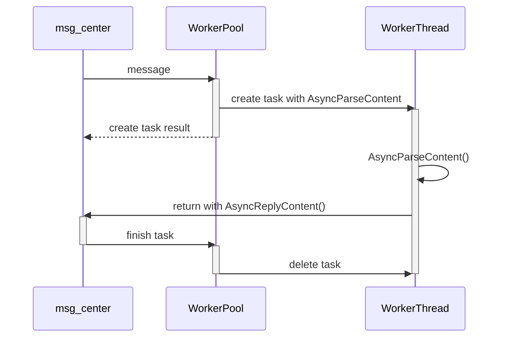
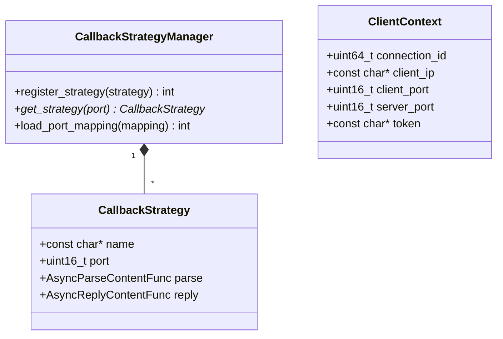

# Callback 模块详细设计

**模块名称**: Callback
**模块路径**: codes/core/source/callback/
**版本**: v1
**创建日期**: 2026-02-16

---

## 目录

1. [模块职责](#1-模块职责)
2. [类设计](#2-类设计)
3. [接口定义](#3-接口定义)
4. [回调策略模式](#4-回调策略模式)
5. [回调调用约定](#5-回调调用约定)
6. [依赖关系](#6-依赖关系)

---

## 1. 模块职责

Callback模块负责回调策略管理，主要职责包括：

- 回调策略管理
- 端口到回调的映射维护
- 回调函数调度

**该模块不负责**：
- 事件循环（由MsgCenter模块负责）
- 调测功能（由DebugChain模块负责）

---

## 2. 类设计

### 2.1 ClientContext 结构

**文件路径**: codes/core/include/callback/client_context.hpp

```cpp
#ifdef __cplusplus
extern "C" {
#endif

typedef struct {
    uint64_t connection_id;
    const char* client_ip;
    uint16_t client_port;
    uint16_t server_port;
    const char* token;
} ClientContext;

#ifdef __cplusplus
}
#endif
```

### 2.2 CallbackStrategy 结构

**文件路径**: codes/core/include/callback/callback_strategy.hpp

```cpp
#ifdef __cplusplus
extern "C" {
#endif

#include <stdint.h>

typedef uint32_t (*AsyncParseContentFunc)(const ClientContext* ctx,
                                           const uint8_t* in,
                                           uint32_t inLen);

typedef uint32_t (*AsyncReplyContentFunc)(const ClientContext* ctx,
                                           uint8_t* out,
                                           uint32_t* outLen);

typedef struct {
    const char* name;
    uint16_t port;
    AsyncParseContentFunc parse;
    AsyncReplyContentFunc reply;
} CallbackStrategy;

#ifdef __cplusplus
}
#endif

namespace https_server_sim {

class CallbackStrategyManager {
public:
    CallbackStrategyManager();
    ~CallbackStrategyManager();

    // 注册回调策略
    int register_strategy(const CallbackStrategy* strategy);

    // 获取指定端口的回调策略
    const CallbackStrategy* get_strategy(uint16_t port) const;

    // 加载配置中的端口映射
    int load_port_mapping(const std::unordered_map<std::string, std::string>& port_mapping);

private:
    std::unordered_map<uint16_t, const CallbackStrategy*> strategies_;
    mutable std::mutex mutex_;
};

} // namespace https_server_sim
```

---

## 3. 接口定义

### 3.1 C接口回调定义

```c
/**
 * @brief 内容解析函数（异步）
 * @param ctx client上下文信息
 * @param in 输入报文二进制数据
 * @param inLen 输入报文长度
 * @return 错误码，0表示成功
 *
 * 调用约定：
 * - 调用线程：工作线程（T4或T5）
 * - 并发调用：可被多个线程并发调用，需保证线程安全
 * - 阻塞行为：允许阻塞，但建议异步处理
 */
uint32_t AsyncParseContent(const ClientContext* ctx, const uint8_t* in, uint32_t inLen);

/**
 * @brief 内容回复函数（异步输出）
 * @param ctx client上下文信息
 * @param out 输出报文缓冲区
 * @param outLen 输入时为缓冲区大小，输出时为实际数据长度
 * @return 错误码，0表示成功
 *
 * 调用约定：
 * - 调用线程：工作线程（T4或T5）
 * - 并发调用：可被多个线程并发调用，需保证线程安全
 * - 阻塞行为：允许阻塞
 */
uint32_t AsyncReplyContent(const ClientContext* ctx, uint8_t* out, uint32_t* outLen);

// 注册回调策略
int RegisterCallbackStrategy(const CallbackStrategy* strategy);

// 获取指定端口的回调策略
const CallbackStrategy* GetCallbackStrategy(uint16_t port);
```

### 3.2 CallbackStrategyManager 类接口

| 接口 | 功能描述 | 参数 | 返回值 | 线程安全 |
|-----|---------|------|-------|---------|
| register_strategy(strategy) | 注册回调策略 | strategy | 0成功，非0错误码 | 是 |
| get_strategy(port) | 获取指定端口的回调策略 | port | CallbackStrategy* | 是 |
| load_port_mapping(mapping) | 加载配置中的端口映射 | mapping | 0成功，非0错误码 | 是 |

---

## 4. 回调策略模式

### 4.1 策略注册机制

```c
// 回调策略注册结构
typedef struct {
    const char* name;              // 回调名称
    uint16_t port;                 // 监听端口
    AsyncParseContentFunc parse;   // 解析函数
    AsyncReplyContentFunc reply;   // 回复函数
} CallbackStrategy;

// 注册回调策略
int RegisterCallbackStrategy(const CallbackStrategy* strategy);

// 获取指定端口的回调策略
const CallbackStrategy* GetCallbackStrategy(uint16_t port);
```

### 4.2 多端口监听实现方式

- 每个端口独立创建监听socket
- 所有监听socket注册到IO线程的epoll/select/kqueue
- accept成功后，根据监听端口获取对应的回调策略
- 连接与回调策略绑定，后续请求使用同一策略

### 4.3 端口与回调映射关系维护

- 使用哈希表存储端口到回调策略的映射
- 启动时根据配置初始化映射关系
- 运行时不支持动态修改映射（无配置热重载）

---

## 5. 回调调用约定

### 5.1 调用时序



### 5.2 内存生命周期规则

| 参数 | 所属函数 | 生命周期 | 释放者 |
|-----|---------|---------|-------|
| ClientContext* ctx | AsyncParseContent | 调用期间有效，调用后失效 | 调用方 |
| const uint8_t* in | AsyncParseContent | 调用期间有效，调用后失效 | 调用方 |
| ClientContext* ctx | AsyncReplyContent | 调用期间有效，调用后失效 | 调用方 |
| uint8_t* out | AsyncReplyContent | 调用前由调用方分配，调用后由调用方释放 | 调用方 |
| uint32_t* outLen | AsyncReplyContent | 调用期间有效，调用后失效 | 调用方 |

### 5.3 数据传递机制

1. **请求数据传递**：
   - msg_center接收到完整请求报文后，创建message_parser_task
   - 将报文数据通过in参数传递给AsyncParseContent
   - AsyncParseContent可保存报文数据供后续AsyncReplyContent使用

2. **响应数据传递**：
   - AsyncReplyContent被调用时，out缓冲区已分配
   - 回调实现将响应数据写入out缓冲区
   - 通过outLen返回实际数据长度
   - 最大响应数据长度：64MB

---

## 6. 依赖关系

### 6.1 依赖模块

| 模块 | 用途 |
|-----|------|
| ClientContext | Client上下文 |

### 6.2 依赖类图



---

**文档结束**
