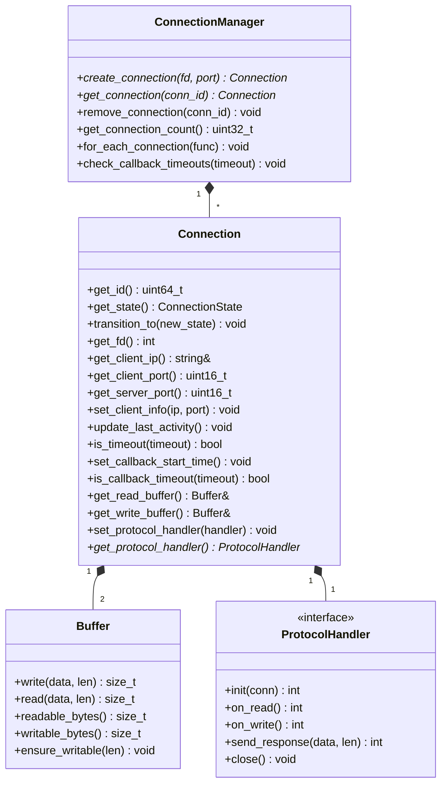

# Connection 模块详细设计

**模块名称**: Connection
**模块路径**: codes/core/source/connection/
**版本**: v1
**创建日期**: 2026-02-16

---

## 目录

1. [模块职责](#1-模块职责)
2. [类设计](#2-类设计)
3. [接口定义](#3-接口定义)
4. [状态机设计](#4-状态机设计)
5. [依赖关系](#5-依赖关系)

---

## 1. 模块职责

Connection模块负责单个连接的生命周期管理，主要职责包括：

- 单个连接的生命周期管理
- 连接状态机实现
- 超时检测与处理
- 连接数据缓冲区管理
- Client信息维护

**该模块不负责**：
- 协议解析（由Protocol模块负责）
- 事件循环（由MsgCenter模块负责）

---

## 2. 类设计

### 2.1 Connection 类

**文件路径**: codes/core/include/connection/connection.hpp

```cpp
namespace https_server_sim {

class Connection {
public:
    Connection(uint64_t conn_id, int fd, uint16_t server_port);
    ~Connection();

    // 获取连接ID
    uint64_t get_id() const { return conn_id_; }

    // 获取当前状态
    ConnectionState get_state() const { return state_; }

    // 状态转换
    void transition_to(ConnectionState new_state);

    // 获取socket fd
    int get_fd() const { return fd_; }

    // 获取Client信息
    const std::string& get_client_ip() const { return client_ip_; }
    uint16_t get_client_port() const { return client_port_; }
    uint16_t get_server_port() const { return server_port_; }

    // 设置Client信息
    void set_client_info(const std::string& ip, uint16_t port);

    // 超时相关
    void update_last_activity();
    bool is_timeout(uint32_t timeout_seconds) const;

    // 回调超时相关
    void set_callback_start_time();
    bool is_callback_timeout(uint32_t timeout_seconds) const;

    // 数据读写
    Buffer& get_read_buffer() { return read_buffer_; }
    Buffer& get_write_buffer() { return write_buffer_; }

    // 协议处理器
    void set_protocol_handler(std::unique_ptr<ProtocolHandler> handler);
    ProtocolHandler* get_protocol_handler() { return protocol_handler_.get(); }

private:
    uint64_t conn_id_;
    int fd_;
    ConnectionState state_;
    std::string client_ip_;
    uint16_t client_port_;
    uint16_t server_port_;
    std::chrono::steady_clock::time_point last_activity_;
    std::chrono::steady_clock::time_point callback_start_time_;
    bool callback_in_progress_;
    Buffer read_buffer_;
    Buffer write_buffer_;
    std::unique_ptr<ProtocolHandler> protocol_handler_;
};

} // namespace https_server_sim
```

### 2.2 ConnectionManager 类

**文件路径**: codes/core/include/connection/connection_manager.hpp

```cpp
namespace https_server_sim {

class ConnectionManager {
public:
    ConnectionManager();
    ~ConnectionManager();

    // 创建新连接
    Connection* create_connection(int fd, uint16_t server_port);

    // 获取连接
    Connection* get_connection(uint64_t conn_id);

    // 移除连接
    void remove_connection(uint64_t conn_id);

    // 获取当前连接数
    uint32_t get_connection_count() const;

    // 遍历所有连接（用于超时检查）
    template<typename Func>
    void for_each_connection(Func&& func);

    // 检查回调超时
    void check_callback_timeouts(uint32_t timeout_seconds);

private:
    std::unordered_map<uint64_t, std::unique_ptr<Connection>> connections_;
    mutable std::mutex mutex_;
    uint64_t next_conn_id_;
};

} // namespace https_server_sim
```

### 2.3 ConnectionState 枚举

```cpp
namespace https_server_sim {

enum class ConnectionState : uint8_t {
    ACCEPTING = 1,
    TLS_HANDSHAKING = 2,
    CONNECTED = 3,
    RECEIVING = 4,
    PROCESSING = 5,
    SENDING = 6,
    DISCONNECTING = 7,
    DISCONNECTED = 8
};

} // namespace https_server_sim
```

---

## 3. 接口定义

### 3.1 Connection 类接口

| 接口 | 功能描述 | 参数 | 返回值 | 线程安全 |
|-----|---------|------|-------|---------|
| get_id() | 获取连接ID | 无 | uint64_t | 是（只读） |
| get_state() | 获取当前状态 | 无 | ConnectionState | 是（只读） |
| transition_to(new_state) | 状态转换 | new_state: 新状态 | 无 | 否（仅Event Loop调用） |
| get_fd() | 获取socket fd | 无 | int | 是（只读） |
| get_client_ip() | 获取Client IP | 无 | const string& | 是（只读） |
| get_client_port() | 获取Client端口 | 无 | uint16_t | 是（只读） |
| get_server_port() | 获取Server端口 | 无 | uint16_t | 是（只读） |
| set_client_info(ip, port) | 设置Client信息 | ip, port | 无 | 否（仅Event Loop调用） |
| update_last_activity() | 更新活动时间 | 无 | 无 | 否（仅Event Loop调用） |
| is_timeout(timeout_seconds) | 检查是否超时 | timeout_seconds | bool | 是 |
| set_callback_start_time() | 设置回调开始时间 | 无 | 无 | 否（仅Event Loop调用） |
| is_callback_timeout(timeout_seconds) | 检查回调是否超时 | timeout_seconds | bool | 是 |
| get_read_buffer() | 获取读缓冲区 | 无 | Buffer& | 否（仅Event Loop调用） |
| get_write_buffer() | 获取写缓冲区 | 无 | Buffer& | 否（仅Event Loop调用） |
| set_protocol_handler(handler) | 设置协议处理器 | handler | 无 | 否（仅Event Loop调用） |
| get_protocol_handler() | 获取协议处理器 | 无 | ProtocolHandler* | 否（仅Event Loop调用） |

### 3.2 ConnectionManager 类接口

| 接口 | 功能描述 | 参数 | 返回值 | 线程安全 |
|-----|---------|------|-------|---------|
| create_connection(fd, port) | 创建新连接 | fd, port | Connection* | 是 |
| get_connection(conn_id) | 获取连接 | conn_id | Connection* | 是 |
| remove_connection(conn_id) | 移除连接 | conn_id | void | 是 |
| get_connection_count() | 获取连接数 | 无 | uint32_t | 是 |
| for_each_connection(func) | 遍历所有连接 | func | void | 是 |
| check_callback_timeouts(timeout) | 检查回调超时 | timeout | void | 是 |

---

## 4. 状态机设计

### 4.1 状态定义

| 状态 | 枚举值 | 说明 |
|-----|--------|------|
| ACCEPTING | 1 | TCP连接建立中，等待三次握手完成 |
| TLS_HANDSHAKING | 2 | TLS握手进行中 |
| CONNECTED | 3 | 连接已建立，等待接收数据 |
| RECEIVING | 4 | 正在接收请求报文 |
| PROCESSING | 5 | 报文处理中（回调处理中） |
| SENDING | 6 | 正在发送响应报文 |
| DISCONNECTING | 7 | 连接断开中 |
| DISCONNECTED | 8 | 连接已断开 |

### 4.2 状态转换规则

```
ACCEPTING → TLS_HANDSHAKING: TCP三次握手完成
TLS_HANDSHAKING → CONNECTED: TLS握手成功
CONNECTED → RECEIVING: 接收到HTTP请求头
RECEIVING → PROCESSING: 请求报文接收完成
PROCESSING → SENDING: 回调返回响应数据
SENDING → CONNECTED: 响应发送完成，等待下一个请求
CONNECTED → DISCONNECTING: 超时触发
RECEIVING → DISCONNECTING: 超时触发
PROCESSING → DISCONNECTING: 超时触发
SENDING → DISCONNECTING: 超时触发
PROCESSING → DISCONNECTING: 回调超时（配置的timeout_seconds）
ACCEPTING → DISCONNECTING: TCP连接失败
TLS_HANDSHAKING → DISCONNECTING: TLS握手失败
DISCONNECTING → DISCONNECTED: TCP连接关闭完成
```

### 4.3 状态转换异常处理

| 异常场景 | 处理方式 |
|---------|---------|
| ACCEPTING→TLS_HANDSHAKING超时（10秒） | 转换到DISCONNECTING，记录WARN日志 |
| TLS_HANDSHAKING→CONNECTED超时（30秒） | 转换到DISCONNECTING，记录WARN日志 |
| RECEIVING→PROCESSING超时（配置的timeout_seconds） | 转换到DISCONNECTING，记录WARN日志 |
| PROCESSING→SENDING超时（配置的timeout_seconds） | 转换到DISCONNECTING，记录ERROR日志，回调超时 |
| 任意状态下网络错误 | 转换到DISCONNECTING，记录ERROR日志 |
| 内存分配失败 | 转换到DISCONNECTING，记录FATAL日志 |

---

## 5. 依赖关系

### 5.1 依赖模块

| 模块 | 用途 |
|-----|------|
| Buffer | 数据缓冲区管理 |
| ProtocolHandler | 协议处理 |

### 5.2 依赖类图



---

**文档结束**
