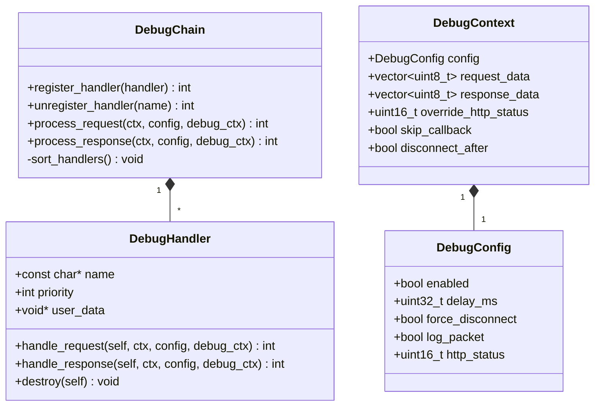

# DebugChain 模块详细设计

**模块名称**: DebugChain
**模块路径**: codes/core/source/debug_chain/
**版本**: v1
**创建日期**: 2026-02-16

---

## 目录

1. [模块职责](#1-模块职责)
2. [类设计](#2-类设计)
3. [接口定义](#3-接口定义)
4. [调测点执行顺序](#4-调测点执行顺序)
5. [调测点扩展机制](#5-调测点扩展机制)
6. [依赖关系](#6-依赖关系)

---

## 1. 模块职责

DebugChain模块负责调测职责链管理，主要职责包括：

- 调测点职责链管理
- 各调测点实现（延迟响应、强制断开、日志记录、错误码）
- 调测点注册与扩展

**该模块不负责**：
- 连接管理（由Connection模块负责）
- 协议解析（由Protocol模块负责）

---

## 2. 类设计

### 2.1 DebugConfig 结构

**文件路径**: codes/core/include/debug_chain/debug_config.hpp

```cpp
namespace https_server_sim {

struct DebugConfig {
    bool enabled = false;
    uint32_t delay_ms = 0;
    bool force_disconnect = false;
    bool log_packet = false;
    uint16_t http_status = 200;
};

} // namespace https_server_sim
```

### 2.2 DebugContext 结构

**文件路径**: codes/core/include/debug_chain/debug_context.hpp

```cpp
namespace https_server_sim {

struct DebugContext {
    DebugConfig config;
    std::vector<uint8_t> request_data;
    std::vector<uint8_t> response_data;
    uint16_t override_http_status = 0;
    bool skip_callback = false;
    bool disconnect_after = false;
};

} // namespace https_server_sim
```

### 2.3 DebugHandler 结构

**文件路径**: codes/core/include/debug_chain/debug_handler.hpp

```cpp
namespace https_server_sim {

struct DebugHandler {
    const char* name;
    int priority;
    void* user_data;

    int (*handle_request)(DebugHandler* self,
                         const ClientContext* ctx,
                         const DebugConfig* config,
                         DebugContext* debug_ctx);

    int (*handle_response)(DebugHandler* self,
                          const ClientContext* ctx,
                          const DebugConfig* config,
                          DebugContext* debug_ctx);

    void (*destroy)(DebugHandler* self);
};

} // namespace https_server_sim
```

### 2.4 DebugChain 类

**文件路径**: codes/core/include/debug_chain/debug_chain.hpp

```cpp
namespace https_server_sim {

class DebugChain {
public:
    DebugChain();
    ~DebugChain();

    // 注册调测点
    int register_handler(DebugHandler* handler);

    // 注销调测点
    int unregister_handler(const char* name);

    // 处理请求
    int process_request(const ClientContext* ctx,
                       const DebugConfig* config,
                       DebugContext* debug_ctx);

    // 处理响应
    int process_response(const ClientContext* ctx,
                        const DebugConfig* config,
                        DebugContext* debug_ctx);

private:
    // 按优先级排序
    void sort_handlers();

    std::vector<DebugHandler*> handlers_;
    bool sorted_;
};

} // namespace https_server_sim
```

---

## 3. 接口定义

### 3.1 DebugChain 类接口

| 接口 | 功能描述 | 参数 | 返回值 | 线程安全 |
|-----|---------|------|-------|---------|
| register_handler(handler) | 注册调测点 | handler | 0成功，非0错误码 | 否（仅启动前调用） |
| unregister_handler(name) | 注销调测点 | name | 0成功，非0错误码 | 否（仅启动前调用） |
| process_request(ctx, config, debug_ctx) | 处理请求 | ctx, config, debug_ctx | 0成功，非0错误码 | 是 |
| process_response(ctx, config, debug_ctx) | 处理响应 | ctx, config, debug_ctx | 0成功，非0错误码 | 是 |

### 3.2 DebugHandler 结构接口

| 字段 | 功能描述 |
|-----|---------|
| name | 调测点名称 |
| priority | 优先级（越小越先执行） |
| user_data | 用户数据 |
| handle_request | 处理请求函数指针 |
| handle_response | 处理响应函数指针 |
| destroy | 销毁函数指针 |

---

## 4. 调测点执行顺序

```
请求 → [延迟响应] → [强制断开] → [日志记录] → [错误码] → 回调处理
```

### 4.1 各调测点配置规则

| 调测点 | 配置字段 | 类型 | 取值范围 | 默认值 | 说明 |
|-------|---------|------|---------|--------|------|
| 延迟响应 | delay_ms | integer | 0-60000 | 0 | 延迟毫秒数，0表示不延迟 |
| 强制断开 | force_disconnect | boolean | true/false | false | 处理完后是否强制断开连接 |
| 日志记录 | log_packet | boolean | true/false | false | 是否记录请求/响应报文 |
| 错误码返回 | http_status | integer | 100-599 | 200 | 返回的HTTP状态码 |

---

## 5. 调测点扩展机制

### 5.1 调测点扩展接口

```c
// 调测点接口
typedef struct DebugHandler DebugHandler;

struct DebugHandler {
    const char* name;              // 调测点名称
    int priority;                   // 优先级（越小越先执行）
    void* user_data;                // 用户数据

    // 处理请求
    int (*handle_request)(DebugHandler* self,
                         const ClientContext* ctx,
                         const DebugConfig* config,
                         DebugContext* debug_ctx);

    // 处理响应
    int (*handle_response)(DebugHandler* self,
                          const ClientContext* ctx,
                          const DebugConfig* config,
                          DebugContext* debug_ctx);

    // 清理资源
    void (*destroy)(DebugHandler* self);
};

// 注册调测点
int RegisterDebugHandler(DebugHandler* handler);

// 注销调测点
int UnregisterDebugHandler(const char* name);
```

### 5.2 调测点扩展规范

**接口标准**：
- 必须实现DebugHandler结构的handle_request、handle_response、destroy三个函数指针
- priority值越小，优先级越高，越先执行
- name必须唯一，用于注销

**接入流程**：
1. 定义DebugHandler结构实例
2. 实现handle_request、handle_response、destroy函数
3. 在Server启动前调用RegisterDebugHandler注册

**约束条件**：
- 调测点注册必须在server启动前完成
- 调测点顺序由priority决定，priority相同按注册顺序
- handle_request和handle_response必须是线程安全的

---

## 6. 依赖关系

### 6.1 依赖模块

| 模块 | 用途 |
|-----|------|
| ClientContext | Client上下文 |

### 6.2 依赖类图



---

**文档结束**
