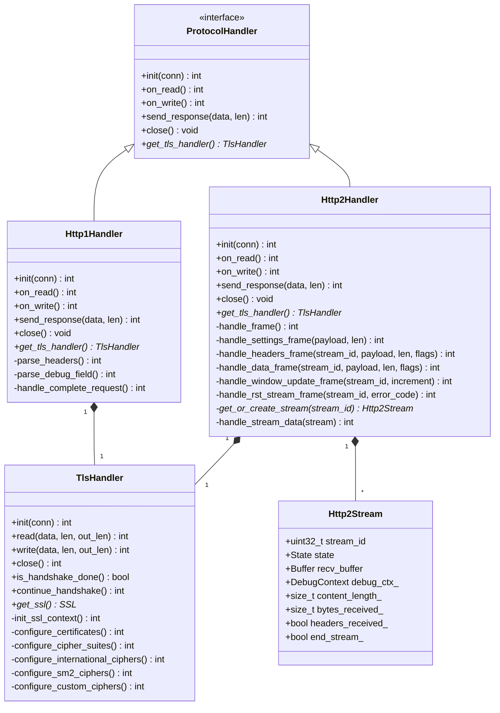

# Protocol 模块详细设计

**模块名称**: Protocol
**模块路径**: codes/core/source/protocol/
**版本**: v1
**创建日期**: 2026-02-16

---

## 目录

1. [模块职责](#1-模块职责)
2. [类设计](#2-类设计)
3. [接口定义](#3-接口定义)
4. [国密SM2证书配置](#4-国密sm2证书配置)
5. [大报文处理机制](#5-大报文处理机制)
6. [HTTP/2 Stream级别回调](#6-http2-stream级别回调)
7. [依赖关系](#7-依赖关系)

---

## 1. 模块职责

Protocol模块负责协议处理，主要职责包括：

- TLS握手处理
- HTTP/1.1协议解析与生成
- HTTP/2协议解析与生成
- 证书与Cipher Suites管理
- 国密SM2证书支持

**该模块不负责**：
- 连接生命周期管理（由Connection模块负责）
- 事件循环（由MsgCenter模块负责）

---

## 2. 类设计

### 2.1 ProtocolHandler 接口

**文件路径**: codes/core/include/protocol/protocol_handler.hpp

```cpp
namespace https_server_sim {

class ProtocolHandler {
public:
    virtual ~ProtocolHandler() = default;

    // 初始化协议处理器
    virtual int init(Connection* conn) = 0;

    // 处理读事件
    virtual int on_read() = 0;

    // 处理写事件
    virtual int on_write() = 0;

    // 发送响应
    virtual int send_response(const uint8_t* data, uint32_t len) = 0;

    // 关闭
    virtual void close() = 0;

    // 获取底层TLS处理器
    virtual TlsHandler* get_tls_handler() { return nullptr; }
};

} // namespace https_server_sim
```

### 2.2 TlsHandler 类

**文件路径**: codes/core/include/protocol/tls_handler.hpp

```cpp
namespace https_server_sim {

class TlsHandler {
public:
    TlsHandler(const Config* config);
    ~TlsHandler();

    int init(Connection* conn);
    int read(uint8_t* data, size_t len, size_t* out_len);
    int write(const uint8_t* data, size_t len, size_t* out_len);
    int close();

    // TLS握手状态检查
    bool is_handshake_done() const { return handshake_done_; }

    // 继续握手
    int continue_handshake();

    // 获取SSL对象
    SSL* get_ssl() { return ssl_; }

private:
    // 初始化SSL上下文
    int init_ssl_context();

    // 配置证书
    int configure_certificates();

    // 配置Cipher Suites
    int configure_cipher_suites();

    // 配置国际证书Cipher Suites
    int configure_international_ciphers();

    // 配置国密证书Cipher Suites
    int configure_sm2_ciphers();

    // 配置自定义证书Cipher Suites
    int configure_custom_ciphers();

    const Config* config_;
    Connection* conn_;
    SSL* ssl_;
    SSL_CTX* ssl_ctx_;
    bool handshake_done_;
};

} // namespace https_server_sim
```

### 2.3 Http1Handler 类

**文件路径**: codes/core/include/protocol/http1_handler.hpp

```cpp
namespace https_server_sim {

class Http1Handler : public ProtocolHandler {
public:
    Http1Handler(std::unique_ptr<TlsHandler> tls_handler);
    ~Http1Handler() override;

    int init(Connection* conn) override;
    int on_read() override;
    int on_write() override;
    int send_response(const uint8_t* data, uint32_t len) override;
    void close() override;
    TlsHandler* get_tls_handler() override { return tls_handler_.get(); }

private:
    // 解析HTTP请求头
    int parse_headers();

    // 解析Debug字段
    int parse_debug_field();

    // 处理完整请求
    int handle_complete_request();

    std::unique_ptr<TlsHandler> tls_handler_;
    Connection* conn_;
    bool headers_parsed_;
    size_t content_length_;
    size_t bytes_received_;
    DebugContext debug_ctx_;
};

} // namespace https_server_sim
```

### 2.4 Http2Handler 类

**文件路径**: codes/core/include/protocol/http2_handler.hpp

```cpp
namespace https_server_sim {

struct Http2Stream {
    uint32_t stream_id;
    enum State {
        IDLE,
        OPEN,
        HALF_CLOSED_REMOTE,
        HALF_CLOSED_LOCAL,
        CLOSED
    } state;
    Buffer recv_buffer;
    DebugContext debug_ctx_;
    size_t content_length_;
    size_t bytes_received_;
    bool headers_received_;
    bool end_stream_;
};

class Http2Handler : public ProtocolHandler {
public:
    Http2Handler(std::unique_ptr<TlsHandler> tls_handler, const Config* config);
    ~Http2Handler() override;

    int init(Connection* conn) override;
    int on_read() override;
    int on_write() override;
    int send_response(const uint8_t* data, uint32_t len) override;
    void close() override;
    TlsHandler* get_tls_handler() override { return tls_handler_.get(); }

private:
    // 处理HTTP/2帧
    int handle_frame();

    // 处理SETTINGS帧
    int handle_settings_frame(const uint8_t* payload, size_t len);

    // 处理HEADERS帧
    int handle_headers_frame(uint32_t stream_id, const uint8_t* payload, size_t len, uint8_t flags);

    // 处理DATA帧
    int handle_data_frame(uint32_t stream_id, const uint8_t* payload, size_t len, uint8_t flags);

    // 处理WINDOW_UPDATE帧
    int handle_window_update_frame(uint32_t stream_id, uint32_t window_size_increment);

    // 处理RST_STREAM帧
    int handle_rst_stream_frame(uint32_t stream_id, uint32_t error_code);

    // 获取或创建Stream
    Http2Stream* get_or_create_stream(uint32_t stream_id);

    // 处理完整Stream数据
    int handle_stream_data(Http2Stream* stream);

    std::unique_ptr<TlsHandler> tls_handler_;
    Connection* conn_;
    const Config* config_;
    std::unordered_map<uint32_t, std::unique_ptr<Http2Stream>> streams_;
    uint32_t max_concurrent_streams_;
    uint32_t initial_window_size_;
    uint32_t connection_window_size_;
    bool preface_received_;
    Buffer frame_buffer_;
};

} // namespace https_server_sim
```

---

## 3. 接口定义

### 3.1 ProtocolHandler 接口

| 接口 | 功能描述 | 参数 | 返回值 |
|-----|---------|------|-------|
| init(conn) | 初始化协议处理器 | conn: Connection指针 | 0成功，非0错误码 |
| on_read() | 处理读事件 | 无 | 0成功，非0错误码 |
| on_write() | 处理写事件 | 无 | 0成功，非0错误码 |
| send_response(data, len) | 发送响应 | data: 数据指针, len: 长度 | 0成功，非0错误码 |
| close() | 关闭 | 无 | 无 |
| get_tls_handler() | 获取TLS处理器 | 无 | TlsHandler指针 |

### 3.2 TlsHandler 类接口

| 接口 | 功能描述 | 参数 | 返回值 |
|-----|---------|------|-------|
| init(conn) | 初始化 | conn: Connection指针 | 0成功，非0错误码 |
| read(data, len, out_len) | 读取数据 | data, len, out_len | 0成功，非0错误码 |
| write(data, len, out_len) | 写入数据 | data, len, out_len | 0成功，非0错误码 |
| close() | 关闭 | 无 | 0成功，非0错误码 |
| is_handshake_done() | 检查握手是否完成 | 无 | bool |
| continue_handshake() | 继续握手 | 无 | 0成功，非0错误码 |
| get_ssl() | 获取SSL对象 | 无 | SSL* |

---

## 4. 国密SM2证书配置

### 4.1 证书类型与Cipher Suites对应关系

**国际证书（cert_type=international）：**
- TLS 1.2支持的Cipher Suites：
  - TLS_ECDHE_RSA_WITH_AES_128_GCM_SHA256
  - TLS_ECDHE_RSA_WITH_AES_256_GCM_SHA384
  - TLS_ECDHE_ECDSA_WITH_AES_128_GCM_SHA256
  - TLS_ECDHE_ECDSA_WITH_AES_256_GCM_SHA384
- TLS 1.3支持的Cipher Suites：
  - TLS_AES_128_GCM_SHA256
  - TLS_AES_256_GCM_SHA384
  - TLS_CHACHA20_POLY1305_SHA256

**国密证书（cert_type=sm2）：**
- TLS 1.2支持的Cipher Suites（遵循GM/T 0024-2014标准）：
  - TLS_ECDHE_SM2_WITH_SM4_SM3
  - TLS_SM2_WITH_SM4_SM3
- TLS 1.3支持的Cipher Suites（遵循GM/T 0126-2022标准）：
  - TLS_SM4_GCM_SM3

**自定义证书（cert_type=custom）：**
- 使用用户配置的cipher_suites列表

---

## 5. 大报文处理机制

### 5.1 单报文最大支持长度

64MB（单个HTTP请求body限制）

### 5.2 大报文分块接收与缓冲区管理策略

1. **接收缓冲区管理**：
   - 初始分配8KB缓冲区
   - 动态扩展：每次需要更多空间时翻倍，最大64MB
   - 使用Buffer类的ensure_writable()方法确保空间
   - 超过64MB返回413 Payload Too Large错误

2. **分块接收流程**：
   ```
   1. 接收HTTP请求头，解析Content-Length
   2. 若Content-Length > 64MB → 返回413错误
   3. 否则分配所需缓冲区（最大64MB）
   4. 循环读取数据直到接收完整报文
   5. 每次读取最多16KB数据
   6. 更新last_activity时间戳
   ```

3. **HTTP/2大报文处理**：
   - 每个stream独立接收缓冲区
   - 每个stream最大64MB限制
   - 超过限制返回RST_STREAM帧

---

## 6. HTTP/2 Stream级别回调

HTTP/2多路复用时，**每个stream独立回调**，透传stream数据。

每个Http2Stream结构中，每个stream拥有：
- 独立的stream_id
- 独立的接收缓冲区
- 独立的DebugContext
- 独立的回调上下文

回调时，ClientContext的connection_id为连接ID，stream_id通过单独参数传递。

---

## 7. 依赖关系

### 7.1 依赖模块

| 模块 | 用途 |
|-----|------|
| Connection | 连接管理 |
| Buffer | 数据缓冲区管理 |
| DebugContext | 调测上下文 |
| Config | 配置管理 |

### 7.2 外部依赖

| 依赖 | 用途 |
|-----|------|
| OpenSSL | TLS协议实现 |

### 7.3 依赖类图



---

**文档结束**
