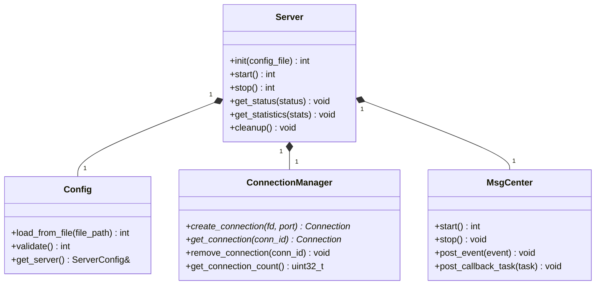

# Server 模块详细设计

**模块名称**: Server
**模块路径**: codes/core/source/server/
**版本**: v1
**创建日期**: 2026-02-16

---

## 目录

1. [模块职责](#1-模块职责)
2. [类设计](#2-类设计)
3. [接口定义](#3-接口定义)
4. [Graceful Shutdown 流程](#4-graceful-shutdown-流程)
5. [依赖关系](#5-依赖关系)

---

## 1. 模块职责

Server模块负责整个HTTPS Server模拟器的生命周期管理，主要职责包括：

- Server实例的创建与销毁
- 监听socket的创建与绑定
- 全局资源初始化与清理
- Graceful Shutdown流程控制
- 配置加载与校验
- 各子模块（ConnectionManager、MsgCenter）的协调

**该模块不负责**：
- 具体连接的处理（由Connection模块负责）
- 协议解析（由Protocol模块负责）
- 事件循环（由MsgCenter模块负责）

---

## 2. 类设计

### 2.1 Server 类

**文件路径**: codes/core/include/server/server.hpp

```cpp
namespace https_server_sim {

class Server {
public:
    Server();
    ~Server();

    // 初始化Server，加载配置
    int init(const std::string& config_file);

    // 启动Server
    int start();

    // 停止Server
    int stop();

    // 获取状态
    void get_status(ServerStatus* status) const;

    // 获取统计信息
    void get_statistics(Statistics* stats) const;

    // 清理资源
    void cleanup();

private:
    // 初始化监听socket
    int init_listen_sockets();

    // 优雅关闭
    void graceful_shutdown();

    // Graceful Shutdown步骤1：停止接受新连接
    void stop_accepting();

    // Graceful Shutdown步骤2：等待现有请求处理
    void wait_pending_requests();

    // Graceful Shutdown步骤3：关闭连接
    void close_all_connections();

    // Graceful Shutdown步骤4：清理资源
    void cleanup_resources();

    std::unique_ptr<Config> config_;
    std::unique_ptr<ConnectionManager> conn_manager_;
    std::unique_ptr<MsgCenter> msg_center_;
    std::vector<int> listen_fds_;
    std::atomic<bool> running_;
    std::atomic<bool> graceful_shutdown_;
};

} // namespace https_server_sim
```

### 2.2 ServerStatus 结构

**文件路径**: codes/api/adapt/include/server_adapt.h

```c
typedef enum {
    SERVER_STATUS_STOPPED = 0,
    SERVER_STATUS_INITIALIZING = 1,
    SERVER_STATUS_RUNNING = 2,
    SERVER_STATUS_SHUTTING_DOWN = 3,
    SERVER_STATUS_ERROR = 4
} ServerStatusEnum;

typedef struct {
    ServerStatusEnum status;
    uint64_t uptime_seconds;
    uint32_t current_connections;
    uint16_t listen_port;
    char listen_ip[64];
} ServerStatus;
```

---

## 3. 接口定义

### 3.1 公有接口

| 接口 | 功能描述 | 参数 | 返回值 | 线程安全 |
|-----|---------|------|-------|---------|
| init(config_file) | 初始化Server，加载配置 | config_file: 配置文件路径 | 0成功，非0错误码 | 否（仅启动时调用） |
| start() | 启动Server | 无 | 0成功，非0错误码 | 否（仅启动时调用） |
| stop() | 停止Server | 无 | 0成功，非0错误码 | 是 |
| get_status(status) | 获取当前状态 | status: 输出参数 | 无 | 是 |
| get_statistics(stats) | 获取统计信息 | stats: 输出参数 | 无 | 是 |
| cleanup() | 清理资源 | 无 | 无 | 否（仅停止后调用） |

### 3.2 私有接口

| 接口 | 功能描述 |
|-----|---------|
| init_listen_sockets() | 创建并绑定监听socket |
| graceful_shutdown() | 执行优雅关闭流程 |
| stop_accepting() | 停止接受新连接 |
| wait_pending_requests() | 等待现有请求处理完成 |
| close_all_connections() | 关闭所有连接 |
| cleanup_resources() | 清理所有资源 |

---

## 4. Graceful Shutdown 流程

### 4.1 关闭步骤

**步骤1：停止接受新连接**
- 关闭所有监听socket
- 停止accept调用
- 设置graceful_shutdown标志

**步骤2：处理现有请求**
- 等待正在处理的请求完成
- 最长等待时间：30秒
- 超时后强制终止

**步骤3：关闭连接**
- 遍历所有连接，发送close_notify（TLS）
- 等待连接关闭
- 最长等待时间：5秒
- 超时后强制关闭

**步骤4：清理资源**
- 释放Event Loop资源
- 释放连接池资源
- 停止所有线程
- 释放回调资源

### 4.2 状态转换

```
STOPPED → INITIALIZING → RUNNING → SHUTTING_DOWN → STOPPED
```

---

## 5. 依赖关系

### 5.1 依赖模块

| 模块 | 用途 |
|-----|------|
| Config | 配置加载与校验 |
| ConnectionManager | 连接生命周期管理 |
| MsgCenter | 事件循环与消息分发 |

### 5.2 依赖类图



---

**文档结束**
