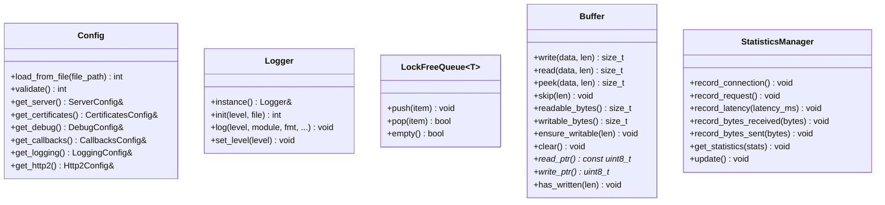

# Utils 模块详细设计

**模块名称**: Utils
**模块路径**: codes/core/source/utils/
**版本**: v1
**创建日期**: 2026-02-16

---

## 目录

1. [模块职责](#1-模块职责)
2. [类设计](#2-类设计)
3. [接口定义](#3-接口定义)
4. [配置职责划分](#4-配置职责划分)
5. [依赖关系](#5-依赖关系)

---

## 1. 模块职责

Utils模块负责工具类实现，主要职责包括：

- 日志系统
- 无锁队列
- 缓冲区管理
- 统计信息管理
- 配置解析

**该模块不负责**：
- 配置加载与校验（由Server模块负责）

---

## 2. 类设计

### 2.1 Config 类

**文件路径**: codes/core/include/config/config.hpp

```cpp
namespace https_server_sim {

struct ServerConfig {
    std::string listen_ip = "0.0.0.0";
    uint16_t listen_port = 8443;
    std::string tls_version = "both";
    uint32_t thread_count = 5;
    uint32_t timeout_seconds = 30;
};

struct CertificatesConfig {
    std::string cert_file;
    std::string key_file;
    std::string cert_type = "international";
    std::vector<std::string> cipher_suites;
};

struct DebugConfig {
    bool enabled = false;
    bool log_packets = false;
};

struct CallbacksConfig {
    std::string strategy = "port_based";
    std::unordered_map<std::string, std::string> port_mapping;
};

struct LoggingConfig {
    std::string level = "INFO";
    std::string file;
    uint32_t max_size_mb = 100;
    uint32_t max_files = 10;
};

struct Http2Config {
    bool enabled = true;
    uint32_t max_concurrent_streams = 100;
    uint32_t initial_window_size = 65535;
};

class Config {
public:
    Config();
    ~Config();

    // 从文件加载配置
    int load_from_file(const std::string& file_path);

    // 校验配置
    int validate() const;

    // 获取配置项
    const ServerConfig& get_server() const { return server_; }
    const CertificatesConfig& get_certificates() const { return certificates_; }
    const DebugConfig& get_debug() const { return debug_; }
    const CallbacksConfig& get_callbacks() const { return callbacks_; }
    const LoggingConfig& get_logging() const { return logging_; }
    const Http2Config& get_http2() const { return http2_; }

private:
    ServerConfig server_;
    CertificatesConfig certificates_;
    DebugConfig debug_;
    CallbacksConfig callbacks_;
    LoggingConfig logging_;
    Http2Config http2_;
};

} // namespace https_server_sim
```

### 2.2 Logger 类

**文件路径**: codes/core/include/utils/logger.hpp

```cpp
namespace https_server_sim {

enum class LogLevel : uint8_t {
    DEBUG = 0,
    INFO = 1,
    WARN = 2,
    ERROR = 3
};

class Logger {
public:
    static Logger& instance();

    // 初始化日志
    int init(const std::string& level, const std::string& file = "");

    // 日志输出
    void log(LogLevel level, const char* module, const char* fmt, ...);

    // 设置日志级别
    void set_level(LogLevel level);

private:
    Logger();
    ~Logger();

    LogLevel level_;
    std::ofstream file_;
    std::mutex mutex_;
};

#define LOG_DEBUG(module, fmt, ...) \
    Logger::instance().log(LogLevel::DEBUG, module, fmt, ##__VA_ARGS__)
#define LOG_INFO(module, fmt, ...) \
    Logger::instance().log(LogLevel::INFO, module, fmt, ##__VA_ARGS__)
#define LOG_WARN(module, fmt, ...) \
    Logger::instance().log(LogLevel::WARN, module, fmt, ##__VA_ARGS__)
#define LOG_ERROR(module, fmt, ...) \
    Logger::instance().log(LogLevel::ERROR, module, fmt, ##__VA_ARGS__)

} // namespace https_server_sim
```

### 2.3 LockFreeQueue 类

**文件路径**: codes/core/include/utils/lockfree_queue.hpp

```cpp
namespace https_server_sim {

template<typename T>
class LockFreeQueue {
public:
    LockFreeQueue();
    ~LockFreeQueue();

    // 入队
    void push(T item);

    // 出队
    bool pop(T& item);

    // 检查是否为空
    bool empty() const;

private:
    struct Node {
        T data;
        std::atomic<Node*> next;
        Node(T d) : data(std::move(d)), next(nullptr) {}
    };

    std::atomic<Node*> head_;
    std::atomic<Node*> tail_;
};

} // namespace https_server_sim
```

### 2.4 Buffer 类

**文件路径**: codes/core/include/utils/buffer.hpp

```cpp
namespace https_server_sim {

class Buffer {
public:
    Buffer(size_t initial_size = 8192);
    ~Buffer();

    // 写入数据
    size_t write(const uint8_t* data, size_t len);

    // 读取数据
    size_t read(uint8_t* data, size_t len);

    // 查看数据（不移动读指针）
    size_t peek(uint8_t* data, size_t len) const;

    // 跳过数据
    void skip(size_t len);

    // 获取可读数据长度
    size_t readable_bytes() const;

    // 获取可写空间
    size_t writable_bytes() const;

    // 确保有足够的可写空间
    void ensure_writable(size_t len);

    // 清空缓冲区
    void clear();

    // 获取读指针
    const uint8_t* read_ptr() const;

    // 获取写指针
    uint8_t* write_ptr();

    // 提交写入
    void has_written(size_t len);

private:
    std::vector<uint8_t> data_;
    size_t read_index_;
    size_t write_index_;
};

} // namespace https_server_sim
```

### 2.5 StatisticsManager 类

**文件路径**: codes/core/include/utils/statistics.hpp

```cpp
namespace https_server_sim {

struct Statistics {
    uint64_t total_connections = 0;
    uint64_t total_requests = 0;
    uint64_t requests_per_second = 0;
    uint32_t avg_response_latency_ms = 0;
    uint32_t p50_response_latency_ms = 0;
    uint32_t p95_response_latency_ms = 0;
    uint32_t p99_response_latency_ms = 0;
    uint64_t total_bytes_received = 0;
    uint64_t total_bytes_sent = 0;
};

class StatisticsManager {
public:
    StatisticsManager();
    ~StatisticsManager();

    // 记录新连接
    void record_connection();

    // 记录请求
    void record_request();

    // 记录响应延迟
    void record_latency(uint32_t latency_ms);

    // 记录接收字节
    void record_bytes_received(uint64_t bytes);

    // 记录发送字节
    void record_bytes_sent(uint64_t bytes);

    // 获取统计信息
    void get_statistics(Statistics* stats);

    // 定期更新（每秒调用）
    void update();

private:
    std::atomic<uint64_t> total_connections_;
    std::atomic<uint64_t> total_requests_;
    std::atomic<uint64_t> total_bytes_received_;
    std::atomic<uint64_t> total_bytes_sent_;
    std::atomic<uint64_t> requests_last_second_;
    std::atomic<uint64_t> requests_current_second_;
    std::atomic<uint64_t> requests_per_second_;

    std::vector<uint32_t> latencies_;
    std::mutex latencies_mutex_;
};

} // namespace https_server_sim
```

---

## 3. 接口定义

### 3.1 Config 类接口

| 接口 | 功能描述 | 参数 | 返回值 |
|-----|---------|------|-------|
| load_from_file(file_path) | 从文件加载配置 | file_path | 0成功，非0错误码 |
| validate() | 校验配置 | 无 | 0成功，非0错误码 |
| get_server() | 获取Server配置 | 无 | const ServerConfig& |
| get_certificates() | 获取证书配置 | 无 | const CertificatesConfig& |
| get_debug() | 获取Debug配置 | 无 | const DebugConfig& |
| get_callbacks() | 获取Callbacks配置 | 无 | const CallbacksConfig& |
| get_logging() | 获取Logging配置 | 无 | const LoggingConfig& |
| get_http2() | 获取Http2配置 | 无 | const Http2Config& |

### 3.2 Logger 类接口

| 接口 | 功能描述 | 参数 | 返回值 |
|-----|---------|------|-------|
| instance() | 获取单例 | 无 | Logger& |
| init(level, file) | 初始化日志 | level, file（可选） | 0成功，非0错误码 |
| log(level, module, fmt, ...) | 输出日志 | level, module, fmt, ... | 无 |
| set_level(level) | 设置日志级别 | level | 无 |

### 3.3 Buffer 类接口

| 接口 | 功能描述 | 参数 | 返回值 |
|-----|---------|------|-------|
| write(data, len) | 写入数据 | data, len | size_t |
| read(data, len) | 读取数据 | data, len | size_t |
| peek(data, len) | 查看数据（不移动读指针） | data, len | size_t |
| skip(len) | 跳过数据 | len | void |
| readable_bytes() | 获取可读数据长度 | 无 | size_t |
| writable_bytes() | 获取可写空间 | 无 | size_t |
| ensure_writable(len) | 确保有足够的可写空间 | len | void |
| clear() | 清空缓冲区 | 无 | void |
| read_ptr() | 获取读指针 | 无 | const uint8_t* |
| write_ptr() | 获取写指针 | 无 | uint8_t* |
| has_written(len) | 提交写入 | len | void |

---

## 4. 配置职责划分

### 4.1 Config类（Utils模块）

负责配置文件解析、JSON解析、配置数据存储。

### 4.2 Server模块

负责配置加载、配置校验、配置使用。

---

## 5. 依赖关系

### 5.1 外部依赖

| 依赖 | 用途 |
|-----|------|
| JSON Library | JSON解析 |

### 5.2 依赖类图



---

**文档结束**
