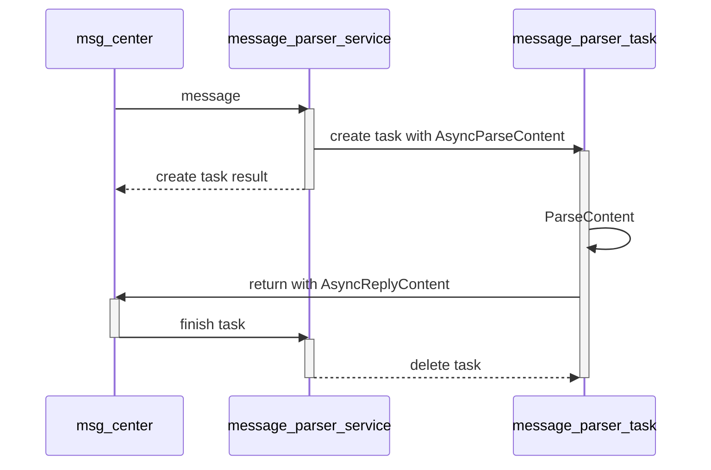

# HTTPS Server 模拟器 - 软件需求规格说明书 (SRS)

**版本**: 1.0
**创建日期**: 2026-02-15
**状态**: 需求已确认

---

## 目录

1. [项目概述](#1-项目概述)
2. [功能需求](#2-功能需求)
3. [非功能需求](#3-非功能需求)
4. [接口设计](#4-接口设计)
5. [系统架构](#5-系统架构)
6. [配置文件格式](#6-配置文件格式)
7. [项目目录结构](#7-项目目录结构)
8. [调测点设计](#8-调测点设计)

---

## 1. 项目概述

### 1.1 项目背景
开发一个HTTPS Server端模拟器，用于测试用户自己编写的Client端的报文请求。

### 1.2 项目目标
- 提供一个可配置的HTTPS Server模拟器
- 支持通过C接口回调进行自定义报文解析和转译
- 支持高并发连接（1000个client同时连接）
- 提供测试用的Client模拟器
- 支持Windows、Linux、Mac多平台

### 1.3 范围界定

#### 包含内容
- HTTPS Server模拟器核心（C++17）
- Python 3.8适配层（CLI和GUI）
- 测试用Client模拟器（Python）
- C接口回调机制
- 多证书支持（国际证书、国密证书、自定义证书）

#### 不包含内容
- 版本升级机制（卸载后重新安装即可）
- 高可靠性（掉电等异常场景不考虑）
- 安全性（本身就是测试工具，不做安全加固）

---

## 2. 功能需求

### 2.1 HTTPS Server核心功能

| ID | 功能点 | 描述 |
|----|--------|------|
| FR-2.1.1 | TLS连接 | 支持TLS 1.2和TLS 1.3 |
| FR-2.1.2 | 多证书支持 | 支持国际证书、国密证书、自定义证书 |
| FR-2.1.3 | HTTP协议支持 | 支持HTTP/1.1、HTTP/2及所有版本 |
| FR-2.1.4 | HTTP方法支持 | 支持GET、POST、PUT、DELETE等所有HTTP方法 |
| FR-2.1.5 | 报文透传 | 将HTTPS body作为二进制流透传给回调函数 |
| FR-2.1.6 | 响应返回 | 从回调函数获取响应并返回给client |

### 2.2 并发与连接管理

| ID | 功能点 | 描述 |
|----|--------|------|
| FR-2.2.1 | 进程限制 | 最多1个进程 |
| FR-2.2.2 | 线程限制 | 进程内至多5个线程 |
| FR-2.2.3 | 最大连接数 | 同时支持1000个client连接 |
| FR-2.2.4 | 连接建立 | TCP三次握手 + TLS认证成功才算连接建立 |
| FR-2.2.5 | 连接超时 | 默认30s无活动断开，可配置 |
| FR-2.2.6 | 连接断开 | 超时后直接关闭TCP连接 |
| FR-2.2.7 | 生命周期管理 | 跟踪client所有状态（已连接、握手完成、报文中、已断开等） |

### 2.3 C接口回调功能

| ID | 功能点 | 描述 |
|----|--------|------|
| FR-2.3.1 | 静态链接 | 回调通过CMake object静态链接 |
| FR-2.3.2 | 策略模式 | 支持多个回调object，通过server端口选择策略 |
| FR-2.3.3 | 异步处理 | 回调采用异步方式处理报文 |
| FR-2.3.4 | Event Loop | msg_center采用event loop机制 |

### 2.4 Debug字段与调测点

| ID | 功能点 | 描述 |
|----|--------|------|
| FR-2.4.1 | Debug字段解析 | 解析HTTP header末尾的`<debug-server-sim>`字段 |
| FR-2.4.2 | 延迟响应 | 支持配置延迟响应时间 |
| FR-2.4.3 | 强制断开 | 支持强制断开client连接 |
| FR-2.4.4 | 报文日志 | 支持记录报文日志 |
| FR-2.4.5 | 错误码返回 | 支持返回特定HTTP错误码 |
| FR-2.4.6 | 职责链模式 | 调测点采用职责链模式，可叠加，支持扩展 |

### 2.5 适配层功能

| ID | 功能点 | 描述 |
|----|--------|------|
| FR-2.5.1 | CLI界面 | Python 3.8命令行界面 |
| FR-2.5.2 | GUI界面 | Python 3.8图形界面（Windows使用） |
| FR-2.5.3 | 配置文件 | JSON格式配置文件 |

### 2.6 测试用Client模拟器

| ID | 功能点 | 描述 |
|----|--------|------|
| FR-2.6.1 | Python实现 | 全Python实现，不对外发布 |
| FR-2.6.2 | HTTPS支持 | 支持HTTPS，可配置证书 |
| FR-2.6.3 | HTTP版本 | 支持HTTP/1.1和HTTP/2 |
| FR-2.6.4 | 报文配置 | 通过JSON Schema配置文件生成报文 |
| FR-2.6.5 | 连接管理 | 支持建联、发送报文、接收响应 |

---

## 3. 非功能需求

| ID | 需求项 | 描述 |
|----|--------|------|
| NFR-3.1 | 平台支持 | Server端支持Windows、Linux、Mac |
| NFR-3.2 | 架构支持 | 支持x86、x86_64、arm、arm64 |
| NFR-3.3 | 性能 | 高效、快速处理1000并发连接 |
| NFR-3.4 | 三方库 | 所有三方库源码克隆到third_party，源码编译 |
| NFR-3.5 | 构建系统 | 使用CMake构建 |

---

## 4. 接口设计

### 4.1 C接口回调定义

```c
#ifdef __cplusplus
extern "C" {
#endif

#include <stdint.h>

// Client信息结构体
typedef struct {
    uint64_t connection_id;    // 连接ID
    const char* client_ip;     // client IP地址
    uint16_t client_port;      // client端口
    uint16_t server_port;      // server监听端口（用于策略选择）
    const char* token;         // token（预留，暂不使用）
    // 可扩展字段
} ClientContext;

/**
 * @brief 内容解析函数（异步）
 * @param ctx client上下文信息
 * @param in 输入报文二进制数据
 * @param inLen 输入报文长度
 * @return 错误码，0表示成功
 */
uint32_t AsyncParseContent(const ClientContext* ctx, const uint8_t* in, uint32_t inLen);

/**
 * @brief 内容回复函数（异步输出）
 * @param ctx client上下文信息
 * @param out 输出报文缓冲区
 * @param outLen 输入时为缓冲区大小，输出时为实际数据长度
 * @return 错误码，0表示成功
 */
uint32_t AsyncReplyContent(const ClientContext* ctx, uint8_t* out, uint32_t* outLen);

#ifdef __cplusplus
}
#endif
```

### 4.2 回调调用时序



---

## 5. 系统架构

### 5.1 架构分层

```
┌─────────────────────────────────────────────────────────────┐
│                     Python 3.8 适配层                        │
│  ┌──────────────────┐         ┌──────────────────┐        │
│  │   CLI (cli)      │         │   GUI (app)      │        │
│  └──────────────────┘         └──────────────────┘        │
└─────────────────────────────────────────────────────────────┘
                              │
                              ▼
┌─────────────────────────────────────────────────────────────┐
│                   C++17 核心层 (core)                        │
│  ┌───────────────────────────────────────────────────────┐ │
│  │              适配层封装 (adapt)                        │ │
│  └───────────────────────────────────────────────────────┘ │
│  ┌───────────────────────────────────────────────────────┐ │
│  │  ┌──────────────┐  ┌──────────────┐  ┌────────────┐ │ │
│  │  │  HTTP/TLS    │  │ Msg Center   │  │ Client     │ │ │
│  │  │  协议层      │  │ (Event Loop) │  │ 生命周期   │ │ │
│  │  └──────────────┘  └──────────────┘  └────────────┘ │ │
│  ├───────────────────────────────────────────────────────┤ │
│  │  ┌─────────────────────────────────────────────────┐  │ │
│  │  │          调测职责链 (Debug Chain)                │  │ │
│  │  │  延迟响应 | 强制断开 | 日志记录 | 错误码        │  │ │
│  │  └─────────────────────────────────────────────────┘  │ │
│  ├───────────────────────────────────────────────────────┤ │
│  │  ┌─────────────────────────────────────────────────┐  │ │
│  │  │       回调策略模式 (Callback Strategy)           │  │ │
│  │  │  根据server端口选择对应的回调object              │  │ │
│  │  └─────────────────────────────────────────────────┘  │ │
│  └───────────────────────────────────────────────────────┘ │
└─────────────────────────────────────────────────────────────┘
                              │
                              ▼
┌─────────────────────────────────────────────────────────────┐
│                   静态链接回调 Objects                        │
│  ┌──────────────┐  ┌──────────────┐  ┌──────────────┐     │
│  │  Callback 1  │  │  Callback 2  │  │  Callback N  │     │
│  └──────────────┘  └──────────────┘  └──────────────┘     │
└─────────────────────────────────────────────────────────────┘
```

---

## 6. 配置文件格式

### 6.1 JSON配置文件结构

```json
{
    "server": {
        "listen_ip": "0.0.0.0",
        "listen_port": 8443,
        "tls_version": "1.2|1.3|both",
        "thread_count": 5,
        "timeout_seconds": 30
    },
    "certificates": {
        "cert_file": "/path/to/cert.pem",
        "key_file": "/path/to/key.pem",
        "cert_type": "international|sm2|custom"
    },
    "debug": {
        "enabled": true,
        "log_packets": false
    },
    "callbacks": {
        "strategy": "port_based",
        "port_mapping": {
            "8443": "callback_1",
            "8444": "callback_2"
        }
    }
}
```

### 6.2 配置项说明

| 配置项 | 说明 | 是否必填 | 默认值 |
|--------|------|----------|--------|
| server.listen_ip | 监听IP地址 | 是 | - |
| server.listen_port | 监听端口 | 是 | - |
| server.tls_version | TLS版本 | 是 | - |
| server.thread_count | 线程数（最大5） | 否 | 5 |
| server.timeout_seconds | 超时时间（秒） | 否 | 30 |
| certificates.cert_file | 证书文件路径 | 是 | - |
| certificates.key_file | 私钥文件路径 | 是 | - |
| certificates.cert_type | 证书类型 | 是 | - |
| debug.enabled | 是否启用debug | 否 | false |
| debug.log_packets | 是否记录报文日志 | 否 | false |

---

## 7. 项目目录结构

```
https-server-sim/
├── docs/
│   └── .ai/
│       ├── srs-1-requirements.md       # 本文档
│       └── srs/
│           └── account_manager/         # 需求沟通临时文件
├── codes/
│   ├── api/
│   │   ├── adapt/                       # 将core封装成可执行文件
│   │   ├── cli/                         # Python CLI适配层
│   │   ├── app/                         # Python GUI适配层
│   │   └── Test/                        # 测试代码
│   └── core/
│       ├── include/                     # 头文件
│       ├── source/                      # 源文件
│       └── test/
│           └── sim_client/              # 测试用client模拟器
├── prompts/                             # 用户维护
├── scripts/
│   ├── build_project.py                 # 构建脚本
│   ├── server_sim_cli.py                # CLI入口
│   └── server_sim_app.py                # GUI入口
└── third_party/                         # 三方库源码
    ├── openssl/                         # 或其他TLS库
    └── ...
```

---

## 8. 调测点设计

### 8.1 职责链模式

```
请求 → [延迟响应] → [强制断开] → [日志记录] → [错误码] → ... → 回调处理
           ↓              ↓             ↓           ↓
        可配置跳过     可配置跳过    可配置跳过   可配置跳过
```

### 8.2 Debug字段格式

Debug字段位于HTTP header末尾，格式如下：

```
<debug-server-sim>
{
    "delay_ms": 100,
    "force_disconnect": false,
    "log_packet": true,
    "http_status": 200
}
</debug-server-sim>
```

### 8.3 调测点列表

| 调测点 | 说明 | 配置字段 |
|--------|------|----------|
| 延迟响应 | 在响应前延迟指定毫秒数 | delay_ms |
| 强制断开 | 处理完后强制断开连接 | force_disconnect |
| 报文日志 | 记录请求/响应报文内容 | log_packet |
| 错误码返回 | 返回指定HTTP状态码 | http_status |

---

## 9. 测试用Client模拟器设计

### 9.1 JSON Schema配置示例

```json
{
    "$schema": "http://json-schema.org/draft-07/schema#",
    "type": "object",
    "properties": {
        "server": {
            "host": "127.0.0.1",
            "port": 8443,
            "tls_version": "1.2",
            "ca_cert": "/path/to/ca.pem"
        },
        "client": {
            "http_version": "1.1|2",
            "method": "POST",
            "path": "/api/test",
            "headers": {
                "Content-Type": "application/octet-stream"
            },
            "debug": {
                "enabled": false,
                "config": {}
            }
        },
        "payload": {
            "type": "file|hex|base64|random",
            "value": "/path/to/payload.bin"
        },
        "scenario": {
            "concurrent_clients": 10,
            "requests_per_client": 100,
            "keep_alive": true
        }
    }
}
```

---

**需求确认完成！**

本文档汇总了所有需求细节，可以作为后续设计和开发的依据。
